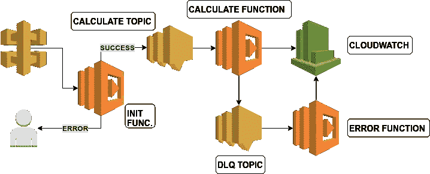
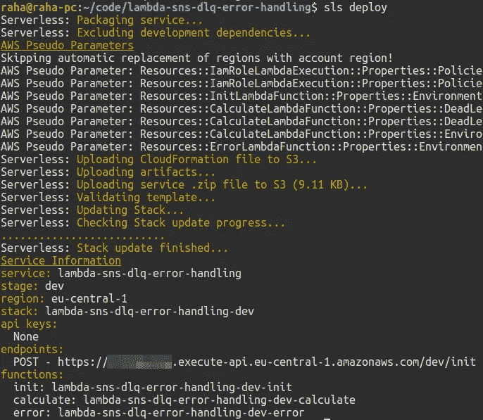
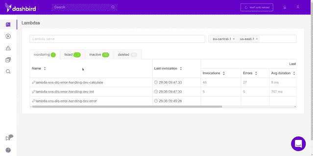
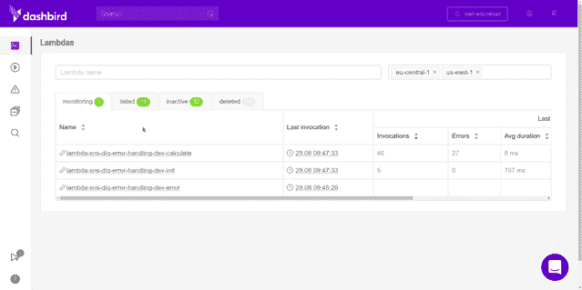
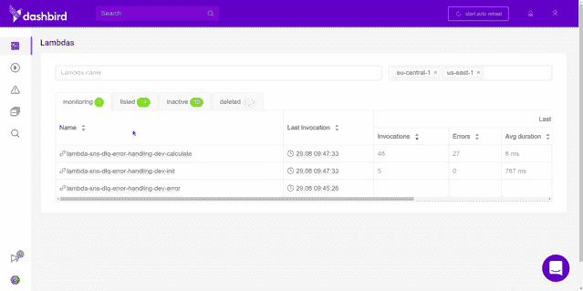
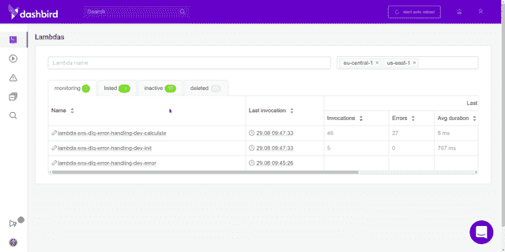
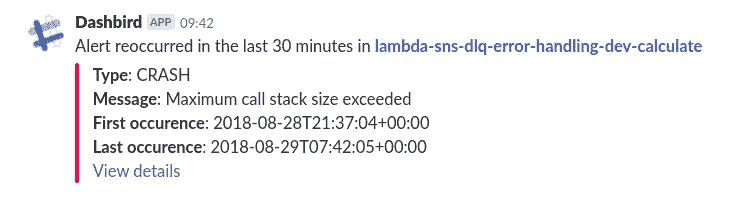

# AWS 无服务器速成班——用 SNS 消息触发 Lambda

> 原文：<https://medium.com/hackernoon/a-crash-course-on-serverless-with-aws-triggering-lambda-with-sns-messaging-bc17d9f81ca2>


如果你像我一样，对事件驱动编程着迷，你会想继续阅读。今天我们来看看如何从 [AWS SNS](https://aws.amazon.com/sns/) 消息中触发 [AWS Lambda](https://aws.amazon.com/lambda/) 功能。我已经讨论了一些关于无服务器架构和 AWS 的有趣话题，但是还没有这样的。往下挖，准备好。我们走吧。

# TL；速度三角形定位法(dead reckoning)

*   我们在建造什么？
*   什么是 AWS SNS？
*   用[无服务器框架](https://serverless.com/)构建 API
*   将 API 部署到 [AWS Lambda](https://aws.amazon.com/lambda/)
*   用 [Dashbird](https://dashbird.io/) 测试 API

***注意*** *:如果你想马上查看最终结果，本教程的所有* [*代码都已经在 GitHub*](https://github.com/adnanrahic/lambda-sns-dlq-error-handling) *上了。*

# 我们在建造什么？

我们将只关注创建我们的应用程序所需的基础设施组件的步骤。代码本身将只是模拟随机复杂计算的行为。我选择了一个递归函数来计算传递给它的数字的阶乘。这里有一个很好的图表，因为图表当然很棒！



`init`函数是唯一公开的函数，它被挂接到 [API 网关](https://aws.amazon.com/api-gateway/)。它接受一个单独的`number`参数进行验证，成功后，它发布一个 SNS 主题并发送`number`值。

SNS 话题会触发第二个功能叫做`calculate`。该函数将执行计算并将结果记录到控制台。这模拟了繁重的计算后台任务，如数据处理、图像处理或机器学习计算。

如果`calculate`功能失败，死信队列 SNS 话题会收到消息并触发`error`功能。

每个被异步调用**的函数**在失败后会重试执行两次。将死信队列用作错误日志池是一个明智的用例。

现在你可能想知道，为什么 SNS 会如此复杂，而不是用 [lambda 的调用 API](https://docs.aws.amazon.com/AWSJavaScriptSDK/latest/AWS/Lambda.html#invoke-property) 从第一个 Lambda 函数中调用第二个函数？

首先，对于异步工作流来说，这是一个巨大的反模式，这就是我们的情况。否则，如果您立即需要第二个 lambda 函数的响应，也没问题。另一个问题是很快达到 Lambda 的并发限制。这可能导致调用丢失和数据丢失。通过 SNS 之类的发布/订阅服务或者像 [SQS](https://aws.amazon.com/sqs/) 之类的队列发送数据将确保数据的完整性。

现在有意义了？太好了，让我们再多谈谈社交网络。

# 什么是 AWS SNS？

在我们开始编码之前，我们需要了解一些基础知识。我们知道 AWS Lambda 是什么，但是 SNS 呢？AWS 文档非常简单。

> *亚马逊简单通知服务(SNS)是一种灵活、完全托管的* [*发布/订阅消息*](https://aws.amazon.com/pub-sub-messaging/) *和移动通知服务，用于协调向订阅端点和客户端的消息传递。*
> 
> - AWS 文档

在英语中，这意味着它是一种基于发布者/订阅者在服务之间发送通知的方式。一个服务发布关于一个**主题**的一些数据，并沿其路径发送。然后，社交网络会将它传递给该特定**主题**的所有订阅者。重点放在**主题**这里，你会看到为什么有点深入。

# 用无服务器框架构建 API

一如既往，首先要做的是设置项目并安装依赖项。

## 1.安装无服务器框架

我开发和部署无服务器应用的首选工具是[无服务器框架](https://serverless.com/framework/)。让我们继续安装它。

```
$ npm i -g serverless
```

注意: *如果你使用的是 Linux，你可能需要以 sudo 的身份运行这个命令。*

一旦全局安装到您的机器上，您就可以在终端的任何地方使用这些命令。但是为了让它与您的 AWS 帐户通信，您需要配置一个 IAM 用户。跳过[这里的解释](https://docs.aws.amazon.com/IAM/latest/UserGuide/id_users_create.html)，然后返回并使用提供的键运行下面的命令。

```
$ serverless config credentials \ 
    --provider aws \ 
    --key xxxxxxxxxxxxxx \ 
    --secret xxxxxxxxxxxxxx
```

现在，当您运行任何终端命令时，您的无服务器安装知道要连接到哪个帐户。让我们来看看它是如何工作的。

## 2.创建服务

创建一个新目录来存放您的无服务器应用程序服务。在那里启动一个终端。现在您已经准备好创建一个新的服务了。

什么是服务？就像一个项目。在这里，您可以定义 AWS Lambda 函数、触发它们的事件以及它们所需的任何 AWS 基础设施资源，包括我们今天将添加的 SNS，所有这些都在一个名为 **serverless.yml** 的文件中。

回到您的终端，键入:

```
$ serverless create \
    --template aws-nodejs \
    --path lambda-sns-dlq-error-handling
```

create 命令将创建一个新的**服务**。真是惊喜！我们还为函数选择了一个运行时。这被称为**模板**。传入`aws-nodejs`会将运行时设置为 Node.js .这正是我们想要的。**路径**将为服务创建一个文件夹。

## 3.使用代码编辑器浏览服务目录

用你最喜欢的代码编辑器打开**lambda-SNS-dlq-error-handling**文件夹。这里应该有三个文件，但是现在，我们只关注 **serverless.yml** 。它包含此服务的所有配置设置。您可以在这里指定常规配置设置和每个功能的设置。您的 **serverless.yml** 将充满样板代码和注释。请随意删除它，并粘贴这个。

让我们来分析一下这里的情况。查看`functions`部分。这里有三个功能。从上到下依次是`init`、`calculate`和`error`。`init`函数将由一个简单的 HTTP 请求触发，我们通过 API Gateway 调用该请求。我们熟悉的领域。

但是，`calculate`和`error`功能是由 SNS 话题触发的。这意味着我们将在`init`函数中拥有逻辑，它将**向名为`calculate-topic`的主题发布**消息，而`calculate`函数则为同一主题订阅**。**

继续,`error`函数订阅了`dlq-topic`,而`calculate`函数将在失败时向该主题发布消息，正如您在`onError`属性中看到的。现在事情有意义了，对吧？

请记住，一旦您将 SNS 主题作为事件添加到您的功能中，资源将在您部署服务时自动创建。

还有什么，看一下`iamRoleStatements`，它们指定我们的函数有权限触发，并被 SNS 主题调用。而`serverless-pseudo-parameters`插件让我们用 CloudFormation 语法引用我们的`AccountId`和`Region`，这使得在所有资源中保持我们的 SNS ARNs 一致变得容易得多。

## 4.安装依赖项

幸运的是，这部分会很短。只需安装一个软件包。首先，初始化 npm，然后你可以安装`serverless-pseudo-parameters`。

```
$ npm init -y && npm i serverless-pseudo-parameters
```

那就行了。

## 5.编写业务逻辑

考虑到所有的事情，配置过程相当简单。我们现在要写的代码同样简单明了。没什么特别的，很抱歉让你失望了。

为了简单起见，让我们将这三个函数放在不同的文件中。首先创建一个 **init.js** 文件并粘贴这个片段。

我们有几个助手函数和底部导出的 lambda 函数。这是怎么回事？lambda 验证输入并将一些数据发布到`calculate-topic` SNS 主题。这就是这个函数所做的一切。`calculate-topic` SNS 话题会触发`calculate` lambda 功能。现在我们来补充一下。

创建一个文件，命名为 **calculate.js** 。将此片段粘贴到。

如你所见，这只是一个用递归函数实现的简单阶乘计算。它将从`init`函数中计算我们发布到 SNS 主题的数字的阶乘。

这里需要注意的一点是，如果`calculate`函数总共失败三次，它将向死信队列 SNS 主题发布消息，我们在 **serverless.yml** 文件中用`onError`属性指定了该主题。死信队列将触发`error`功能。让我们现在创建它，以便它可以将错误记录到 CloudWatch。创建一个 **error.js** 文件，并将这些行粘贴进去。

目前，这就够了。然而，理想情况下，您应该已经用关于正在发生的一切的详细信息构建了日志记录。这是另一篇文章的主题。

# 将 API 部署到 AWS Lambda

简单的部分来了。部署 API 就像运行一个命令一样简单。

```
$ serverless deploy
```



您可以看到端点被记录到控制台。这是您发送请求的地方。

# 用 Dashbird 测试 API

测试 API 最简单的方法是使用 CURL。让我们创建一个简单的 CURL 命令，并向端点发送一个 JSON 有效负载。

```
$ curl -H "Content-Type: application/json" \
    -d '{"number":1000}' \
    https://<id>.execute-api.eu-central-1.amazonaws.com/dev/init
```

如果一切正常，计算结果将被记录到 CloudWatch 中。如果不是，那么你就不走运了。在这种情况下，我默认使用 [Dashbird](https://dashbird.io/register/) 来调试正在发生的事情。它是免费的，不需要信用卡来设置。

在用几个不同的值到达端点几次后，结果如下。`init`功能按预期工作。



但是，真正让我们感兴趣的是`calculate`函数。这是它成功时的样子。



当失败时，它会指定一个崩溃，并显示错误日志。



经过两次重试后，它会向死信队列发送一条消息，并触发`error`功能。



太棒了。我们已经测试了所有不同的场景。希望这能澄清一些事情。

# 包扎

这是所有的乡亲。我们已经介绍了如何为 Lambda 创建 SNS 触发器，同时还实现了一个死信队列来捕获失败调用中的错误。使用无服务器进行各种间歇性计算是一种有效的用例，将来只会越来越受欢迎。

没有你需要担心的服务器，你只为它运行的时间付费。只需部署代码，并保证它会工作。如果有什么东西坏了，你有 Dashbird 在背后看着你，如果有什么不对劲，它会通过 Slack 或电子邮件提醒你。你只需要热爱 Slack 集成！



同样，如果你想看看代码，这里是 GitHub repo 。在您需要 SNS 消息触发 lambda 功能的情况下，它可以作为您自己用例的开端。如果你喜欢它，并希望更多人在 GitHub 上看到它，请给它一颗星。

如果你想阅读我以前的一些无服务器思考，请前往[我的简介](/@adnanrahic)或[加入我的时事通讯！](https://upscri.be/b6f3d5/)

或者，马上看看我的几篇文章:

*   [关于使用 Vue.js、Nuxt.js 和 AWS Lambda 进行无服务器端渲染的速成课程](https://hackernoon.com/a-crash-course-on-serverless-side-rendering-with-vue-js-nuxt-js-and-aws-lambda-fbfaad80aa25)
*   [使用 AWS Lambda 和 AWS SES 构建无服务器联系表单](https://hackernoon.com/building-a-serverless-contact-form-with-aws-lambda-and-aws-ses-fbf01d523678)
*   【Express 和 MongoDB 的无服务器 API 速成班
*   [使用无服务器和 MongoDB 解决不可见的伸缩问题](https://hackernoon.com/solving-invisible-scaling-issues-with-serverless-and-mongodb-1a065b5a6465)
*   [如何使用无服务器将 Node.js 应用程序部署到 AWS Lambda](https://hackernoon.com/how-to-deploy-a-node-js-application-to-aws-lambda-using-serverless-ae7e7ebe0996)
*   [AWS Lambda 和 Node.js 入门](https://hackernoon.com/getting-started-with-aws-lambda-and-node-js-4ce3259c6dfd)
*   [用 JSON web 令牌保护无服务器 API 的速成班](https://medium.freecodecamp.org/a-crash-course-on-securing-serverless-apis-with-json-web-tokens-ff657ab2f5a5)
*   [将 Node.js REST API 迁移到无服务器](https://hackernoon.com/migrating-your-node-js-rest-api-to-serverless-d2a170e0856c)
*   [用 Node.js 和 MongoDB 构建无服务器 REST API](https://hackernoon.com/building-a-serverless-rest-api-with-node-js-and-mongodb-2e0ed0638f47)
*   [node . js 无服务器速成班](https://hackernoon.com/a-crash-course-on-serverless-with-node-js-632b37d58b44)

希望你们喜欢读这篇文章，就像我喜欢写这篇文章一样。如果你喜欢的话，拍一下那个小小的拍手，这样更多的人会在 Medium 上看到这个教程。直到下次，保持好奇，玩得开心。

*原载于*[*dev . to*](https://dev.to/adnanrahic/a-crash-course-on-serverless-with-aws---triggering-lambda-with-sns-messaging-30nf)*。*