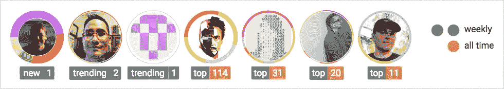

# 撰写更好自述文件的速成课程

> 原文：<https://medium.com/hackernoon/a-crash-course-on-writing-a-better-readme-d796d1f6b352>

在 [Hacktoberfest](https://hacktoberfest.digitalocean.com/) 之后，我们看到开源贡献的巨大增长。仅在 10 月份，开源社区就开放了超过 40 万个请求。这太疯狂了。

我开始调查有大量捐款的项目。这让我开始思考。一个共同的模式开始出现。他们都有惊人的`readme.md`档案。我怀疑如果不是这样的话，做出贡献会很容易。可能有联系。我肯定会说有！

先说几个著名的项目像 [React](https://github.com/facebook/react) 、 [Vue](https://github.com/vuejs/vue) 、 [freeCodeCamp](https://github.com/freeCodeCamp/freeCodeCamp) 、[sourcer](https://github.com/sourcerer-io/sourcerer-app)或者 [Serverless。](https://github.com/serverless/serverless)你可以看到他们的`readme.md`是文档、项目概述、常见问题和贡献步骤的完美结合。他们提到了生态系统、社区，并且用图片解释了开源项目本身。

因为开源社区运行这个项目，所以它需要一个中心文件来简化交流。这是一个文件，维护者在其中解释所有项目细节，作为指导。但是到底什么是`readme.md`文件呢？

# 什么是自述文件？

任何开源项目的支柱都是`readme.md`。它包含了理解项目发展方向的所有必要信息。它解释了软件及其用途。任何先决条件也是为了确保新的贡献者可以快速上手。

最重要的部分是，它包含了让软件在您的本地机器上运行以进行开发的步骤。但是，它还应该包含将软件部署到生产环境的步骤。

# 为什么需要自述文件？

当你希望人们注意到你和你的工作时，你不使用简历、GitHub 个人资料甚至网站吗？当然，你知道。我也是，同样的逻辑也适用于开源项目。`readme.md`是你的软件的简历。添加任何你认为会让未来的贡献者更容易理解的东西。

在公开一个项目之前，你应该首先创建一个`readme.md`是非常明智的。这将使你作为维护者或合作者的生活变得更加容易。回答问题和帮助贡献者将成为公园里的散步。

这就是为什么你应该把它作为你在项目中创建的第一个文件。确保将它放在项目的根目录下，这样它就可以在 GitHub 上看到了。

# 如何写自述？

幸运的是，你不需要重新发明轮子。有一些很棒的模板可以使用。你需要记住的是在你的`readme.md`中有一个自然的流动。你希望它易于理解，并且让每个阅读它的人都能简单地开始协作。

看看这个由[比莉·汤普森](https://github.com/PurpleBooth)制作的惊人模板。它会让你很快恢复健康。

但是，还缺少一些东西。首先，让社区更多参与的方法。随意添加视觉效果、徽章、图像、视频，甚至 gif 到你的`readme.md`文件中！别忘了，你的目标是让人们喜欢你的项目。你不能忘记让贡献者对你的帮助有一种感激之情。

这里是[做一个自述](https://www.makeareadme.com/)的用武之地。它将带你经历写一个令人敬畏的`readme.md`的整个过程。

 [## 制作自述文件

### 如果您已经耗尽了项目的精力或时间，请在自述文件的顶部注明开发已经…

www.makeareadme.com](https://www.makeareadme.com/) 

请记住，关键是要让社区参与进来，并感谢贡献者。首先，从添加徽章开始。我喜欢徽章！您可以使用它们来显示构建状态、测试覆盖率、PR 状态、漏洞以及您正在使用的许可证。大胆使用这些，因为它们会让你的项目看起来很严肃。在开源社区中，社交证明就是一切。最棒的是，你可以[创造你自己的](https://shields.io/#/)。或者，复制下面的。😉

另一个很棒的工具是[名人堂](https://github.com/sourcerer-io/hall-of-fame)，它在很棒的视觉效果和欣赏你的贡献者之间架起了一座桥梁。

 [## sourcerer-io/名人堂

### 奖杯:给你的贡献者一些爱！您的回购自述文件的小部件。目测干净。每小时刷新一次。…

github.com](https://github.com/sourcerer-io/hall-of-fame) 

提及软件的开发者是让社区参与进来的重要一步。说实话，难道你不想看到自己成为一个了不起的开源项目的贡献者吗？？我肯定会的。

# 我错过什么了吗？

如果您的项目开始以越来越快的速度增长，该怎么办？那么你应该开始考虑创建一个`contributing.md`。您可以在这里输入关于贡献和拉取请求的所有详细信息。它是所有开源爱好者如何开始为您的项目做贡献的官方指南。这是 freeCodeCamp 的样子。

 [## 免费代码营/免费代码营

### https://freeCodeCamp.org 开源代码库和课程。与数百万人一起免费学习编码…

github.com](https://github.com/freeCodeCamp/freeCodeCamp/blob/master/CONTRIBUTING.md) 

它不止于此。首先，添加一个`license.md`来指定开放的级别。然后，一个`code_of_conduct.md`来解释开发者应该遵守的一般规则和条件。最后，我们都应该对彼此敬畏。行为准则是为了确保我们做到这一点。

# 包扎

每一个牛逼的开源项目都有一个令人惊叹的`readme.md`，而且非常有意义。我们人类的注意力持续时间有限。我们需要一个*弹出*的`readme.md`，让潜在的贡献者开始创建拉请求。通过查看像 [freeCodeCamp](https://github.com/freeCodeCamp/freeCodeCamp) 或[sourcer](https://github.com/sourcerer-io/sourcerer-app)这样的库，你可以看到一个共同的模式。对功能、内容、文档、投稿指南和引人入胜的视觉效果的清晰解释。

最终，你不需要重新发明轮子。使用模板。遵循上面的指导方针。让你的社区参与进来，对你的开发伙伴们表现出敬畏！这就是它的意义所在。互相帮助创造出造福人类的神奇软件。

如果你想看看我以前的一篇与个人成长相关的文章，请随意前往[我的简介](/@adnanrahic)，或者查看下面的内容。

 [## 如何删除你的开发者档案，让你的旧简历灰飞烟灭

### 在本文中，我们将讨论如何通过几个简单的步骤提升您的开发人员档案。

medium.freecodecamp.org](https://medium.freecodecamp.org/how-to-pimp-out-your-developer-profile-and-leave-your-old-r%C3%A9sum%C3%A9-in-the-dust-3655b0c04c05) 

希望你们喜欢读这篇文章，就像我喜欢写这篇文章一样。
*你觉得这个教程会对某个人有帮助吗？不要犹豫分享。如果你喜欢，击碎下面的***这样其他人会在媒体上看到这个。**