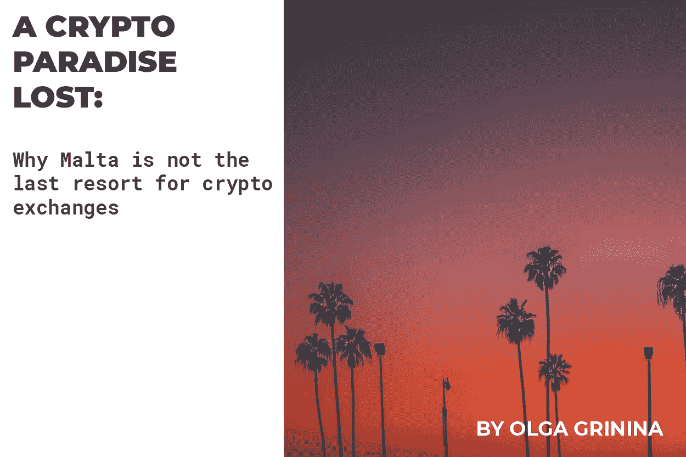

# 一个神秘的失乐园？为什么马耳他不是交流的最后手段？

> 原文：<https://medium.com/hackernoon/a-crypto-paradise-lost-why-malta-is-not-the-last-resort-for-exchanges-e7795f2c8ee2>

科技作家奥尔加·格里尼纳

*[*arbi dex*](http://arbidex.uk.com)的首席执行官卡米莉娅·阿斯拉诺娃*

**Rustam Rafikov，* [*Arbidex*](http://arbidex.uk.com) 法律部主管*

*这一切都是从头条新闻报道世界上最大的密码交易所将其业务转移到马耳他开始的。现在，几个星期后，我们看到至少有 3 家交易所搬到了海外，以回应中国和日本最近的监管打击。那么，像币安和北海巨妖这样的人搬迁到那些偏远的岛屿位置时，他们在寻求什么好处呢？他们的法律框架在哪些方面有利于建立一个与加密相关的实体？*

*早在 2017 年 2 月，[直布罗陀政府](https://cointelegraph.com/news/gibraltar-to-introduce-worlds-first-ico-regulations)宣布了在直布罗陀金融服务委员会(GFSC)的监督下发布加密货币监管框架的计划。GFSC 拟定了必要的立法提案，以便在直布罗陀提供一个高效、安全和创新的监管框架。该提案的主要思想是使创新公司能够通过分布式账本技术(DLT)传输和存储属于他人的价值。考虑到 2017 年 5 月 26 日欧洲议会关于虚拟货币的决议[【1】](#_ftn1)，直布罗陀 DLT 监管框架的“创始者”为在 DLT 经营的许可公司提出了以下九项监管原则:*

*1.诚实和正直*

*2.对顾客的利益和需求给予应有的尊重*

*3.保持充足的资源*

*4.充分的风险管理实践*

*5.保护客户的资产和金钱*

*6.有效的公司治理*

*7.维护高安全性访问协议*

*8.发现和披露金融犯罪风险*

*9.对不断变化的加密环境具有弹性*

*然后，2018 年 1 月 1 日，金融服务(分布式账本技术提供商)条例 2017 (LN。2017/204)[【2】](#_ftn2)生效。该法规定，愿意通过区块链技术(DLT)经营加密货币的公司必须获得 DLT 特别许可证，即“在直布罗陀或从直布罗陀开展业务，使用分布式分类帐技术储存或传输属于他人的价值”(《金融服务(投资和信托服务)法》附表 3 第 10 段)。获得 DLT 执照的政府费用在 20-30，0 00 英镑之间。*

*乍一看这种新的监管环境，直布罗陀似乎是重新安置加密业务的最佳地点。然而，重要的是，从技术上讲，该国不是欧盟共同关税区的一部分，但仍在欧洲经济区[【3】](#_ftn3)内。直布罗陀也是英国海外领土的一部分，这意味着英国退出欧盟可以极大地改变其法律和经济环境。另一个风险是，作为英国海外领土的一部分，直布罗陀将不得不根据英国反腐败、逃税和洗钱政策[【4】](#_ftn4)披露公司受益所有人的信息。此外，根据直布罗陀法律获得 DLT 许可证的公司必须开设一个公司银行账户，这就是银行的 KYC 程序发挥作用的地方。这里的主要问题是，银行最终是否愿意参与从法定货币到加密货币的交易操作？到目前为止，在实践中，我们已经看到私人银行部门在向转移加密货币的公司提供银行服务时相当谨慎。然而，毫无疑问，一旦针对加密货币用户的反洗钱新规[【5】](#_ftn5)和 KYC 程序最终实施，情况将会彻底改变。*

*从税收角度来看，直布罗陀可能会受到许多欧洲和美国公司的青睐。直布罗陀的公司税为 10%，不包括股息税。然而，任何公司结构都应接受法律审查，因为大多数国家对受控外国公司都有自己的规定。另一点需要考虑的是，许多 OECD(经济合作与发展组织)的决议和计划，如 BEPS(税基侵蚀和利润转移)，都适用于直布罗陀。这些实际上削弱了直布罗陀作为传统离岸领土的地位，从适当的意义上讲，直布罗陀的税率相当低，使其成为一个相当正规的管辖区，没有任何突出的法律吸引力。*

*看起来马耳他也正在形成几乎相同的监管视角。上周，摩根士丹利(Morgan Stanley)报告称，目前大多数加密货币交易量都发生在马耳他的市场上，来自在该岛注册的公司:*

*谈到法律框架，早在 2017 年，马耳他金融服务管理局(MFSA)就提出了一项加密货币集体投资计划。MFSA 宣布的立法草案提议向有权投资加密货币的合格投资者发放许可。简单地说，如果该法案最终获得政府批准，马耳他有很大的潜力成为对投资者和基金公司最具吸引力的地方之一。2018 年 4 月，马耳他议会开始讨论三项关于加密货币监管的法案[【6】](#_ftn6):马耳他数字创新管理局法案(MDIA)关于建立 DLT 公司认证的特别政府机构；关于注册和认证服务提供商的技术安排和服务法案(TAS)；以及关于监管虚拟货币金融服务的虚拟金融资产法案。据[马尔他独立报](http://www.independent.com.mt/articles/2018-02-16/local-news/Malta-Digital-Innovation-Authority-revealed-providing-legal-certainty-in-a-regulatory-vacuum-6736184937)报道，MDIA 的最终目标是认证和监管区块链人经营的企业及其运作。该组织还宣布了建立一个监督 ico 的框架的计划。马耳他的这些法律发展——如果最终得以实施——肯定会为加密货币业务(如平台、基金、交易所等)创造一个良好的框架。与此同时，很难评估它们将如何影响整个生态系统。这里最大的问题可能是银行经营法定/加密货币转移的意愿。*

*没有提供任何具体的时间表，在实际通过成为立法之前，所有这些法律提案——无论它们多么创新和有益——现在似乎只是政府的承诺，缺乏可信性和有效性。无论是在马耳他、直布罗陀还是在任何其他地方，这种倡议都必须得到政府方面具体行动和详细执行计划的支持。因此，现在——在前往另一个“秘密天堂”之前——我们强烈建议首先花些时间与律师谈谈这一举动的所有可能影响。不过，马耳他的律师可能不会——我们听说他们已经开始为加密初创公司提供许可服务援助，但许可只是泛泛地宣布，没有关于许可机构或要求等具体细节。*

***[**arbi dex**](http://arbidex.uk.com)**CEO 卡米莉娅·阿斯拉诺娃点评:*****

***当然，我们很高兴看到像马耳他和直布罗陀这样的离岸地区进一步为加密行业创造一个有益的法律框架。世界各国政府应该意识到，这些措施将导致大量资金流入国库和国家:加密交易所将带来所有其他参与者——从区块链的初创公司到老牌企业。然而，这里主要关心的是为所有参与者提供舒适的环境——用户、投资者、企业和政府。这就是为什么除了建立有利的法律体系，另一件重要的事情是建立某种自我监管协会——我们已经看到这种情况在发生。这些自律组织不仅有助于遵守所有利益相关方的利益，还能创造透明和有益的法律条款，这些条款在理想情况下应尽可能全球化和统一。这似乎与整个加密空间的分散操作方式完全同步:无论你的企业位于何处，操作规则和标准都是相同的。第一个提出这套规则的国家将为全球社会做一件大好事。***

***[【1】](#_ftnref1)欧洲议会，P8_TA(2016)0228 网址:[http://www.europarl.europa.eu/sides/getDoc.do?pubRef=-](http://www.europarl.europa.eu/sides/getDoc.do?pubRef=-)***

***//EP//NONSGML+TA+P8-TA-2016–0228+0+DOC+PDF+v 0//EN***

***[【2】](#_ftnref2)网址:[http://gibraltarlaws.gov.gi/articles/2017s204.pdf](http://gibraltarlaws.gov.gi/articles/2017s204.pdf)***

***[【3】](#_ftnref3)参见:[http://www.gibraltarlaws.gov.gi/eea_agreement.pdf](http://www.gibraltarlaws.gov.gi/eea_agreement.pdf)***

***[【4】](#_ftnref4)[https://www . ft . com/content/5a 924560-4d 45-11e 8-8a8e-22951 a2d 8493](https://www.ft.com/content/5a924560-4d45-11e8-8a8e-22951a2d8493)***

***[【5】](#_ftnref5)[http://www . europal . Europa . eu/news/en/press-room/2018 04 11 IPR 01527/anti-money-laundry-MEPs-vote-shed-light-on-the-true-owners-of-companies](http://www.europarl.europa.eu/news/en/press-room/20180411IPR01527/anti-money-laundering-meps-vote-to-shed-light-on-the-true-owners-of-companies)***

***[【6】](#_ftnref6)[https://OPM . gov . mt/en/Documents/fs dei % 20-% 20 DLT % 20 regulation % 20 document . pdf](https://opm.gov.mt/en/Documents/FSDEI%20-%20DLT%20Regulation%20Document.pdf)***