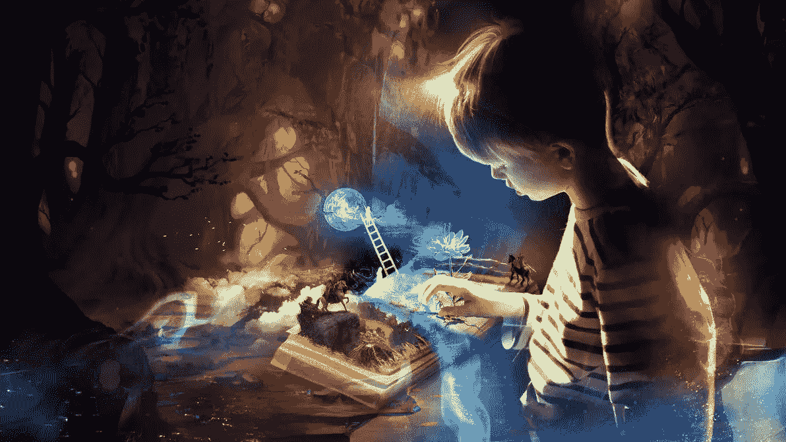

# 赛博朋克金融科技初创公司创始人 2018 阅读清单

> 原文：<https://medium.com/hackernoon/a-cryptopunk-startup-founders-2018-reading-list-a52c7fb6bc0a>

## [君主|马基雅维利](https://www.amazon.co.uk/gp/product/1981120920/ref=as_li_qf_asin_il_tl?ie=UTF8&tag=chrisherd-21&creative=6738&linkCode=as2&creativeASIN=1981120920&linkId=448e7ebb5112833e0219a651ad22f35a)

有一个从未在书中出现过的坏名声。我发现它是理解人们一直以来所做决定的永恒资源。为什么掌权者保留它，为什么粗心的人由于管理不善和对世界如何运转的基本理解而失去机会。这本书阐述了如何管理公司收购的原则——确保你把自己的人安排在组织内部，否则很可能会发生叛乱——以及其他许多真正明智的建议。这可能是我今年读过的最有独创性的一本书，因为很多人的看法而避开它确实是你的损失。你会发现这是一本很有教育意义的读物。

## [Nexus 三部曲【Nexus，Crux，Apex】| Rames Naam](https://www.amazon.co.uk/gp/product/0857662929/ref=as_li_qf_asin_il_tl?ie=UTF8&tag=chrisherd-21&creative=6738&linkCode=as2&creativeASIN=0857662929&linkId=c31ffbd90c47c1dd0cd845be865b1805)

对一旦地球上的每个人都用人工智能增强了自己，世界会变成什么样子感兴趣？这篇散文很简单，有时有点 meh，但内容却发人深省。人类正处于自我导向进化的边缘，随着现实的到来，我们将被迫做出道德和伦理选择。这本书让你从一个非常聪明的角度考虑这些可能性，并采取你能想象到的每一种立场，在一个易于理解的故事中纠缠在一起。这本书很容易阅读，内容扣人心弦，并且预见了我们正在加速迈向的不远的将来。总而言之，对于那些有兴趣为未来做准备的人来说，这是一本重要的读物，因为我们可能会比想象中更快地居住在未来。

## [真实|汉斯·罗斯林](https://www.amazon.co.uk/gp/product/B0769XK7D6/ref=as_li_qf_asin_il_tl?ie=UTF8&tag=chrisherd-21&creative=6738&linkCode=as2&creativeASIN=B0769XK7D6&linkId=ee96811852d65f5032259ce90a4b1c5b)

我今年读过的最重要的书——从头到尾都非常棒。你需要马上阅读这个。你所知道的世界并不存在。你越聪明，就越有可能犯错误。我们对 it 的愿景源于 20 世纪 60 年代，但自那以后，世界已经发生了巨大的变化。事情既可能变好，也可能变坏。我把这本书作为礼物送给我的商业伙伴和朋友，这是我读过的最多的一本书。所有人都觉得它很有价值。

## [地理囚犯|蒂姆·马歇尔](https://www.amazon.co.uk/gp/product/1783962437/ref=as_li_qf_asin_il_tl?ie=UTF8&tag=chrisherd-21&creative=6738&linkCode=as2&creativeASIN=1783962437&linkId=bb46720d6470627c7c84132f9da75e5a)

如果你想了解为什么其他国家会这样做，这是一个很好的起点。俄罗斯为什么要吞并克里米亚？他们为什么在乌克兰边境集结军队？为什么中国和印度很少发生冲突？答案是在地理上，这些国家是一个囚犯。中国和印度被世界上最高的山脉分开，这意味着他们不能开战——或者即使他们开战，也难以置信的困难。俄罗斯的反应是因为他们需要一个温暖的海港来发射他们的军事力量和投射全球力量。这本书通过时间来观察整个世界，并在预测未来将发生的事情的同时，教育我们使民族国家得以发展的原则和限制。

## 债务:前 5000 年|大卫·格雷伯

首先，这是一项艰巨的任务。它又长又密，又复杂又令人沮丧。也就是说，就金融和人种学而言，这是世界上最具启发性的书籍之一。它结合了人类历代的历史，以及为什么金钱和债务会随着时间的推移而演变并奴役我们。债务是我们认同的一个哲学概念，当我们意识不到的时候，它几乎渗透到我们的生活中。罪恶感、人的价值、作为交换所需的控制机制的金钱塑造了我们生活的世界。这不是那种坐下来享受脑海中描绘的文字的书。这是关于奴隶制是如何形成的以及性别差异的另一种观点。这不是你喜欢的东西，但它是你非常欣赏的知识和理解。

## [数字政府|安迪·威尔](/s/futurehuman/digitocracy-a-story-by-andy-weir-a13c0412e50d)

超级短的故事，超级有力的信息。不管我们喜不喜欢，人工智能都会到来。这个故事拼接了它潜在的仁慈，同时质疑我们，我们自己，是否不是真正的怪物——至少这是我的解释。机器和算法已经比我们自己更了解我们，直到它们能够预测我们的行为并操纵它为自己或它们的代理谋利。

## [阿耳忒弥斯|安迪·威尔](https://www.amazon.co.uk/gp/product/1785030256/ref=as_li_qf_asin_il_tl?ie=UTF8&tag=chrisherd-21&creative=6738&linkCode=as2&creativeASIN=1785030256&linkId=a724ba226bdd8f4c91ea6e756f92fcd9)

没有火星人那么好，但却是月球上生活的一个相当令人愉快的景象。这个故事讲述了一个在月亮上最大的城市的小偷，并记录了她的故事，因为她阴谋揭露一个阴谋，导致了它最富有的居民之一的死亡。令人兴奋，雄心勃勃，可读性强，我喜欢它的速度和高层次的概念，但并不喜欢它。

## [火星之前|艾玛·纽曼](https://www.amazon.co.uk/gp/product/147322389X/ref=as_li_qf_asin_il_tl?ie=UTF8&tag=chrisherd-21&creative=6738&linkCode=as2&creativeASIN=147322389X&linkId=d7cffa7ccb9ea50e68834a42f2344d67)

一位艺术家在火星上发现了一幅只有她能在床边画下来的画。问题是——她昨天才到，以前从未去过那里。这本书开头很好，但有点失败。前提很棒，人物刻画很好，方向很棒，但是结局的深度让我想要更多。也许不是一件坏事。

## [在魔法王国落魄|科利·多克托罗](https://www.amazon.co.uk/gp/product/0007327935/ref=as_li_qf_asin_il_tl?ie=UTF8&tag=chrisherd-21&creative=6738&linkCode=as2&creativeASIN=0007327935&linkId=6b9199412e506019ab569ebeca3544c9)

基于社会或声誉的货币是不可避免的。它已经在中国进行了测试，并将在未来 20 年内环游世界。这本书是隐藏在表面故事情节下的哲学文本。以迪士尼的魔法王国为背景，这个世界已经演变为以短暂的信誉为基础的货币为交易媒介。如果你不受欢迎或者做了一些公众普遍不喜欢的事情，你就有成为一个非人类的风险。这本书是有先见之明和令人吃惊的，因为它跨越的主题是为我们所有人而来的。

## [血汗和像素|杰森·施莱尔](https://www.amazon.co.uk/gp/product/0062651234/ref=as_li_qf_asin_il_tl?ie=UTF8&tag=chrisherd-21&creative=6738&linkCode=as2&creativeASIN=0062651234&linkId=598569d20fa5a39f04f6c0b98ec8eb67)

爱情游戏——这才是它们真正的制作方式。游戏设计师是我们时代的艺术家。在列奥纳多画的壁画被普通市民或大众消费的地方，游戏已经成为一种公众评论的形式，被任何可以想象的人消费。作为对日常生活的逃避，它们成功了，但是制造它们的人呢？这是一个无拘无束的贯穿一些巨大的成功，所以鲜为人知的旅程和一些巨大的失败。这是对创意者的思想以及他们克服的斗争、压力和冲突的洞察，以他们的创作取悦我们。

## 毁灭大师|大卫·库什纳

这是一个故事。约翰·卡马克可能是世界历史上最被低估的程序员。他是我们今天认可的 3D 游戏之父。他实际上负责编写物理世界的代码，历史上一些最知名的游戏就是在这些物理世界中创建的。他现在领导 Oculus 重新做这件事。是一个摇滚明星，他是杨的偶像，是一个有远见卓识的人，是他给了这些游戏诞生的想象力。事情就是这样发生的。他们的关系，毁灭传说背后的人。这就是创业公司和商业的真实情况——人们很难相处，他们并不总是相处融洽。有自我的脱落，家庭，金钱，需求，贪婪，这是从这本书的每一页滴下。末日情人，读读吧。技术发烧友，读一读。想着创业，读一读。创业了，看了。它很棒，你会喜欢我推荐它的。

## [基金会|艾萨克·阿西莫夫](https://www.amazon.co.uk/gp/product/0008117497/ref=as_li_qf_asin_il_tl?ie=UTF8&tag=chrisherd-21&creative=6738&linkCode=as2&creativeASIN=0008117497&linkId=1d2c37f1a1f665e7742b2c75e502438b)

对当今世界有先见之明，知道现实中会发生什么。每天我都觉得自己遇到越来越多的无奈。我们拥有丰富的知识，但人们变得越来越小众。我们不太擅长概括，而更擅长具体。基金会遵循这一思路。这个世界比我们今天进化得多，但是有一个问题。他们有令人敬畏的技术，但是人们理解它如何工作和修理它的能力正在消失。基金会是关于建立一个基金会——一群有才华的工匠和工程师位于银河系的两端——来保存和扩展人类的集体知识，从而成为这个新银河帝国加速复兴的基础。三部曲紧随其后。

## [安静|苏珊·凯恩](https://www.amazon.co.uk/gp/product/0141029196/ref=as_li_qf_asin_il_tl?ie=UTF8&tag=chrisherd-21&creative=6738&linkCode=as2&creativeASIN=0141029196&linkId=741a8142405ddc98a534ff0ead5c01b7)

我是一个内向的人，这本书对诊断我的一些“行为”很有用。理解为什么和什么使某些类型的人在没有行动过程的规定下成功是很有趣的。我并不完全相信这些标签如我们所想的那样适用于事物或人——人们可以是或者取决于特定的情况。我发现它很有用，但并不具有开创性。我可能不会再读一遍，我更希望能看到它的摘要或者在 Blinkist 上阅读。

## [安德的游戏|奥森·斯科特·卡德](https://www.amazon.co.uk/gp/product/0356500845/ref=as_li_qf_asin_il_tl?ie=UTF8&tag=chrisherd-21&creative=6738&linkCode=as2&creativeASIN=0356500845&linkId=e5b9a8a9e4e1e07d6e0fb03850c0bc33)

我今年读的第二喜欢的书。一本青少年小说登上美国军方的推荐书目是有原因的。无情很关键。这本书太棒了，我今年读了两遍。

## [神经癌|威廉·吉布森](https://www.amazon.co.uk/gp/product/1473217385/ref=as_li_qf_asin_il_tl?ie=UTF8&tag=chrisherd-21&creative=6738&linkCode=as2&creativeASIN=1473217385&linkId=fa112b17cf637c1ee3ce19e8b1fd3f13)

赛博朋克流派的杰出作品。网络空间是在它的页面上创建的。这是电影《黑客帝国》的灵感来源。关于互联网，有人说“如果把它写下来的行为，事实上，*带来了什么？”这本书做到了这一点。作为技术发展的影响者,《神经肿瘤学》的影响力无以言表。这不仅是赛博朋克爱好者的必读之作，也是任何使用科技的人的必读之作。写于 20 世纪 80 年代，影响了流行文化，预测了世界上最重要的技术的崛起，吉布森创造了一件艺术作品，这是我们成长的未来的路线图。*

## [预先劝说|罗伯特·恰尔迪尼](https://www.amazon.co.uk/gp/product/B01A6DJD7Q/ref=as_li_qf_asin_il_tl?ie=UTF8&tag=chrisherd-21&creative=6738&linkCode=as2&creativeASIN=B01A6DJD7Q&linkId=bc5c424a362dccd4a550f3f6dfc44fb8)

劝说的后续行动。一个网站上的云跟卖沙发有什么关系？什么都没有，除了它在你头脑中插入的关于你将要看到的东西的想法。这是一个经典的伎俩，用来使人们认为一家公司的沙发更舒适。心灵被推、拉和操纵的程度是我们无法控制的。预先劝说让你对所用的方法大开眼界。如果你从事建立品牌的业务，这是必不可少的读物。这可能是你的公司生死存亡的关键。

## [三体问题|刘](https://www.amazon.co.uk/gp/product/178497157X/ref=as_li_qf_asin_il_tl?ie=UTF8&tag=chrisherd-21&creative=6738&linkCode=as2&creativeASIN=178497157X&linkId=9d63b6350862a4d8c1f348ac6bcceae4)

在科幻小说界很流行，我的真实看法？高估了。我发现这很有趣，这个高层次的概念雄心勃勃——但我发现它乏味、缓慢，也不是特别有趣。我被迫去读它，因为强烈的积极感伴随着它，等待故事来吸引我。不幸的是，它从来没有。也许我只是不明白。建议是，通过三部曲会变得更好，所以我必须读第二部，看看是否是真的。但是到目前为止，对第一次的记忆阻止了我这样做。

## [彻底的坦白|金斯科特](https://www.amazon.co.uk/gp/product/1509845380/ref=as_li_qf_asin_il_tl?ie=UTF8&tag=chrisherd-21&creative=6738&linkCode=as2&creativeASIN=1509845380&linkId=c2a11bfcb8cf807a94365672e3c0ca90)

许多常识性的建议，我们认为理所当然，可以做得更好。这是关于工作中的坦诚。作为管理者，我们会隐瞒我们应该说什么的真相，直到为时已晚。金讲述了一位同事的故事，她监督的这位同事的工作产生了糟糕的结果。最终，她不得不解雇了他，只是为了让他问为什么在事情发展到这一步之前，她从来没有告诉过他？在一个做出正确选择对企业成功至关重要的环境中，彻底坦诚是公开讨论的框架。作为一个初创公司的创始人，我从中学到了很多，并将其中的许多教导应用到我的业务中。它并不适合所有人——有些人不想知道真相——但在大多数情况下，我认为采纳它的许多原则对现代企业来说是必不可少的。

## [七 eves |尼尔·斯蒂芬森](https://www.amazon.co.uk/gp/product/0008132542/ref=as_li_qf_asin_il_tl?ie=UTF8&tag=chrisherd-21&creative=6738&linkCode=as2&creativeASIN=0008132542&linkId=3595a2b39baa2bd989216dee71098737)

这是一本很长的书，将近 800 页。第一句话就定下了基调“月亮突然爆炸，毫无征兆。”令人惊讶的是它做到了这一点。这是讲故事的胜利，洒满了精确的科学原理。它很容易阅读，更容易理解，非常令人愉快。如果不泄露情节，故事的力量会在结尾时减弱，但不会到令人无法欣赏的地步。一本伟大的长篇读物，让你思考我们在地球之外的未来。

## [处女银行家|杰恩-安妮·加迪亚](https://www.amazon.co.uk/gp/product/0753548461/ref=as_li_qf_asin_il_tl?ie=UTF8&tag=chrisherd-21&creative=6738&linkCode=as2&creativeASIN=0753548461&linkId=f96eea17a70d9fa3e09135e613e42dab)

我喜欢这本书。她是如何成长为一股不屈不挠的力量，改变了银行业，并创造了商业街上最友好的银行。《处女银行家》是一个女人不懈地追求创造一些与众不同的东西，在我今年读过的所有书中，我最崇拜的莫过于杰恩和她的角色，无论是虚构的还是真实的。她的故事鼓舞人心，通俗易懂。没有让你翻白眼的陈词滥调。这就是它是如何发生的，这就是在一家初创公司里试图改变世界的真实感受。

## [为什么信息会增长|塞萨尔·伊达尔戈](https://www.amazon.co.uk/gp/product/0141978023/ref=as_li_qf_asin_il_tl?ie=UTF8&tag=chrisherd-21&creative=6738&linkCode=as2&creativeASIN=0141978023&linkId=d528e593c98b4552210627920b39d5ae)

信息和知识的区别是什么？一辆布加迪威龙跑车卖 250 万美元，如果你把它开到墙上，它值多少钱？车里的所有原子都还在，唯一改变的是它们的排列。订单反映了嵌入产品中的信息，而信息反过来又反映了产品设计者和制造商的知识和技能。伊达尔戈做了一个大胆的尝试，将大量尖端作品合成为一个可读的小册子。这是增长理论的未来，他发人深省的书值得广泛阅读。在这次尝试中，他只是没有抓住其中的精髓。

## [重游巴比伦|菲茨杰拉德](https://www.amazon.co.uk/gp/product/0141195967/ref=as_li_qf_asin_il_tl?ie=UTF8&tag=chrisherd-21&creative=6738&linkCode=as2&creativeASIN=0141195967&linkId=7dd1563303a15c2b1f0cf54ad21bcb10)

下一个。

## [金钱:未经授权的传记|费利克斯·马丁](https://www.amazon.co.uk/gp/product/0099578522/ref=as_li_qf_asin_il_tl?ie=UTF8&tag=chrisherd-21&creative=6738&linkCode=as2&creativeASIN=0099578522&linkId=3368c5bb6ae5dc492e5e2373fb0cab36)

你知道从前蚌壳被用作货币吗？巨大的石圈怎么样？其中一艘在海上失踪了，而开采它的家族在很长一段时间里都在利用它所谓的大小进行交易，这一事实又如何呢？这并不是对我们今天银行系统的门面漠不关心。人们仍然认为货币与某种资产或商品相关联——事实并非如此，近 100 年来也不是这样。物物交换发生过吗？这不是有史以来最深入的研究，但它恳求你发现更多，这是最有价值的书籍类型——它们让你敢于揭开帷幕，更深入地探索。

## [格雷格·赫维兹](https://www.amazon.co.uk/gp/product/1405928549/ref=as_li_qf_asin_il_tl?ie=UTF8&tag=chrisherd-21&creative=6738&linkCode=as2&creativeASIN=1405928549&linkId=930fa98ee7005c4494538dc55636b08a)

如果你把杰森·伯恩和侠探杰克以及詹姆斯·邦德放在一起，你会得到什么？不如埃文·斯默克酷的人。《孤儿 X》系列的第三部不亚于前两部，这部快节奏的惊悚片永远无法预测。对我来说，这个角色比其他提到的英雄更脆弱，这就是为什么我对他这个人投入更多，也更喜欢这个故事。他有缺点，他流血，但他深深地在乎，这使他处于危险之中。我可以把这三本书从头到尾读一遍。

## [雪灾|尼尔·斯蒂芬森](https://www.amazon.co.uk/gp/product/0241953189/ref=as_li_qf_asin_il_tl?ie=UTF8&tag=chrisherd-21&creative=6738&linkCode=as2&creativeASIN=0241953189&linkId=5a1fb6921ee7934b0661eff3b6ac3f6e)

我是一个赛博朋克，这是该流派的三位一体之一。尼尔·斯蒂芬森是一个天才，这本书是一部杰作，每一页都充满了智慧。写于互联网出现之前，这部小说描绘的未来派世界就是我们后来认识到的互联网。有充分的理由，这本书影响了每个人，从谷歌地球的创造者，地震的开发者和 X-Box 的制造商。

## [小王子|安托万·德·圣·埃克苏佩里](https://www.amazon.co.uk/gp/product/1405216344/ref=as_li_qf_asin_il_tl?ie=UTF8&tag=chrisherd-21&creative=6738&linkCode=as2&creativeASIN=1405216344&linkId=1345b7b33956beb59810e4032a110889)

有时，可爱的儿童书籍有重要的故事告诉我们，而我们很容易忘记。这是其中之一，值得你或你的孩子读一读。

## [到皮克斯和超越|劳伦斯·利维](https://www.amazon.co.uk/gp/product/178607186X/ref=as_li_qf_asin_il_tl?ie=UTF8&tag=chrisherd-21&creative=6738&linkCode=as2&creativeASIN=178607186X&linkId=95557a7dfa654579c6b19b4533b5ac17)

从帮助皮克斯取得成功的金融奇才的角度来看，皮克斯的精彩历史也是对史蒂夫·乔布斯的另一种看法。我今年读的第一本书几乎是一口气读完的。我喜欢它，它在一个故事中为企业家提供了明智的建议，对迪士尼爱好者、历史爱好者或乔布斯迷来说同样适用。

## [如何另一半银行| Mehrsa Baradaran](https://www.amazon.co.uk/gp/product/0674983963/ref=as_li_qf_asin_il_tl?ie=UTF8&tag=chrisherd-21&creative=6738&linkCode=as2&creativeASIN=0674983963&linkId=c6f544a5acd3de4a8d8f52588551ea44)

银行业破产了——如果你不同意这种说法，请阅读这本书。可能是我今年读过的最迷人的冒险史。它提供了从内战到今天美国银行业发展的历史概况。它让你看到，共和党人和民主党人不会一直像现在这样固定不变——民主党人在人们需要获得更好的银行和信贷服务的几乎每个重大发展中扮演共和党人的角色。如果曾经有一本书阐明了为什么 crypto 是一种选择，这就是它。在美国，得不到银行服务的下层银行的数量令人震惊。因为无法获得信贷或短期贷款而使用发薪日贷款的人数令人作呕。银行——尽管它们实际上是公共机构，接受了近 7 万亿美元(万亿！)—只为财富而工作。还有其他选择，从邮局经营的公共银行，但加密是一个更激进但有趣的途径。也许吧。