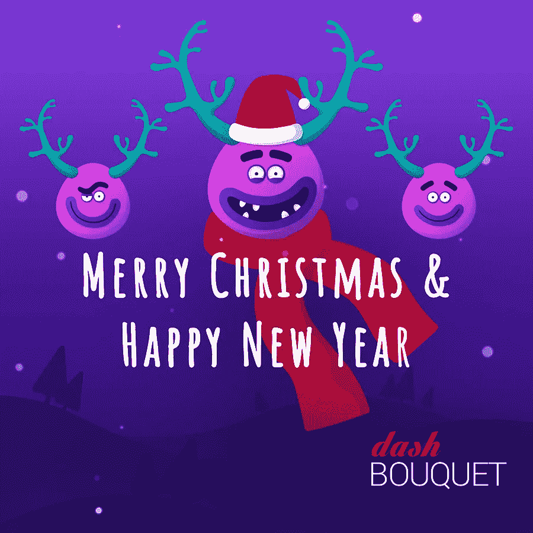

# Dashbouquet 倒带:我们如何度过 2018 年，以及与您一起度过！

> 原文：<https://medium.com/hackernoon/a-dashbouquet-rewind-how-we-rolled-through-2018-and-together-with-you-c25613c877d8>

大家好！

在 Dashbouquet，我们怎么强调与客户的长期关系都不为过。我们认为我们的成功完全建立在您的基础上——我们非常自豪地知道有这么多公司信任我们的项目。

我们还要感谢我们博客的读者:你们的评论和参与激励我们继续发布相关信息，并与那些对技术和创新感兴趣的人分享我们的专业知识。

因此，我们要对我们的客户、读者以及所有与我们一起工作和交流的技术极客们表示衷心的感谢。我们希望你有许多令人兴奋的新项目，许多乐趣和冒险，我们希望在 2019 年我们的客户群将会扩大。我们热爱我们所做的事情，我们很高兴与你分享我们的激情。

 [## DashMagazine -黑客正午

### 阅读黑客正午 DashMagazine 的文章。收集来自那些建立 Dashbouquet 的帖子…

hackernoon.com](https://hackernoon.com/@dashbouquet) 

2018 年一直在为 dash bounk 忙碌。这里是一个快速浏览:

*   雇用了 20 名新员工
*   启动了 5 个新项目
*   发表 64 篇文章
*   开设了 1 个新办公室
*   收到 5 份评论

至于我们的博客，也很忙。我们收集了阅读量最高的 9 篇文章，以防你错过其中任何一篇或者只是想重读它们:

1.  [你应该在软件工作流程中使用的十大工具](https://dashbouquet.com/blog/web-development/top-ten-tools-software-workflow)
2.  [将主导 2019 年的网络发展趋势](https://dashbouquet.com/blog/web-development/web-development-trends-that-will-dominate-in-2019)
3.  [在 React-Redux 应用程序中使用重选](https://dashbouquet.com/blog/frontend-development/usage-of-reselect-in-a-react-redux-application)
4.  [2018 年将推出 10 个 JavaScript 动画库](https://dashbouquet.com/blog/frontend-development/10-javascript-animation-libraries-to-follow-in-2018)
5.  [2018 年 Angular VS React](https://dashbouquet.com/blog/frontend-development/angular-vs-react)
6.  [2018 年排名前 5 的 JavaScript ide](https://dashbouquet.com/blog/frontend-development/top-5-javascript-ides-in-2018)
7.  [2018 年机器学习和人工智能趋势:期待什么？](https://dashbouquet.com/blog/artificial-intelligence/machine-learning-and-ai-trends-for-2018-what-to-expect)
8.  [性玩具和人工智能——过去、现在和未来](https://dashbouquet.com/blog/artificial-intelligence/sex-toys-and-artificial-intelligence)
9.  [区块链如何变革人工智能](https://dashbouquet.com/blog/blockchain/how-blockchain-can-transform-artificial-intelligence)
10.  [资料图:React vs Angular vs Vue.js](https://dashbouquet.com/blog/frontend-development/infographic-react-vs-angular-vs-vuejs)

再次感谢您和我们在一起，您激励我们做更多酷的事情！和往常一样，我们总是期待收到您的反馈。所以，请对我们的文章发表评论，给我们发电子邮件，或者简单地分享我们博客的内容——这会让我们感到非常特别。

达什布克团队致以最美好的祝愿，圣诞快乐，新年快乐！

【dashbouquet.com】最初发表于**。**

* [## DashMagazine -黑客正午

### 阅读黑客正午 DashMagazine 的文章。收集来自那些建立 Dashbouquet 的帖子…

hackernoon.com](https://hackernoon.com/@dashbouquet)*