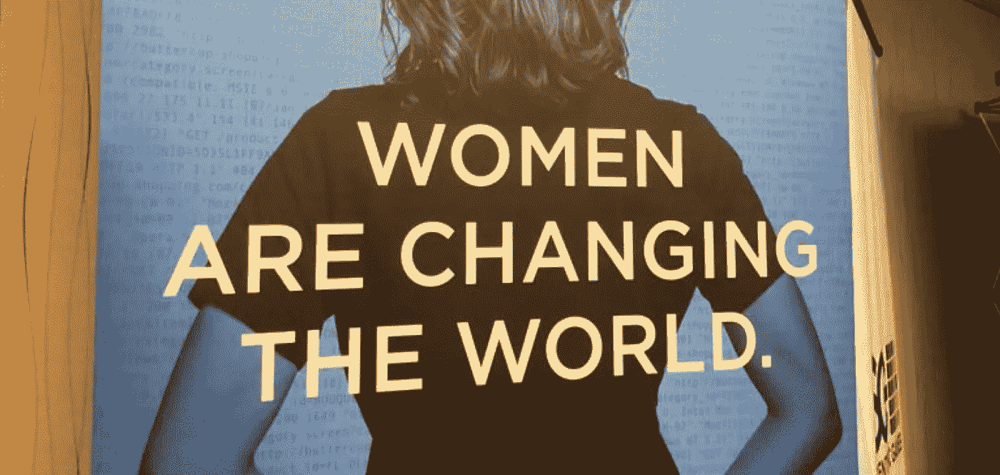

# 硅谷女性大会的一天

> 原文：<https://medium.com/hackernoon/a-day-at-the-women-of-silicon-valley-conference-88c3cfb6a66b>

Using note cards with no shame

# 为什么舞台上有个男的？

上周，我意外地有幸主持了硅谷女性大会的技术讲座。这是我第一次主持一场比赛，它以我无法预料的方式变得有趣又可怕。一个演讲者在还剩一天的时候退出了。幻灯片混在一起了。观众需要为问答做准备。这真的让我一整天都保持警觉。

更重要的是，我很荣幸成为此次针对科技界女性的活动中为数不多的男性参与者之一。一个常见的问题是，为什么我被要求主持，为什么我说，“是”(你知道，不是一个女人和所有)。有两个原因:

首先，我是硅谷的黑人男性工程副总裁。据我所知，现存的大约只有 4 个。尽管我无法确切描述硅谷女性的日常生活，但我认为我能体会到许多相同的感受，尤其是在一个我很少见到像我这样的人的世界里寻找联系和灵感的需要。所以我欣然接受了在 WoSV 主持一场比赛的机会，因为它将这么多有才华的女性聚集在一起，展示她们的成就。

其次，我个人认为，科技行业的高管有责任支持多元化。我们的行业，尤其是硅谷，仍然是这个星球上发展最快、最具变革性、最富机遇的环境。作为领导者，我们不仅要对自己负责，也要对公司负责，还要对整个社会负责。对我来说，这种责任意味着创造一个公平、多样和公正的世界。所以我参加了 WoSV，因为我是一个同盟者和支持者，不仅仅是为了技术领域的女性，也是为了所有未被充分代表的群体。

Reddit Execs + shout out to Wayne Sutton

# Reddit 的 D&I 方法

现在在 Reddit 工作。对于那些不知道的人来说，Reddit 是成千上万个你可能感兴趣的任何话题或兴趣的社区的集合。我们渴望带给世界上每个人一种社区感和归属感。听着，如果这听起来太花哨或不切实际，Reddit 有很多有趣的猫图片，你可以投票选出你喜欢的。

在 Reddit，我们一直非常公开地支持科技领域的多样性和包容性。来自 Reddit 的四位演讲者作为演讲者参加了硅谷女性大会:我是工程副总裁，出色的 Katelin Holloway 是我们的人力和文化副总裁，还有我们的两位明星数据科学家。

像许多其他科技公司一样，Reddit 仍在试图找出改善 D&I 的有效方法，但我认为我们已经确定的一件事是，如此大的变化必须从最高层开始。如果你看看 Reddit 高管团队，你会发现它可能是硅谷最多元化的团队之一。女性得到了很好的代表，黑人，拉丁人，穆斯林，我们甚至还加入了一些白人。

但严肃地说，我认为我们在高管层面做得很好，因为我们的多元化始于高层，所以我们能够为整个组织的其他部分定下基调。我们经常谈论 D&I，我们制定计划，我们采取行动，最重要的是我们看到了真正的变化。

特别是，这就是我如此兴奋地主持 WoSV 技术讲座的原因，因为这个讲座不仅仅是谈论和计划，它是关于行动和结果的。与会者看到了硅谷的女性，她们是各自领域的专家，成功的女性，成功的女性，以及代表这个行业需要看到的变革的女性。我很自豪也很荣幸能够介绍他们。

# 以下是阵容:

Fernanda Weiden — Engineering Manager @ Facebook

**将脸书扩展到 20 亿人口**
**主持人:**费尔南达是[脸书](https://hackernoon.com/tagged/facebook)制作工程团队的总监，领导与 Ads 的合作。她的团队致力于与 Ads 产品和基础设施服务的可靠性、效率、性能和可扩展性相关的项目。Fernanda 来自巴西，自 2012 年 5 月以来一直在脸书。在此之前，费尔南达曾在谷歌苏黎世、IBM 和巴西其他较小的公司工作。

Kritika Rai and Katie Bauer — Reddit Data Scientists

**Reddit 的数据科学，又名用数学在 Cat Gifs 中寻找意义**
**主讲人:** Kritika 是 Reddit 的数据科学家，她致力于建立用户行为模型和预测，以帮助加快产品增长。在 Reddit 之前，她在 Hipmunk 担任数据科学家，在那里她从事分析平台的工作，并为营销和产品团队构建了几个模型。她是 Reddit 和 Hipmunk 的第一位女性数据科学家。她拥有旧金山大学的经济学硕士学位，专攻预测金融市场变量的应用数学。

Katie Bauer 是 Reddit 的高级数据科学家，她致力于改进推荐系统，使用 NLP 来理解评论，并测量网站时间。此前，她在广告技术部门从事受众细分工作，在自然语言搜索部门从事查询解析工作。她的学术背景是社会语言学，她一直着迷于在线语言使用如何反映用户及其身份的信息。

Rebecca Holzschuh Senior Software Engineer @ New Relic

**如何成功实现开源项目**
**主讲人:** Rebecca 是 New Relic 的一名高级软件工程师，她每天都在构建原型并决定使用哪些开源项目。她最喜欢的开源项目是 Rails。

Molly Stevens — Director, User Experience Research @ Uber

**全球洞察、全球增长**
**主讲人:** Molly Stevens 在多个领域的用户体验设计和研究方面拥有超过 15 年的工作经验。她倡导在现代工具和服务开发的各个方面促进不同声音的发展。在优步，她的团队专注于开发本地和全球对人的洞察力，以创新当前和未来的技术。

KR Liu — Board of Directors @ Consumer Technology Association Foundation

**我推动无障碍听力技术的历程**
**主讲人:**KR 在三岁时被诊断患有严重的听力损失，在过去的二十年里，他一直是一名[技术执行官和残疾倡导者。KR 在 Doppler Labs 担任了两年的倡导和无障碍副总裁，在那里她制定了听力健康无障碍市场战略。这导致她与参议员沃伦的团队合作制定名为《2017 年非处方助听器法案》的新立法，该法案于 2017 年 8 月 8 日签署成为法律。](https://hackernoon.com/tagged/technology)

目前，KR 是美国听力损失协会、聋哑儿童协会、消费者技术协会基金会和世界听力基金会国际(世卫组织的分支)的董事会成员。她被授予美国国会奖；硅谷 40 岁以下前 40 名；2017 年度影响力女性；2015 年，因其在听力健康和技术方面的倡导工作获得《女性商业杂志》颁发的“女性在行动”奖。

D&I 问题将伴随我们很多年。像 WoSV 这样的活动给了那些未被充分代表的人一个找到社区的地方，并被那些找到成功之道的人所激励。我很自豪能参与其中，并乐观地认为希望和可能性的感觉会持续很久。

**岩石上的
-刻痕**

# 👏🏿👏🏿👏🏿**喜欢这个故事？请鼓掌！👏🏿👏🏿👏🏿我感谢大家的支持，这也有助于其他人了解这个故事。**