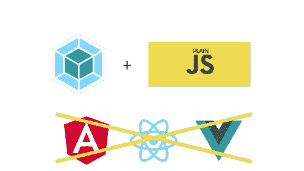
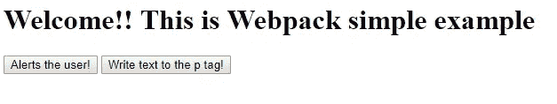

# 一个非常简单的 Webpack 4 示例，使用普通的 JavaScript(没有库和框架)

> 原文：<https://medium.com/hackernoon/a-dead-simple-webpack-4-example-with-vanilla-javascript-no-libraries-and-frameworks-8b9d0a7684be>



抢回购[这里](https://github.com/superjose/webpack-simple-example)！

这是对堆栈溢出问题的回应。我发现有些人可能需要这个，即使它看起来很傻，在最开始的时候，[学习](https://hackernoon.com/tagged/learning) [Webpack](https://hackernoon.com/tagged/webpack) 是在浑水中游泳。这是一个使用 Webpack 4 和普通 JavaScript(没有库和框架)的快速速成课程。

在计算机中打开一个新文件夹。检查您是否安装了 [NodeJS](https://nodejs.org/en/) 。运行`npm init`并填写详细信息。之后做:

*   `npm install webpack-cli -D`
*   `npm install webpack`

使用以下文件夹结构创建(index.html，index.js):

```
--index.html
--src/
-—----index.js
```

在 index.html 境内，添加以下内容:

```
<!DOCTYPE html>
<html lang="en">
<head>
<meta charset="UTF-8">
<meta name="viewport" content="width=device-width, initial-scale=1.0">
<meta http-equiv="X-UA-Compatible" content="ie=edge">
<title>Webpack Simple Example</title>
</head>
<body>
<h1>Welcome!! This is Webpack simple example</h1>
<button id="js-button">Alerts the user!</button>
<button id="js-write-text-button">Write text to the p tag!</button><p></p>
<script src="./dist/main.js"></script>
</body>
</html>
```

这应该是这样的:



The output of the HTML file

我们将使用 Webpack，以便在用户点击“Alerts the user！”按钮，并在用户单击“将文本写入 p 标签”时写入一些随机文本

由于我们正在学习基础知识，我们将创建另外两个文件:`alertbox.js`和`write-text.js`你的结构应该如下所示:

```
--index.html
--src/
-—----alert-box/
-—-------------/alert-box.js
-—----write-text/
-—-------------/write-text.js
```

在 alert-box.js 中，我们将编写:

```
/**
* This format uses the ES2015/ES6 class.
* You define an export before 'class' and you then import
* it by referencing the path of this file and then referring it
* with curly braces:
*
* import { AlertBox } from './alert-box/alert-box;
* Note that AlertBox is the same name as your class!
*
*/export class AlertBox { sayHi() {
      alert("Hello 😊");
   }
}
```

这是 ES2015/ES6 课程。我们可以通过`import {AlertBox} from './alert-box/alert-box';`将它包含在我们的脚本中

在 write-text.js 中，我们将有:

```
/**
 * We pass the actual <p></p> tag by searching it with
 * document.querySelector
 * @param {} p
 */module.exports = (p) => {
   p.innerHTML = 'Hello! From hidden text ';
}
```

这是一个传统的 module.exports 方法，演示了如何从文件中导出代码。

最后，在我们的 index.js 中，我们将它们集合在一起:

```
import { AlertBox } from './alert-box/alert-box';
import writeText from './write-text/write-text';// Since it's a class, we need to instantiate it before we can use it.const alertUser = new AlertBox();document.addEventListener('DOMContentLoaded', () => {
  const alertButton = document.getElementById('js-button');
  alertButton.addEventListener('click', alertUser.sayHi);
  const pTagButton = document.getElementById('js-write-text-button'); const pTag = document.querySelector('p');/**
* This is another variation. We create an anonymous function (Search more about it online)
* and we call the function.
*/ pTagButton.addEventListener('click', () => {
      writeText(pTag)
   });
});
```

发生了很多事。首先，我们需要将警告框和文本文件导入到代码中。我们通过使用您在那里看到的`import`语句来实现这一点(`require`也是有效的！).

其中一个是 ES2015 类(AlertBox)，我们需要在使用它之前实例化它，这就是为什么我们做`const alertUser = new AlertBox();`

# 应用事件侦听器

这就是奇迹发生的地方。事件侦听器是向 DOM 元素添加功能的“Webpack-way”。发生这种情况是因为 Webpack 限定了函数名的范围，使得它们很难通过全局范围来访问(如果这太专业了，可以认为您不能像以前那样访问它们)。原因是在构建复杂的应用程序时，有许多类可能会相互覆盖，或者可能具有相似的名称。这样就避免了问题。

我将在这里停止解释，并鼓励您查看[源代码](https://github.com/superjose/webpack-simple-example)以了解更多详细信息。你这样做是一个很好的实践，因为将会有黑暗的时期，你将不得不挖掘找到你的问题的根源。

# 构建项目

要构建项目，在目录中启动一个终端或 CMD/PowerShell 窗口，并执行`webpack`这将把您的代码转换成一个 main.js 文件，该文件将被浏览器读取。

然后打开你的**index.html**，瞧！不需要在网络服务器上运行。这直接通过双击 index.html 文件来实现。