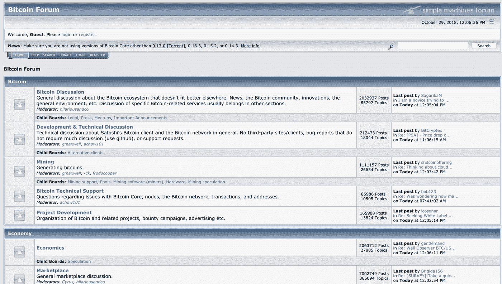
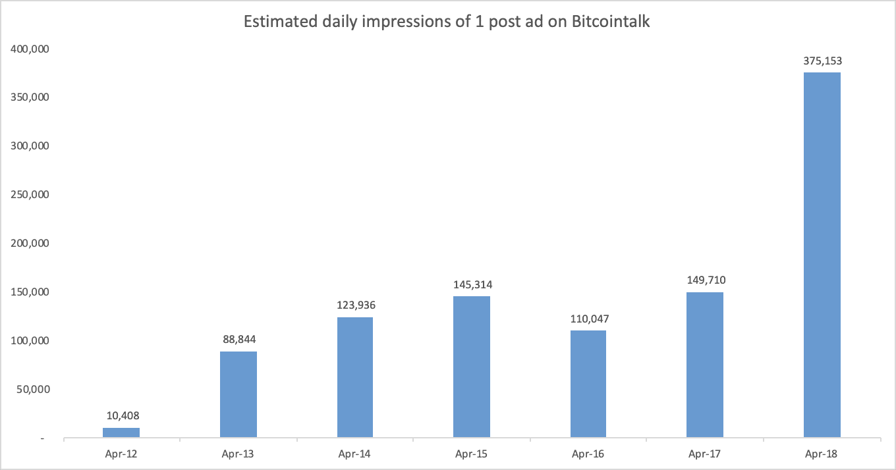
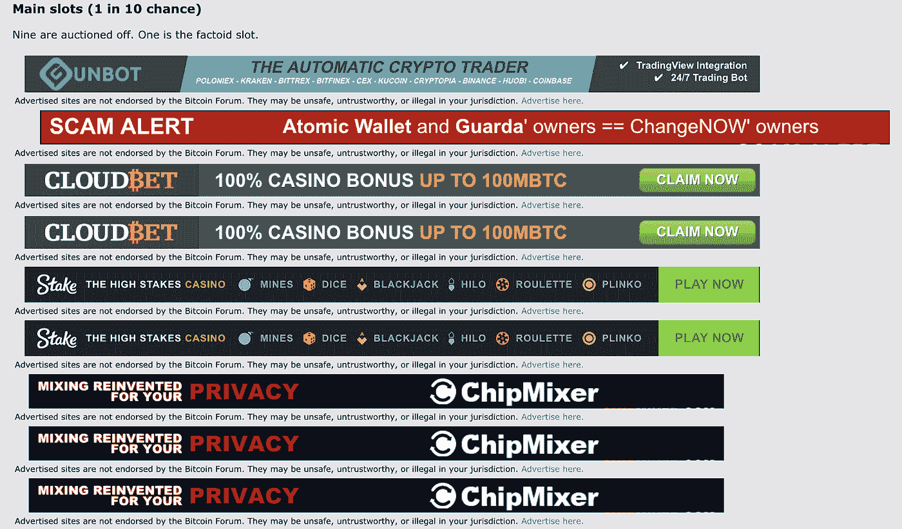
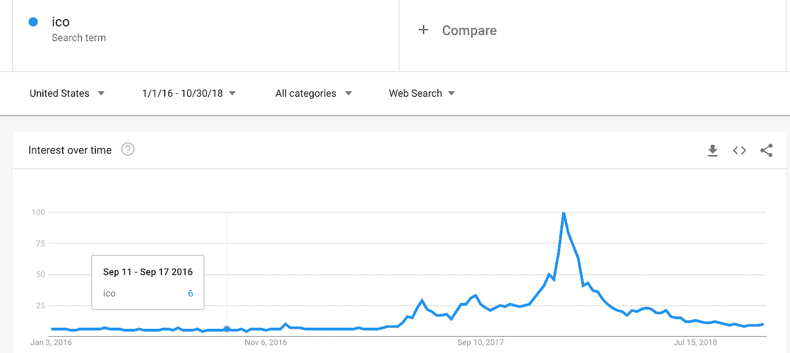
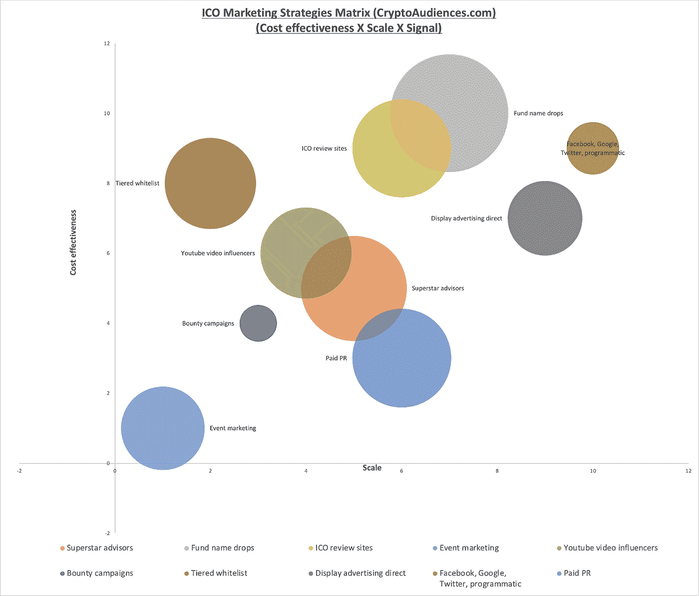
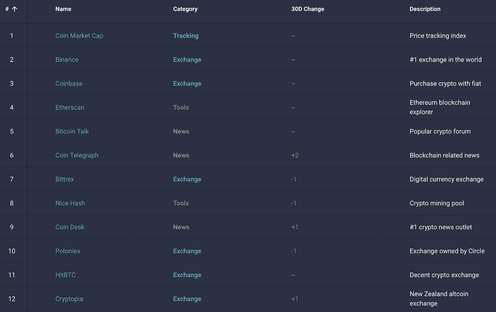
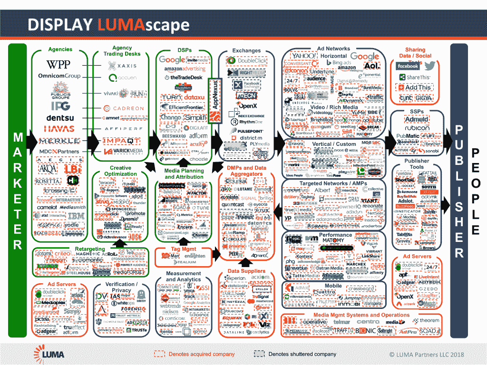
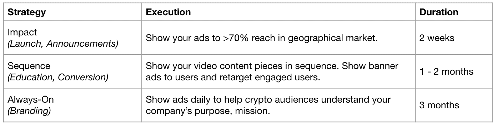

# 这十年的秘密广告

> 原文：<https://medium.com/hackernoon/a-decade-of-crypto-advertising-c7f698510e2e>

## 从聪到今天

## 谦逊的比特币白皮书从 ICOs 的狂野西部到广告增长的未来

2018 年 10 月 31 日是中本聪发布比特币白皮书十周年。在过去的 10 年里，随着更强大的技术、更多的使用案例以及全球对区块链的认知和采用，区块链的加密货币领域取得了显著进步。然而，一个很少被探讨的方面是加密和区块链业务是如何在他们接触和获取新用户的方式上发展的。在本帖中，我们将穿越时间，看看加密广告在过去 10 年中是如何变化的，并展望加密广告在未来 10 年可能会如何发展。

## 这一切的开始

2008 年 10 月 31 日，一个名为中本聪的个人或团体发布了《T2》比特币白皮书。白皮书提出了创建一种分散的点对点加密货币的愿景，这种货币可以作为无信任的交换和价值存储媒介。在 Sourceforge 论坛上，中本聪首先开始与粉丝和爱好者讨论比特币，该论坛后来成为 Bitcoin.org 的一个论坛。后来，它成为了一个独立的论坛——Bitcointalk——并在 2012 年 7 月 22 日达到了 100 万帖子的里程碑，时隔近 4 年。比特币的起源，围绕它的社区，以及发布的所有相关内容，创造了加密货币和相关项目商业化的潜力。如果没有在社区中旋转的想法，无论是赞扬还是讨厌各种想法或项目，整个加密货币行业都不可能存在。在早期，正在创建的有趣的附带项目不可避免地会发布在 Bitcointalk 上，以向社区“宣传”并接收关于其潜力和可行性的反馈。

*图一:Bitcointalk 论坛截图*

你可以回顾一下过去，看看有史以来最热门的话题: [**最具标志性的 bitcointalk 话题。Bitcointalk 上的历史。**](https://bitcointalk.org/index.php?topic=4322078.0)

我们可以看到，2010 年 1 月 15 日，有史以来第一个交易所公布并分享到社区:[【交易所】bitcointalk 用户 dwdollar 公布的第一个比特币交易所](https://bitcointalk.org/index.php?topic=20.0)。我们可以将此视为加密货币空间商业化的开始，因为越来越多的用户寻求创造和推出让其他人更容易交易和使用加密货币的产品。

因此，更好地接触和获得新客户变得更加迫切——其中一种方式当然是广告。

## 早期加密社区中的广告

虽然我们大多数人已经非常熟悉，但让我们来定义一下广告的含义:“广告是一种非个人的信息交流，通常由特定的赞助商通过各种媒体付费，通常具有关于产品、服务或想法的说服力。”(Bovee，1992 年，第 7 页)。事实上，在过去的加密时代，它始于一个论坛上的用户分享他们的想法和产品。Bitcointalk 在 2012 年 4 月推出了在每个主题页面的第一个帖子下面出售广告空间的做法。这里有一个基于每年间隔 7 天的印象的可视化。

*图 2:每个时段历史计数的估计日印象*

*当*用户浏览论坛时，他们会在 Bitcointalk 上看到产品潜在广告商的广告(见下图)。在过去的 7-10 天里，赢得拍卖的广告是赌场应用程序、隐私混合器、公共服务公告和加密交易机器人产品的组合。这种形式的广告也被称为展示广告。广告客户根据投放顺序(IO)中规定的投放次数或活动持续时间付费——基本上，这是广告客户为其广告投放而制定的一个顺序。

广告费用通常由发布者基于特定广告位的供给和需求来手动决定。如果出版商看到对其网络资产的良好需求，他们可能会继续提高价格，以最大限度地增加收入，达到广告商仍然可以接受的程度。相反，如果发行商有多余的存货，他们可以降低一些不太受欢迎的广告位的价格，使得他们不必求助于提供房屋广告(发行商或“房屋”为了填充广告位而放置的广告)并且使那些广告位不被网上销售。

*图 3:截至 2018 年 10 月 29 日，Bitcointalk 上拍卖给广告位广告商的九个广告位*

## 伊科斯的西部荒原

回到 2017 年:“初始硬币发行”(ICO)热潮开始形成势头，吸引了开发商、代币基金、散户投资者、监管机构以及中间所有人的注意力。这种新的融资现象使一类新的创业公司建立在社区建设和众包投资的原则上，为加密世界如何获得客户带来了新的动力。从与关键意见领袖合作、空投到在线广告，密码领域获取客户的工具箱开始再次发生变化。

在过去的 1.5 年里，推动全球对加密货币兴趣的最重大发展是公用事业代币的“首次硬币发行”。从 2017 年 1 月到 2018 年 6 月，创业公司和项目筹集了超过 190 亿美元([https://www . news BTC . com/2018/06/29/icos-已经产生-2018 年 13-70 亿-到目前为止-几乎翻了一番-2017-numbers/](https://www.newsbtc.com/2018/06/29/icos-have-generated-13-7-billion-in-2018-so-far-nearly-doubling-2017-numbers/) )。考虑到三分之二的金额是在 2018 年上半年筹集的，这个数字令人震惊。

比特币:

ICO:

*图片 4:截至 2018 年 10 月 29 日谷歌搜索趋势上的“比特币”&“ICO”*

从谷歌搜索趋势中，我们可以发现 ICO 和比特币搜索词之间的强烈相关性。这表明，对比特币和其他相关加密货币的兴趣激增，主要是由围绕首次发行比特币的活动和热情推动的。尽管中国等某些国家努力限制 ICO 活动，并于 2017 年 9 月 4 日彻底禁止，但来自中国的活动只是转移到了海外，使许多其他国家受益。EOS、TON by Telegram、Kyber Network、Zilliqa、ICON 等成功的代币销售都发生在过去的 1.5 年里。

## ICO 项目的秘密营销工具箱

通过研究项目促进其代币销售的多个工具箱，我们评估了 10 个最受欢迎的宣传项目的工具:

1.  超级明星顾问(所有“不免费赠送 eth”的人)
2.  基金“弃名”(a16zcrypto、币安实验室、Polychain、潘迪拉、FBG、希格诺、哈希德、比特大陆、F2pool、红杉、IDG)
3.  ICO 评论网站(ICODrops、CryptoBriefing、CrushCrypto、ICOBench、ICORating)
4.  活动营销(共识、代币峰会、街区秀、超越街区)
5.  YouTube 视频影响者(Ian Balina、Doug Polk Crypto、Ivan On Tech、Boxmining)
6.  赏金战役(通过论坛、电报群宣布)
7.  分层白名单(Quantstamp 的关怀证明、Kyber Network 的 Slack 邀请白名单、Fantom 的幸运抽奖白名单)
8.  直接显示广告(CoinMarketCap、Etherscan、CryptoCompare、Coingecko.com、Bitcointalk)
9.  脸书/谷歌/ Twitter /程序化广告(脸书、谷歌和 Twitter 在一段时间内禁止了加密广告，2018 年第三季度放松了对受监管交易所、教育内容的规定)。少数广告客户在程序化平台上运营，所有创意都要经过广告交易所的批准。
10.  付费 PR (Cointelegraph，Coindesk，金色财经等。)

【图 5: ICO 营销矩阵——成本效益 x 规模 x 信号(CryptoAudiences.com)

## 数字广告在规模和成本效益上排名靠前，在信号效果上排名靠后

从我们对顶级策略的分析中，我们发现数字广告渠道在大规模接触大量受众方面非常有效。当然，加密公司的数字广告在很大程度上并不是一帆风顺的。脸书、推特和谷歌在 2018 年 Q2 奥运会上禁止了加密/初始硬币提供相关广告，而程序化也踩在了须经出版商或网络创意批准的灰色地带。

最受欢迎的加密货币网站，如 CoinMarketCap，月浏览量超过 5000 万次，在 2018 年 Q2 全球排名前 200 位，为广告商提供了直接接触加密货币爱好者的重要途径。

对于许多代币销售项目，市场中存在显著的信息对称。因此，许多参与者依赖于社会证据，如基金或著名的加密影响者也投资于该项目，作为其前景的受欢迎程度或可行性的信号。就像 Yelp 上的餐馆评论和 App Store 上的应用评论如何影响下载量一样，让顶级基金和知名社区成员积极评价他们的项目，有助于项目获得“高信号评级”。虽然这些看起来似乎是免费的，但这些成本中的大部分也可能隐藏在交易所上市费([https://www . finance magnates . com/cryptocurrency/news/pay-for-play-why-exchange-token-listing-fees-are-bad-for-the-industry/](https://www.financemagnates.com/cryptocurrency/news/pay-for-play-why-exchanges-token-listing-fees-are-bad-for-the-industry/))或咨询费的形式中，一些项目在交易所上市时为了保持形象而积极做市。

token 项目的创始人可能还会在收件箱中发现许多来自活动组织者的电子邮件，推销活动赞助包。虽然活动营销非常适合建立联系，但它们是可扩展性最差、成本最高的选择，一些活动的赞助套餐高达 10 万美元以上。“区块链周”正在各地兴起，包括最近在韩国、旧金山和新加坡，是资金交流信息和项目合作的绝佳聚集地；但就任何产品的规模化获取用户而言，它们肯定不划算。

也就是说，在项目的广告提供和评估方面，经验普遍较少，因为一些创始人来自更具技术背景的地方，或者更依赖社会证明作为他们的营销手段。虽然广告明显带来了规模——一旦你搞清楚了你的产品和渠道，增加更多的广告费用会给你带来一致的结果——但当这些项目仍在搞清楚它们的产品市场适合度或筹资组合时，这样的规模并不总是被理解或需要。因此，crypto 中的许多广告老手都来自成熟的商业模式，如区块链的赌博应用程序或接受 crypto 的赌场。

这可能会导致误解或密切联系的加密广告，有些人可能会认为是令人讨厌的。当然，ico 的兴起也催生了另一个更加阴险的广告商群体。

## 班，班&班

由于散户对加密货币有很大兴趣，机会主义者发现了快速赚钱的机会，创造了虚假项目来欺骗投资者。这些骗子从哪里接触散户？你猜对了，通过脸书、谷歌、Twitter 和 Programmatic 等平台的在线广告。自然，随着这些骗局变得越来越常见，这些平台慢慢开始了他们对加密广告的战争，以保护消费者。这对市场营销人员——甚至那些来自合法项目的人——如何为他们的加密产品获得新客户产生了巨大的影响。

随着 ICOs 及其相关营销的爆炸式增长，脸书、谷歌和 Twitter 等许多主要平台介入，以确保消费者免受欺诈性广告的影响，作为一项安全措施，同时开始起草内部政策。

粗略时间表:

*   脸书、谷歌、Twitter ICO 广告无处不在(2017 年 6 月至 2018 年 4 月)
*   脸书禁令、谷歌禁令、推特禁令(2018 年 4 月)
*   脸书放松——Brian Armstrong 在推特上发布消息称，比特币基地广告现已被列入白名单(2018 年 6 月)
*   从 10 月起(2018 年 9 月)谷歌放松

**展示横幅——我应该去哪里？**

脸书和谷歌等传统平台为广告商提供了一个自助服务平台，利用其平台根据用户档案数据提供的定位选项来锁定加密受众(对加密货币和区块链感兴趣的用户)。在脸书，广告客户可以通过对加密相关话题的兴趣定位来锁定用户。谷歌搜索使广告商能够根据用户使用的搜索词来确定目标，例如“最佳 ico”。Twitter 上的广告商可以锁定某些交易所的关注者和相似者，例如“@币安”。

即使在今天，广告账户和创意的白名单也是不确定和困难的。鉴于传统平台的相对不确定性，广告商也应该考虑其他广告渠道。

像 CoinMarketCap 这样的网站提供了一个很好的途径来达到同样的影响力。广告方法主要是在各个页面上打出横幅；还提供原生功能，如推荐钱包和兑换的按钮，适用于不同的加密货币。

程序化广告提供了在加密网站上运行的另一种途径。这可以通过管理网站列表来实现。在程序上，进行“拍卖”是为了确定特定广告印象的合理价格，在它出现在用户屏幕前的几毫秒内发生。这创造了一个需求与供给的经济，确保广告商可以获得有价值的库存，同时为出版商带来良好的收益。

编程的另一个吸引力是，它提供了由第三方数据提供商(如 Oracle)提供的独特的加密受众；通过代理商和出版商之间的伙伴关系，广告商可以获得由浏览加密相关内容的用户组成的第二方数据。如果广告商担心创意审批，他们也可以通过与出版商达成协议，建立一个私人市场(PMP)来运行广告，从而绕过审批程序。使用 PMP 的好处是可以利用有价值的加密受众，否则直接购买 IO 是不可能的。

在 Crypto viewers，我们的合作伙伴 CoinMarketCap 将允许 Crypto 广告商在对他们重要的网站和应用程序(脸书、Youtube、内容网站和游戏应用程序等)上与 CoinMarketCap 受众进行互动。

*图 6:加密货币相关网站流量排名—*[*【https://www.cryptotrafficrank.com/】*](https://www.cryptotrafficrank.com/)

*图 CoinMarketCap 上推广内部产品 Pro API 的顶部横幅*

## 越来越受目标驱动

当我们交易加密货币时，公平地说，我们永远不会真正知道市场的走向。广告的伟大之处在于，虽然加密货币和区块链行业绝对是独一无二的，有其自己的一套原则和规则，但与其他行业相比，它在广告方面遵循类似的趋势。自 2010 年以来，展示 LUMAscape 是一个动态文档，根据展示广告行业的发展方向进行更新。随着许多公司被收购，这个行业肯定会出现整合。与其他公司相比，能够生存下来的公司能够提供显著的业绩。脸书、推特、谷歌因其影响力而脱颖而出。大机构拥有深厚的客户关系，能够相应地进行调整。在产品上与众不同的中间参与者能够继续在市场上竞争。

*图 Luma Partners 的展示广告 Luma scape*

许多加密货币相关产品的广告成本以 CPMs(每千次展示的成本)来衡量。尽管广告商通常为展示付费，但他们可能对点击和转化等其他指标更感兴趣。虽然印象服务肯定有很大的价值——知名度、品牌、脑海中的回忆、思想的分享——但当涉及到对底线的实际贡献时，它们可能很难量化。只有当我们能够衡量点击量、完成浏览量和转化率时，我们才能系统地优化以获得更好的结果。

目前，在加密货币广告中，CPM 购买仍然是最常见的做法，因为许多媒体购买仍然是通过直接 IO 完成的。这并不意味着出版商不提供 CPC(每次点击成本)的测量，或者广告商不跟踪 CPA。这只是意味着，不管你喜欢与否，CPM 收费是出版商最直接的盈利方式，而不必对其他指标负责。由于加密公司的广告选择有限，他们现在仍然不得不接受 CPM 购买。

一些与加密货币相关的广告机构正在崛起，挑战现状。我们将看到在 CPC(每次点击成本)、CPA(每次行动/获取的成本，例如注册为用户)、CPCV(每次完成观看的成本)方面对活动进行优化和报价的转变。尽管自数字广告出现以来，这些指标几乎已经存在了很长时间，但由于缺乏广告测量方面的经验，它们现在并不常用于加密领域，更不用说创建用于跟踪和优化的像素或代码了。

在这种情况下，通过 CPA 进行测量将需要广告商(交易所、矿业公司、加密项目)在他们的网站上放置一个跟踪像素，以便将用户的“行为”(登录页面、注册优惠、采取行动等)归属于该特定活动。这也将允许重新定位和创造性排序，实现广告客户的预期目标。

这将要求拥有加密和广告领域专家的罕见机构，具备为加密产品类型建立成功营销活动的知识。其中一部分包括增加获得批准在 FB、Google、Youtube、Programmatic 上开展活动的机会；建立跟踪和再销售；并达到关键交付成果的目标。一些真正独特的机构还与顶级密码出版商合作，为超目标受众提供服务，以加速该活动。

## 视频和更好的讲故事

2014 年，大型平台押注的一个关键领域是视频广告。Youtube 提供预卷视频，在 Youtube 上你最喜欢的烹饪课视频开始之前播放。事实上，这些持续 6 秒钟的前滚动视频中的一些非常好，你不会知道你更喜欢实际的视频还是广告本身([https://blog . hubspot . com/marketing/best-six-seconds-pre-roll-ads-on-YouTube](https://blog.hubspot.com/marketing/best-six-second-pre-roll-ads-on-youtube))。

脸书提供了原生视频，当你在脸书和 Instagram 上滚动浏览你的内容时，这些视频会自动播放，没有声音。Twitter 提供的视频广告也可以出现在获得许可的及时内容之前，如超级碗触地得分即时重播。Programmatic 还开放了无数的视频库存，如(移动)垂直视频、原生视频和外流视频。随着加密货币和区块链成为更大的主流应用，我们应该看到更多的努力来创造更好的面向消费者的视频，与其他行业的标准保持一致。

*视频 1:新人营介绍预告片，一部以兰迪·扎克伯格为主角的高质量作品*

视频作为一种工具可以非常有效地激发用户的情绪，讲述静态图像难以传达的故事。推广制作的视频也可以瞬间抓住用户的注意力，让他们能够迅速做出明智的决定。

## 接触加密受众

可以肯定地说，所有的广告客户都希望以最广泛的覆盖面和规模向目标用户提供广告。虽然这听起来是一个简单的目标，但要实现它并不容易。数据稀缺，在哪里投放广告的选择有限。了解到这一点，在 CryptoAudiences.com，我们最近与加密货币和区块链的领先网站 CoinMarketCap 合作，为广告商提供从该网站接触用户的能力。特别是因为我们了解加密和广告的挑战和机遇，我们看到脸书、谷歌和程序化广告的结合将如何影响全球超过 20 亿用户，这些用户通过他们的浏览或购买行为表现出对加密的真实兴趣。创建正确活动策略的专业知识对于满足运营交易所、加密硬件公司、dApps(去中心化应用)、品牌和该领域其他项目的加密广告商的 KPI 非常重要。

【图 9:广告客户活动策略示例(CryptoAudiences.com)

## 建立新的规范

> “我确信，20 年后，要么交易量非常大，要么没有交易量。”— Satoshi

值得注意的是，加密货币和区块链行业仍处于萌芽阶段。在过去 10 年里，我们从比特币白皮书的发布发展到流通加密货币和代币市值超过 2000 亿美元的整个行业。看到 2028 年我们会在哪里，真的会令人惊讶。作为一种支付形式、价值储存、融资方式、记账单位，这些都是我们在过去十年探索的用例，并将在未来十年继续探索。我敢打赌，将会有非常大的交易量，我们刚刚开始建设基础设施，以支持这些量和基于该技术的产品。

*这篇为 Hackernoon 写的文章最初发表在 crypto 观众博客上的是* [*。*](https://cryptoaudiences.com/blog/a-decade-of-crypto-advertising)

[**crypto audients**](http://cryptoaudiences.com)是一家致力于为业内顶尖公司实现广告目标的加密广告公司。凭借 20 多年的广告经验，我们推动您的活动取得成效。我们的团队和顾问来自成熟的广告和区块链技术公司，如 Twitter、Trade Desk、#Chain、Cobo 和 CoinMarketCap。CryptoAudiences 是 CoinMarketCap 的首选合作伙伴和官方经销商。通过程序化、脸书、Youtube 广告渠道，锁定对加密货币感兴趣的受众，无论他们在哪里。您的活动将达到 1000 多万当今世界上最高质量的加密观众。