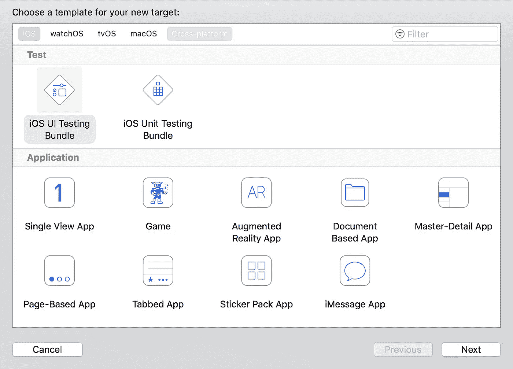

# 如何准备您的 iOS 应用程序进行 UI 测试

> 原文：<https://medium.com/hackernoon/a-developer-and-tester-friendly-guide-to-ui-testing-on-ios-71fbd20f22a8>

## 为你的 iOS 应用编写稳定一致的 UI 测试

去年，我与我们的测试人员密切合作，将第一个 UI 测试目标添加到我们的 iOS 项目中。我们有一些简单的目标来衡量我们的成功:

*   编写易于维护的测试。
*   从测试中抽象出 app 内部接线和架构。
*   一个简单的机制来[存根](https://github.com/AliSoftware/OHHTTPStubs)相关的 API 调用(使用[查尔斯](https://www.charlesproxy.com/)或[查尔斯代理](https://itunes.apple.com/app/charles-proxy/id1134218562?mt=8)找到相关的调用)。

## 您实际测试的是什么

例如，为了确保你测试的是你的应用程序，而不是你的后端，把你所有的 API 调用都截掉是个好主意。这也保证了一致性、稳定性和不那么脆弱的 UI 测试。

你的目标不应该是测试你的后端或它和前端之间的集成，而是孤立地测试应用程序，并确认它在一些预先确定的条件下一致地工作。

# 设置事物

如果您的应用程序还没有 UI 测试目标，您将不得不转到`**File** > **New** > **Target** > **iOS UI Testing Bundle**`添加一个。



## XCTest 框架如何工作

让大多数人感到困惑的第一件事是，你不能在你的`**XCTestCase**`中存根你的 API 调用，因为它只是打开你的应用程序，所以你在那里做的任何存根都将丢失。

你必须使用 [launch arguments](https://developer.apple.com/documentation/xctest/xcuiapplication/1500477-launcharguments) 来代替，让你的应用程序知道它处于 UI 测试模式，什么 API 调用需要存根。

## 如何存根你的 API 调用

当涉及到向你的应用返回虚假数据(预先决定的响应)时，你有很多选择，比如模仿存储库(管理者，等等..基于您的应用程序架构)协议。换句话说，就是在呼叫实际到达网络层之前避开它。

另一个选择是阻止你的应用程序在测试中可能发出的所有 web 调用。使用[ohhttpsubs](https://github.com/AliSoftware/OHHTTPStubs)时，您的应用程序实际上执行了存储库中的所有代码，当您访问网络层时[ohhttpsubs](https://github.com/AliSoftware/OHHTTPStubs)会返回预先响应或错误。与第一个选项不同，这实际上会暴露存储库中隐藏的错误。

## 一个简单的结构来存根现有的和未来的 API 调用

在我以前编写可维护的 UI 测试的尝试中，主要是在 Android 上，模仿存储库方法总是很棘手，特别是从测试人员的角度来看，因为它们不会每天都在代码库上工作。另一方面，您可以轻松运行应用程序，找出应用程序发出的所有请求及其响应，并轻松处理它们，而不必担心代码中会发生什么。

我仍然想让代码清晰，并且可以很容易地映射到我们的 API 结构/文档中。任何 REST 后端都有不同的 API，每个 API 都有一堆端点，所以这就是代码看起来的样子。我甚至可能会考虑将来自动生成所有这些代码。

```
**protocol** StubApi {   
}**protocol** StubEndpoint {

    **var** path: String { **get** }
    **var** name: String { **get** }
    **var** type: String { **get** }
    **var** method: HttpMethod { **get** }
    **var** params: [String: String]? { **get** }

}**extension** StubEndpoint {

    // Helper serialization function.
    **func** toDictionary() -> [String: String] {
        **var** dictionary = [String: String]()
        dictionary["path"] = path
        dictionary["name"] = name
        dictionary["type"] = type
        dictionary["method"] = method.rawValue

        **if let** params = params {
            **let** json = **try**! JSONSerialization.data(withJSONObject: params, options: JSONSerialization.WritingOptions())
            dictionary["params"] = String(data: json, encoding: String.Encoding(rawValue: String.Encoding.utf8.rawValue))
        }

        **return** dictionary
    }

}
```

我还包括了`**StubbingManager**`将支持的 HTTP 方法和资源类型。

```
**enum** HttpMethod: String {
    **case** *GET*, *POST*, *DELETE*, *PUT* **static func** fromString(rawValue: String?) -> HttpMethod {
        **guard let** rawValue = rawValue **else** { fatalError() }

        **switch** rawValue {
        **case** HttpMethod.*GET*.rawValue:
            **return** .*GET* **case** HttpMethod.*POST*.rawValue:
            **return** .*POST* **case** HttpMethod.*DELETE*.rawValue:
            **return** .*DELETE* **case** HttpMethod.*PUT*.rawValue:
            **return** .*PUT* **default**:
            fatalError()
        }
    }
}**enum** ResourceType: String {
    **case** J*SON* }
```

一个示例 API 存根看起来像这样

```
// [https://jsonplaceholder.typicode.com/](https://jsonplaceholder.typicode.com/)
**class** PostsStubApi: StubApi {

    **class** RetrieveOnePostItem: StubEndpoint {
        **let** path = "/posts/1"
        // This file name, it can exist anywhere but it needs to be accessible by the app target as well as the UI test target.
        **let** name = "stub_discarded_jobs"
        **let** type = ResourceType.*json*.rawValue
        **let** method = HttpMethod.*GET* **let** params: [String : String]? = **nil** }
}
```

## 如何在 UI 测试模式下启动您的应用程序

因为您不能在测试中存根 API 调用，所以当从 UI 测试启动应用程序时，您必须将一些数据传递给应用程序。为此，我们可以在`**XCUIApplication**`上使用`**launchEnvironment**`。

```
**class** BaseTestCase: QuickSpec { // Or XCTestCase

    **private var** stubManager: StubManager = StubManager()

    // Easily add a new stub before your test run.
    **func** stub(endpoint: StubEndpoint) {
        stubManager.add(stub: endpoint)
    } // Remove all tests after a test has ran.
    **func** removeAllStubs() {
        stubManager.removeAllStubs();
    } **// Here is where the magic happens.**
    **func** launch(app: XCUIApplication) {
        app.launchEnvironment["stubs"] = stubManager.toJSON()
        app.launch()
    }

}
```

并且`**StubManager**`可以存在于应用程序或者 UI 测试目标中，它只需要在两个目标之间共享。

```
**import** OHHTTPStubs

**final class** StubManager {

    **let** jsonHeaders = ["content-type": "application/json"]

    **private var** stubs: [StubEndpoint] = []

    **deinit** {
        killStubs()
    }

    **func** add(stub: StubEndpoint) {
        stubs.append(stub)
    }

    **func** loadStubs() {
        // Just stub any image request to avoid any web calls.
        stub(condition: isExtension("png") || isExtension("jpg") || isExtension("gif")) { _ **in
            let** stubPath = OHPathForFile("stub.jpg", type(of: **self**))
            **return** fixture(filePath: stubPath!, headers: ["Content-Type" **as** NSObject:"image/jpeg" **as** AnyObject])
        } **// Now let us go through the stubs array and apply them.**
        **for** stub **in** stubs {
            // Base url for your endpoints.
            **var** condition = isHost("[https://jsonplaceholder.typicode.com](https://jsonplaceholder.typicode.com/)")
            condition = condition && isPath(stub.path)

            **switch**(stub.method) {
            **case** .*GET*: condition = condition && isMethodGET()
            **case** .*POST*: condition = condition && isMethodPOST()
            **case** .*DELETE*: condition = condition && isMethodDELETE()
            **case** .*PUT*: condition = condition && isMethodPUT()
            }

            **if let** params = stub.params {
                condition = condition && containsQueryParams(params)
            }

            stub(condition: condition) { _ **in
                let** bundle = Bundle(for: type(of: **self**))
                **let** path = bundle.path(forResource: stub.name, ofType: stub.type)
                **return** OHHTTPStubsResponse(fileAtPath: path!, statusCode: 200, headers: **self**.jsonHeaders)
            }
        }
    }

    **func** removeAllStubs() {
        stubs = []
    }

    **func** killStubs() {
        OHHTTPStubs.removeAllStubs()
    } **// To serialize stubs and send them to the app.**
    **func** toJSON() -> String? {
        **var** arrayOfStubs = [[String: String]]()

        **for** sutb **in** stubs {
            arrayOfStubs.append(stub.toDictionary())
        }

        **let** json = **try**! JSONSerialization.data(withJSONObject: arrayOfStubs, options: JSONSerialization.WritingOptions())

        **return** String(data: json, encoding: String.Encoding(rawValue: String.Encoding.utf8.rawValue))
    } **// To deserialize stubs in the app and apply them.**
    **func** fromJSON(json: String) {
        stubs.removeAll()

        **let** data = **try**! JSONSerialization.jsonObject(with: json.data(using: String.Encoding.utf8)!, options: JSONSerialization.ReadingOptions())

        **if let** stubData = data **as**? [[String: String]] {
            **for** stub **in** stubData {
                stubs.append(AnyStubEndpoint(dictionary: stub))
            }
        }
    }

    **struct** AnyStubEndpoint: StubEndpoint {

        **var** path: String
        **var** name: String
        **var** type: String
        **var** method: HttpMethod
        **var** params: [String: String]?

        **init**(dictionary: [String: String]) {
            uri = dictionary["path"] ?? ""
            name = dictionary["name"] ?? ""
            type = dictionary["type"] ?? ""
            method = HttpMethod.fromString(rawValue: dictionary["method"])

            **if let** params = dictionary["params"] {
                **self**.params = **try**! JSONSerialization.jsonObject(with: params.data(using: String.Encoding.utf8)!, options: JSONSerialization.ReadingOptions()) **as**? [String: String]
            }
        }
    }
}
```

剩下的就是检查`**AppDelegate**`是否设置了`**launchEnvironment**`。

```
**extension** AppDelegate {

    **func** isStubbing() -> Bool {
        **return** ProcessInfo.processInfo.environment["stubs"] != **nil** }

    **func** configureStubsIfNeeded() -> Bool {
        **if** isStubbing() {
            stubManager = StubManager()
            **if let** json = ProcessInfo.processInfo.environment["stubs"] {
                stubManager.fromJSON(json: json)
                stubManager.loadStubs()
            }

            **return true** }
        **else** {
            **guard** stubManager != **nil else** { **return false** }
            stubManager.killStubs()

            **return false** }
    }

}
```

## 使用 Quick and Nimble 编写您的第一个 UI 测试

编写 UI 测试不需要太多的应用架构知识，测试人员或开发人员只需要找到哪些端点需要存根，就可以轻松地开始添加更多测试。

```
**import** Quick
**import** Nimble

**class** DiscardJobsSpec: TMTestCase {

    **override func** spec() {
        **let** app = XCUIApplication()

        describe("retrieve discarded jobs") {

            beforeEach {
                stub(endpoint: PostsStubApi.RetrieveOnePostItem())
            }

            afterEach {
                removeAllStubs()
            }

            it("should do something") {
                // You will have one item on the screen at this point 🎉
            }
        }
    }
}
```

我希望你喜欢读这篇文章，如果你喜欢就分享它，如果你喜欢就在 Twitter 上关注我。