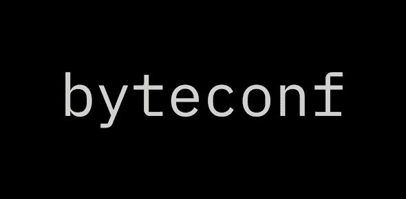

# 面向所有人的开发者大会

> 原文：<https://medium.com/hackernoon/a-developer-conference-for-everyone-d9968368368d>

今天，我很兴奋地宣布 [Byteconf](https://hackernoon.com/tagged/byteconf) 。这是另一种不同的技术[会议](https://hackernoon.com/tagged/conference)，在 Twitch 上**免费**和**直播，因此地球上任何有设备和互联网连接的人都可以参加。**

我们的第一个会议是***byteconf _ react _ 2018****，* a 为期两天的单场会议，JavaScript 和 React 开发人员可以在这里向世界上最好的 React 开发人员学习。***byteconf _ react _ 2018***将于 8 月 23 日**至 24 日**举行，所以请在您的日历上做好标记！

会议在我心中有一个特殊的位置——在那里，我接触到了我现在每天都在使用的新技术，以及从事令人难以置信的项目的了不起的开发人员。作为一名 2013 年的 Ruby on Rails 新开发人员，参加 Heroku 的 Waza 会议产生了巨大的影响:这是我第一次被一大群开发人员包围。这鼓舞并激励我继续成为一名软件工程师。

但是会议可能很贵。在旅行、住宿和票价之间，很多技术会议对很多人来说都是遥不可及的。

无论你是业余爱好者还是专业开发人员，你都应该能够参加会议，向世界上最好的程序员和演讲者学习。无论位置或经济地位如何，每个人都应该成为社区的一部分。我正试图用 Byteconf 实现这一点。

Byteconf 与许多会议截然不同——我们用一排排的椅子换来了一个聊天框，用 HDMI 线缆换来了一个实时的 Twitch 流。这是一个未开发的领域，但我知道的是社区是最重要的部分。

**想参加 byteconf_react_2018？你可以[加入邮件列表](https://www.producthunt.com/upcoming/byteconf)，了解我们宣布的演讲者、赞助商等最新消息。也可以在推特[上找到我们——希望能在那里见到你！](https://twitter.com/byteconf)**

**你是想在 byteconf_react_2018 做演讲的 React 开发者吗？**我们现在也公开征集论文。[填写我们的快速 CFP 表格](https://bytesized.typeform.com/to/wtTJDJ)，我们会保持联系！

**贵公司有兴趣赞助 byteconf_react_2018 吗？**我们希望与那些希望将其产品展示给全世界 React 和 JavaScript 开发人员的优秀公司合作。如果贵公司有兴趣，[联系我们](https://bytesized.typeform.com/to/NHnkGu)。

[*克里斯蒂安·弗里曼*](https://twitter.com/imkmf) *是软件工程师，* [*老师*](https://bytesized.xyz) *，还有* [*播客*](https://bytesizedpodcast.com) *。他在* [*产品搜索*](https://producthunt.com) *工作，同时还组织* [*字节配置*](https://byteconf.com) *。*