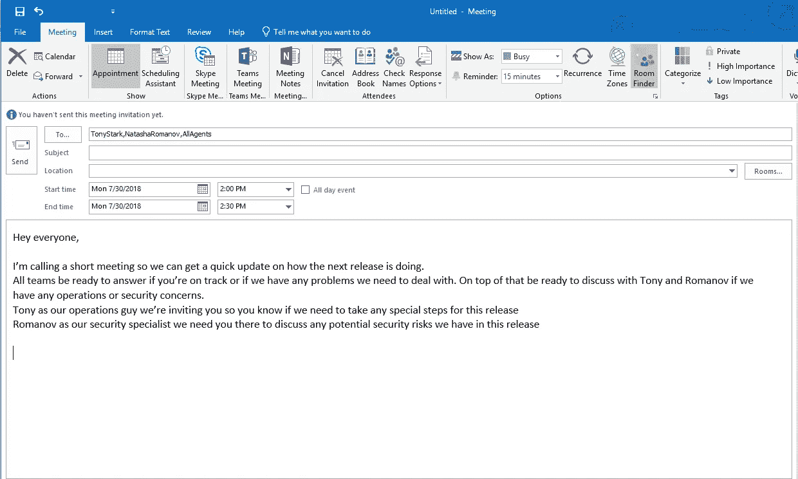
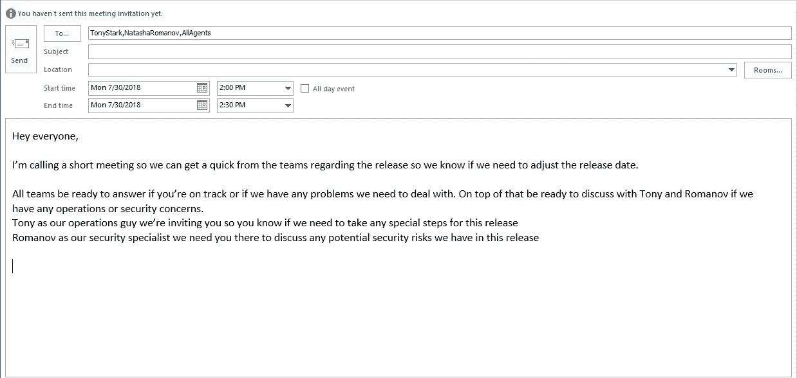

# 开发人员如何开好会议的指南

> 原文：<https://medium.com/hackernoon/a-developers-guide-to-having-great-meetings-d46a1289b7e3>

主持会议本身就是一种技能，这是我在大学学习计算机科学的几年中肯定没有学到的。当我开始我的职业生涯时，我觉得在我的显示器前比在会议室里的人面前更自在，但随着我不得不为更多这样的事情提供便利，我学会了如何做得更好。所以现在，本着分享我多年来所学到的东西的精神，这里有一些帮助你开好会议的建议。

## 让每个人都知道你邀请他们的原因

像方法名和变量这样的会议，最好是在自己解释的时候。就像你会用代码写一个注释来解释事情一样，在会议邀请中写下一个简短的注释可以帮助那些被邀请的人弄清楚他们为什么被召集。

像大多数[开发商](https://hackernoon.com/tagged/developers)一样，我也很内向，所以直接走向让我不舒服的人需要时间、勇气和精力。由于我对每个人都感到不舒服，所以我会给那些可能没有收到会议邀请的人发一条简短的信息，只是为了提醒他们，以防他们忘记，我会在会议请求中这样写下:

## 准备好议程

这听起来可能是显而易见的，但令人惊讶的是，有多少人的议程仅仅是“让我们谈谈这个话题”。就我个人而言，我认为这样的开放式议程并不是最好的，我宁愿这样表述。改写前面的例子:

当然，这并不总是那么容易。有时我们召开会议来收集想法或获得反馈。当谈到我过去为会议设定的目标时，这里有一些启发

*   对(某一问题)做出决定
*   有一个关于(主题)的想法列表
*   列出关于(主题)的反馈
*   对(问题)有行动要点
*   让(人)了解(话题)

## 以一个目标开始会议

把会议的第一分钟想象成你的函数或类的名字，当你在里面继续阅读的时候，它会准确地告诉你将要发生什么。这是对人们的一个提醒，也是一个让人们专注于手头任务的机会。

## 边栏讨论

在激烈的会议中，我们很容易深入探讨并尝试解决出现的每一个小问题。还记得那次有人提到一个 bug，你开始在脑子里调试并询问越来越多的细节，然后你知道的下一件事是 30 分钟过去了，每个人要么试图和你一起找出这个 bug，要么希望他们在其他地方？我知道，因为这种事以前在我身上发生过，我知道类似的事情也发生在你身上。这就是侧边栏的概念被很好理解的地方。我让人们到边栏的个人流程是

*   让他们知道我们偏离了主题。
*   承认他们的深潜很重要，但现在不是时候。
*   向他们保证会有时间进行讨论。

这里有一个例子:

> 嘿，伙计们，我们开始花太多时间讨论这个安全问题，我们还有其他事情要做。我知道这是一个我们必须解决的问题，所以我们将在议程结束后腾出时间，或者我们将为此安排另一次会议，好吗？

## 让人们早点出去

将会议视为一种快速失败的方法，就像发生错误时抛出异常并停止流程一样。当会议对内部人员不再有意义时，还应该允许人们退出会议。例如，一旦议程完成，我们正在利用时间处理边栏，那么这是其他人早点去的好时机。我相信每个人都会对正在进行的讨论感兴趣，但如果出于某种原因，他们没有兴趣，那么留下一个空隙让他们退出也没问题。在上面使用的例子中:

> 伙计们，谢谢你们的更新，我们将开始讨论我们是否能完成发布。如果你对那次讨论感兴趣，我们非常欢迎你留下来，但是如果你有事情要做，你也可以走

## 用时尚来包装它

我喜欢用一些充满活力的东西来结束我的会议。你如何做到这一点完全取决于你，但对会议如何结束要有一定的洞察力，这样才能留下一个好的最后印象。提前结束我们的示例会议

> 因此，我们已经就该做什么做出了决定，而且我们在分配给本次会议的一个小时内就做出了决定。干得好，伙计们，我们走！

## 会后反馈

就像你让同事检查你的代码来寻找改进一样，会议也是同样的工作方式。没有什么能阻止你问在场的人有什么可以做得更好，然后在你的下一次会议上尝试。

你有它！从一个害怕开会的人到一个人们要求帮助他们开会的人，我学到了很多重要的东西。