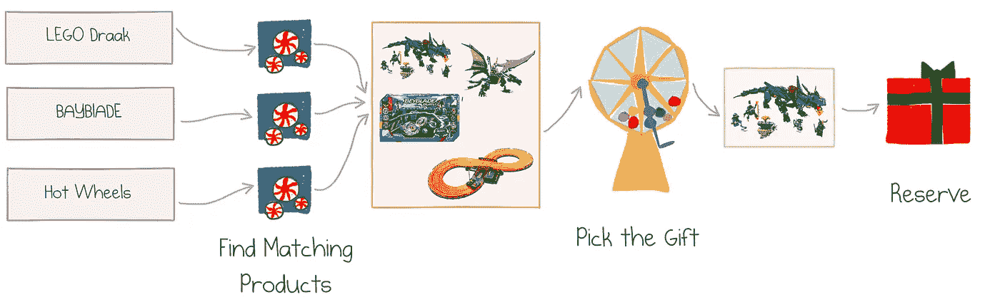
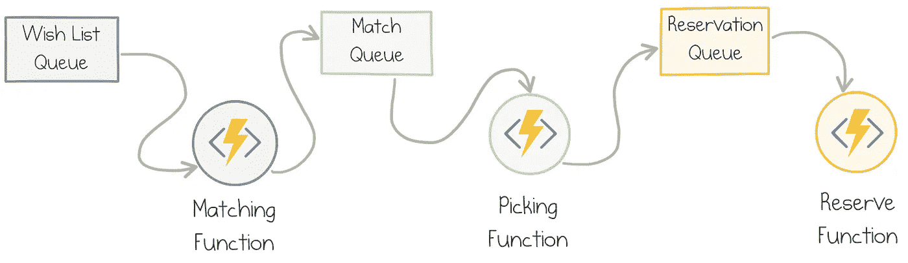
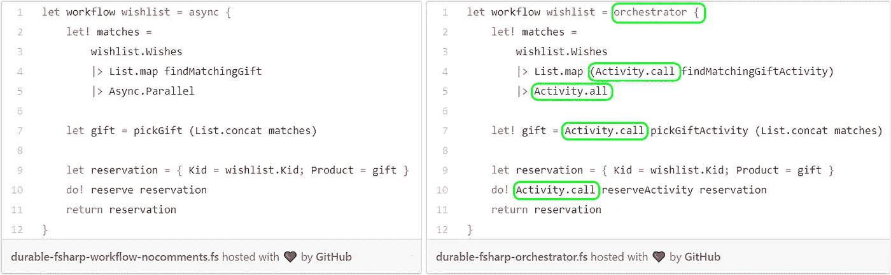

# F#和持久函数的童话

> 原文：<https://medium.com/hackernoon/a-fairy-tale-of-f-and-durable-functions-975ccc4d46b8>

*该帖子是* [*F#降临节日历 2018*](https://sergeytihon.com/2018/10/22/f-advent-calendar-in-english-2018/) *的一部分。圣诞节到了！*

今年夏天，我受雇于圣诞老人办公室。圣诞老人不仅仅是一个童话人物，他领导着一个大型组织，为全球数百万儿童提供礼物和快乐。像任何大型组织一样，圣诞老人的办公室雇佣了数量惊人的 IT 系统。

作为 IT 现代化工作的一部分，North Pole HQ 重组了整个圣诞礼物供应链。许多遗留组件从北极的自我管理数据中心转移到 Azure cloud，尽管那里的冷却成本非常低。由于圣诞老人的技术精灵使用 Office 365、SharePoint 和。NET 开发堆栈。

重新设计的目标之一是尽可能利用托管云服务和无服务器架构。圣诞老人没有多余的精灵来继续改造它的轮子。

# 愿望实现服务

我的任务是重新设计**愿望实现**服务。该服务接收来自客户(他们称孩子为“客户”)的愿望列表:

Christmas Card with a Wish List © my son Tim

幸运的是，这个列表已经被其他服务解析过了，并且还包含了关于孩子背景(年龄、性别等等)和偏好的元数据。

对于列表中的每一项，我们的服务都调用匹配服务，该服务使用机器学习、Azure 认知服务和一点魔法来确定最符合客户表达的愿望和特征的实际产品(他们将礼物称为“产品”)。例如，我儿子对“乐高德拉克”的愿望与“斯宾吉祖·第一伯恩红龙的乐高·宁加戈大师”相匹配。你明白了。

每个想要的项目可能有几个匹配，每个结果都有一个估计，即满足最初要求并让孩子开心的可能性有多大。

所有匹配的产品被组合起来，并被发送到**礼品挑选**服务。挑选礼物会根据价格、需求、信心水平和客户的淘气或乖分数来选择其中一个。

工作流程的最后一步是**在仓库和运输系统中预留**选定的礼物，该系统称为“圣诞老人的产品档案”，也称为 SAP。

下面是一张图中的整个流程:

Gift Fulfillment Workflow

我们应该如何实现这项服务？

# 原设计

愿望实现服务应该运行在云中，并与其他服务集成。它应该能够在 12 月处理数百万个请求，并在今年剩下的时间里保持非常低廉的运行成本。我们决定在[消费计划](https://azure.microsoft.com/en-us/pricing/details/functions/)上利用具有 [Azure 功能](https://docs.microsoft.com/en-us/azure/azure-functions/functions-overview)的无服务器架构。无服务器功能包括:

*   **完全托管**:云提供商提供资源，根据负载进行扩展，保证正常运行时间和可靠性；
*   **事件驱动**:对于每个无服务器函数，你必须定义一个特定的触发器——导致它运行的事件类型，可以是 HTTP 端点，也可以是队列消息；
*   **每次执行更改**:如果没有使用，运行应用程序不需要任何成本，繁忙应用程序的成本与实际资源利用率成正比。

这是原始设计的图表:

Workflow Design with Azure Functions and Storage Queues

我们使用 Azure 存储队列来保持整个流程的异步性，并对故障和负载波动具有更强的弹性。

这种设计基本上是可行的，但是我们发现了一些问题:

*   这些功能是通过存储队列和相应的绑定手动连接的。工作流分散在基础设施定义中，因此很难掌握。
*   我们必须将每个愿望列表的所有项目传递到一个匹配函数的调用中，否则组合来自多个队列消息的匹配结果会很棘手。
*   虽然不在最初版本的范围内，但有计划为不匹配的项目添加手动 elf 干预。这个特性需要改变流程设计:让长时间运行的流程适合管道并不是一件小事。

为了改进这些点，我们决定尝试[持久函数](https://docs.microsoft.com/azure/azure-functions/durable/durable-functions-overview)——一个将工作流编排引入 Azure 函数的库。它引入了几个[工具](https://hackernoon.com/tagged/tools)来定义有状态的、可能长期运行的操作，并在幕后处理大量可靠通信和状态管理的机制。

如果你想知道更多关于什么是持久函数以及为什么它们可能是一个好主意，我邀请你阅读我的文章[理解 Azure 持久函数](https://mikhail.io/2018/12/making-sense-of-azure-durable-functions/) (20 分钟阅读)。

在这篇文章的剩余部分，我将带你通过 Azure 持久功能实现愿望实现工作流。

# 领域模型

一个好的设计从一个合适的领域模型开始。幸运的是，这个项目是用 F#构建的，F #是。网络生态系统。

## 类型

我们的服务是用一个愿望列表作为输入参数调用的，所以让我们从类型`WishList`开始:

它包含关于列表作者和已识别的“订单”项目的信息。`Customer`是自定义类型；现在，里面有什么并不重要。

对于每个愿望，我们希望生成一个可能匹配的列表:

该产品是圣诞老人目录中的一个特定礼物选项，信心是从`0.0`到`1.0`的一个数字，表示匹配有多强。

我们服务的最终目标是生产一个`Reservation`:

它代表了特定儿童的确切产品选择。

## 功能

愿望实现服务需要执行三个动作，可以用三个强类型异步函数来建模。

*注意:在整篇文章中，我对 F#函数使用小写的“function ”,对 Azure 函数使用大写的“Function ”,以减少混淆。*

**第一个动作**为每个愿望寻找匹配:

我的所有函数片段的第一行显示了函数类型。在这种情况下，这是从孩子的愿望文本(`string`)到匹配列表(`Match list`)的映射。

**第二个动作**取所有愿望的所有匹配的*组合*列表并选择一个。它的实际实现是圣诞老人的秘密酱，但我的模型只选择了置信度最高的一个:

给定 picked `gift`，预订仅仅是`{ Kid = wishlist.Kid; Product = gift }`，不值得单独操作。

**第三个动作**在 SAP 系统中注册预订:

## 工作流程

履行服务将这三个操作合并到一个工作流中:

工作流实现是对实际领域流的一个很好的简明的总结。

注意，匹配的服务被并行调用多次，然后借助于`Async.Parallel` F#函数很容易地组合结果。

那么，我们如何将领域模型转化为无服务器持久功能之上的实际实现呢？

# 经典持久函数 API

C#是持久函数的第一个目标语言；现在也完全支持 Javascript。

F#最初并没有被官方声明为受支持的，但是因为 F#运行在官方支持之上。NET 运行时作为 C#，它一直在工作。我有一篇关于 F# 中的 [Azure 持久函数的博文，并且已经将](https://mikhail.io/2018/02/azure-durable-functions-in-fsharp/) [F# samples](https://github.com/Azure/azure-functions-durable-extension/tree/master/samples/fsharp) 添加到官方资源库中。

下面是我的旧 F#代码中的两个例子(它们与我们的礼物实现领域无关):

这段代码工作正常，但看起来不像惯用的 F#代码:

*   无强类型:活动函数通过名称和手动指定的类型来调用
*   功能没有具体化，所以局部应用很困难
*   任何持久操作都需要传递`context`对象

虽然这里没有显示，但是其他示例读取输入参数、处理错误和强制超时——看起来都太像 C#-y 了。

# 更持久的功能

我们没有遵循次优路线，而是用更符合 F#习惯的 API 实现了服务。我先展示代码，然后解释它的基础。

实现由三部分组成:

*   **Activity**Functions——来自域模型的每个动作一个
*   **Orchestrator** 功能定义工作流
*   [**Azure 函数绑定**](https://docs.microsoft.com/en-us/azure/azure-functions/functions-triggers-bindings) 指示如何在云中运行应用程序

## 活动功能

每个活动功能定义了工作流的一个步骤:匹配、挑选和保留。我们只是在一行定义中引用这些操作的 F#函数:

每个活动都由一个名称和一个功能定义。

## 管弦乐演奏家

Orchestrator 调用活动函数来产生服务的预期结果。该代码使用自定义计算表达式:

请注意它与我们的领域模型中的工作流定义的匹配程度:

Async function vs. Durable Orchestrator

唯一的区别是:

*   `orchestrator`计算表达式被用来代替`async`,因为在编排器中不允许多线程
*   `Activity.call`取代直接调用函数
*   `Activity.all`替补队员`Async.Parallel`

## 托管层

Azure Function 触发器需要被定义为托管任何一段代码作为云函数。这可以在`function.json`中手动完成，或者通过从。网络属性。在我的例子中，我添加了以下四个定义:

这些定义非常机械，而且是强类型的(除了函数名)。

## 装运它！

这些都是让我们的持久愿望实现服务启动和运行所需要的。从这一点出发，我们可以利用 Azure 功能的所有现有工具:

*   用于开发和调试的 Visual Studio 和 Visual Studio 代码
*   [**Azure 功能核心工具**](https://github.com/Azure/azure-functions-core-tools) 在本地运行应用并将其部署到 Azure
*   核心工具的最新版本有专门的命令来 [**管理持久函数**](https://docs.microsoft.com/en-us/azure/azure-functions/durable/durable-functions-instance-management) 的实例

在采用无服务器架构的过程中有一个学习曲线。然而，像我们这样的小项目是学习的好方法。它使圣诞老人的 It 部门走上了成功之路，孩子们将更可靠地获得更好的礼物！

# 耐久功能。FSharp

以上代码是用库 [DurableFunctions 实现的。FSharp](https://github.com/mikhailshilkov/DurableFunctions.FSharp) 。我创建了这个库，作为一个瘦的 F#友好的持久函数包装器。

坦率地说，本文的全部目的就是介绍这个库，让您有足够的好奇心去尝试一下。耐久功能。FSharp 的工具箱中有几个部分:

*   `OrchestratorBuilder`和`orchestrator`计算表达式，封装了`DurableOrchestrationContext`的基于`Task`的 API 的正确用法
*   `Activity`将活动定义为头等值的通用类型
*   `Activity`模块用助手函数调用活动
*   用于`Async`和`Orchestrator`的 Azure 函数定义的适配器
*   原始持久扩展的 API 仍然可用，因此如果需要，您可以使用它们

在我看来，F#是开发无服务器功能的绝佳语言。使用函数的简单性、默认的不变性、强类型系统、对数据管道的关注在事件驱动的云应用程序世界中都是有用的。

Azure Durable Functions 带来了更高层次的抽象，用简单的构建块组成工作流。持续功能的目标。FSharp 是为了让 F#开发者的作品更加自然和有趣。

[开始使用](https://github.com/mikhailshilkov/DurableFunctions.FSharp#getting-started)就像创建一个新的一样简单。NET 核心项目并引用一个 NuGet 包。

我希望得到尽可能多的反馈！在下面留下评论，在 [GitHub 库](https://github.com/mikhailshilkov/DurableFunctions.FSharp)上创建问题，或者打开一个 PR。这将是超级真棒！

编码快乐，圣诞快乐！

## 感谢

非常感谢[凯蒂清水](https://twitter.com/kashimizMSFT)、[德文伯里斯](https://twitter.com/DevonBurriss)、[戴夫洛](https://twitter.com/iwasdavid)、[克里斯吉勒姆](https://twitter.com/cgillum)审阅本文草稿并提出宝贵的意见和建议。

*最初发表于*[*Mikhail . io*](https://mikhail.io/2018/12/fairy-tale-of-fsharp-and-durable-functions/)*。*