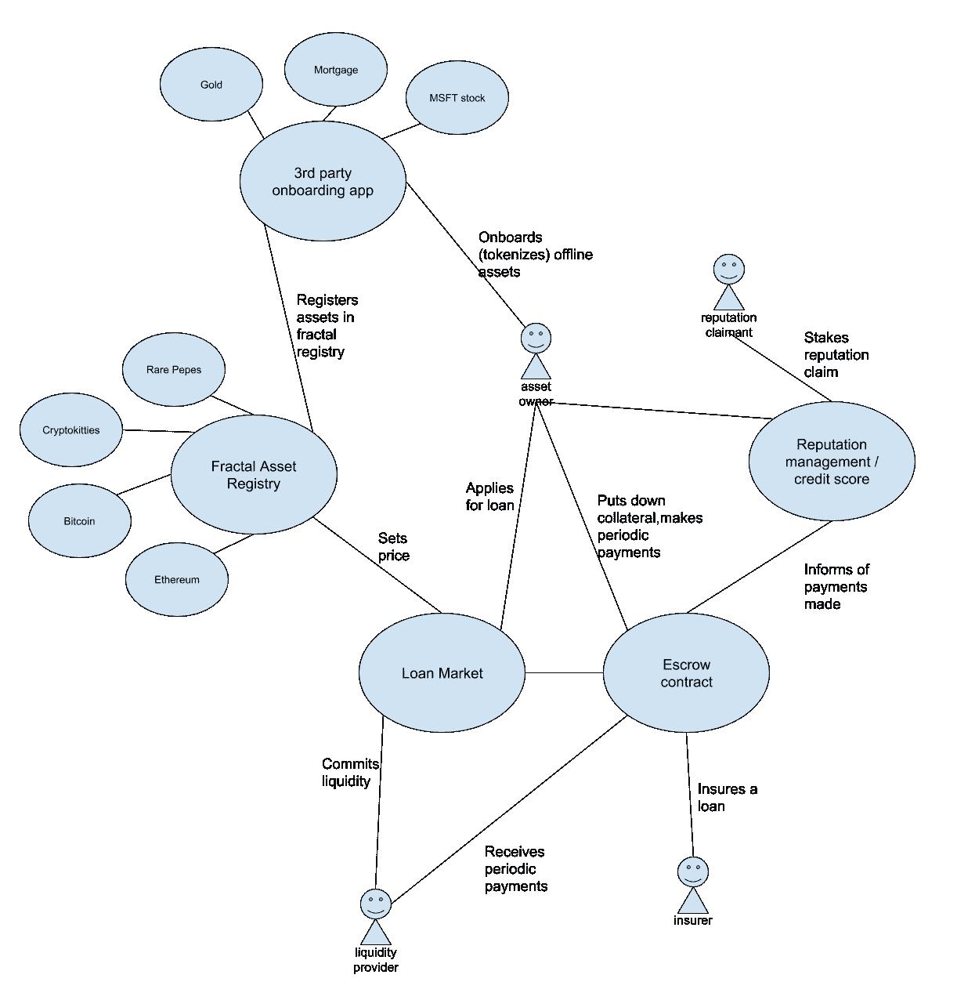

# 关于安全令牌的几点思考

> 原文：<https://medium.com/hackernoon/a-few-thoughts-on-security-tokens-d5a47f1fbd91>

## 正如一个没有经济、金融或贸易背景的工程师所理解的

我们的经济已经发展到考虑和说明各种不同的资产:股票、债券、房地产、商品、知识产权和许多其他资产。交易这些资产中的一部分会受到其实物的限制，因为实物交易所有权或者甚至细分资产可能会很麻烦。

为了帮助解决这个问题，我们发明了证券化。这是将资产或权利的所有权转化为易于交易的证券的过程。我们预计，随着区块链技术的出现和成熟，以及开放标准的发展，我们将能够扩展证券化的概念和影响。我们将通过资产的令牌化来做到这一点。

证券交易的数字化和标准化已经有很长的历史了，但许多这些系统仍然是封闭的花园，没有互操作性。它们不是开放的系统，任何人，即使有合适的需求，都可以随意参与。而且他们在很大程度上是由各方作为中介的，随着区块链体系的不信任、透明和分散共识，他们的角色(提供信任和降低风险)可能会过时。

既然我们已经有了实现这一目标的技术手段，将相对缺乏流动性的资产进行令牌化，并创建一个交易这些令牌的市场是不可避免的。传统的、流动性相对较差的资产将获得可观的流动性溢价，再加上非中介化带来的费用大幅削减，这意味着巨大的市场机会。

# 安全令牌的优势

由于其非中介化潜力、全球风险和程序化操作，令牌化证券对现代金融市场具有破坏性。安全令牌的几个优点是:

*   更低的费用
*   获得全球资金池
*   更快的结算
*   部分所有权
*   全年无休的市场
*   流动性增加
*   没有最低投资额
*   自动化合规
*   资产互操作性

所有这些结合起来应该导致更大的市场效率，并且这些代币的编程性质将为新的金融技术打开闸门。建立一个标准化的协议是至关重要的，quants 和其他开发者可以在此基础上设计新的金融产品和服务，因为它真正使创新在这个领域加速。至关重要的是，这种创新将是没有许可的，因为它不会局限于当前金融领域大型企业的 R&D 部门。

# 标准化和互操作性

标准化和互操作性是开放金融市场运动中的两个关键概念。

多年来，金融界已经制定了一些标准，这并不是什么新想法。否则，你的经纪人就不可能持有不同公司的股票，而这些公司使用的是相同的法律结构。然而，令牌化使我们能够通过标准化许多不同资产类别的所有权，将这一概念提升到新的高度，并使它们可以放在同一个钱包中，用作贷款的抵押品，以及无需现金中介的直接交易。我设想所有资产类别将合并成一个全球流动性池，通过一个通用的 API 实现互操作。

# 自动化合规

安全令牌化的一大优势是潜在的自动化合规性。我们正在试验一种内嵌合规性的令牌:如果你愿意，可以称之为合规性原生令牌。这防止了令牌化证券落入坏人之手，同时保持了交易阶段的非中介化。

很容易想象出这种技术的天真版本。对于那些熟悉 ERC-20 标准的人来说，您可以想象在该合同的基础上有一个限制，这样所有权转移只能发生在已经注册为经过适当级别的财务尽职调查(KYC/反洗钱/CFT、资本市场法规、投资者认证)的地址。

这些嵌入了合规性的安全令牌应该会让合规过程变得如此无缝和可审计，以至于我预测监管机构将开始要求证券的令牌化，仅仅是为了这些优势。在这个世界上，法规的执行将会简单得多。有很好的理由相信这将会发生，因为[我们已经看到监管机构在过去要求采用技术](https://www.sec.gov/info/edgar/regoverview.htm)。

监管将不可避免地发生变化。一些国家规定了所有权转移的形式，或者要求有实际的书面记录。我们相信，当地金融市场先驱带来的竞争压力将推动其他监管机构接受这项新技术。

# 技术草案样本

## 嵌入式合规性

如上所述，想象一个令牌实例化契约，它要求购买者经历某种程度的 KYC。买家必须接受身份提供商的彻底注册，比如[分形 ID](/frctls/introducing-fractal-id-gateway-to-the-web-3-0-8169b4291d45) 。验证成功后，Fractal ID 可以向他们提供这种 KYC 验证的加密签名声明，他们可以使用该声明作为令牌合同的证明，以证明他们有资格购买。在这一点上，通过允许代币的所有权归属于该买方，合同将允许销售。

上面设计的机制的一个有趣的可能性是，代币合同不需要知道买方的身份，只要他们经历了要求的 KYC 水平，只要合同信任分形的主张。

## 自动流动性供应

这是智能合同/应用程序网络的一个示例。

上面的示例提供了以下功能:

*   离线资产的加入/令牌化
*   令牌化资产的注册
*   价格发现
*   自动贷款申请
*   流动性准备金
*   贷款保险
*   信用/声誉评分

作为一个例子，让我们假设一个贷款市场，投资者向该市场提供流动性，为满足某些接受标准的贷款提供资金。例如，贷款必须由令牌化资产抵押，由第三方保险，并且只授予具有一定信用评分的个人。在这一点上，个人可以使用他们注册的动态定价的 Cryptokitties 作为所述自动贷款的抵押品。然后，该贷款由托管合同管理，托管合同保管抵押品和提供的流动性。用户将对该合同的贷款定期支付利息，这些利息将传递给投资者。

**策划一个 ICO？**在 [Fractal](https://www.trustfractal.com/business/) ，我们提供了一个简单易用的 launchpad 解决方案，结合全面的客户身份识别服务(KYC/AML ),轻松成功地部署您的令牌。

**建立交易所？** [分形 ID](/frctls/introducing-fractal-id-gateway-to-the-web-3-0-8169b4291d45) 让你披上用户认证，KYC & AML。[告诉我们](https://trustfractal.com/business/)或查看[集成文档](https://github.com/FractalBlockchain/id-integration-docs)。