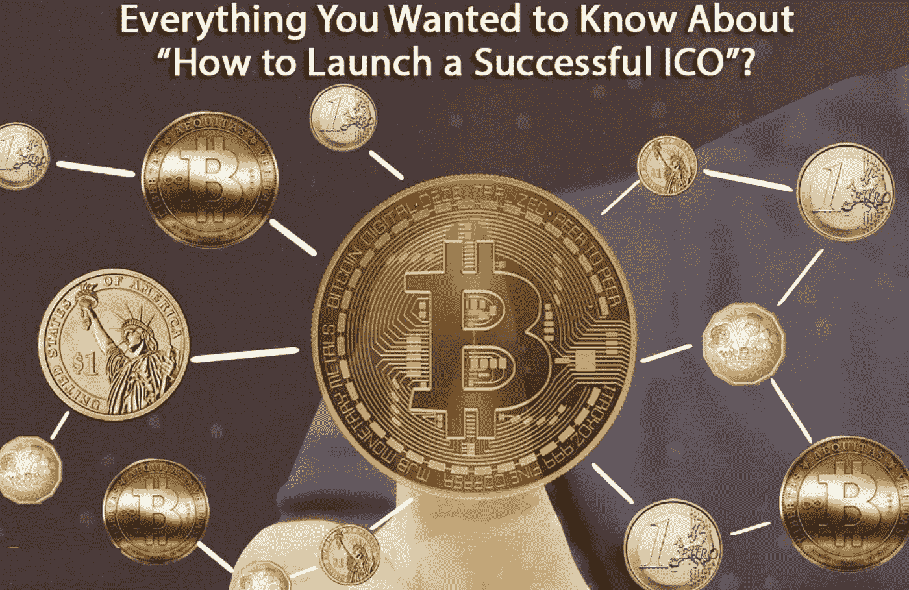

# 如何推出 1 亿美元的 ICO-A Conf？致电 Sirin Labs 创始人兼首席执行官 Moshe Hogeg 美国东部时间 2 月 1 日下午 1 点至 2 点

> 原文：<https://medium.com/hackernoon/a-fireside-chat-conf-82f5e990ae69>

电话录音回放如下:

Sirin Labs 的愿景是成为安全开源消费电子产品的全球领导者，弥合大众市场和区块链经济之间的差距。他们芬尼手机的预购量[已经超过 25000 台](https://goo.gl/sab3Sj)。上个月，Sirin Labs 在实现这一愿景方面向前迈出了一大步，他们通过 ICO 筹集了 1.57 亿美元，这是历史上第三大 ICO[ICO](https://hackernoon.com/tagged/ico)(仅次于 Tezos 和 Filecoin [(根据 *Business Insider*](https://goo.gl/4VUXxY) )。

显然，1.57 亿美元的 ICO 不会凭空出现。除了创办一家像制造下一代手机一样复杂的新公司这一艰难的工作之外，还有大量的工作要做。

在这个电话会议上，Sirin Labs 的创始人兼联合首席执行官 Moshe Hogeg 将谈论 Sirin Labs 在世界各地通过各种社交媒体平台建立的令人惊叹的社区。我们将深入探讨白皮书的撰写、售前流程和加密鲸。这将是一个很好的入门读物，任何人都在考虑投资 ICO 或投资 ICO。

此外，Moshe 还将谈到 Sirin 的 Finney phone，以及他的风险投资基金 Singulariteam，该基金专注于人工智能、机器人和 AR/VR 等先进技术以及加密技术。最后，Moshe 将谈论 Alignment Blockchain Hub，“区块链创造&转型的一站式商店。

正如我以前所写的，[以色列在加密领域击败了它](https://goo.gl/JgMxwD)，Moshe 处于以色列生态系统的中心，他在全球加密生态系统中开辟了一条独特的道路，在多个项目中创造了巨大的股东价值。

我们将在最后留出充足的时间供观众提问。

[点击此处](https://goo.gl/hDZSt4)在 GoToWebinar 上注册电话会议

在通话的第二天，会有一段通话录音发布在这个页面上

[点击此处](http://www.lendit.com/usa/2018/blockfin?utm_source=CryptoOracle&utm_medium=website&utm_campaign=usa-2018)了解更多关于 BlockFin 峰会的信息，这是一个领先的加密金融科技会议，将于 4 月 9 日至 10 日在旧金山莫斯康中心举行

[点击此处](https://goo.gl/ksEFpQ)了解更多关于加密星期一的信息

*如果你从这篇帖子中获得了至少* 0.00000001 比特币*的价值，那么* ***继续，在*** *下方“鼓掌”。*