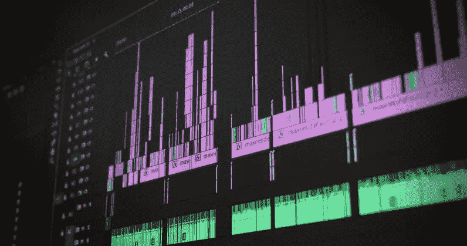

# 一个轻弹是 1/705600000 秒

> 原文：<https://medium.com/hackernoon/a-flick-is-1-705600000th-of-a-second-3680c4524fbd>

Credit: [Recklessstudios / Pixabay](https://pixabay.com/en/editing-video-computer-1141505/)

为了让电影、虚拟现实和其他视觉内容创作者更容易处理屏幕上的单个帧，脸书创造了一种新的时间测量单位，比秒等标准单位划分得更灵活。

这个单位叫做[拂动](https://github.com/OculusVR/Flicks)，它相当于 1/705600000 秒。该公司解释了这如何与通用帧速率相关联，如下所示:

> 为电影、电视和其他媒体创建视觉效果时，通常会运行模拟或其他时间整合过程，将单个时间帧细分为固定的整数个细分。出于各种原因，积累这些细分以创建精确的 1 帧和 1 秒间隔是很方便的。
> 
> (这可以)以整数精确地表示 24hz、25hz、30hz、48hz、50hz、60hz、90hz、100hz、120hz 的单个帧持续时间，以及每个的 1/1000 划分。

Flicks 的想法是在处理视觉媒体时轻松划分帧速率——用秒和纳秒是不容易实现的。

例如，大多数电影和电视节目以每秒 24 帧的速度显示，每帧的长度为. 04166666667 秒。如果您必须精确地编辑您的内容，或者精确地计算出需要多少帧动画来叠加在您的视频上，那么在以秒为单位计算这些剪辑的持续时间时，很难同步所有内容。对于笔势，24 fps 的单个帧相当于 29，400，000 次笔势。120 fps 的单帧要少得多:5，880，000 次轻击——这些都是很好的整数，很容易处理。

这个单元是由[克里斯多佛·霍瓦特](https://www.facebook.com/christopher.horvath.395/posts/1598269910261607?pnref=story)创建的，他是 Oculus ' Story Studio 的前脸书员工。该公司希望推广它并使其成为行业标准，但这取决于专业人士是否愿意使用它。

在 GitHub 库的[中找到更多关于电影的信息。](https://github.com/OculusVR/Flicks)

> 这篇文章由特里斯坦·格林撰写，最初发表在 Next 网站上。
> 
> Hacker Noon 每周都会重新发布 TNW 的热门故事。更多阅读请点击****。****