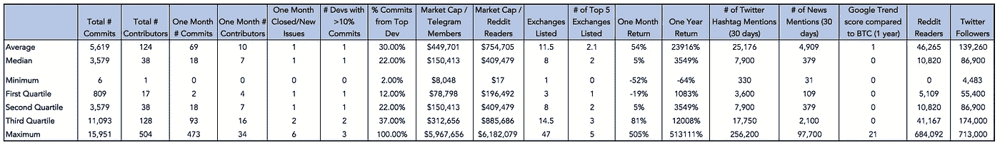

# 风险投资公司对加密货币的评估

> 原文：<https://medium.com/hackernoon/a-framework-for-evaluating-cryptocurrencies-e1b504179848>

*1/31 更新:根据读者反馈，我们在* [*的电子表格*](https://docs.google.com/spreadsheets/d/1gArufBuDdoV561w7byxvW-UieQxZhjv9jDq6aOAUwQM/edit#gid=353840556) *中添加了一个标签，列出了前 50 名硬币的四分位数排名(仅针对* ***量化指标*** *)!*

生活在硅谷，我们发现无法避免对密码的狂热。加密货币创造了一个创造财富的机会，这与近代史上的任何事情都不同，似乎几乎每个人都在参与加密游戏。然而，尽管这个领域有很多传言，但很难找到一个稳健的投资框架来评估新硬币。

在与加密专家交谈后，我们惊讶地发现，许多人依赖主观指标来做出决策——团队背景、白皮书质量，以及这个想法作为区块链平台是否有意义。所有这些特征都是不可否认的重要。然而，加密货币的美妙之处在于，大多数项目都是开源的，代码可以在 Github 上获得，Twitter、Reddit、BitcoinTalk 和 Telegram 上公开进行了关于许多硬币的热烈讨论。我们认为应该利用这些数据来评估硬币的合法性。

因此，我们开发了一个结合定量和定性指标的指标，以全面评估加密货币。首先，我们确定了适合六个关键类别(产品、社区、代码、吸引力、交易和网络)的 23 个指标，目标是为每个指标在一到三的范围内排列货币。为了确定一个指标的基准，我们按市值(截至 2018 年 1 月 26 日)取了前 50 个硬币，并对每个硬币的得分进行了汇总。

大多数定量指标来自 Github、CoinGecko、CoinMarketCap 和 BitInfoCharts，而定性数据来自公司网站、白皮书和 Reddit、Twitter 和 Telegram 等网站上的在线对话。完整的数据集在[我们的电子表格](https://docs.google.com/spreadsheets/d/1gArufBuDdoV561w7byxvW-UieQxZhjv9jDq6aOAUwQM/edit?usp=sharing)中提供，但量化指标的汇总统计数据如下。

**这一分析主要适用于替代硬币—** 正如我们将在帖子底部讨论的那样，还有一些重要的网络效应，我们无法在这一主题中捕捉到，这些效应预示着 BTC 和 ETH 相对于所有其他货币的长寿。

下面，我们概述了我们的六个关键类别，以及每个类别中涉及的指标，以及我们如何根据这些指标评估一个样本货币。

**产品—** *该项目是区块链独一无二的有价值的实施吗？*

在这一类别中，比特币的得分为 9 或 10/12。白皮书已经存在，并且内容全面(3 分)。有竞争对手，一些人认为比特币有严重的技术缺陷，但它显然仍然拥有巨大的市场份额(得分 2 或 3，可以辩论)。目前清除路障需要大约八分钟(1 分)。区块链是私人、去中心化和全球交易本质的核心(3 分)。

我们知道，与作为交换媒介的硬币相比，主要作为价值储存手段的硬币需要较少的时间来清理障碍。然而，鉴于许多硬币声称对频繁交易是可行的，我们认为较短的时间来清除障碍是一个积极因素。

**社区—** *密码影响者和更广泛的社区围绕硬币的对话数量和质量如何？*

在这个类别中，Decred 的得分为 11/12。Reddit(3 分)和 Telegram(2 分)社区对于硬币的市值来说是相当标准的规模。查理·李是一名顾问(3 分)，Twitter 情绪(可以在这里看到)相当积极，非顾问影响者如[泰曾](https://twitter.com/HeyTaiZen)和 [Garry Tan](https://twitter.com/garrytan/status/920167450498363393) 都公开表示支持(3 分)。

Twitter 是讨论加密的另一个重要论坛。然而，考虑到垃圾邮件/虚假用户的数量，我们决定不根据他们在 Twitter 社区中帖子的大小或频率来评估货币(至少在“社区”类别中，我们将在“网络”中回到这一点)。此外，我们决定将 Reddit 和 Telegram 社区作为硬币市值的函数进行评估，而不是作为原始数据点。我们认为，惩罚仍不太知名(市值较小)的硬币是不公平的，因为这些硬币自然拥有较小的在线社区。

**代码—** *生成的代码实际上能做到产品承诺的吗，有没有一个有才华的、积极的团队在上面取得进展？*

在这一类别中，BitShares 的得分为 8/12。大部分开发者都是匿名的，网站的[团队页面](https://bitshares.org/community/team/)已经不可用(评分 1)。GitHub 有来自 79 个贡献者的 5，212 个提交(分数为 3)。在过去的一个月里，有来自 20 个开发者的 78 个提交，关闭/新的比率是 2.3(分数为 3)。然而，顶级开发人员提交了 43%的提交(得分为 1)。

专注于某个开发人员提交的代码不一定是负面的。然而，考虑到许多硬币仍处于非常早期的阶段，依赖一个单一的开发者可能是有风险的，我们认为一个高度集中的开发者社区是一个负面因素。

**牵引—** *这个平台发展了多长时间，它是被用来进行交易还是被公司实施？*

在这个类别中，Omise Go 的得分为 8/9。该产品是活的，但没有公共代码，因为它是一家风险投资公司的产品(得分为 2)。但是，它每天处理东南亚 6000 多家商户价值数百万美元的交易(得分 3)，包括为泰国 240 家麦当劳店提供支付支持(得分 3)。

我们知道 5000 是一个相当随意的交易量衡量标准。然而，我们正试图区分在交易中经常使用的硬币和仍然难以使用或相对未经证实的硬币。根据我们能够找到的前 50 名硬币的交易数据，每小时 5000 英镑似乎是一个合理的下限。

**交易—** *近期围绕该货币的交易活动如何，投资者买入或卖出该货币的流程是怎样的？*

在这个类别中，奥格的得分是 10/12。价格在过去一个月下跌了 2%(得分 3)，在过去一年上涨了 1876%(得分 3)。Augur 在前五大交易所中有两个被列入(得分为 2)。代币数量上限为 1100 万。几乎所有的代币都是在 2015 年的众筹中分配的——20%留给了创始人和奥格基金会(授权时间表未披露)。因此，该货币的令牌分布得分为 2。

从预期短期回报的角度来看，我们假设一枚硬币的近期高回报是负的。有多种小额加密货币(价格

We also look at exchanges from the perspective of short term returns. If a coin is not yet listed on any major exchanges, we can expect a significant pop in price once it joins one of these exchanges and becomes easier to buy. However, in the long term, we believe that coins that are more easily attainable will perform better, so the 1 to 3 criteria would be reversed. Also — the standards in the rubric for both one-month and one-year returns should be recalculated on a monthly basis based on averages for the top 50 coins.

**网络** — *人们是否在谈论和/或购买这种货币？*

我们认为，从中长期来看，一种特定加密货币的成功将严重依赖于**网络效应**(见维塔利克·布特林的伟大文章[这里](https://blog.ethereum.org/2014/11/20/bitcoin-maximalism-currency-platform-network-effects/))。拥有一枚硬币的人越多，这枚硬币就越容易获得合法性和广泛采用，也越难被颠覆。我们将在下面概述这一点为何如此重要，但根据上面的指标，我们基本上是在试图了解有多少人拥有或知道或了解这种货币。

在这个类别中，字节币的得分是 7/12。硬币在过去 30 天里获得了 7.2k 的 Twitter 提及(得分为 2)和 317 次新闻提及(得分为 2)，并拥有 9.6k 的 Reddit 读者和 29.3k 的 Twitter 关注者(得分为 1)。它在过去一年的谷歌趋势平均得分(与比特币相比)为 0.06(得分为 2)。

请记住一些加密网络效应的例子:

*   **交易。**几乎所有交易替代币的交易所都要求你用比特币和/或以太坊购物——你不能只用信用卡或 PayPal 购物！一种用作交易媒介的硬币，投资者购买(并可能持有)该硬币，以便用替代硬币进行交易。
*   机构兴趣。机构投资者可以向一种货币注入大量资本，但他们担心围绕这种货币的合法性、流动性和价格稳定性的风险。较大的硬币通常被认为更合法，通常有足够的流动性来维持重大投资，而价格不会大幅上涨。此外，它们的价格通常更稳定，因为有更多的投资者对防止大幅贬值感兴趣。
*   **安全。**被广泛采用的币自然会有更好的安全性——更大的共识群体更难被攻击，应该有更多的开发者去识别和修补潜在的漏洞。假设投资者希望购买建立在更安全平台上的硬币，更好的安全性将导致更多的资本流入硬币。
*   **按下。**有这么多新的加密货币要报道，媒体主要关注采用率最高的硬币。许多个人投资者购买他们在媒体上最常听到的硬币，这形成了一个循环，因为这些硬币因此拥有更大的用户群，然后得到更多的媒体报道。在这一点上，对许多人来说，比特币实际上是加密货币的同义词。
*   **交换媒介。**最大的货币可能会首先被零售商采用(例如，Overstock.com[接受比特币](https://www.overstock.com/bitcoin))，因为会有更多的人对使用该货币进行交易感兴趣，而且大多数零售商会希望限制初始敞口。随着越来越多的零售商接受一枚硬币，有理由认为这将吸引更多的消费者拥有这枚硬币，从而吸引更多的零售商。
*   **监管合法性。对于监管者来说，关闭拥有数百万用户的大型加密货币比关闭只有几个投资者的小型货币更困难。监管者被激励与最广泛采用的货币合作，而较小的替代货币可能会发现监管者采取更敌对的立场。**

感谢阅读！我们希望在 olivia@crv.com 和 justine@crv.com，以及在 Twitter[@ venture wins](https://twitter.com/venturetwins)上听到你们的想法和反馈。