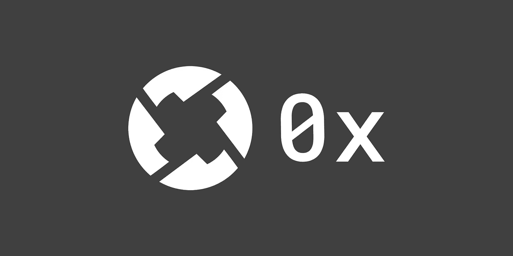
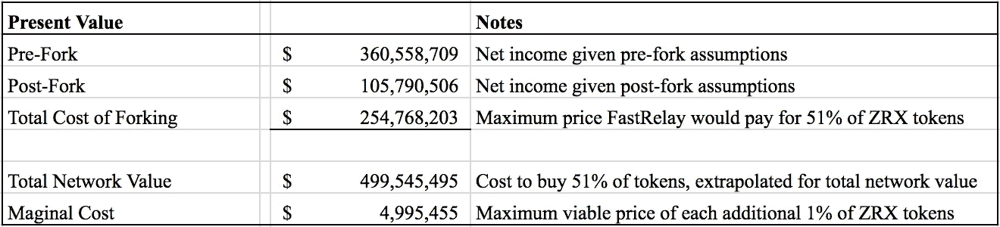

# 评估治理令牌的框架:0x

> 原文：<https://medium.com/hackernoon/a-framework-for-valuing-governance-tokens-0x-49d2cf2ef5bc>

分布式开源网络中的治理是密码领域中经常讨论的话题。这些网络允许开发人员以快速、迭代的方式创建和测试复杂的治理模型。随着项目对治理令牌的试验，度量令牌可能为其治理功能捕获的价值是有用的；一个用户愿意花多少钱去投票？

TLDR；网络参与者(可能是中继者)将为 51%的治理令牌支付的最高价格受到与网络分叉相关联的成本的约束。成本等于分叉前和分叉后业务的净现值之间的差额。这是确定网络公允价值的起点。附加的[框架](https://docs.google.com/spreadsheets/d/1teAMeKemHjVJzTk5TJqRCwk1hCy5Vjc89VjrEFYzpCw/edit#gid=553695003)提供了额外的细节。

**背景**

链外治理

在链外治理中，网络参与者在网络之外进行通信。像 [CarbonVote](http://carbonvote.com/) 这样的机制可以用来给予代币持有者非正式的投票权。投票可以作为社区下载代码变更的信号，但是投票不会自动触发变更。如果少数人不同意，他们可以选择不下载代码更新。这将导致两个独立的网络。这样，链外投票作为一种协调工具。

链上治理

使用链上治理，在投票完成后，代码更改会自动实现。类似于链外治理，少数人可以通过安装取消变更的硬分叉来选择另一条路径。在每种情况下，少数派都有力量通过复制网络和创造新的发展道路来反抗多数派的投票。

这两个系统的主要区别在于参与者选择加入的方式。链上允许代码变更作为多数投票的结果发生，而链下要求参与者下载代码变更。作为开源网络，每个场景都为少数人提供了创建适合他们的网络的机会。

治理令牌允许持有者投票支持他们所属网络的变革。通常，一个人持有的代币数量与他拥有的票数成正比。在一个可以复制的系统中，治理令牌的价值是什么？如果脸书的代码可以被复制，股东们可能就不会那么在意他们的投票权了。当然，代码不是公司、网络或平台中唯一重要的东西。

分叉是很重要的，应该尽可能避免，但是如果有不同意见，或者有令人信服的升级理由，一组用户可能会选择开发一个变体并分叉原始网络。

从根本上说，治理令牌的网络价值受到派生或创建网络新副本的净成本的限制。

**示例:0x**

0x 是一个用于分散式交换的协议，是最受尊敬的 ERC 20 项目之一，并且已经推出了一个很棒的产品。0x 协议产生了分散式交换机，如 RadarRelay 和 Paradex，称为 relayers。

0x 最近[宣布](https://blog.0xproject.com/governance-in-0x-protocol-86779ae5809e)其原生令牌 ZRX 将推动协议治理，并允许利益相关方对协议升级进行安全投票。向社区治理的过渡将分阶段进行。治理是持有 ZRX 的主要功能，探索一个合理的价格是合适的。

在尝试评估 0x 治理令牌时，我们将假设一个中继站的角度，这是一个面向用户的应用程序，用于促进 0x 协议上的交换。因为 relayers 目前在 0x 上经营着成功的业务，他们似乎是 0x 未来最大的利益相关者。这里，我们将考虑一个名为“快速继电器”的虚构继电器。

【FastRelay 应该为 ZRX 代币支付多少钱？

FastRelay 是建立在 0x 协议之上的分散式交换。作为一家基于该协议的公司，它有兴趣为协议开发定义一个具体的方向。这种利益可以通过投票权来体现。投票权用 ZRX 表示。

FastRelay 为了保证 0x 的方向，正在考虑是否购买 ZRX 令牌。FastRelay 需要考虑两个关键的极端情况，以确定它愿意为 ZRX 支付的最高价格:

1.现状:FastRelay 经营着一家成功的企业，并希望保持下去。为了确保一切照常，FastRelay 可以通过购买所有 ZRX 的 51%来决定 0x 的方向。

2.革命:FastRelay 不拥有 ZRX，希望 0x 进展顺利。如果 FastRelay 不同意大多数 0x 投票者的意见，它可以决定复制 0x，并在新的 0x 网络上托管 FastRelay 平台。与维护副本相关的持续开发成本和潜在的收入损失。

通过观察每种情况下的净收入差异，FastRelay 能够确定它愿意支付的最高价格，以通过购买 51%的 ZRX 来确保现状。

我们可以尝试为每个场景计算 FastRelay 业务的净现值。请参见随附的[框架](https://docs.google.com/spreadsheets/d/1teAMeKemHjVJzTk5TJqRCwk1hCy5Vjc89VjrEFYzpCw/edit#gid=553695003)以了解清楚。

**假设**

*所有假设都是说明性的。*

**场景 1(无分叉)**

1.总收入:10，000，000 美元——假设 FastRelay 的日均交易量为 2，000 万美元，收取 0.15%的费用。注意——目前 0x 的总日交易量接近 50 万美元。

2.年增长率:假设广泛采用，我们估计 FastRelay 的收入将以每年 80%的速度增长。

3.工程:FastRelay 有 10 名工程师，平均工资 20 万美元。

4.运营费用:100 万美元——税收、办公用品、差旅费等。

5.营销:100 万美元——传播消息很重要！

6.费用增长:每年 30%

7.贴现率:40% —风险资本率通常在 30%-70%之间。

8.终端增长率:5%

估计五年的现金流，我们得到的净现值为 3.606 亿美元。

**场景 2(分叉后)**

1.总收入: *$7，000，000——假设由于声誉受损，收入下降 30%,以及可能的销量下降(无共享流动性池)。*

2.年增长率:45 *% —由于缺乏流动性池和声誉受损，增长率较低。*

3.工程: *20 名工程师——fast relay 额外雇佣了 10 名资源来维护新的 0x 网络。*

4.运营费用:100 万美元——办公室、用品、差旅等。

*5。*营销:*:150 万美元——增加营销以弥补任何声誉损失。*

6.费用增长:每年 30%

7.贴现率:40% —风险资本率通常在 30%-70%之间。

8.终端增长率:5%

由于成本增加和收入减少 10%，FastRelay(分叉后)的净现值为 1.058 亿美元。

FastRelay(分叉前)净现值= 3.606 亿美元

快速接力(分叉后)NPV = 1.058 亿美元

See attached [framework](https://docs.google.com/spreadsheets/d/1teAMeKemHjVJzTk5TJqRCwk1hCy5Vjc89VjrEFYzpCw/edit#gid=553695003) for clarity

从逻辑上讲，FastRelay *不会*愿意支付超过 2.548 亿美元购买 ZRX 51%的股份，因为任何更多的股份都意味着分流成本更低。鉴于 51%价值 2.548 亿美元，ZRX 的总公平市值为 4.995 亿美元。

但是 FastRelay 可能不想用 ZRX 的 51%来控制投票。相反，该公司认为 30%足以影响网络的走向。使用上述框架，FastRelay 找到了它将为 ZRX 的 1%支付的最高价格——500 万美元。对于 ZRX 30%的股份，FastRelay 愿意支付高达 1.5 亿美元。

**注意事项**

*   *可能很难买到 ZRX 的 51%。*
*   ZRX 每增加 1%,边际效用可能减少。
*   继电器组可以选择一起分叉。
*   *汇集的流动性可能比估计的价值高或低。*
*   *网络的每个参与者的费用都不同。*

**结论**

在试图估算 ZRX 的价值时，我们围绕交易量、增长率和与网络分叉相关的成本做了许多假设。这篇文章的目标是围绕治理令牌的价值展开讨论，而不是断言 ZRX 的真实价值。

分叉网络的成本决定了其治理令牌的相关价值。实现治理令牌的网络应该致力于增加与分叉相关的成本，同时保持开源。我期待继续围绕治理模型和随后的估值方法开展工作。

*感谢* [*徐建华*](https://twitter.com/derek_hsue) *和* [*丹朱勒*](https://twitter.com/danzuller) *的反馈。如有任何意见，可在* [*推特*](https://twitter.com/PhilJBonello) *上联系我！*