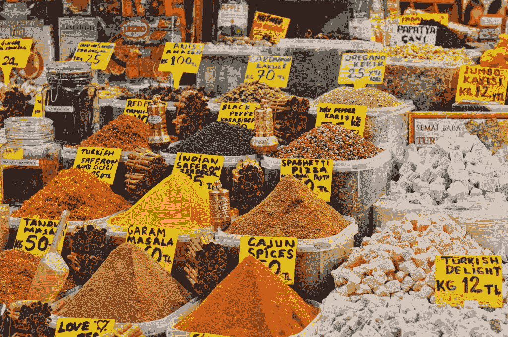

# 自由市场？

> 原文：<https://medium.com/hackernoon/a-free-market-bac5e11a750e>

什么是自由市场？要回答这个问题，我们必须首先考察什么是贸易。贸易的核心是一种商品与另一种商品的交换。为了使交换发生，双方都需要以某种方式从中受益。从理论上讲，自由市场应该让所有参与其中的人受益。在市场上，不同的商品在价格和质量上竞争，以最适合买方的需求，同时仍然为卖方创造利润。真的没有什么比这更重要的了。然而，人类思维的特点不如参与互利关系的愿望令人钦佩。例如，嫉妒在我们如何看待他人的互动，以及反过来，我们如何与他人互动中起着重要作用。对平等的渴望，无论你如何定义，似乎是我们与生俱来的。许多人似乎认为，他们的生活水平只能用他们与其他人的生活水平有何不同来衡量，换句话说，就是用相对的 T2 来衡量。相反，如果你看看一段时间以来的生活水平，这个星球上的几乎每个人都比他们的父母，甚至更肯定的是，他们的祖父母享受着更高的生活水平。这让我们产生了偏见。据估计，大约 80 人拥有地球资源的一半，但是很少有证据表明我们中的另外 70 亿人因此而患病。其实相反更符合实际。全球化使少数人变得极其富有，但同时也几乎完全消除了地球上的贫困。

自从货币(可以说是人类的第一项发明)发明以来，随着时间的推移，贸易变得越来越容易。在金钱出现之前，交易的发生需要需求的相互一致。然而，金钱从来就不是一场公平的游戏。造假是一件偷偷摸摸的事情，比大多数人意识到的要严重得多。大多数央行的目标是将通胀水平保持在 2%至 3%之间，以刺激消费，让公民工作和*做事。*不幸的是，人们在做的事情也在慢慢破坏这个星球。大多数人没有意识到，通货膨胀*是*伪造，伪造*是*盗窃。在过去的 30 年里，美元失去了超过一半的购买力。换句话说，有人偷走了全球流通的美元总数的一半。其他法定货币也是如此，或者更糟。如果你认为这只是一种隐性税收，而且这笔钱已经在人口中公平分配，那你可能非常天真。通货膨胀充其量是一种不公平、不诚实和偷偷摸摸的偷窃方式。这对每个人来说都是显而易见的，但不幸的是，事实并非如此。然而，对中本聪来说，它是，这使他采取相应的行动。

自从物物交换以来，我们第一次可以拥有一个公平的自由市场。一个真正的自由市场。一个自由的市场，在这里你可以保留你的劳动成果，而不是不得不尽快把它卖掉，或者看着它腐烂，失去它的价值。一个人与人之间的自由市场，没有偷偷摸摸从中分一杯羹的中间商，也没有为了保护你而声称自己永远有权分一杯羹的政府。社会保障和基础设施的必要性可以讨论，但在潘多拉魔盒打开和比特币出现之后，人们现在有了一种自己保障孩子未来的方式。对于我们这些总体上对大型机构更为怀疑的人来说，这是一份期待已久的礼物。未来可能会以许多不同的方式展开，但你至少可以在一定程度上选择你想成为哪种未来的一部分。你可以留在你出生的系统中，或者逐渐选择离开它们，进入你认为最有吸引力的平行现实。确保你仔细选择，确保你遵循一条符合你的道德和你相信会在最深层次上让世界变得更好的道路。对于我们这些相信个性是集体主义的必需品的人来说，选择是很容易的。