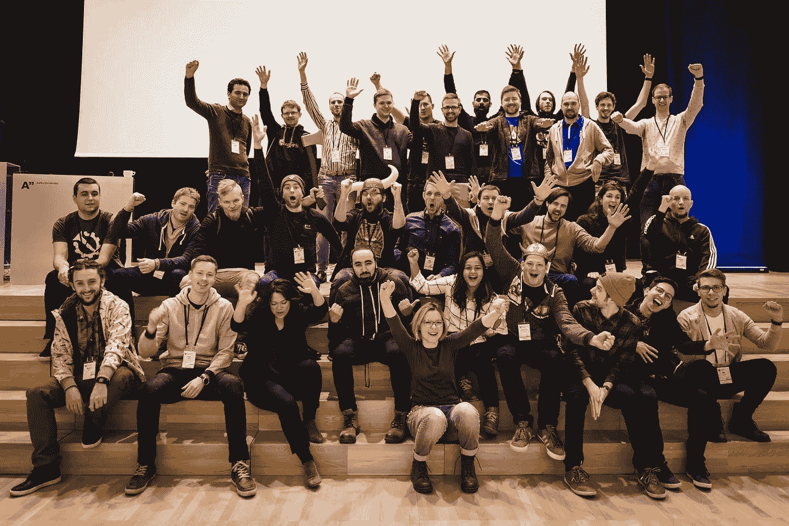
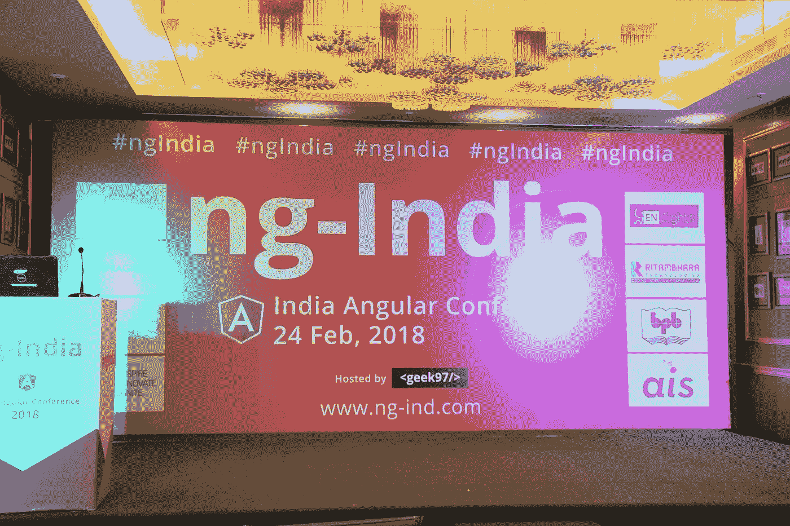

# DevRel 新生指南

> 原文：<https://medium.com/hackernoon/a-freshers-guide-to-devrel-10f0d814111e>

## 今天是我 DevRel 生活的第一个周年纪念日，也就是我不再是新生了。根据大众的要求，这里有一篇文章解释了在你职业生涯的开始阶段加入 DevRel 需要什么以及它所涉及的工作。

> 为引起人的注意时所发的声音..这篇文章的内容纯粹来自我的个人经历，并不代表我现在或以前的雇主。

我来自印度，在那里,*fresh*这个词用来指一个刚刚毕业没有工作经验的人。今天，我不再是新生。像怀旧一样让人耳目一新。同样令人难过的是，像许多其他事情一样，我不再是一个新鲜人，我已经觉得自己老了。

我的第一份工作是在一个离我家 1000 英里之外的国家做一名*开发者传道者*。尽管我手里有六份其他工作邀请，可以让我留在我的家乡城市，但我还是接受了这份在整个另一个大陆的工作，因为这是 DevRel 唯一的一份工作。

DevRel(开发者关系的简称)目前被认为是最受欢迎的角色。对于任何在[推特](https://twitter.com/Srushtika)上关注 DevRel 专业人士生活的人来说，这是一个梦幻般的角色。去年至少有 100 人问过我这个角色到底需要什么，以及他们如何成为其中的一部分。

已经说了很多，也做了很多来解释开发者关系，以及为什么它对一个面向开发者的公司很重要，但是我从来没有遇到过第一份工作是在 DevRel 的人。因此，我想分享一下我对 DevRel 的看法(如果你愿意的话，作为一个非新生的新手)。这篇文章是写给那些在公司里没有 DevRel 部门的人的，因此他们不太理解这个角色，以及不同类型的公司有什么不同。对于那些渴望成为 DevRel 团队一员的人来说，“仅仅因为”这听起来很有趣。

> 开发人员关系部门通常由社区经理、技术作者、开发人员传播者、开发人员倡导者等角色组成，有时甚至包括增长黑客和营销人员。开发者关系旨在与开发者建立积极的关系——他们是面向开发者的公司的主要客户，例如 [Ably](https://ably.io) ，我目前在那里担任开发者代言人。

只有当公司的开发者客户高兴时，这些关系才会变得积极。对于开发人员来说，快乐来自于完美的产品文档、网站的轻松导航、及时的客户支持、建设性的入职培训、有用的教程、引人入胜的活动/竞赛以及介于两者之间的任何事情。这正是 DevRel 团队的关注点。

根据科技公司的规模、产品或类型，*开发者传道者/倡导者*的目标应该不同。(顺便问一下，你知道这两个术语是用来定义完全相同的东西吗？阅读我的现任经理去年写的这篇[快速文章](https://hackernoon.com/is-it-time-stop-calling-yourself-a-developer-evangelist-a56a66ae06ed)，了解更多。我将在本文中交替使用它)

*   在全球跨国公司中，除了其他事情之外，开发者传道者的重点是尽可能多地出现在世界各地的活动中，分享一般的技术知识，同时也提到他们是代表一家 XYZ 公司。有时，开发人员传道者也负责内部新招聘的开发人员的入职，让他们和其他人保持一致。
*   在一家科技初创公司中，开发者福音传播者的重点是为产品获得尽可能多的开发者用户，并确保现有用户拥有理解和充分利用产品所需的一切。
*   在一家中等水平的科技公司，开发者传道者的重点可能不仅仅是参加科技活动，还包括制定各种内部策略来吸引和留住开发者客户。

尽管这对不同的公司来说意味着不同的事情，但重要的是 DevRel 团队的更大目标是共享知识——无论是关于编程语言、软件工程学科还是公司自己产品的技术细节。

> 对我来说，开发者福音传播者应该是这样一个人，他能够将高级会议演讲转化为初级观众可以欣赏的东西，同时保留原始内容的技术细节。因此，在我看来，开发者福音传播者所分享的所有资源都必须包含所涉及主题的介绍性材料，或者至少链接到其他简单的材料，即使是初学者也可以跟随高级材料。

# DevRel 中的开发经验

一个公认的事实是，一些为最复杂的问题建立解决方案的最伟大的头脑有时只是不太愿意交流他们的所作所为。有时候，他们不想浪费时间去做后者，因为他们更喜欢前者。

因此，在技术的创造者和消费者之间存在着巨大的鸿沟——这正是 DevRel 团队的目标。

正如我之前提到的，我的第一份工作是在 DevRel，尽管我在大学期间参与了许多业余项目，并在寻求推出技术产品的初创公司实习，但我没有在公司担任全职开发人员的经验。当然，有时我觉得(现在仍然觉得)人们在 Twitter 上分享的惊人的事情让我不知所措，我发现自己不断地想，“哦，天哪，世界上有这么多事情我仍然不知道”。但事实是，相信我，我自己也从别人那里听说过——大多数人和我(或你)有着同样的处境！).

世界上每天都有令人难以置信的惊人技术被大量生产出来。它的进化速度已经超出了一个人的能力范围。因此，一个在某个领域是专家的人对另一个领域的细节知之甚少是很常见的，但是作为一个观众，你消费了所有这些不同专家的集体创作，因此让你觉得你是唯一一个不知道很多事情的人。

如果有什么不同的话，我在 Twitter 上看到的每一个帖子都鼓励我去学习新的东西。如果我喜欢它，我自然会在它上面花更多的时间，很好地理解它，做我的研究，做实验，并对它充满信心，以至于我现在觉得有必要以尽可能简单的方式与他人分享它，这样他们就不必像我一样花那么多时间或浏览那么多材料，只是在最后将点点滴滴联系起来。我喜欢这样做。

> 当我能够让别人理解他们以前不理解的事情，而我自己在花了很多时间理解之后最近才理解时，我的一天就结束了。(这句话的复杂性是讽刺:P)

# 有时 DevRel 可能意味着同时戴上多顶帽子

一个庞大的 DevRel 团队意味着每个开发人员都要花时间尝试什么对公司的开发人员客户最有利——编写有趣的教程，谈论最热门的技术趋势，举办网络研讨会，撰写发人深省的技术文章，录制屏幕广播，手绘解释复杂数据结构/算法的草图，提出更有效的技术支持策略，为产品制定教育指南，甚至尽可能多地参加开发人员活动，尝试与其他技术人员进行面对面的互动。

但是一个更小的 DevRel 团队意味着同时做不止一件事情。这是一个美丽的平衡行为，天生带有实验性质。任何东西太多或太少都是危险的。因此，你要不断改进策略，定期检查衡量标准，根据多个变量分析什么可行，什么不可行，等等。

# 作为一名新生会派上用场吗？

可以肯定的是，一个大学新生和一个作为开发人员多年后成为开发人员拥护者的人有着不同的经历，他有着处理技术问题和提出解决方案的第一手经验。

虽然我同意一个有经验的人非常值得谈论某个技术话题，但一个新手相反，他/她会花十倍的时间来首先了解这个话题。只有这样，他们才有足够的信心与他人分享。尽管它可能不包括与其他有经验的 DAs 相同的内容，但它确实引入了一个完全不同的理解视角。

# 每个人都想成为 DevRel 的一部分

正如我之前提到的，最近的毕业生有进入 DevRel 的巨大愿望(我无耻地认为激发了一两个；) ).即使像这样一个超级酷的角色也需要认真的工作。这是一个巨大的误解，开发者福音传道者是这些在世界各地漫游的潮人，他们分享一些基本的开发技巧。相信我，各位，每篇文章、每篇教程和每场演讲背后都有很多东西。内容是最大的挑战，许多其他因素也发挥了作用，例如视觉呈现、技术分解、相关性、技术水平和材料长度等等。在舞台上面对成千上万的人并不容易，敞开心扉与陌生人进行有意义的对话并成为好朋友也不容易。公开接受批评并不断学习和提高并不容易。没有一件事是容易的。

> DevRel 不容易。但是对于那些喜欢对正在建造的令人惊奇的东西充满热情并且不能停止谈论它的人来说，它确实是超级有趣的。

当然，在 DevRel 中也意味着你不用花太多时间写真正的代码。这对许多人来说是令人沮丧的，这会影响他们迁移到 DevRel 的整个决定。我也看到很多人在 DevRel 呆了一段时间后又回到了开发者的行列。因此，在你决定成为它的一部分之前，理解它是什么是非常重要的。

认识我的人都知道我是一个超级健谈的人，我想我的母亲是一名计算机科学的大学教授，她也让我感受到了向他人教授复杂事物的乐趣；因此我认为 DevRel 对我来说很自然。我并不是说我在这方面很棒，但是我喜欢参与其中，并且在事情发生的时候学习。同样的热情驱使我从大学开始就与 Mozilla 基金会有联系，先是作为 Firefox 的学生大使，后来作为代表，现在是一名技术演讲人。告诉世界他们认为复杂的事情是多么简单，这种热爱驱使我与人合著了一本关于虚拟现实的书。我喜欢谈论和写我所知道的东西；我对学习我不知道的东西非常感兴趣，这样我就可以自己和别人分享了。

如果你能以任何方式理解这篇文章，并且这是你一直想做的事情，那么 DevRel 就是为你准备的。开始找机会吧！但是如果你不能理解，那么我的朋友，你只是对 DevRel 有了错误的理解。

# 有经验的开发者！=高级开发倡导者 DevRel 负责人

到目前为止，你应该已经明白，与全是开发人员的技术团队或营销团队相比，DevRel 团队具有完全不同的目标、职责、所需技能等。因此，即使你已经花了很多年时间做开发人员，你也需要花一些时间在 DevRel 本身上来准确地理解它。因此，从一个有经验的开发人员跳到一个高级开发倡导者对你和公司来说都不太可能有什么收获。

# 印度的 DevRel

不幸的是，DevRel 在印度的前景相当黯淡。与欧洲和美国相比，这里的会议数量非常少。尽管许多人(如[西达尔特](https://twitter.com/siddharthkp)和[达纳贾伊](https://twitter.com/debug_mode))已经理解了这一点，并正在通过在印度组织一些有意义的活动来努力改变这一点，并通过邀请他们来参与和贡献来与全球 DevRel 社区联系。然而，这还远远没有让技术社区将“开发人员传道者”视为一个自然的工作角色。有相当多的公司有一个 DevRel 部门，但是目标有很大不同。

在印度的公司里，我自己被提供了开发者传道者的角色，重点是简单的营销，而不是开发者/社区建设。这是一个完全错误的想法，如果你是其中之一，请在雇佣前理解它。你可能正在改变这个角色对很多人的意义。克里斯蒂安·海尔曼的《常青邮报》总是一个很好的起点。

如果你是一家面向开发者的科技公司，是时候认真考虑建立一个 DevRel 团队了，如果你是一个第一次想加入 DevRel 团队的人，请确保你掌握了正确的事实，很好地理解了你将要进入的领域，并做出正确的判断。

我非常兴奋能够完成我一年的职业生涯！我想感谢每一个帮助我理解各种事情的人，感谢他们在过去的一年里帮助我成长为一个人和一名专业人士。你知道你是谁:)同时，如果你想关注我的工作，我也一样，[发很多推特](https://twitter.com/Srushtika)(但没有我说的多；) ).我目前住在英国伦敦，为一家名为 [Ably Realtime](https://ably.com/) 的实时数据流网络提供商工作

只是一个快速的大脑转储，所以请忽略任何语法愚蠢。我知道这个标题有点误导，因为我不再是一名新生了。但是你在乎吗？:)

如果有任何问题，请随时通过 [Twitter](https://twitter.com/Srushtika) 联系我。我的 DMs 总是开放的:D

再见了。