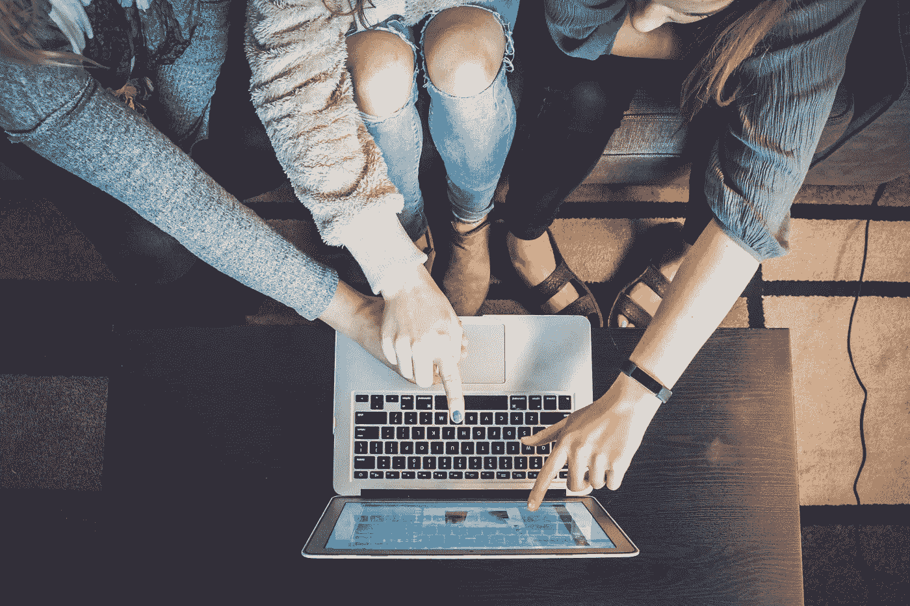

# 我们虚拟匿名的完全证明安全概念

> 原文：<https://medium.com/hackernoon/a-full-proof-security-concept-for-our-virtual-anonymity-2d419b4bf9bf>

Image from Unsplash

> “匿名只是一种认知。不是某人拥有它，而是占有它”

# 我们的匿名到底怎么了？

现在，我们可能知道也可能不知道，但来自世界各地的顶级政府机构正在通过记录我们的通话位置、跟踪我们的移动 GPS、脸书的推特更新、在线支付日志、闭路电视、自动取款机和其他监控摄像头对我们进行全天候的监视。其实你的一举一动都在被这些躲在政府面具后面的专业人士用某种**严肃的深度学习算法**记录和分析。一些跟踪我们的政府机构有**中情局，国家安全局五角大楼**等等。他们的动机是什么？

> NSA——国家安全局
> CIA——中央情报局
> 深度学习算法——机器训练的数据使用算法来检测使用过去数据的模式。
> 匿名——隐私(保护身份。)

# 他们为什么这么做？

他们认为，通过记录全球所有人的活动，他们有可能通过分析恐怖分子的行为和过去，将他们与普通人区分开来。他们相信他们可以通过预测他们未来的行动来阻止这些袭击，从而试图挽救数百万人的生命。但是，躲在这个目的后面，他们不能为侵犯每个人的隐私找借口，这本身就是一个非常大的罪行。

# 我这辈子没做过任何错事。我为什么要担心？

> 在当今的数字信息世界中，任何组织最有价值的资产都可能是从全球用户那里收集的信息。

这与你无关。再多的金钱、黄金、钻石、比特币也买不到政府机构和其他顶级品牌从非授权途径免费获得的那么多信息。想想吧。**谷歌**在他们的缓存中存储数据，包括每个谷歌产品的搜索查询、我们的邮件、驱动器和我们的其他数据 **8 年**。脸书做同样的事情 5-6 年。这些政府机构正在追踪你的行踪。他们从这些网站获取所有数据，并从其他来源交叉验证。

> 有了这个庞大的大数据和深度机器学习算法，他们已经知道你几秒钟前在哪里，他们可以预测你在接下来的几秒钟、下一分钟或下一个小时会在哪里。

你的生活将会被控制，我们生活中的其他因素也会被这些外在因素控制。我们可能会成为他们大局中的牺牲品。

An Image from Unsplash

# 有效的操作系统——一个概念:

一个为讨厌监视美国国家安全局和政府的人设计的操作系统。偏执狂和现实主义者的操作系统。以下技术将使它比其他操作系统更好:

> 如果它的任何数据遭到破坏，它应该执行**完全远程移动擦除(使用加密密码)**。
> 
> 它应该为用户和所有其他软件提供一个**完全多层加密**。
> 
> 它应该使用 **Tor 作为浏览器。**如果不通过 Tor 网络路由其网络数据包，则不应使用其他浏览器
> 
> **一个完全证明病毒检测和反数据窃取的方法**(我在这里使用了一些 blackphones 的想法)。blackphone 是一种智能手机，通过 VPN 提供互联网接入来确保隐私。
> 
> 它应该总是**阻止与 PRISM 相关的软件/网站**，并且这些协议的定义应该随时更新
> 
> **应安装身份创建软件**(为假名创建个人资料和在线身份，并添加您选择的照片和简历)以使用第三方提供的一些一次性服务。你可以在 prism 网站上使用这些。
> 
> USB 在使用前需要用管理员密码进行验证，以防止其他人在我们的系统中创建后门。
> 
> 它应该**自动加密**所有的文件和文件夹，只要他们到达系统。
> 
> **防止软件/病毒**检测/删除**文件和文件夹**
> 
> **使用**主密码**自动对上传到互联网和其他设备的**文件进行密码保护。
> 
> 如果任何 PC 连接到**蓝牙**，那么我们的操作系统应该在内部检测该区域的
> 蓝牙设备，如果怀疑它们与 **NSA/PRISM** 相关，那么用户将会收到警告，并且蓝牙黑客软件将会打开，让用户关闭设备连接。然而，如果 1 分钟内没有采取任何行动，它将自动被黑客攻击。(不知道这也可以通过 Wi-Fi 实现)
> 
> 使用**自动 VPN/代理使用，代理会在合适的时间间隔内轮换**。
> 
> **免费匿名邮箱安装**。Tor 邮件可以在这种情况下使用。
> 
> **预装的匿名视频聊天**——没听说有这种软件在实施。
> 
> **匿名种子程序**——来自 Clearnet torrent 的**种子**和**学习者**不允许 TOR 正常运行，并可能最终给出我们的确切位置。
> 
> **擦除 PC 热键**和 **1 验证密码**，然后擦除 40 遍。
> 
> **一种反蛮力，尝试 5 次密码**，然后自动擦除或解锁有秘密密钥的手机。
> 
> **反远程管理**了解我们不在时系统周围发生了什么
> 
> **第二个密码**，如果输入将清除所有内容(反美联储)
> 
> **警告是否安装了 NSA 相关硬件或试图更改管理权限。**

这个概念的灵感来自于对黑暗网络的技术讨论。

这些方法帮助我们获取和保护我们的个人信息。然而，我们不可能都做到这些，但我们可以尽我们所能，让我们的生活更加安全，让我们的世界更加安全，并向所有人证明

> 安全不仅仅是现实世界中的幻想。

除此之外，不要做傻事，不要说或做任何可能暴露真实身份的事情，不要使用昵称、密码或任何你在网上用过的可以用来识别你身份的东西。

但是如果你不小心，到处留下你是谁的暗示，这一切都没有意义。记住，这三家信评机构非常擅长剖析。

做最好的自己。