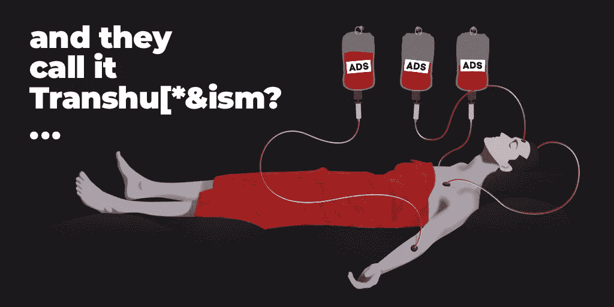

# 去 H+ Future 的路上发生了一件有趣的事

> 原文：<https://medium.com/hackernoon/a-funny-thing-happened-on-the-way-to-h-future-ccedc175e3>

H+是超人类主义的通俗缩写；而 *future* 作为一个名词，[按照韦氏词典的定义](https://www.merriam-webster.com/dictionary/future)，是几样东西:1)即将到来的时间，以及 2)对进步或逐步发展的期望。

超人类主义是一场国际性的哲学运动——跨越非常广泛的研究和学习领域——其前提是，我们人类目前正处于发展的相对早期阶段，我们不断加快的技术进步步伐将极大地增强我们人类的智力和生理。

简而言之，在未来的某个时刻，新兴技术将变得足够复杂，足以让我们克服基本的人类局限性，我们将成为超人。

H+先声夺人思想的信号已经存在了数千年，这在古代文献的各种作品中得到证明，其中描述了[不老泉](https://en.wikipedia.org/wiki/Fountain_of_Youth)和[长生不老药](https://en.wikipedia.org/wiki/Elixir_of_life)的概念，并且记载了对人类永生的追求。

然而，直到 20 世纪 80 年代，随着加州大学有史以来第一次正式会议的召开，超人类主义运动才完全形成并全面展开，多年来，加州大学一直是超人类主义思想的主要中心。

20 世纪 80 年代也是数字革命发生的时期，其中大部分发生在加州。

个人电脑变得无处不在。

1980 年 12 月 12 日，苹果股票交易的第一天以每股 29 美元收盘，这是自 1956 年福特汽车公司股票上市以来最大的一次 IPO。人类相信技术的一个重要证据。

1982 年推出的 Commodore 64 拥有廉价的调制解调器和网络软件，用于运行公告板系统。

苹果公司在 1984 年为苹果 II 和麦金塔 128K 个人电脑推出了第一个真正的调制解调器。

蒂姆·伯纳斯·李在 1989 年发明了万维网，这是我们今天生活的信息时代发展过程中最重要的事情之一。

技术在蓬勃发展，世界变得越来越互联，信息时代的曙光——人们在他们的数字自我中联网——显而易见；所有这些都给超人类主义者的思想提供了很多相信未来的良好基础——对进步或渐进发展的期望。

但是后来发生了别的事情。这到底是什么(现在仍然是),杰伦·拉尼尔最好地叙述了这一点——计算机科学家和计算机哲学作家，经常被描述为一个有远见的人，他从 20 世纪 80 年代开始在加州工作，并在 2018 年的 ted 演讲中亲身经历了数字革命。

> 事情是这样的。早期的数字文化，实际上直到今天的数字文化都有一种，我会说，左派的社会使命感，不像其他已经完成的事情，比如书籍的发明，互联网上的一切都必须是完全公开的，必须是免费的，因为即使只有一个人负担不起，这就会造成这种可怕的不平等。
> 
> 现在，当然，有其他方法来处理这个问题——如果书籍需要钱，你可以有公共图书馆等等，但是我们在想——不，不，不——这是一个例外，这必须是纯粹的公共评论，这就是我们想要的。所以这种精神活在其中，你可以在维基百科和许多其他的设计中体验它。
> 
> 但与此同时，我们也以同样的热情相信另一件完全不相容的事情，那就是我们爱我们的科技企业家，我们爱史蒂夫·乔布斯，我们爱这个尼采和能削弱宇宙的科技迷的神话。这种神秘的力量也控制着我们。
> 
> 所以你有两种不同的激情，一种是让一切免费，另一种是科技企业家的超自然力量——当一切都免费时，你怎么庆祝企业家精神？
> 
> 当时只有一种解决方案，那就是广告模式。
> 
> 因此，谷歌诞生了——免费，带广告；脸书出生了——免费，有广告。一开始，这很可爱。就像最早的谷歌一样，广告实际上是一种广告——它们就像，你知道，你当地的牙医或什么的，但有一种叫做摩尔定律的东西，它使计算机越来越有效，越来越便宜，它们的算法变得越来越好——我们实际上有大学，人们在那里研究它们，它们变得越来越好，使用这些系统的客户和其他实体变得越来越有经验，越来越聪明。最初的广告真的不能再被称为广告了——它变成了行为修正。我再也不能称这些东西为社交网络了；我称他们为行为矫正帝国。

Jaron 没有诋毁像谷歌和脸书这样的公司，但是，他说发生的事情是一个悲剧性的错误。社交网络中的广告业务与常规的电视广告或街头广告牌非常不同，因为社交网络会分析用户行为——在你、用户和广告发布者之间有一个持续的反馈回路，通过算法尽可能多地吸引你的注意力，使广告更有效，业务更有利可图。社交网络收集你的数据，为你调整算法，这反过来改变你的行为。因此，杰伦·拉尼尔给它起了个名字——*行为矫正帝国*。

这种行为修正机制肯定不是超人类主义者对未来的设想，其中不可或缺的一部分是我们所有人都被联系在一起。

最近社交网络的信任度下降，公众对社交网络的抗议像滚雪球一样越滚越大，这充分证明了广告和个人数据收集模式正在过时，必须有一种新的方式让我们联系和合作。而不是通过脸书或谷歌等在当前的实现。

随着基础设施和去中心化社交网络初创企业在区块链的崛起，我们——作为人——正朝着正确的方向前进。至少这个未来——几乎就是现在——具有韦氏词典定义的特征:对进步或渐进发展的期望。

我们还没有看到新的通信模式——特别是去中心化的——在未来几十年如何发展，但在那之前——今天——你可以成为新的新生运动和做事方式的一部分。

[加入 U 社区](https://u.community/)。