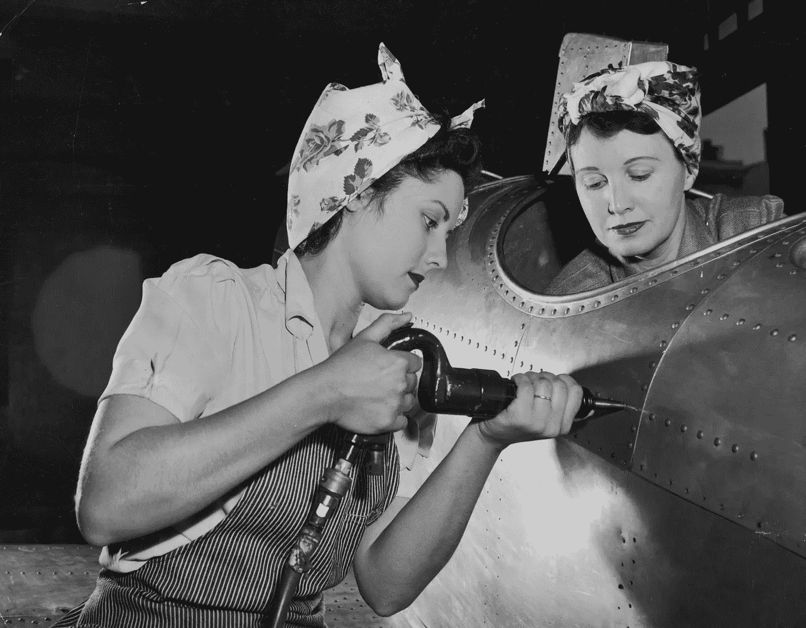
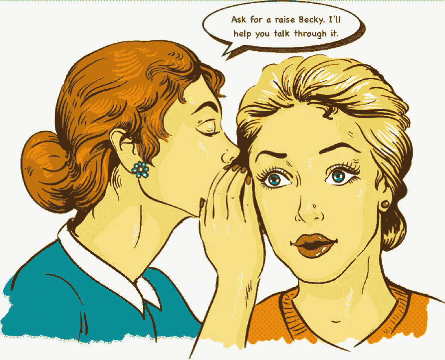

# 职场女性支持指南

> 原文：<https://medium.com/hackernoon/a-gals-guide-to-supporting-women-in-the-workplace-78ee2d5ab04f>

在工作中，女性可能是最好的支持者，也可能是最残酷的敌人——以下是一些提升和激励职场女性的方法。

女人很优秀。当然了。

女人是强大的。这就是为什么女人可以成为**一个女孩在工作场所找到的最有帮助的支持者，或者毁掉这个女孩的事业。**

女人就像猫一样，在任何时候都有权决定自己想要什么样的个性。但是如果你正在读这篇文章，我怀疑你是那种[希望女性成功的人。](https://blog.usejournal.com/women-a-depressingly-necessary-primer-for-silicon-valley-fe9760b233df)

谢谢你能来。

本文将概述一些激励和提升职场女性的策略。

# 雇佣女性。训练女性。

当更多的女性在你的办公室工作时，神奇的事情开始发生。

温度被调高了几度。像演讲者系列和导师项目这样的事情层出不穷。会议是深思熟虑和富有成效的。总的来说，东西闻起来更新鲜了。

在工作场所，女性可以帮助改善小女孩和坏老板之间的任何一点。

也许那是参观学校和小女孩谈论职业。或者联系你的大学网络为你的公司招聘毕业生。或者打电话给对申请感兴趣的人。或者甚至指导你自己公司的人。

对于导师来说，你永远不会太“缺乏经验”。每个女性都在以不同的时间和速度走过熟悉的职业道路。你身边的某个人就在你前面的台阶上。

# 提供反馈，而不仅仅是表扬

尽管女人天生就很棒，但她们有不断进步的天赋。

**私下建设性地提供反馈，帮助女性提高。**

如果你和工作中的女性关系不密切，但你确实有一些你认为有助于她们进步的东西，你仍然可以分享。只是**让他们知道你的反馈来自一个支持和尊重的地方**。说一些积极的事情来平衡更多类似批评的反馈。在我看来，击掌有时很尴尬，但绝不会影响反馈情况。

# 发现他人的优点

花点时间注意一下你工作场所的其他女性做得好不好——每个人都有某种超能力。乐于参与并提供帮助，在一个项目上伸出援手……**女性拥有号召这些行动的力量。**

女性如何表达对同事优秀的支持完全取决于她自己。如果这意味着私下表达感谢，那将对优秀同事的自信产生积极影响。

然而，如果你在公共场合表达你的感谢，这有一个额外的好处，那就是提升优秀同事在其他人眼中的地位。

这可能意味着在公共场合感谢他们。或者给他们的经理发一封电子邮件，让他们知道你欣赏你的优秀同事对项目的贡献。一位女性甚至可能会发挥创意，介绍优秀的同事，并评论他们之前工作的水平。

# 肩并肩站着

女性天生肾上腺素激增，有很强的愤怒能力，并有足够的力量将其转化为适合社会的干预措施。

**如果你看到有什么奇怪的事情发生——大声说出来是女人的责任。**

有时是女人在会议中不断被打断。有时候，令人毛骨悚然的是，一位同事总是坐得离你的女友莉莉太近，让她感到不舒服。

女人是聪明的，这就是为什么要由她们来决定如何应对这种情况。有时是和女孩说话，表达支持或提问。有时是阻止一个同事，把话题带回被他打断的女人身上。有时是给人力资源部的报告。**你收到了。**

# 做你自己精彩的自己

提升其他女性的最好方法之一就是以身作则。

如果你犹豫要不要在会议上发言，那就说些废话。如果你不确定该不该戴你买的那顶疯狂的帽子，就戴那顶烂帽子吧。每次你自信地表达自己的观点或个人风格，并向其他女性发出信号，这是可以的。

女性富有创造力，她们会找到不同的途径变得优秀。每个人都会有不同的技能，带来不同的味道— **不应该有一个所有职场女性都在努力实现的模板。**

相反，认可其他女性和你自己的优点是支持女性的任务和力量。

## 有其他策略吗？你在工作中帮助过女孩吗？

*在下面的评论中分享你的建议或故事吧！*

另请查阅— [**女性:硅谷必备指南**](https://blog.usejournal.com/women-a-depressingly-necessary-primer-for-silicon-valley-fe9760b233df)