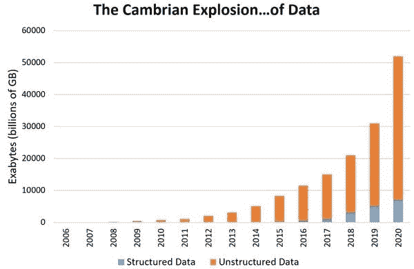

# 数据科学的简明介绍

> 原文：<https://medium.com/hackernoon/a-gentle-introduction-to-data-science-1d8193a3cfcb>

每年都会产生数万亿千兆字节的数据，而且这个数字还在呈指数级增长。据估计，到 2020 年，每个人每秒将产生 1.7 兆字节的数据，数字数据积累将达到约 44 兆字节或 44 万亿千兆字节。下图也显示了这种数据爆炸。

Growth of Data. Source: Patrick Cheesman

数据只是一种原材料，从中提取信息需要进一步的工作。我们的社会越来越依赖数据，而数据科学是帮助我们理解这些海量数据的领域。

数据科学是一个跨学科的领域，它利用了来自不同领域的方法和技术，如计算机科学、数据库、数学、统计和机器学习。数据科学涉及数据的收集、准备、分析、可视化、管理和保存。这些数据通常数量非常大，并且涵盖多种类型。

# 我们身边数据科学的例子

公司和其他组织广泛使用数据科学来了解他们的客户、员工、产品和流程。

例如，谷歌在 AdSense 等产品中使用数据科学，根据用户所在的网站以及谷歌过去收集的有关用户的其他数据，个性化显示给浏览网站的用户的商业广告。优步使用数据科学来计算特定乘车的费用，给哪些乘客打折，并测试哪种忠诚度计划对其司机最有效。Airbnb(一个连接租房者和租房者的在线市场)使用数据科学来帮助人们估计租房的价格。对于任何以数据为中心的组织来说，数据就是客户的声音，数据科学就是对这种声音的诠释。

除了商业部门，政府和非政府组织也非常依赖数据科学来理解他们生成的大量数据。通过使用数据科学，政府可以检测欺诈和犯罪活动，优化投资和融资等。类似地，非政府组织利用数据科学通过提供可靠的证据来加强他们的事业。例如，世界野生动物基金会(WWF)通过使用数据科学来显示不同野生动物和鸟类的信息，从而提高了他们的筹款效率。除了这些机构之外，其他几个组织也在将数据科学用于多种任务，随着时间的推移，数据科学的应用只会越来越多。

# 数据科学中的机遇

数据的指数级增长也使得数据科学家的工作数量呈指数级增长。LinkedIn 基于其庞大的专业人员档案数据库所做的分析显示，数据分析师和数据科学角色作为一个整体在增长(见下图)。

Growth of Data Science and Data Analysis jobs

顺便说一下——作为一个小题外话——这篇教程摘自[公共休息室](https://www.commonlounge.com/)的[数据科学课程](https://www.commonlounge.com/discussion/367fb21455e04c7c896e9cac25b11b47)。该课程包括许多实践作业和项目。另外，80%的课程内容都是免费的！如果你对学习数据科学感兴趣，绝对推荐去看看。

# 数据科学的关键组成部分

## 编程(Python，R)

如前所述，数据科学处理大量数据。在数据科学中，使用计算机[编程](https://hackernoon.com/tagged/programming)来管理和分析这些数据。在被称为数据分析/业务分析的领域中，研究了分析数据的其他非编程方法。

在数据科学社区中，以下两种编程语言最受欢迎:

**Python:**numpy、scipy、scikitlearn、matplotlib 等大量第三方包的出现，使得数据科学项目更容易实施，并导致了它的广泛流行。除此之外，不同的 ide 如 PyCharm、Vim、Emacs 和交互式 Python 环境如 IPython 和 Jupyter 使得使用 python 比使用其他语言更容易。

**R:** R 是一种专门为实现各种统计和图形技术而开发的编程语言，即由统计学家为统计而设计和创造的编程语言。r 也有不同的数据争论、数据可视化和机器学习包。它是一种开源语言，有一个活跃的统计学家和程序员社区，他们通过为新的统计方法添加新的库来不断丰富语言。

## 数据(及其各种类型)

数据科学使用编程来分析数据，这些数据可以是各种类型的。下面讨论一些重要的数据类别:

**结构化数据:**易于用表格形式表示，并在数据库和 Excel 文件中存储和操作的数据。数据有明确定义的数据模型。例如，Airbnb 有一个可供出租的地方的数据库，其中包含一些变量，如房屋的大小(以平方英尺为单位)、可以容纳的客人数量、床位数量、浴室数量、房屋租赁的每日成本等等。

**非结构化数据:**不容易适合一个数据模型的数据称为非结构化数据。非结构化数据的示例包括电子邮件、PDF 文件、图像、视频等。

**自然语言:**用英语、汉语、法语等人类用来相互交流的语言直接书写的数据。自然语言数据是非结构化数据的一个子类型。

**图像、视频、音频:**图像、视频、音频广泛产生于摄像头、麦克风等传感器。它们本质上是非结构化的，从中提取信息是一个相当大的挑战。

**基于图形的数据:**图形是一种数学结构，它对两个实体之间的成对关系进行建模。它使用节点、边和属性来存储信息。例如，关于脸书朋友的信息可以用图形表示，其中人是节点，两个节点之间的边表示两个人是朋友。

**机器生成:**机器生成数据是由计算机、不同应用程序或机器在没有人类参与的情况下创建的任何信息。

## 统计和概率

**统计学:**统计学是数学的一个分支，处理数据的收集、组织、分析和解释。统计方法和技术通过编程来分析数据。一些常用的概念包括均值、众数、中位数、标准差、假设检验、偏度等。

**概率:**概率用于数学上描述事件发生的可能性。它量化了随机性和不确定性。例如，概率告诉我们某一天下雨的几率，或者某人中了彩票的几率。事件发生的概率总是在 0 到 1 之间，其中 1 代表绝对确定，0 代表完全不可能。一些常用的概念包括随机变量，不同的概率分布，条件概率，贝叶斯定理，z-检验等。

**与数据科学的关系:**数据科学就是操纵数据，从中提取信息。统计学和概率构成了数据科学的数学基础。如果没有对统计学和概率的清晰理解，很容易误解数据并得出错误的结论。

## 机器学习

**简介:**亚瑟·萨缪尔斯(Arthur Samuels)将机器学习定义为在没有明确编程的情况下赋予计算机学习能力的研究领域。每当一台机器*以某种方式改变它的结构或程序，使其预期的未来性能提高时，它就会学习*。这种变化可能因其输入或对外部信息的响应而发生。例如，当一个正在接受对象识别训练的机器学习模型的性能在查看了该对象的几张图片后有所提高时，可以合理地说该机器已经*学习了*来识别该对象。

简单来说，机器学习包括三个目标:改变、概括和改进。

*   学习改变学习者:对于机器学习来说，问题是确定这些变化的性质以及如何最好地表现它们。
*   学习导致泛化:不仅在相同的任务上，而且在相似的任务上，绩效都必须提高
*   学习导致改进:机器学习必须解决变化可能降低性能的可能性，并找到防止变化的方法。

机器学习系统执行各种任务，包括识别、诊断、规划、机器人控制、预测等。

**数据科学中的机器学习:**数据科学家使用机器学习算法，特别是回归和分类方法在数据科学中很流行。当数据科学家需要从可用数据中预测不同的事情时，机器学习就变得很方便。例如，通过使用购物中心前几年的销售数据，我们可以使用线性回归等回归方法预测未来几年的大致销售额。同样，将数据分类为已知类别，就像根据哨声对鸟类进行分类一样，需要像逻辑回归、决策树等机器学习算法。

## 大数据

**简介:**当一组数据在数量上变得如此庞大，或者变得如此复杂，以至于使用传统的数据管理方法难以处理时，我们就转向大数据。通常，存储或处理这些数据需要大量的计算机(从小公司的 10 台开始，到大公司的数万台)。大数据有三个特征:

*   **量**:大数据量大:可以从万亿字节到万亿字节。
*   **多样性**:大数据本质上是多样的。它可以是不同的格式和类型。大多数公司都混合了结构化和非结构化数据。
*   **速度**:持续产生大量数据。例如，这些数据来自与网站交互的用户，或者来自可能不断收集数据的传感器。

Three Vs of Big Data: Volume, Velocity and Variety

**大数据和数据科学:**大数据的出现提升了数据科学的重要性。通常，数据被认为是一种原油——一种原材料，通过应用数据科学，我们可以提取不同类型的信息，就像从原油中提取精炼油一样。数据科学家根据需要使用不同的工具来处理大数据，如 Hadoop、Spark、R、Pig、Java 等。随着我们的技术和社会越来越受数据驱动，大数据和数据科学将变得更加错综复杂。

# 参考

1.  Davy Cielen 介绍数据科学
2.  约翰·霍普斯金大学数据科学专业| Coursera

*由 Bishal Lakha 和 Keshav Dhandhania 合著。*

*最初作为* [*的教程发表于 www.commonlounge.com*](https://www.commonlounge.com/discussion/6a009863d192452485f2403bf85819f7)*作为* [*数据科学课程*](https://www.commonlounge.com/discussion/367fb21455e04c7c896e9cac25b11b47) *的一部分。*