# 硬件加速数据处理简介

> 原文：<https://medium.com/hackernoon/a-gentle-introduction-to-hardware-accelerated-data-processing-81ac79c2105>

用于数据处理的硬件加速有着悠久的历史。这不是新的。当我还是个孩子的时候，我爸爸为我们的 12 MHz 286 系统配备了可选的 80287 浮点单元(FPU)协处理器，运行速度高达 4.7MHz。

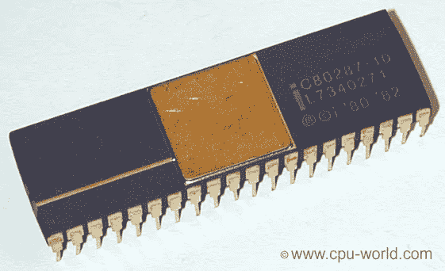

那东西是一头野兽。它为 Lotus 1–2–3 创造了奇迹。

不久之后，这种特定的 FPU 被集成到 CPU 中，减少了数学运算对外部协处理器的需求。然而，协处理器实际上存在的时间更长。

你知道你用来读这篇文章的 GPU 吗？你手机里的 DSP？声卡？他们都是协处理器，他们仍然存在是有原因的。

# 你的 CPU 不能做所有的事情

不，真的。它不能。英特尔 x86(8086 的继承者，也是我最爱的 80286)架构的实际芯片已经非常复杂了。根据 EETimes 的 Rick Merrit 的说法，向 x86 体系结构添加额外的操作具有递减的回报，[到了可能不值得的地步](https://www.eetimes.com/document.asp?doc_id=1333109)。

事实上，全球最大的硅芯片制造商之一 GlobalFoundries 已经宣布[放弃 7 纳米芯片](https://www.anandtech.com/show/13277/globalfoundries-stops-all-7nm-development)的计划。只是已经不值得了。

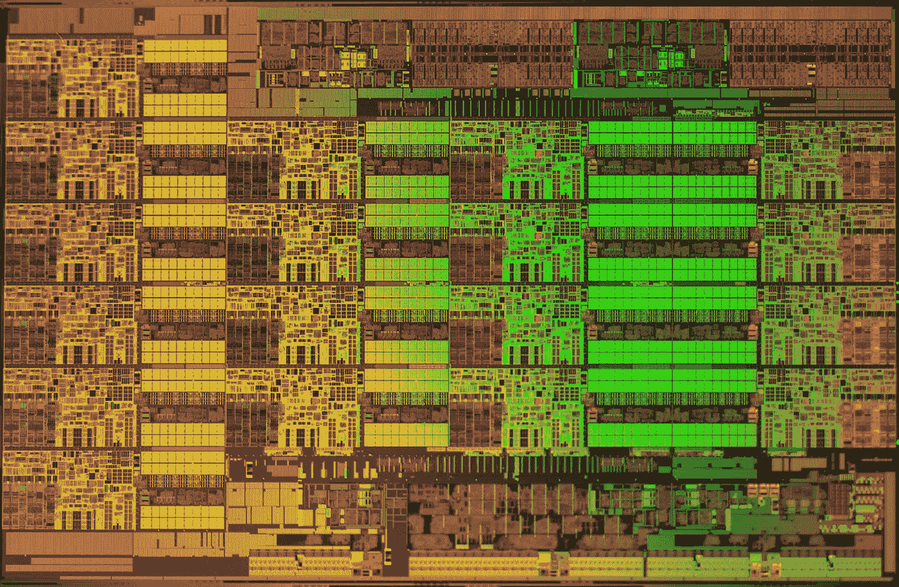

Intel Haswell-EP Xeon E5–2699 V3 Die on [wccftech](https://wccftech.com/intel-xeon-e52600-v3-haswellep-workstation-server-processors-unleashed-highperformance-computing/)

为什么这是个问题？嗯，x86 架构中的每个处理器内核都做许多不同的事情，这实际上让程序员们沾沾自喜。不用担心写不好的软件——处理器会保证它运行的很快！

当然，英特尔早在 21 世纪初就知道这一点。他们试图用 Itanium 来扼杀 x86 架构，Itanium 是一个为 64 位计算设计的处理器系列。然而，AMD 有一个不同的计划，并发布了 64 位 x86 处理器，阻碍了英特尔的计划。这就是我们如何结束这场混乱。

## 走向多核

让 CPU 发挥更大威力的唯一方法是向外扩展。这就是为什么今天的 CPU 几乎都是多核的原因。对于英特尔至强系列等高端服务器芯片，它们有 2 到 28 个内核。

x86 架构中巧妙的流水线和向量化、缓存以及其他一些复杂的系统允许很好地利用微型电子设备。有些任务可以成组运行，处理器甚至可以在下一步动作发生之前就正确预测它们。然而，正如我之前提到的，这些处理器已经非常复杂了。

其他架构确实存在。你可以在各种各样的设备中找到 ARM——从电池充电器到你的手机，甚至你的汽车——它有一个精简指令集，也称为 RISC。

IBM 同样走了 RISC 路线。RISC 处理器有一个简单得多的核心，它不能做更多复杂的 CPU 核心所做的事情。软件必须专门编写为多核，才能从这类处理器中受益。

目前，x86 还没有被执行。可能再过 10 年、15 年，x86 就会消失。

如果您有兴趣了解英特尔为实现并行处理所做的更多工作，请阅读关于英特尔 SPMD 计划编译器的“ISPC 的故事:【https://pharr.org/matt/blog/2018/04/18/ispc-origins.html】T2

# GPU 和 GPGPUs 来了

图形处理单元(GPU)也不是什么新东西。这个术语至少在 1986 年就已经在[使用了，但是倾向于严格地集中在图形上。NVIDIA 的第一张作为“GPU”上市的卡是 2009 年的 GeForce 256。然而，通用 GPU(**gp GPU**s)实际上在 2007 年左右开始出现，当时 NVIDIA 和 ATI(现在的 AMD)开始为他们的 3D 显卡配备越来越多的功能，如统一像素着色器。这些功能可以重新用于执行矩阵乘法、快速傅立叶变换、小波变换等操作。](https://books.google.dk/books?id=2j4hTAqxJ_sC&pg=PA169&redir_esc=y#v=onepage&q&f=false)

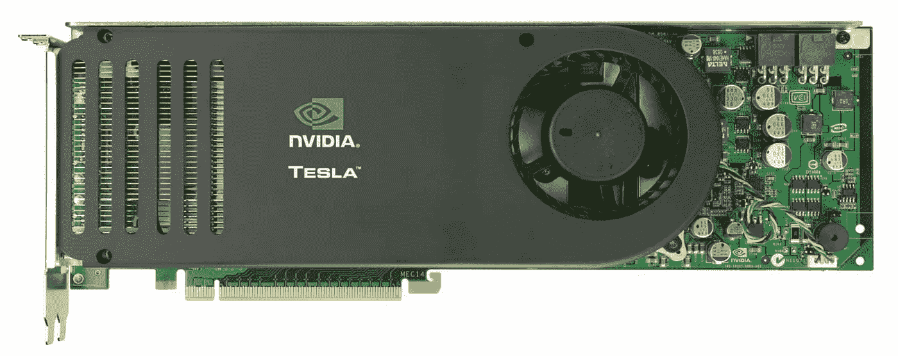

NVIDIA Tesla C870 with 128 CUDA cores ([NVIDIA](https://www.nvidia.com/docs/IO/43395/C870-BoardSpec_BD-03399-001_v04.pdf))

访问这些特性意味着必须发明新的编程结构。所以，2008 年，苹果开始开发 OpenCL。到 2009 年底，它已经被 AMD、IBM、高通、英特尔甚至 NVIDIA 采用。AMD 决定广泛支持 OpenCL，而不是他们“接近金属”的框架。

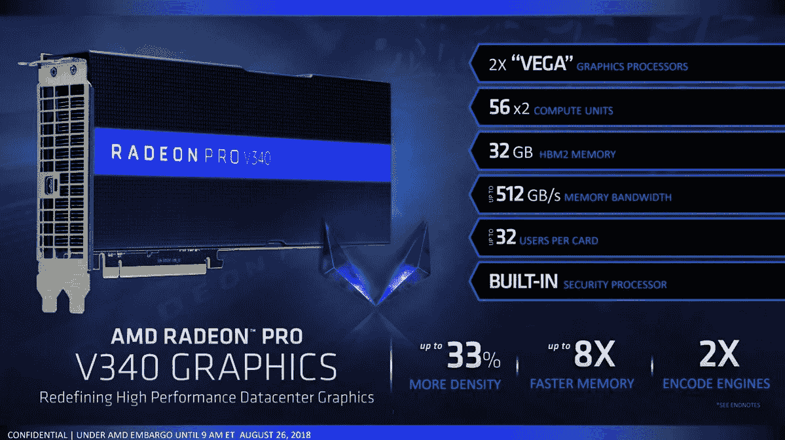

AMD’s Radeon Pro V340, with 512GB/s of memory bandwidth. Source: AMD

虽然 NVIDIA 过去和现在都支持 OpenCL，但他们并没有放弃自己的框架，即 CUDA。今天，CUDA 是高速、高吞吐量 GPU 计算的事实上的标准。它本质上是一个软件层，可以直接访问 GPU 的虚拟指令集和并行计算元素，以执行计算内核。

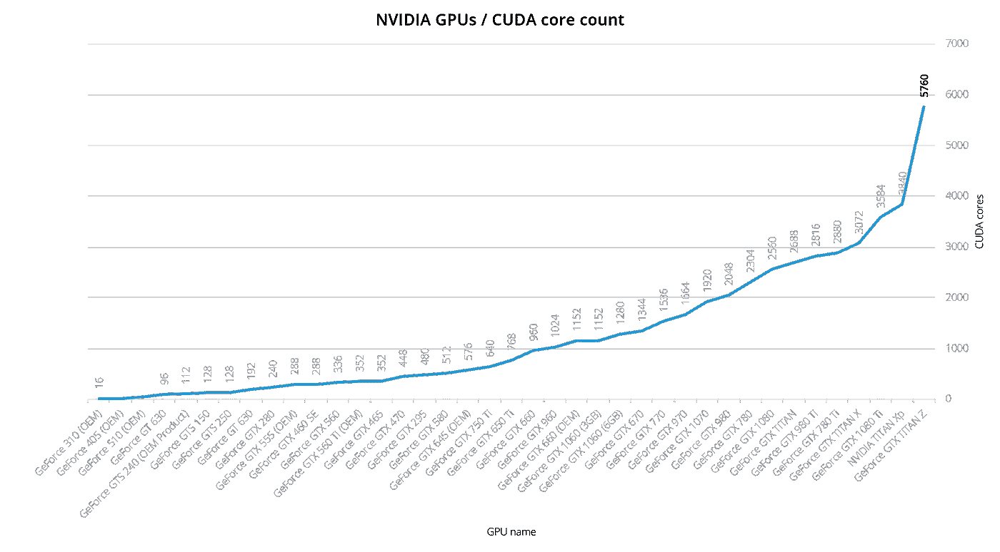

Newer NVIDIA GPUs have up to 5,760 CUDA cores

凭借 2009 年的 256 个内核，以及单个现代 GPU 中多达 5，760 个内核，我认为很容易理解为什么 GPU 对于需要高度并行性的操作非常有用。但这不仅仅是并行性——GPU 拥有极大的内存带宽，这使其适合高吞吐量的应用。

## 为什么不干脆把 CPU 换成 GPU？

并不是所有的应用都适合 GPU。GPU 在以下情况下最有用:

*   这些动作是重复的
*   这些动作大多是独立的(不相互依赖)
*   这些操作计算量很大

除了图形(和密码挖掘)，GPU 还发现了一些有趣的用途。今天，在各种数据处理场景中都可以找到 GPU。它们可以用作数据处理管道的一部分，用于在上运行机器学习模型，作为硬件加速关系数据库的一部分，或者只是很好地呈现结果。

让我们来看看 GPU 在数据处理管道中可以发挥作用的三个主要领域:

## 用于流处理的 GPU

新的流处理解决方案，如 [**FASTDATA.io**](https://www.fastdata.io/) 的等离子引擎可以利用 GPU 对进出数据库的数据进行流处理(无论是否使用 GPU)。该工具可用于在 GPU 上执行流数据的分析和/或转换。

FASTDATA 引擎的主要竞争对手是 [**支持 GPU 的 Spark**](https://github.com/IBMSparkGPU/SparkGPU) ，它是 IBM 的开源插件。

## 用于分析的 GPU 数据库

几乎所有的 GPU 数据库都是为分析而构建的。

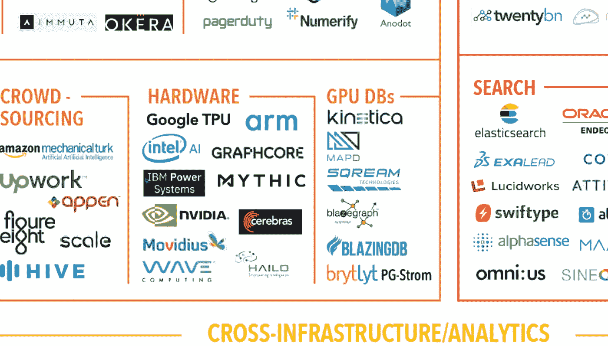

GPU Databases. Source: [The 2018 Big Data Landscape](http://mattturck.com/bigdata2018/)

从头开始构建 GPU 数据库的原因似乎是用非常不同的技术改造旧的基于行的数据库存在困难。

GPU 数据库领域有几个参与者，每个参与者都有自己的优势:

*   [**OmniSci**](https://www.omnisci.com/) **(以前为 MapD)——用于地理空间用例的内存 GPU 数据库**
*   [**SQream DB**](https://sqream.com)**—针对大于 RAM 的数据集的 GPU 数据仓库**
*   [**BlazingDB**](https://blazingdb.com)**—基于拼花的 GPU 数据库**
*   [**Kinetica**](https://www.kinetica.com/)**—内存 GPU 数据库**
*   [**HeteroDB**](http://heterodb.com/)**—Postgres 插件，基于 UDF，用于快速 NVMe 访问**
*   [**Brytlyt**](https://www.brytlyt.com/)**—用于内存计算的 Postgres 插件**
*   [**Blazegraph**](https://www.blazegraph.com/)**—图形数据库**

## **用于机器学习的 GPU**

机器学习往往非常适合 GPU 架构。这不仅仅是高水平的并行性和众多的矩阵运算。很大一部分原因其实就是前面提到的内存带宽。

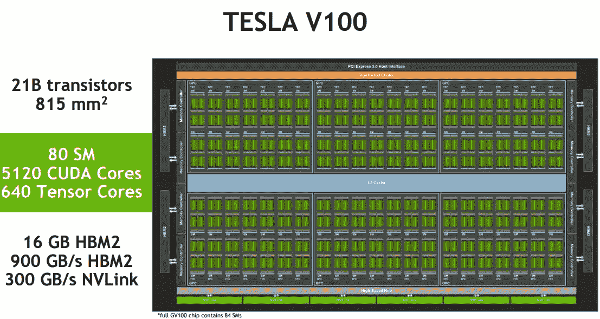

NVIDIA Tesla V100 core-arrangement. Source: [ServeTheHome](https://www.servethehome.com/nvidia-v100-volta-update-hot-chips-2017/)

CPU 就是我们所说的面向延迟的处理器。面向延迟意味着他们倾向于降低纳秒级时钟周期的操作延迟(一条数据每秒约 30 亿次操作)。相比之下，GPU 是面向吞吐量的。它们将以较低的时钟速度(每秒对多个数据块执行约 10 亿次操作)对大量数据同时执行单个操作。

GPU 以较慢的时钟速度牺牲延迟，以便在每个时钟周期获得更高的吞吐量。

不同的 GPU 支持的机器学习框架并不缺乏:

*   [**张量流**](https://www.tensorflow.org/)
*   [库布拉斯 ](https://developer.nvidia.com/cublas)
*   [**韩菲**](http://caffe.berkeleyvision.org/)
*   [**theno**](http://deeplearning.net/software/theano/)
*   [**火炬 7**](https://github.com/torch/torch7)
*   [**cud nn**](https://developer.nvidia.com/cudnn)
*   [**MATLAB**](https://www.mathworks.com/discovery/matlab-gpu.html)
*   [**cxxnet/mxnet**](https://mxnet.apache.org/)
*   [**深度学习 4j**](https://deeplearning4j.org/)
*   
*   **[**Mathematica**](https://reference.wolfram.com/language/example/SpeedUpComputationsWithParallelGPUComputing.html)**

**还有很多。**

# **不仅仅是 GPU，还有 ASICs、FPGAs 和其他奇特的硬件**

**虽然 CPU 和 GPU 是通用的，但我们在硬件上有一些其他替代方案，但也有一些权衡。**

**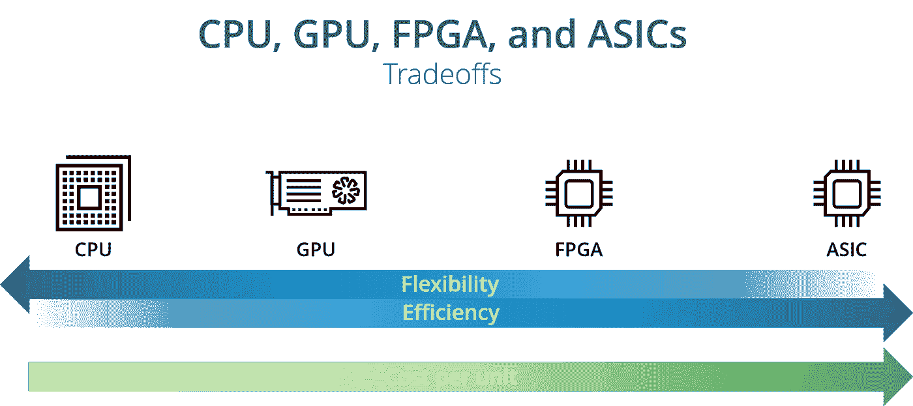**

**我们已经讨论过 CPU 和 GPU 了，下面具体说说 FPGAs 和 ASICs。**

## **FPGAs**

**现场可编程门阵列(FPGA)是一种高速可编程芯片。它们非常受原型和专业设备的欢迎。它们包含一个可编程逻辑块阵列和一个可重新配置的互连层次结构。**

**因为 FPGAs 是可编程的，它们可以在制造出来后被修改，但不能被任何人修改。它们提供了良好的性能，但成本相当高——这就是为什么它们仍然主要用于低产量设备的原因。您可以在医疗设备、汽车、专业设备等中找到 FPGAs。**

**与 CPU(和 GPU)相比，FPGAs 提供了更高的内存带宽和更低的功耗，但它们可能会与浮点计算相冲突，并且很难使用。事实上，它们很难编程，即使最近有像 OpenCL for FPGA 这样的工具存在。**

**在数据分析中，FPGAs 适合简单的重复性任务。它们出现在现代平台中，如微软的 [**项目脑波**](https://www.microsoft.com/en-us/research/project/project-brainwave/) 、Postgres 的 [**Swarm64 数据库加速器**](https://swarm64.com/)**、Xilinx 的[**Alveo 数据中心加速器**](https://www.xilinx.com/products/boards-and-kits/alveo/u250.html) ，以及类似 [**Ryft**](http://www.ryft.com/) 的设备。FPGA 在分析中最广为人知的用法之一是 [**IBM 的 Netezza**](https://www.ibm.com/analytics/netezza) ，虽然 Netezza 的 FPGA 方面似乎已经大部分被放弃了。****

****最终，Netezza 成为了 IBM PureData 的一部分，FPGA 组件主要用于受益于 FPGA 的特定操作，如解压缩和转换。其他操作仍然使用 CPU。****

****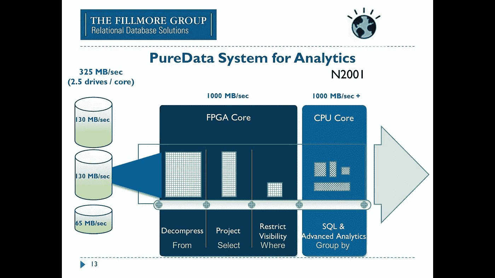****

****Source: [IBM Data Retrieval Technologies RDBMS, BLU, IBM Netezza and Hadoop](https://www.youtube.com/watch?v=xcny1gU0x18)****

## ****专用集成电路（ApplicationSpecificIntegratedCircuits）****

****定制设计的专用集成电路(ASIC)是硅级高速操作的最快选择。因为这些芯片是高度定制的，所以它们能够以最小的开销提供最佳的性能。****

****ASICs 通常是数字信号处理器(DSP)，用于音频处理、视频编码和网络等领域。这些应用主要是在大规模生产的设备中，如照相机、移动电话、无线路由器等。****

****由于创建定制 ASICs 的高成本和时间投资，它们也是最昂贵的选择。如果你计划生产数百万个，它们实际上是更便宜的选择，但在小批量生产时，它们很难证明是合理的。出于这个原因，它们在分析或数据处理中并不常见。****

## ****比较权衡****

****以下是不同处理器及其权衡的总结:****

****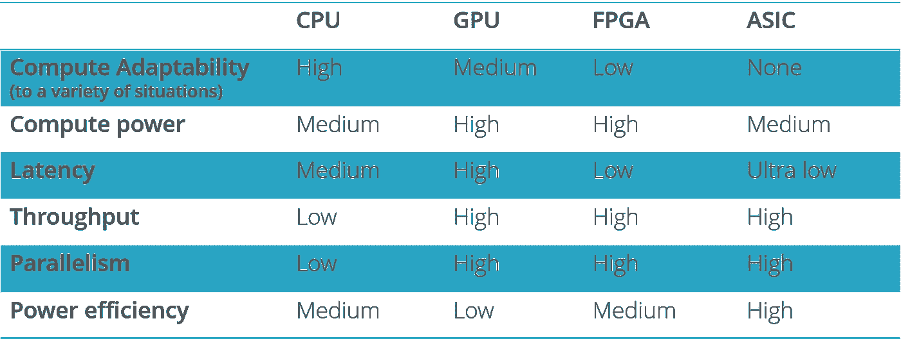****

****Each of the processor types has its own tradeoffs****

# ****硬件加速数据处理的未来****

****未来是硬件多样化，但不是所有的协处理器都适合每一项任务。****

*   ****CPU 的工作:保持标准的、顺序的程序和代码运行****
*   ******协处理器的工作:**运行高吞吐量并行代码****
*   ******CPU +协处理器:**提高并行程序的吞吐量****

****很明显，x86 CPU 架构不会永远存在。从长远来看，这是不可持续的。它与现代数据工作负载的发展速度不同。****

****因为它们没有绑定到相同的向后兼容性，GPU 进步得更快。现代数据工作负载多种多样、不断变化、不断增长且发展迅速。GPU 和其他硬件加速数据处理应用程序越来越受欢迎，在机器学习领域和数据仓库领域取得了一些显著的成功。****

****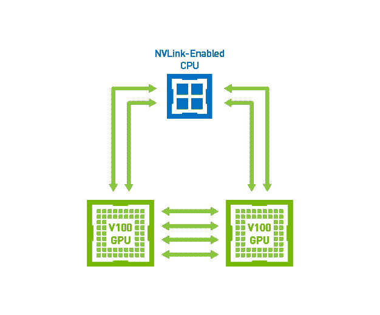****

****Tesla V100 with NVLink GPU-to-GPU and GPU-to-CPU (Power9) connections. Source: [NVIDIA](https://www.nvidia.com/en-us/data-center/nvlink/)****

****支持 FPGA 和 GPU 的硬件，如带有 NVLINK 和 OpenCAPI 的 IBM Power9，以及 Azure 和 AWS GPU 和 FPGA 实例只是未来发展的一个迹象。****

# ****结论****

****我认为硬件加速数据处理仍处于起步阶段，但随着加速技术在今天的 CPU 架构上继续取得进展，它可能会变得更加广泛。****

****谢谢你把这个看完！我知道这并不容易——有很多信息(和缩略语)需要消化。****

****本文是硬件加速数据系列文章的第一篇。在我的下一篇文章中，我将深入探讨不同的硬件加速数据库如何利用它们各自的硬件加速器。****

****如果你喜欢这篇文章，请在下面留下评论，或者与你的朋友和同事分享。****