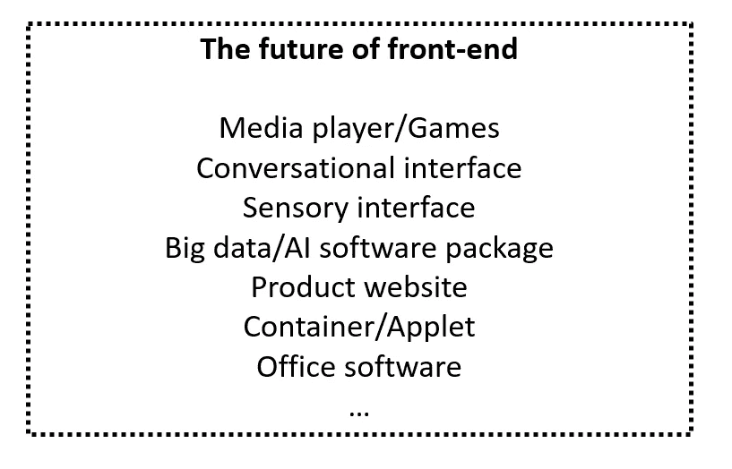

# 对前端工程未来的一瞥

> 原文：<https://medium.com/hackernoon/a-glimpse-into-the-future-of-front-end-engineering-21bbebfc7008>

随着技术的发展，前端工程师的角色将如何发展？阿里巴巴工程师的观点。

前端工程师首先是程序员，其次是软件工程师，融合人们看到的、访问的和交互的东西，创造理想的用户体验。

今天，编程遵循一种将大任务分成多个小任务的分工生产过程。随着每项任务分配给不同的人，它使每个人能够在他们的特定领域专业化和发展。然而，虽然这一过程为程序员专注于前端 web 开发的各个方面奠定了基础，但为了提高生产率，还需要进一步的多样化和集成，这些发展无疑将改变前端工程师的职责。

下图显示了自 1995 年以来软件开发的历史和前端的演变。

# **进一步多元化**

展望未来，web 开发前端涉及的领域、行业和技术将继续多样化。

例如，在阿里巴巴，前端目前分为以下五个部门，所有部门又分为更专业的团队。

*   后台支持:云控制台、信息和资产管理平台等。产品包括阿里云控制台和 DeepInsight。
*   图形:基本的图形库、3D 图形和数据可视化。产品包括 G2 和 DataV。
*   终端:移动和计算机终端、触摸屏计算机和智能设备。产品包括淘宝支付宝 app。
*   节点:工具链、web 框架和物联网。产品包括 DEF/Atool/F2E-Test，阿里巴巴的前端开发者工具。
*   开发者服务:应用开发、组件市场、平台运维，产品包括阿里云的应用开发平台 Boat 和融合设计组件市场。

重点行业包括传统 B2B 行业，如信息管理、金融、建筑、航空航天、制造业等。同样在扩张的还有新产业，如阿里巴巴的“五新”战略，包括新零售、新制造、新金融、新能源和新技术(涉及支持传统产业的新技术)，以及 SaaS 的平台和产品，如 Teambition、Trello 和阿里巴巴的企业聊天应用丁聊。

B2C 行业也很关键，包括移动 app，如微信和微博，PC 桌面应用，产品网站，以及技术栈，即 React(原生)，Angular (NativeScript)，Vue (Weex)。

# **进一步整合**

虽然前端的专业领域正在发展，但其他领域正在进一步整合，最显著的是终端技术、全栈 web 开发和人工智能技术。

## **终端技术**

前端和客户端技术的融合:

-组件(组件构建页面)

-组件生命周期挂钩功能(如 iOS ViewController)

- MV*(如源于微软客户端开发框架的 MVVM 设计)

前端的统一:

-虚拟 DOM:React/React national/React canvas

-各种移动设备核心和引擎的统一:WebKit / V8

-统一技术文件:MDN 网络文件

## **全栈 web 开发**

前端和后端技术的融合:

- MV*(如 Backbone.js，前端第一个 MVC 框架，来自 Ruby on Rails 的开发者)

- AOP，依赖注入(角度)

- GraphQL (SQL)

-索引数据库

## **AI 与终端技术**

人工智能与前端技术的集成

-这里的终端是指到达最终用户的节点

-数据采集后端机器学习，数据分析智能推荐呈现

物联网与前端技术的集成

-智能家居/汽车/工业设备可以有屏幕，并且可以同时使用 Node.js 开发带有 js 执行引擎(如 JerryScript)的网络应用程序。

# **前端的未来**

也许值得注意的是，由于操作系统、算法和数据结构的性质，以及对前端既易读又美观的不变需求，前端 web 开发的本质不会经历彻底的转变。

但是变化是不可避免的。在许多方面，前端的未来是移动的。如今，我们使用智能手机购物、办理银行业务、阅读新闻和观看视频的次数远远超过了仅仅用来交流的次数。但随着企业巨头的接管，一些人，尤其是小规模开发者，正在被挤出市场，这让他们更难在移动应用市场找到立足之地。

与此同时，随着语音和面部识别技术的质量不断提高，无界面交互正在扩大。无接口物联网设备有自己的通信协议和规范，它们的许多前端工作也将在后端进行。

尽管如此，无论是从桌面慢慢演变到网络的复杂应用程序，包括日常办公软件和大数据以及人工智能软件，还是游戏、容器、DSL 和产品网站，前端工程师都将永远处于高需求状态。

**(Original article by Yu Shengjie 郁盛杰)**

# 阿里巴巴科技

关于阿里巴巴最新技术的第一手深入信息→在**脸书**上搜索 [**【阿里巴巴科技】**](http://www.facebook.com/AlibabaTechnology)