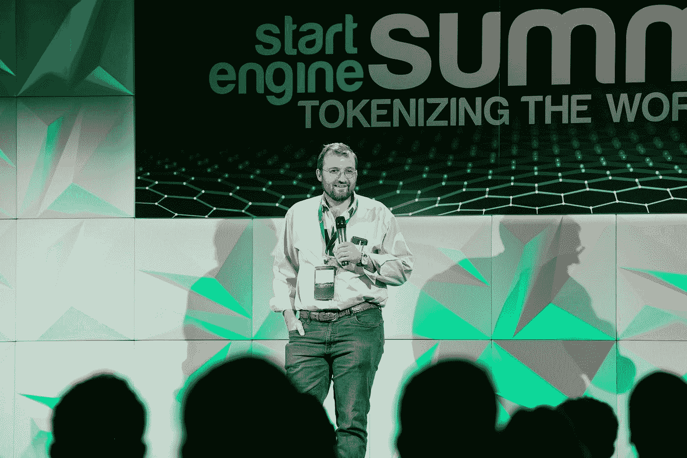
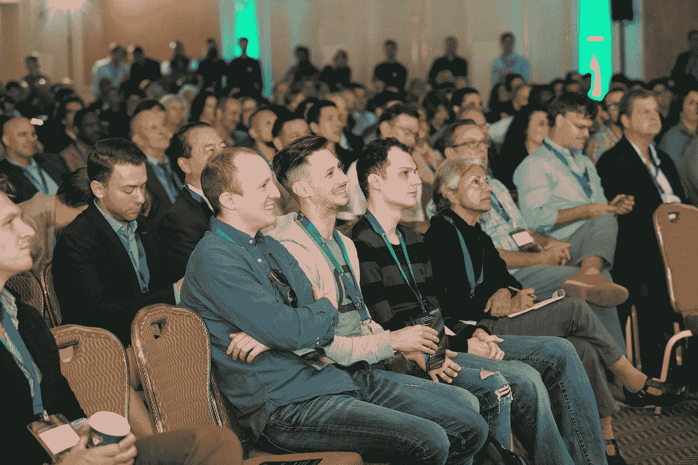
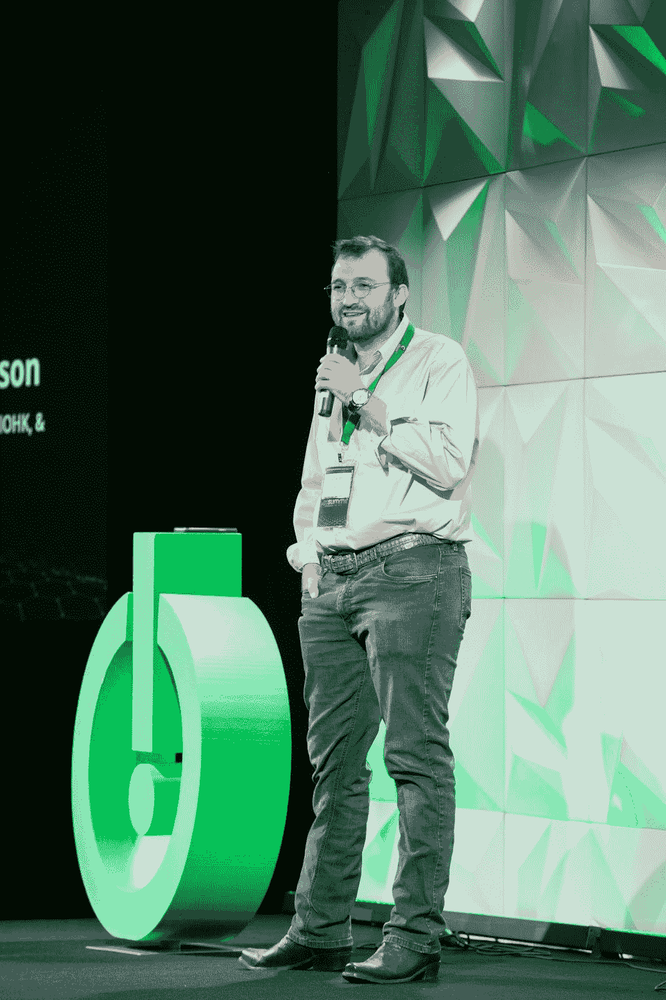
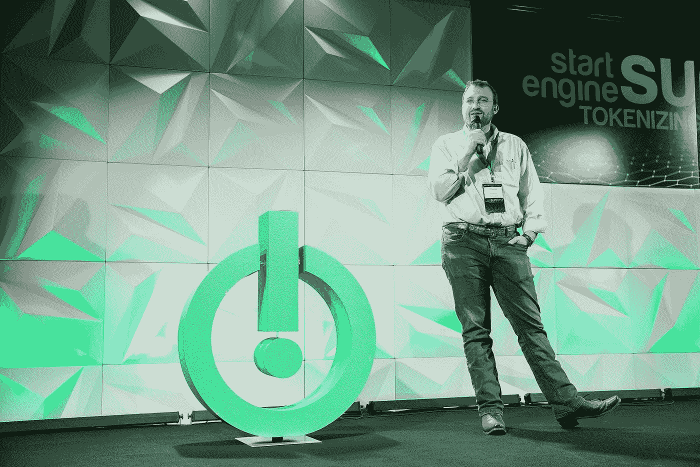

# 霍金森的全球金融体系:“我们的表现取决于我们拥有的工具”

> 原文：<https://medium.com/hackernoon/a-global-financial-system-with-hoskinson-we-are-only-as-good-as-the-tools-we-have-ab443c10bb28>

门开了，与会者涌入房间，观看 StartEngine 峰会的闭幕主题演讲:Charles Hoskinson，以太坊的创始成员和 IOHK 的创始人，IOHK 开发区块链解决方案，包括第三代加密货币 Cardano。

霍金森看上去谦逊，一只手插在口袋里，穿得更像一个喜欢在山里散步的父亲，而不是 crypto 中最聪明的人之一。他的演讲是深思熟虑的，安静的，他的故事以一种温和的节奏漫谈，尽管每个轶事都有浓缩的信息，但还是让观众昏昏欲睡。霍金森是一位出色的演说家。

他以旅行故事开始。毕竟，霍金森今年去过 27 个国家，过去三年里去了 50 个。首先，霍金森谈到了埃塞俄比亚的亚的斯亚贝巴。

“交通比洛杉矶还糟糕，”Hoskinson 开始说道，他描述了一家初创公司，这家公司是蔬菜的优步。这家公司资本很少，却通过将农民和他们的产品直接与餐馆联系起来而变得非常有利可图。他们请他投资，霍金森说当然可以，直到他恍然大悟:“我如何获得流动性？我如何卖出我的股票？”

初创公司告诉他，埃塞俄比亚没有股票市场。有商品交易所，但是政治化了，很难打通。“权力的游戏是真实的，”霍金森说，“是基于埃塞俄比亚的咖啡市场。”

霍斯金森对人群说，如果你想以埃塞俄比亚企业家的身份创办一家企业并出售，你必须在这个国家之外去做。

霍金森接着谈到了蒙古，该国的交通状况比埃塞俄比亚还要糟糕。30%的人口是游牧民族，他描述说在路边看到过骆驼。蒙古国的人口是其道路容量的 15 倍，但是改造公共交通将花费 2B。蒙古为什么不能源都？他们没有好的市场。

霍金森的公司 IOHK 在世界各地与埃塞俄比亚和蒙古等国家合作。“他们有共同的问题，”霍金森说。“他们被排除在世界金融体系之外。他们很乐意来玩，但在合规方面成本太高了。KYC 和反洗钱成本高得惊人，尤其是当每个客户的终身价值为 20 美元时。尽管数万亿美元的价值被锁定，无论是房地产、资源，还是拥有真实资产负债表、现金流和客户的中小企业，他们都不能在全球市场上玩游戏，也不能将这些东西符号化。”

因此，Hoskinson 和 IOHK 团队致力于利用下一代加密货币和下一代合规性为这些地方构建解决方案。

**认知实验**

Hoskinson 然后追溯了他的根源和他在 2011 年进入 crypto。他描述了自己注册的第一个比特币聚会。上面写着“两个注册者，我和另一个人。我出现了，而另一个人没有。”

霍金森说，当时比特币是“一项认知实验”如果黑客创造了据称受密码保护的代码，据称是因为大多数人不够聪明，无法理解底层技术，人们会用真钱购买代币吗？

在早期，除了少数好奇的头脑，没有人关心答案。监管机构当然没有关注，但这种情况在 2013 年开始改变。“2013 年，所有人都说这是个好主意。市场去了 1B。”因此，霍金森告诉全神贯注的听众，我们到达了第一代，他们被定义为“去中心化的概念和大众的错觉，认为这是值得的。”

在霍金森看来，这种做法“唤醒了人们对可编程货币的认识:旧的业务流程，发行资产，交易资产，接受合同，剖析其实际意图，将[所有]内容尽可能多地编入代码，实现自动化，并将其纳入一个有时间戳、不可变、可审计的系统……这是一件非常酷的事情。”

2013 年，霍金森和一个小团队开始构建第二代加密货币以太坊(Ethereum)，并于 2015 年推出。最终，人们意识到以太坊是什么:一个“天空中的鲁伯·戈德堡机器”2017 年就这样发生了。资金涌入 ERC——20 枚代币的规模达数十亿美元，个人发现自己拥有数千万美元。

“一个没有商业经验或知识的 22 岁年轻人可能一觉醒来就有 3000 万美元，甚至没有银行账户，甚至没有合法注册……我们仍在从中恢复。2018 年是‘哦，等等，这可能不是最好的主意，让我们把它拿回来，但我们不能’的一年。”

**“神奇的事情将会发生”**

ICOs 之后，各国政府都在走向不同的方向。一些人将目光投向了欧盟和美国，以及它们的监管者对代币的看法。其他司法管辖区，如巴巴多斯、百慕大、马耳他、直布罗陀等，正在投机取巧，心想“如果我们能占领这个市场的一大块，岂不是很有趣？”另一方面，中国和韩国对代币的态度更加严厉。

“世界上没有共识，”霍金森说。“这对我这样的人来说很难，因为在一天结束的时候，我只是想做些事情。我非常关心如何帮助别人？我如何为消费者制造产品？我如何让这些对他们有用？”

接着，霍金森讲了一个关于南非桑顿的趣闻，他访问了失业率高达 35%的城镇，那里的人们每月生活费不足 100 美元。他遇到了一家风险企业，要求他建立一个土地登记系统，因为目前存在一个问题，即居民在出售土地时没有告知政府。他们只是把契约换成现金。为了找出谁真正拥有一处房产，霍金森说，你必须使用“奶奶测试”，在这个测试中，你向邻居中最年长的奶奶询问房产的历史，她会在四个多小时内完整地告诉你，可能还要喝茶。

回到监管问题上来，Hoskinson 承认存在问题，如果你是一个发行代币的美国公民，美国政府会找到一种方法来声称他们有管辖权。“你可以把它卖给汤加人，用一种奇怪的波利尼西亚语言，”霍金森开玩笑说，“但如果你是美国公民，发行它或把钱带回美国，不知何故，美国监管机构会说你欠税或应该提交一些表格。我的过失。”

霍斯金森认为，ico 也不例外。很多人会被骂。他们将不得不道歉，支付不同数额的罚款，并执行一项规定，提供或其他一些豁免。反过来，这将导致受监管市场的形成，如比特币基地和兹罗，它们“将找到为这些不受监管但现在需要的工具创造流动性的方法”。

然后，霍金森提出，“神奇的事情将会发生。”随着事情的发展，人们会开始问一些基本的问题，比如，“为什么要花这么多钱来做合规性？”

霍金森认为，高成本是因为我们让银行和机构承担了“你是否(在财务上)安全的责任”。这让他们变得保守。这让他们产生了偏见。”你可以是安哥拉的比尔·盖茨，但是因为你住在安哥拉，这是一个高风险的司法管辖区，所以你不能开银行账户。

最终人们会要求以不同的方式做事。例如，霍金森提出了以下假设:“如果[合规]是基于交易的——[个人回答]每笔交易的一系列问题，会怎么样？”这些答案然后查询数据仓库，以确定交易是否“安全”或“合规”

“总有一天，有人会尝试它，”霍金森告诉人群。“它不会在美国试用。它将在非洲试行，“以促进没有良好系统的国家的跨境支付”。在某个地方，它会起作用，当它起作用时，会有更多的人去做。“当足够多的人这样做时，它将改变世界，”他说。

法律具有可塑性，能适应不断变化的行为。毕竟，正如霍金森所指出的，直到 1992 年，在互联网上销售东西是非法的，因为人们认为这会把互联网变成一个“垃圾邮件和色情的粪坑”。他们是对的，霍金森开玩笑说，但我们也有亚马逊。

**咖啡树的树桩**

“我只是一个人，你们都只是普通人，”霍斯金森在过渡到主题演讲的最后一点时说。在霍金森看来，头衔、金钱和经验并不是个人突出的原因。

“现实是，我们的能力取决于我们拥有的工具，”霍金森说。“我们的表现取决于我们服务的人、我们拥有的客户和我们所处的市场。”

在过去的 25 年里，霍金森认为我们生活的市场已经发生了深刻的变化。今天，当你做生意时，你是在与整个世界做生意，而我们的监管和合规系统、支付和金融系统的设计并不适应这一点。

随着美元实力的减弱，以及世界上其他力量的崛起，全球经济将不再由美国政策决定。霍金森认为，不应该有强制要求。相反，我们将被迫谈判。

“你知道当你不得不谈判时会发生什么吗？你的文化会改变。你们的社会会改变…在未来 10-20 年，我们会看到巨大的财富，我们会看到事情发生变化。有一件事我绝对肯定，那就是我们将建立一个全新的世界金融体系。”

霍金森认为，这个新系统将把昂贵的东西自动化，包括合规。很多工作会消失。"我们将开始看到资金随着信息的速度流动."

Hoskinson 以再次回到埃塞俄比亚的咖啡市场来描述巡回演讲的过程来结束他的主题演讲。伐桩是咖啡种植者为了新的生长砍掉老树的一种做法。老树仍然有生产能力，但新树将生产 2-3 倍多的咖啡。然而，农民不会砍伐他们的小树林，因为他们负担不起。现在是掏钱了。很简单，这个问题可以通过信用来解决。

“当这些新系统开始发挥作用时，很快某个地方的农民就可以向这个房间里的某个人贷款 50 或 100 美元，以 20-30%的利息砍伐他们的树木，”霍金森说。“这将是一个现实。我们将看到数十亿和数千亿美元流向世界各地最需要的人，而利率和风险都在下降。这将改变他们的生活。它会让世界变得更美好。”

*StartEngine 是一个领先的股权众筹平台，已经帮助 250 多家公司筹集了超过 8000 万美元。我们目前也在筹集资金。加入已经投资我们的近 3500 名 StartEngine 所有者。* [*这里投资 start engine*](https://www.startengine.com/own?utm_source=Medium)*。*

*如需了解更多信息，请查看我们的* [*公祭通告*](https://www.sec.gov/Archives/edgar/data/1661779/000114420419013344/tv515967_253g2.htm) *。*