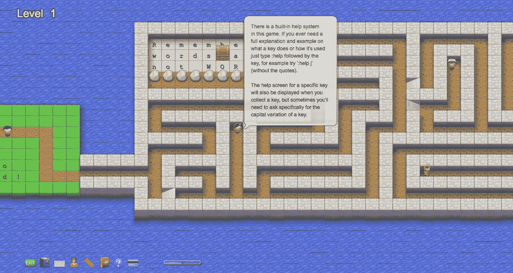

# Vim 命令初学者指南

> 原文：<https://medium.com/hackernoon/a-glossary-of-vi-commands-e17cbc5b12f1>

我想大概是时候记住 [vim](https://hackernoon.com/tagged/vim) 命令了。在我的高中，我们所有的 CS 课程都要求我们学习 emacs 和终端[命令](https://hackernoon.com/tagged/commands)。虽然我对 vim 有粗略的了解(足以保存 git 提交并退出窗口)，但我没有足够的知识完全忽略键绑定。

最近，我偶然发现了 Vim Adventures，这是一款可爱的基于文本的游戏，模仿了《塞尔达传说》之类的游戏。它教授了 vim 的一些更基本的命令，并大大降低了学习曲线(尤其是 vim 和 vi 以其界面极其简约而闻名，但包含许多对常规使用来说往往至关重要的快捷方式——有点像街头霸王和 VSCO)。

无论如何，随着我在游戏中的进展，我意识到有一些备忘单可以参考可能会有所帮助。这个游戏列出了你需要知道的所有主要命令，没有特定的顺序。

以下是我版本的词汇表，更有条理一些:

# 一般

[count]:指定命令迭代的次数，默认为一次

~~:删除光标后面的最后一个字符~~

yank:存储文本，但不修改文本(复制文本)

标记:文件内为导航而设的隐藏位置

*   `:将光标直接放在标记上
*   :将光标放在标记行的第一个非空白字符上

寄存器:在内存中为文本指定的存储空间。有九种类型:

*   未命名的寄存器""
*   编号寄存器“0-”9
*   小型删除寄存器"-
*   命名寄存器“a-”z
*   黑洞寄存器" u
*   四个只读寄存器”；/",/"%/"#
*   表达式寄存器" =
*   选择和丢弃寄存器“*/”+/~
*   最后一个搜索模式"/

nu，nonu:在文本中的每一行前面显示行号

*   :设置 nu:显示行号
*   :set nonu:隐藏行号
*   :set nu！:切换行号
*   :设置 nonu！:切换行号。

# **主**

Esc: escape 键—退出当前模式，进入“命令模式”

I:用于插入文本的插入模式

*插入命令的最后一行模式(保存文档、帮助)

问:允许你退出或退出 vi

*   q！:强制退出
*   退出，将修改后的文件写到原始文件

# **滚动**

[count]h:将光标向左移动一格

j:将光标向下移动一格

k:将光标向上移动一格

[count]l:将光标向右移动一格

[count]w:将光标移动到下一个单词的开头(标点被视为单个单词)

[count]W:将光标移动到下一个单词的开头(单词是由空格分隔的字符/标点符号序列)

e:将光标移动到下一个单词的末尾(标点被视为单个单词)

e:将光标移动到下一个单词的末尾(单词是由空格分隔的字符/标点符号序列)

[count]b:将光标移动到前一个单词的开头(标点被视为单个单词)

[count]B:将光标移动到前一个单词的开头(单词是由空格分隔的字符/标点符号序列)

0:将光标移动到行首

^:将光标移动到该行的第一个非空白字符

[count]$:移动到行尾或[count]-1 行

[count]f{char}:将光标向右移动到第[count]次出现的{char}处

[count]F{char}:将光标向左移动到第[count]次出现的{char}处

[count]t{char}:将光标在第[count]次{char}之前向右移动一格

[count]T{char}:在第[count]次{char}后将光标向左移动一格

[计数]；:重复最后一个 f/F/t/T 命令

[count]，:反方向重复最后一个 f/F/t/T 命令

# 导航(围绕文档)

[count](:导航到上一个句子的开头(一个句子以“.”结尾), '!'，还是'？'后跟空格或换行符)

[count]):导航到下一个句子的开头(一个句子以“.”结尾), '!'，还是'？'后跟空格或换行符)

[count]{:将光标移动到当前段落前的空行

[count]}:将光标移动到下一段之前的空行

[count]gg:导航到文档中的第[count]行，默认情况下转到第一行

[count]G:导航到文档中第[count]行的第一个非空白字符，默认情况下，导航到最后一行的开头

[count][{，[(，])，]}:转到上一个(或下一个)不匹配的' { ' ' '，从当前光标位置开始，但不包括当前光标位置

[count]|:将光标移动到当前行的第[count]列

# 导航(围绕窗口)

z:将光标线重绘为:

*   zt:窗口的顶部
*   zz:窗户中间
*   zb:窗户的底部

[count]H:从窗口的第一行到第[count]行的第一个非空白字符，不滚动屏幕

m:到窗口中间行的第一个非空白字符

[count]L:从窗口的最后一行到第[count]行的第一个非空白字符

# 搜索

*:向前搜索当前行中第[count]次出现的离光标最近的单词。搜索的单词是第一个

*   光标下的关键字(a-z，A-Z，0–9，_，@)
*   光标后的第一个关键字
*   光标下的非空白单词
*   光标后的第一个非空白单词

#:与*相同，但向后搜索

[count]/{pattern}:向前搜索模式，默认为最后一个模式

【计数】？{模式}:向后搜索模式，默认为最后一个模式

[count]n:重复最后一个“/”或“？”搜索

[count]N:重复最后一个“/”或“？”向相反的方向搜索

%:查找该行或其后的下一项并跳转到其匹配项(包括([{ }])/* */# if # ifdef # else # elif # endif)

# 选择

*注:节略，详情见正文-对象*

[count]aw:选择一个单词和它后面的空格，除非光标在单词前面的空格中(然后包括前面的空格)

[count]aW:选择一个单词和它后面的空格，除非光标在单词前面的空格中(然后包括前面的空格)

[count]iw:选择一个单词(空格算作单词)

[count]iW:选择一个单词(空格算作单词)

[count]as:选择一个句子和它后面的空格，除非光标位于前面的空格中(然后包括前面的空格)

[计数]是:选择一个句子(空格算作句子)

[count]ap:选择一个段落和它后面的空白，除非光标在空白之前(然后包括之前的空白)

[count]ip:选择一个段落(空格算作段落)

# 删除

[count]x:删除当前行光标前后的字符

[count]X:删除当前行光标之前的字符

[count]r{char}:用{char}替换光标下的字符

d{motion}:删除{motion}移动过的字符/单词

[count]dd:删除整行，不管光标在行中的位置

[count]D:删除光标下的字符，直到行尾，再删除[count]-1 行

[count]~:切换光标下字符的大小写并将光标向右移动

:delm {args}，:delmarks {args}，:delm！，:德尔马克！:删除指定的标记，包括 a-z、A-Z。为了！，删除所有现有的 a-z 标记

# 文本修改

p:将指定寄存器中的文本放在光标之后。当没有指定寄存器时，使用未命名的寄存器(")包含最后删除、更改或拉取的文本

P:将指定寄存器中的文本放在光标之前。当没有指定寄存器时，使用未命名的寄存器(")包含最后删除、更改或拉取的文本

[计数]。:重复最后一次简单更改，默认为最后一次更改的计数(如果最后一次更改包括一个带编号的寄存器，则寄存器编号将递增)

# 插入模式命令

*注意:Esc 退出插入模式*

[count]i{text}:在光标前插入文本

[count]I{text}:在行中第一个非空白字符之前插入文本

[count]a{text}:在光标之后追加文本，如果光标位于空行的第一列，则从那里开始插入

[count]A{text}:将文本追加到行尾

[register]c{motion}:删除过度运动

[register][count]cc:删除寄存器中的行并开始插入(逐行)

[寄存器][计数]C:从光标位置到行尾删除，并[计数]-再向寄存器中插入 1 行，并开始插入

s:删除或替换指定寄存器中的字符，并开始插入(非逐行插入)，同义词“cl”

[寄存器][计数]S:cc 的同义词

o{text}:在光标下方开始新的一行并插入文本

O{text}:在光标上方开始新的一行并插入文本

# 猛拉

[register]y{motion}:将{motion}文本拉入寄存器，默认情况下存储在“0 寄存器”中

[register][count]yy:将该行拉入寄存器，光标在该行中的位置无关紧要

[寄存器][计数]Y:YY 的同义词

# 撤消/重做

[count]CTRL+R，:redo:重做已撤消的更改

[count]u，:undo:撤消更改

# 登记

:reg {arg}:显示{arg}指定的编号和命名寄存器的内容，或者默认情况下列出所有内容

# **文本对象**

单词:由空格(空格、制表符、<eol>)分隔的字母/数字/下划线或非空白字符的序列，包括一个空行</eol>

WORD:由空格(空格、制表符、<eol>)分隔的非空白字符序列，包括一个空行</eol>

句子:以“.”结尾的一系列单词, '!'，还是'？'后跟空格或换行符

段落:以换行符结尾的一系列句子

text-object:运算符后的两个字符，用于指定运算范围。第一个字符要么是' a '(一个对象，包括空白)，要么是' I '(内部对象没有空白或只有空白)。第二个字符决定对象类型

*   单词，单词，句子，段落
*   "，'，`(带引号的字符串)
*   {，}，B ({}块)
*   (，)，b(()块
*   [，] ([]块)
*   ( <>座)
*   t (HTML/XML 标记块))

# 有兴趣了解更多信息吗？

幸运的是，网上有大量的资源可以帮助你适应 vi/vim 环境。这些网站从帮助你记忆基本的按键和快捷键到设置你自己的宏和定制你的工作环境。您很快就会发现 vi/vim 比简单的文本编辑器有更多的用途！

*   [维姆历险记](https://vim-adventures.com/)
*   [打开 Vim](http://www.openvim.com/)
*   [Vim Linux 指南](https://www.linux.com/learn/vim-101-beginners-guide-vim)

你觉得这个指南有帮助吗？如果有，给它一个‘鼓掌’和分享吧！