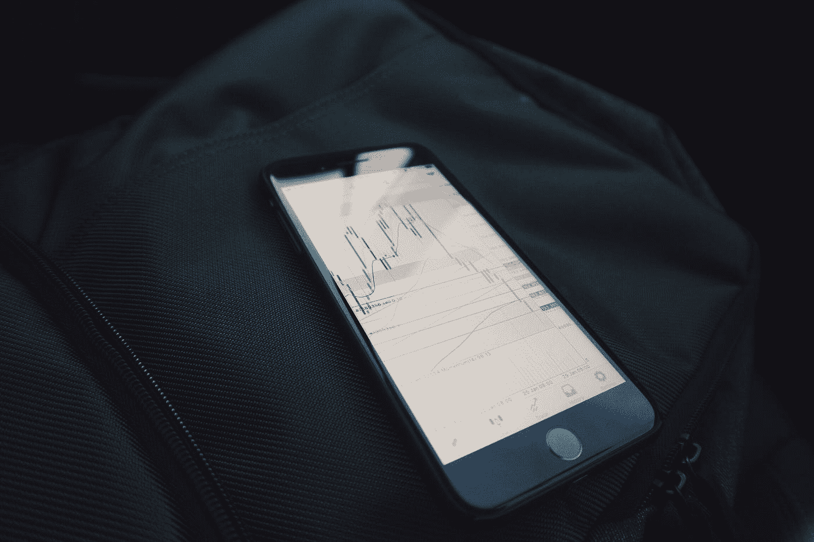

# 密码交易中的大师级策略

> 原文：<https://medium.com/hackernoon/a-grandmaster-strategy-in-crypto-trading-9e62a338f3e0>

## 赚大钱和绝对零损失的关键

Photo by [Mark Finn](https://unsplash.com/@mrkfn?utm_source=medium&utm_medium=referral) on [Unsplash](https://unsplash.com?utm_source=medium&utm_medium=referral)

有可能绝对零损失吗？绝对是！要想亏损，你必须以低于买入价格的价格卖出。作为一名密码策略师，我不相信止损。投资的第一法则(在我看来)是；**千万不要赔钱！**止损让你接受损失，这只能证明你在买入时没有做好功课。这就是为什么我不听助教和图表分析师的话。不是我完全忽视他们，而是我不遵循他们的建议或方法，然而他们给出了一些很好的观点，可能对我自己的评估有帮助。如果你不是自己做主，你就不是交易者。

交易的秘密世界不同于传统的股票市场。某些在股票市场行之有效的原则和策略对密码世界并不适用。有些人可能想将加密交易与外汇、差价合约等相提并论，但我认为它们并不相似。就我而言，外汇(以及诸如此类的东西)太接近赌博了。一个人的损失可能超过投资金额，这一事实令人不安。我见过外汇市场上的人从 0 到 100 的速度非常快，但从 100 到-1000 的速度要快两倍。我不知道你怎么想，但我不喜欢不确定性。**我用加密来换取短期收益，因为我相信它的长期前景**。这就是为什么没有红色市场困扰我。

这是我交易策略的一瞥，我希望它能帮助某人清醒过来，停止亏损。我已经接受了一些影响加密世界的基本事实。在这些事实之后组织你的交易会帮助你做好交易。以下是其中的 5 个:

1.  团队传来的好消息让硬币价值暴涨。你无法计算这个
2.  当比特币下沉时，大多数其他硬币也会下沉，但速度更快
3.  当交易量增加时，价格就会上涨
4.  今天的顶级赢家(尤其是那些涨幅超过 40%的)是明天的顶级输家。(不幸的是，反之亦然不起作用)
5.  每个硬币都会有它的一天

遵循这 5 点，你永远不会在加密交易中赔钱。制定一个尊重这些要点的策略。现在，我必须补充一点，加密交易不是一份工作。我不认为这是一份工作，当然也不会向任何人推荐这份工作。工作是你为获得报酬而增加价值的工作。如果你在买和卖的时候没有对你买的东西做任何事情，那就不是工作。这只是一个不错的，聪明的技能。因此，**如果你没有工作或良好的收入来源，并且仅仅依靠加密交易来获得收入，你将会亏损，并且会成为一个糟糕的交易者**。这是因为你会绝望，意外的市场变化会让你生病。因此，加密交易的基本规则是有一个收入来源，可以支付你的生活方式。那么加密交易可以帮助偶尔的大资金流动。

在密码学中，赚钱而不赔钱是非常简单的。你所要做的就是在亏损的时候永远不要卖出。其中一个方法就是**只买蘸酱**。你怎么知道蘸酱就是蘸酱？简单！生成图表；看看 1 小时(告诉你此刻正在发生什么)，然后是 12 小时(告诉你最近发生了什么)，然后是 3 天(知道它是如何变成 12 小时情景的)，最后是 1 个月(获得广泛的视角)。如果你想更进一步成为天才，比较长期硬币图表和同一时间段的比特币图表。那会告诉你什么价格才是真正的下跌(相对于比特币的价格)。

仅仅因为你抓到了蘸酱并不意味着它不能去迪普。如何在第一时间抓住抄底，就是用限价单。我的建议是，在第一次下跌时，用掉你为这一特殊交易留出的金额的 1/4。然后，为可能进一步下跌 3%设定价格警报。如果它在很短的时间内达到这个目标，再用你设定的八分之一的金额去买。如果时间线相当长，另一个 1/4 可能是理想的。如果继续下降，就这样继续下去。但是当它超过你最初的买入价格 6%(或者更少，这取决于你)时，你就开始逐渐卖出。也使用限价单。检查当天的最高价格，然后把价格设低几英寸。**当交易量开始停滞不前时，这是你在仍有利润时取出剩余股份的提示**(当然，除非你是长期持有或计划使用加密硬币做不同的事情)。

这当然不是投资建议，只是对我做事方式的一瞥。我没有稳定的收入，但是当我赚大钱的时候，我赚了很多。我不会试图做出明智的决定，我会做出自己觉得舒服的决定，然后等待市场让我看起来像个天才的那一天。有时候几个小时，有时候几周。但是我不着急，所以从来不赔钱。我下定决心，我宁愿损失时间也不愿损失金钱。你宁愿失去哪个；时间还是金钱？

附:你可以在推特上联系我[这里](http://twitter.com/proofofwoke)