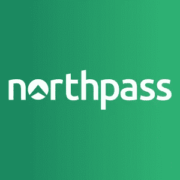

# 一个优秀的用户入职流程会创造出快乐的用户

> 原文：<https://medium.com/hackernoon/a-great-user-onboarding-process-flow-creates-happy-users-8e4e730aa627>

*成功的入职体验为您和您的用户之间建立愉快且有利可图的关系铺平了道路，这种关系有助于提高忠诚度和用户满意度。*

# 用户入职流程:提高用户满意度，减少流失

一次[成功的入职体验](https://elearningindustry.com/free-ebooks/scalable-workforce-onboarding-for-fast-growing-brands)为您和您的用户之间建立愉快且有利可图的关系铺平了道路——这种关系有助于提高忠诚度和用户满意度。

来自 KissMetrics 的 Zach Bulygo 将优化你的入职流程与青蛙过河游戏联系起来。青蛙过河的目的是安全地穿过繁忙的交通，到达街道的另一边。那么，这和你的入职流程到底是什么样的？嗯，Bulygo 认为你的新用户，青蛙，需要到街道的另一边(你的产品)，在那里可以实现预期的结果。你的挑战是创造这条通往成功的道路。

听起来很棘手？有了正确的[入职流程](https://elearningindustry.com/engage-demand-gen-optimize-user-journey-full-funnel-customer-education)，你就可以安全高效地把你的用户带到“彼岸”。

# 为什么需要制定用户入职流程

当你开始经历产品采用率低和/或异常高的流失率时，你就会知道是时候创建或分析你的用户[入职流程](https://www.northpass.com/blog/six-steps-to-an-effective-customer-onboarding-program?utm_campaign=elearningindustry.com&utm_source=%2Fuser-onboarding-process-flow-increases-user-satisfaction-decreases-churn-how-create&utm_medium=link)了。如果不解决这个问题，不断增加的流失率将会影响到你公司的每个部门。营销将不得不更加努力，花更多的钱来填补一个漏洞，销售将被迫争夺，你的支持组织将在门票上达到他们的眼球。

Punchlime 的人制作了一个很棒的幻灯片演示，名为《客户流失、客户成功和工具对 SaaS 业绩的影响》[1]。查看下面的数字，了解客户流失的微小减少会如何影响你的收入。

众所周知，糟糕的入职体验是流失的最常见原因之一。在这篇由 customer success pioneer[2]撰写的关于成功客户入职的精彩文章中，Lincoln Murphy 分享道:“当我与经历了大量[客户流失或不续约](https://www.northpass.com/blog/extending-customer-lifetime-value-ltv-with-customer-education)的企业、高接触 SaaS 公司交谈时，除了误导性销售行为之外，主要原因是客户入职流程。无论是首次实现价值的时间太长，体验是痛苦的，还是期望管理不当，这些流失的种子都可以追溯到入职。

虽然很明显[流失可以通过改进的入职流程来解决](https://elearningindustry.com/churn-is-too-high-can-fix)，但这不应该是我们在这一领域投资的唯一原因。墨菲说，我们应该关注用户的结果。

良好的入职培训可确保您的用户实现他们想要的结果。但是，如何创建良好的入职培训呢？第一步是规划出您现有的入职流程。

**相关阅读:** [8 种方式培训自动化帮你吸引、留住客户&](https://www.northpass.com/blog/8-ways-training-automation-helps-you-attract-onboard-retain-customers?utm_campaign=elearningindustry.com&utm_source=%2Fuser-onboarding-process-flow-increases-user-satisfaction-decreases-churn-how-create&utm_medium=link)

# 如何轻松规划和衡量您的入职流程

映射您现有的流程为您提供了一个优化的启动平台。有了现有的流程，您就可以开始使用适当的技术来跟踪和分析用户实际上是如何通过当前流程的。

## 绘图

对于这一步，我建议简单地使用谷歌幻灯片。这就是我们所使用的，它在概述流程方面非常棒。

清楚地规划你的内容开发方法将确保你团队中的每个人都完全精通内容生产的组织结构、格式和范围。或者，如果你独自处理这个项目，一个[大纲映射](https://www.northpass.com/beginners-guide-to-online-training/outline-your-first-course?utm_campaign=elearningindustry.com&utm_source=%2Fuser-onboarding-process-flow-increases-user-satisfaction-decreases-churn-how-create&utm_medium=link#step-content-2)将让你在创建内容时有条理并专注于目标和目的。

## 测量

一旦你绘制了你现有的流程，你就可以开始[收集一些基线路径和漏斗数据](https://www.northpass.com/beginners-guide-to-online-training/measure-the-success-of-your-program?utm_campaign=elearningindustry.com&utm_source=%2Fuser-onboarding-process-flow-increases-user-satisfaction-decreases-churn-how-create&utm_medium=link#step-content-5)。您将使用这些数据来了解人们是如何围绕您的应用程序移动的，以及他们是否真的按照您想要的方式移动。

对于这种类型的跟踪，你可以使用像[诺斯帕斯](https://www.northpass.com/?utm_campaign=elearningindustry.com&utm_source=%2Fuser-onboarding-process-flow-increases-user-satisfaction-decreases-churn-how-create&utm_medium=link)的 LMS。Northpass 拥有极其[强大的分析功能](https://www.northpass.com/platform/reporting?utm_campaign=elearningindustry.com&utm_source=%2Fuser-onboarding-process-flow-increases-user-satisfaction-decreases-churn-how-create&utm_medium=link)，可以简化事件跟踪，并对所需的少量前期工作提供深刻见解。

数据是推动每一项成功业务的客观支柱。它与每个部门的整合有助于团队取得成功，并有助于实现更高水平的收入目标。对于在线培训项目，数据自始至终都起着至关重要的作用。

上面的截图摘自文章“如何用 Kissmetrics 优化你的入职流程”[3]。它让你一瞥 Kissmetrics 提供了什么。你现在看到的是他们的漏斗报告。你的漏斗可以包括任何必要的事件。该工具为您提供了使用“点击跟踪”功能快速跟踪新事件的能力。

由于大多数 SaaS 公司将入职流程分解为几个步骤，他们可以使用漏斗报告来跟踪他们在哪里失去了大多数新用户。

# 从头开始构建入职流程

如果你还没有专门的资源投入到入职培训中，并且你的用户(到目前为止)已经把他们自己[引导到你的产品](https://elearningindustry.com/getting-started-customer-product-training)上，你将会想要战略性地处理整个过程。

## 预先定义成功

一个成功的用户入职流程让新用户[执行产品中的任务](https://elearningindustry.com/user-happiness-problem-5-steps-fix-under-month)，这些任务在历史上会导致长期使用。你会想看看你最老、最成功的客户，看看最初的几个关键任务是什么。

## 一些需要考虑的指标

*   前 30 天的活动天数
*   前 30 天上传的内容数量
*   前 30 天的销售收入(电子商务示例)

对于更多的入职过程测量的想法，我强烈建议查看陈楚翔的 Quora 对这个问题的回答，“你如何找到像脸书的‘10 天 7 个朋友’这样的见解来更快地发展你的产品？”[4].

我希望这篇文章让您觉得可以轻松地为您的产品创建和优化用户入职流程。

要查看真实入职流程的一些深入示例，请查看[快速增长品牌的可扩展员工入职培训](https://elearningindustry.com/free-ebooks/scalable-workforce-onboarding-for-fast-growing-brands)电子书，了解入职培训如何帮助您比以往更快、更高效、更具成本效益地招聘新员工。

**参考文献:**

1.  [黑仔·SaaS 指标:流失、客户成功和工具对 SaaS 绩效的影响— Punchlime 演示幻灯片—2014 年 1 月](https://www.slideshare.net/punchlime/killer-saa-s-metrics-punchlime-presentation-slides-january-2014?utm_campaign=elearningindustry.com&utm_source=%2Fuser-onboarding-process-flow-increases-user-satisfaction-decreases-churn-how-create&utm_medium=link)
2.  [成功的客户入职秘诀](https://sixteenventures.com/customer-onboarding?utm_campaign=elearningindustry.com&utm_source=%2Fuser-onboarding-process-flow-increases-user-satisfaction-decreases-churn-how-create&utm_medium=link)
3.  [如何使用 Kissmetrics 优化入职流程](https://blog.kissmetrics.com/onboarding-tools/?utm_campaign=elearningindustry.com&utm_source=%2Fuser-onboarding-process-flow-increases-user-satisfaction-decreases-churn-how-create&utm_medium=link)
4.  [我的 Quora 回答:你如何找到像脸书的“10 天 7 个朋友”这样的见解来更快地发展你的产品？](http://andrewchen.co/my-quora-answer-to-how-do-you-find-insights-like-facebooks-7-friends-in-10-days-to-grow-your-product-faster/?utm_campaign=elearningindustry.com&utm_source=%2Fuser-onboarding-process-flow-increases-user-satisfaction-decreases-churn-how-create&utm_medium=link)

[**北关**](https://www.northpass.com)

Northpass 是一个现代化、易于使用的学习管理系统，用于快速创建和提供品牌培训模块。由优步、Lyft 和 Airbnb 等快速增长的品牌使用— [Northpass 可以帮助您交付用户并提高产品使用率](https://www.northpass.com/customer-training)。

*原载于 2018 年 3 月 30 日*[*【elearningindustry.com*](https://elearningindustry.com/user-onboarding-process-flow-increases-user-satisfaction-decreases-churn-how-create)*。*