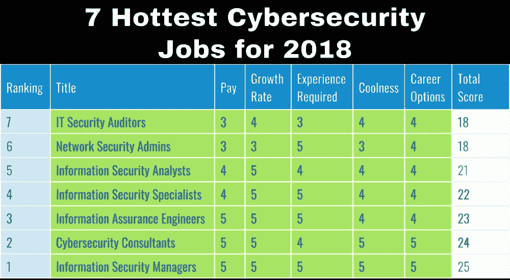

# 成为网络安全分析师指南

> 原文：<https://medium.com/hackernoon/a-guide-to-becoming-a-cyber-security-analyst-5b311be52f29>

网络安全分析师是专业人员，他们负责通过采用各种技术和流程来监控计算机网络，并确保适当的系统和安全措施到位，以保护个人和敏感信息和数据免受网络犯罪分子的侵害。它们保护网络、数据、程序和网站免受各种网络威胁，如恶意软件、拒绝服务攻击、黑客和病毒。

网络安全分析师的重点是预防网络攻击，而不是事后响应。它们的目的是对网络警报做出即时响应，在违规行为发生之前就将其扼杀在萌芽状态。因此，这些专业人员需要渗透测试和道德黑客等技术来验证安全系统的正常运行。

# 安全性分析的重要性

网络安全分析有助于防止攻击，让系统平稳运行，防止个人和重要信息被窃取，并降低与专有数据丢失相关的风险。

这种分析由网络安全分析师利用他们拥有的与数据库、网络、防火墙、硬件和加密相关的知识和专业技能进行。

# 所需技能

网络安全分析师需要的一些基本技能包括:

*   解决问题的技巧
*   思维的分析倾向
*   了解安全标准、政府和行业规则和法规以及网络空间中新出现的安全漏洞
*   能够识别风险并创建、测试和执行恢复计划和策略
*   防火墙安装和其他数据加密和安全软件方面的专业知识

# 教育准备/认证

要成为一名安全分析师，计算机科学、网络安全或相关领域的学士学位就可以了。

如今，除了学位和经验，雇主们还热衷于寻找拥有相关网络安全认证课程的专业人士。下面列出了一些提供网络安全分析专业知识的流行网络安全认证，并做了简要介绍:

*   **CEH** —认证道德黑客 [(CEH)认证](https://www.koenig-solutions.com/ceh-v10-certified-ethical-hacker-training-certification-course.aspx)验证你在道德和合法的黑客技术和技术方面的专业知识。培训课程或认证道德黑客培训计划让您了解黑客的技能，这样您就可以有相同的想法，并能够减轻和防御攻击。
*   **ECSA** —欧盟委员会认证安全分析师 [(ECSA)认证](https://www.koenig-solutions.com/ec-council-certified-system-analyst-ecsa-v10-training-certification.aspx)展示了您在应用合适的方法为组织或企业执行渗透测试方面的专业知识。ECSA 的考试是在获得 CEH 证书后进行的。ECSA 培训计划向候选人介绍了一套独特的方法，涵盖了各垂直行业的各种测试要求。
*   **CISSP**——认证信息系统安全专家 [(CISSP)认证](https://www.koenig-solutions.com/cissp-information-system-security-professional-certification-training-course.aspx)，由(ISC)2 提供，展示了专业人员在为组织规划、设计和管理安全基础设施或信息安全计划方面的专业知识。
*   **CompTIA CySA+** — CompTIA 网络安全分析师 [(CySA+)认证](https://www.koenig-solutions.com/comptia-cyber-security-analyst-cysa-plus-training-course.aspx)验证个人在检测、预防和应对网络安全威胁和弱点方面的技能。

# 工作机会和新兴趋势

没有人比现在更适合考虑和投资网络安全事业了。随着越来越重要的个人信息存储在网上，提高安全性变得越来越重要。

> *根据美国劳工统计局的数据，从 2016 年到 2026 年，信息安全分析师的就业机会预计将增长 28%，远高于所有职业的平均水平。*

网络安全分析师的大量工作机会来自各行各业，如银行、零售商、政府机构和组织。

# 安全分析师的职业道路如下:

*   安全架构师
*   安全工程师
*   安全经理
*   安全顾问
*   安全主管
*   CISO

**还有其他几个类似职位的职称，如:**

*   系统分析专家
*   高级分析师
*   应用系统分析员
*   商业系统分析师
*   系统分析员
*   数据库分析师

# 潜在工资

看看提供给网络安全分析师的薪水，你会非常相信这个职业能够给你带来光明的职业前景。根据 PayScale，网络安全分析师的平均工资为每年 75，974 美元，随着经验的增加，工资会大幅增加。

*原载于 2018 年 11 月 22 日*[*【blog.koenig-solutions.com】*](http://blog.koenig-solutions.com/2018/11/22/a-guide-to-becoming-a-cyber-security-analyst/)*。*