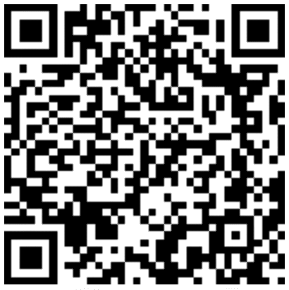

# 加密货币安全指南

> 原文：<https://medium.com/hackernoon/a-guide-to-cryptocurrency-security-8681552820c1>

加密货币压力已经够大了。遵循这个指南，以确保你辛苦赚来的硬币不会被黑客攻击。

如果我们所有的加密货币有一天没有归零，我们希望确保我们不会因为疏忽、恶意实体或两者的结合而失去它们。有一种错误的方法来保护你的加密货币，有一种正确的方法来保护你的加密货币。下面是正确的做法。*本文是为比特币写的，但原理也适用于其他加密货币。*

和我所有的帖子一样，我喜欢讲授相关的重要安全原则。在我们深入研究威胁和保护机制之前，我们将介绍您应该熟悉的一般原则。你不必学习比特和字节，但是大致的理解是很重要的。这篇文章的主要内容是非对称加密(也称为公钥/私钥加密)、数字签名和哈希。让我们快速回顾一下这些。

# 区块链的脊梁

## 公钥加密

顾名思义(“不对称”)，这里涉及两个*不同的*键。一个公钥和一个私钥。这些密钥用于不对称地加密和解密数据。如果用私钥加密数据，只能用公钥解密。相反，如果用公钥加密数据，只能用私钥解密。这是许多加密方案的基础，比如 [SSL/TLS](https://en.wikipedia.org/wiki/Transport_Layer_Security) 。有一条信息你可以放入这个世界，那就是你的公钥，还有一条你必须守护到死，那就是私钥。

## 散列法

消息的哈希(也称为摘要)是根据消息的内容计算出来的。散列由散列算法确定性地生成。散列算法的输入是任意长度的数据。输出是预定义长度的计算散列。因为它是“确定性的”**每次相同的输入都会提供相同的输出**。从数学上来说，从消息到散列是容易的，但是从给定的散列中确定原始消息在计算上是困难的。

让我们看一个例子。你可以把“敏捷的棕色狐狸跳过懒惰的狗”放入任何一个 [SHA256 哈希程序](https://passwordsgenerator.net/sha256-hash-generator/)中，你会得到“05 c 6 e 08 f 1d 9 Dafa 03147 fcb 8 f 82 f 12f 24 c 76 D2 f 70 e 3d 989 DC 8 aadb 5 e 7d 7450 bec”作为哈希。如果你改变了一件事，比如一个字母的大写，散列将会不同。这个很好算。试试看！然而，如果我给你一个随机的 SHA256 散列，比如“a 061622278d 26d 76 bbf 979566 f 56 f 075 c 483d 3473 be 8 a5d 73408d 0 eab DD 867 ad”，你将很难找出原始消息。**我们将向第一个评论原始消息的人免费发送** [**Trezor 加密钱包**](https://shop.trezor.io/?h=676f6f676c652e636f6d) **！**

## 数字签名

让我们把非对称加密和散列这两个概念放在一起理解数字签名。数字签名的目的是确认消息的完整性，并实施不可否认性。Integrity 允许您声明“收到的消息与创建的消息相同。”不可否认性允许您说“消息只能由特定的实体创建”。数字签名**不**保密信息！没有进一步的加密，数字签名的消息可以被全世界读取。数字签名只是用来确认消息的完整性，并确认是谁创建的。

数字签名是邮件的加密散列，它是使用私钥加密的。任何拥有相应公钥的人(例如全世界)都可以解密该数字签名。用公钥解密数字签名可以得到原始散列。任何可以阅读消息的人都可以独立地计算消息的散列值。他们可以将独立计算的散列与解密的散列进行比较，并确保散列是相同的。如果哈希匹配，他们就确认了消息在创建和接收之间没有被更改。他们还证实，只有拥有相应私钥的实体才能对消息进行数字签名。

所以，在我们把它应用到我们喜爱的货币(呃…证券)之前，先快速总结一下我们学到的东西。):

*   非对称加密依赖于私钥和公钥对。如果信息是用私钥加密的，则只能用相应的公钥解密。私钥不能解密用它自己加密的信息，反之亦然！公钥可以与全世界共享。**私钥必须得到保护。**
*   从消息中计算散列。如果消息被更改，它将产生不同的散列。计算消息的哈希值很容易，但是很难逆转这个过程并找到给定哈希值的消息。
*   数字签名是用私钥加密的哈希。具有相应公钥的任何人(例如整个世界)都可以解密该数字签名。他们可以将解密的散列(即数字签名)与独立计算的消息散列进行比较。如果散列是相同的，这证实了原始消息的完整性是完整的，并且消息是由实体用相应的私钥签名的。

# 应用于加密货币

## 加密复习者

Pfewww！现在这已经结束了，让我们把它应用到加密货币。如果你正在读这篇文章，你可能对分布式账本有所了解，俗称区块链。对于门外汉来说，分布式分类帐在多个系统中维护着自己的副本。它为给定系统中发生的所有事务创建一个分散的记录。使用加密货币，你实际上并不拥有或随身携带“硬币”。相反，区块链记录了你可以与系统内的其他实体进行多少加密货币交易。使用上述密码原理来确认交易。

Example BTC Public Address: 19U1nHDXkrbNSzCWTNiKHqLYsHwRHz18jQ

每个加密货币钱包，或加密钱包，实际上是一个或多个“钱包”的集合。从最纯粹的角度来看，“钱包”是一把私人钥匙。从私钥中，您可以创建公钥。通过公钥，您可以创建公共钱包地址。所以“加密钱包”是一组私钥。

你的钱包地址经常被转换成二维码，你可以很容易地与世界分享。这不需要保密。事实上，你可以把它发布到世界上(就像在你的博客上)，看看是否有人决定给你发送加密货币。你“拥有”任何发送到你钱包地址的加密货币。然后，您可以使用您的私钥交易您的加密货币。

要交易加密货币，您需要创建交易。这是公开信息。交易只是区块链移动加密货币所需的信息集合。我们关心的数据是目的地地址和金额。任何人都可以创建交易，但是交易只有在网络的多个成员确认的情况下才被区块链接受。除非交易有效，否则交易不会被确认，除非交易通过必要的私钥进行了数字签名，否则交易无效。所以，你用你的私钥签署一个交易。这个签名的事务被推送到区块链，一旦使用公钥数据确认，就成为区块链的一部分。

**所以你的私钥应该是一个被严密保护的秘密**。任何针对您的私钥的攻击本质上都是针对您的加密货币的攻击。攻击者想要使用您的私钥对从您的地址到她的地址的交易进行数字签名。或者，攻击者可能只是想通过破坏您的私钥来伤害您，消除对您的加密货币的访问。让我们保护我们的私人钥匙。

## 我们的风险来自哪里

我们知道我们在保护什么，加密货币。在我们讨论如何保护我们的加密货币之前，让我们先确定我们在保护谁；谁是我们具体的威胁参与者？第一个威胁是无法获得你的硬币。由于加密货币分类账没有一个中央机构，如果你失去了对钱包的访问权，就没有补救措施。您的钱包是一对公钥/私钥。如果你丢失了这个私人钥匙，你就丢失了你的钱包。如果你丢了钱包，你就失去了加密货币。你是你的第一个威胁。

下一类威胁是我们倾向于思考和在新闻中听到的威胁:机会主义攻击者、专门攻击者和民族国家。

机会主义攻击者看到你的 [coinbase](https://www.coinbase.com/) 钱包在你的笔记本电脑上打开，并向他们的公共钱包地址发起交易。机会主义攻击者不会专门攻击你，但是如果你让他们觉得容易，他们就不会拒绝一大笔钱。

专用攻击者的范围从单个攻击者到一起工作的攻击者群体。他们将关注单个目标，如大量加密货币的所有者、加密交易商或小型交易办公室。他们会进行研究，并经常通过[鱼叉式网络钓鱼活动](https://en.wikipedia.org/wiki/Phishing#Spear_phishing)发起攻击。其他专门的攻击者采取更广泛的方法，编写恶意软件，如果系统被感染，就会试图从系统中窃取私钥。

民族国家有庞大的、协调的、得到良好资助的攻击者团体。他们的动机是金融、间谍或两者的结合。Proofpoint 对来自 Lazarus Group 的加密货币攻击进行了精彩的报道，Lazarus Group 是一个由朝鲜发起的高级持续威胁。

根据你的威胁是谁——根据你控制的加密货币数量和你一天的交易数量——会有不同的风险缓解步骤。

# 保护你自己

## 来自你自己

如果你想失去所有的加密货币，只需扔掉所有的访问密钥。这可能看起来像是将您自己锁定在网络钱包之外，并且无法访问您的网络钱包的密码重置电子邮件地址。或者看起来像是损坏了你的私人密钥的纸质副本。你正在读这篇文章，所以你可能是一个积极主动的思考者。以下是更多的提示:

*   设置新的托管钱包(如 coinbase)时，请经历忘记密码或丢失多因素令牌的过程。确保在没有太多危险的时候你可以恢复。
*   如果你有自己的私人钥匙，你应该做一份纸质备份，并把它们存放在个人保险箱或银行的保险箱里。生成纸质备份时，使用 USB 线直接打印到打印机。重启以擦除打印机内存。一些专家建议不要打印，完全依靠手写的“纸钱包”备份。(打印机可以存储打印任务，然后可能被黑客攻击)。
*   不要将备份的钥匙存放在与日常使用的钥匙相同的位置。由于火灾、盗窃等原因，你有可能同时失去这两样东西。
*   如果您使用多签名(multisig)钱包，即需要两个或更多私钥/公钥对来授权交易钱包，请采取备份预防措施。如果您在“2-of-2”设置中控制两个私钥(两个密钥，两个都是签署交易所必需的)，那么请确保两个备份分开存储，存放在远离您日常使用的密钥的位置。如果您使用“2-of-2”设置，但密钥由两个人分享，请考虑转到“2-of-3”设置(需要三个密钥中的两个)，其中第三个密钥由可信任的第三方控制。这将允许您在第二个人不可用或丧失能力时进行恢复。

## 机会主义攻击者

如果你是一个普通的加密货币交易者，你的威胁可能没有那么复杂。你需要采取简单的措施来保护自己。首先，考虑您需要保护的主要帐户。这可能不是你的 coinbase 钱包，或其他在线钱包帐户。这可能是你的电子邮件。您的电子邮件用于授权新设备、重置密码和确认交易。您的电子邮件是机会主义攻击者的圣杯。把它锁起来，让攻击者看别的地方。

*   查看我们在[谷歌高级保护](/revissolutions/an-introduction-to-google-advanced-protection-90de57d61fc0)上的帖子，锁定你的 GMail，或者至少为你的电子邮件启用基于应用程序或基于硬件的多因素保护。
*   接下来，为您的在线钱包启用多重身份认证。

## 专注的攻击者

如果你正在积极交易大量的加密货币，你需要注意专门的攻击者。专门的攻击者会研究你并发起个性化的攻击。如果您的数据在[以前的入侵](https://haveibeenpwned.com/)中受损，他们会试图对您进行网络钓鱼，并重复使用找到的凭证。你需要练习深度防守。

*   尽一切努力阻止机会主义攻击者，然后再进一步。
*   查看我们的[对科技创业公司的建议](/revissolutions/the-startup-security-checklist-e698fc9bdb34)。许多将适用于你。
*   如果可能，避免使用 web 客户端。如果你打算使用一个[网络客户端](https://bitcoin.org/en/wallets/web/)，考虑使用一个能让你完全控制你的货币的客户端。coinbase 等应用程序维护着“托管钱包”。这意味着你实际上没有对钱包的要求权(例如，可转移的私有/公共密钥对)；您在 coinbase 中保持一个余额，这允许您使用从 coinbase 控制的钱包发送的资金。
*   强烈建议使用桌面客户端。桌面客户端可以让你控制你的按键。
*   强烈建议使用[硬件客户端](https://bitcoin.org/en/wallets/hardware/)来维护您的私钥。这将防止私钥数据接触到连接到互联网的系统。将硬件客户端与连接互联网的桌面客户端相结合，以平衡安全性和便利性。桌面客户端生成事务，硬件客户端签署事务，桌面客户端将事务传输到网络。
*   如果您认为您的威胁是复杂的，那么创建需要两个或更多的私钥/公钥对来授权交易的 multisig 钱包。您的桌面客户端可以维护一个密钥，而硬件客户端可以维护另一个密钥。这意味着，如果您的硬件密钥被盗并解锁，攻击者无法在没有桌面客户端密钥的情况下授权加密货币交易。此外，如果恶意软件感染了您托管桌面客户端的系统，它将无法在没有 multisig wallet 的情况下授权交易。*分别与每个私钥相关联的任何非 multisig 钱包仍然容易受到所描述的攻击。*

## 高度敬业，资金充足，国家资助的威胁行为者

*   首先，你不应该只参考博客文章。你应该雇佣能够了解你的独特环境并提供定制建议的专业人士。
*   遵循上述所有步骤(锁定你的电子邮件帐户，遵循一般网络卫生，等等。)然后继续加强你的安全。
*   根据您控制的加密货币的数量，您可能需要担心您的人身和设备的物理安全。我们不能在博客中对此提出建议。
*   你应该在气隙系统中使用真正的“冷藏”。**考虑使用 multisig 钱包，离线签署交易**。你可以和[银殿](https://bitcoin.org/en/wallets/desktop/windows/electrum/)和[军械库](https://bitcoin.org/en/wallets/desktop/windows/armory/)这样的客户做。您将在“空气间隙”(或“离线”)系统上安装软件，该系统与任何信号传输介质(如 Wifi、蓝牙或以太网)断开连接。您将在一个“在线”系统(一个互联网连接系统)上以“仅观看”模式安装另一个副本。在线系统将生成未签名的交易，USB 将交易传送到空中有隙系统，空中有隙系统将使用多个私钥对交易进行签名，USB 将已签名的交易传送回在线系统，在线系统将向网络传输 multisig 已签名的交易。一些桌面客户端甚至支持维护硬件钱包中的私钥。

## 寻找平衡

投资加密货币现在很热门。偷加密货币一样火。威胁行为者利用了公众对加密货币底层技术原理的有限了解。阅读这篇文章是让天平向你的方向倾斜的第一步。这些是最佳实践，您的个人用例将决定什么是实际可行的。

如果你是一个活跃的交易者，你可能没有时间做完整的 multisig 冷藏。但是，您可能不希望在连接互联网的个人笔记本电脑上保存价值数十万美元的加密货币的私钥。你必须找到一个适合你的平衡点。最有可能的设置是组合。你将在网络或桌面钱包中保留少量的操作资金，并将较大部分转移到冷存储中。无论你选择什么，批判性地思考你的威胁，确保**你**不是你的加密货币突然消失的原因。因为当他们走了，他们就走了。

*感谢*[*Elpsy*](https://medium.com/u/bfd8ba0d0213?source=post_page-----8681552820c1--------------------------------)*对本文的帮助。如果您有任何问题或意见，请在下面留下。如果你觉得它有帮助，请鼓掌并订阅。*

*这是一篇来自* [*以赛亚·萨尔朱*](https://medium.com/u/c9fabda04fb1?source=post_page-----8681552820c1--------------------------------)*[*Revis solution*](https://www.revissolutions.com/)*的帖子。如果你喜欢这篇文章，一定要鼓掌，看看他在* [*Revis Solutions 博客*](https://medium.com/revissolutions) *上的其他文章，并在 Twitter 上关注*[*@ isaiahsarju*](https://twitter.com/isaiahsarju)*[*@ Revis solution*](https://twitter.com/revissolution)**