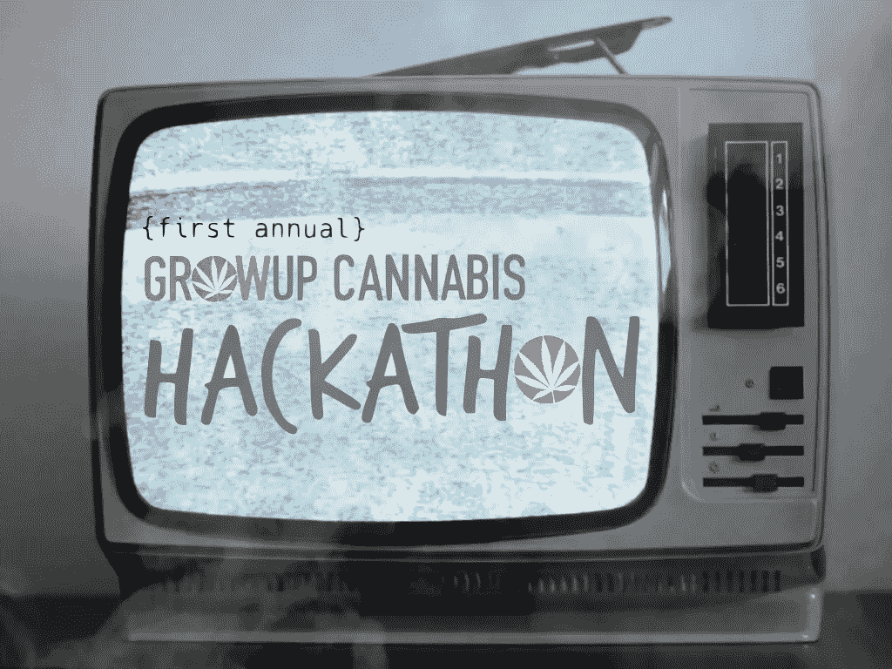

# 关于大麻的黑客会议？GrowUp 的第一届年度大麻黑客马拉松即将到来！

> 原文：<https://medium.com/hackernoon/a-hacking-session-on-marijuana-growups-first-annual-cannabis-hackathon-is-fast-approaching-f27c73a44870>

The first-ever GrowUp Cannabis Hackathon will take place Sept. 6–7, where hackers will build innovative tech solutions to the fast-growing cannabis industry.

9 月 6 日对所有大麻冠军、大麻成员和毒品黑客来说将是一个难以置信的时刻。这将是一个黑客能够为…大麻建立创新技术解决方案的时代？

没错！[大麻会议&博览会](https://growupconference.com/)正在举办首届 [24 小时大麻黑客马拉松](https://www.eventbrite.com/e/growup-cannabis-hackathon-tickets-46424138849)！相互竞争的黑客将探索跟踪、购买、报告、菌株识别、验证、与娱乐行业整合等想法。

Competitors will explore ideas for tracking, strain identification, and more.

黑客马拉松将以 24 小时的创新工作、头脑风暴、辩论、友情和乐趣为特色。这场比赛将有相互竞争的编码员、设计师和工程师探索跟踪、购买、报告、菌株识别、验证、与娱乐行业整合等想法。你甚至可以在这里查看活动[的官方预告。](https://youtu.be/eymWgr1fjqI)

如果你知道这个行业有什么好的，那么你会发现我们确定的合作伙伴包括**[**HERB**](https://herb.co/)[**Merry Jane**](https://merryjane.com/)[**hot box**](https://hotboxshop.ca/)[**叶向前**](https://leafforward.org/)[**大麻& Tech Today**](https://cannatechtoday.com/) 和【**

**黑客马拉松将由大麻行业的几位知名人士来评判，包括**杰伊·罗森茨威格**([罗森茨威格&公司](https://www.rosenzweigco.com/)的董事总经理)；**亚历克斯·布卢门斯坦**([Leaf Forward](https://leafforward.org/)的联合创始人，加拿大第一家大麻商业加速器)；**雷切尔·科利奇**([Pure Global 大麻公司](https://pureglobal.com/)的品牌战略&公关副总裁)和**马特·沙霍布**所有这些都在价值超过 300 亿美元的大麻产业中得到了认可。正如[视频](https://youtu.be/eymWgr1fjqI)中提到的，“我们的评委将选出进入决赛的队伍，他们将登上配有 Tourbuds 的 Canabus”，这本身就是一种奖励！******

**Go to [www.growuphackathon.com](http://www.growuphackathon.com) to register!**

**同样,《黑客正午》很自豪地报道了这次活动，展示了黑客方面无可挑剔的才华！我们将从比赛开始一直报道到比赛结束，直到我们找出获胜的队伍。如果你知道你可以改变大麻产业，[在这里注册](https://www.eventbrite.com/e/growup-cannabis-hackathon-tickets-46424138849)成为一个巨大机会的一部分。**

**因此，对于所有得到印章的黑客来说，确保你在活动售罄之前迅速注册！你还在等什么？*滚打包，滚黑客！***