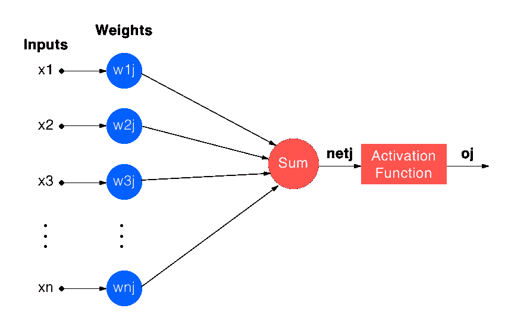

# 神经网络实践介绍

> 原文：<https://medium.com/hackernoon/a-hands-on-introduction-to-neural-networks-6a03afb468b1>

## **在 Python 中从头开始实现单个神经元**


在过去的十年里，人工智能(AI)已经牢牢地站在了公众的聚光灯下，这在很大程度上归功于[机器学习](https://hackernoon.com/tagged/machine-learning) (ML)和人工神经网络(ann)的进步。

但是，伴随着有前途的新技术而来的是一大堆的嗡嗡声，现在这个领域里有着铺天盖地的噪音。这就是为什么我认为回归基础是有用的，实际上**使用 Python 从零开始实现单个神经元**。

## 人工神经元

在我们开始之前，我首先想快速地讨论一下什么是神经元*和*。人工智能的早期支持者注意到，生物神经元能够从大量数据中概念化和学习，并假设在机器中模拟这种神经元可能允许类似的能力。为此，神经元被抽象成一个输入、输出和权重的模型。



Figure 1: Simple neuron model.

在机器学习术语中，神经元的每个输入(x1，x2，… xn)被称为一个**特征**，每个特征都用一个数字加权，以表示该输入的强度(w1j，w2j，… wnj)。输入的加权和(netj)然后通过一个**激活函数**、**、**，其一般目的是通过根据一个公式将加权和转换成一个新的数来模拟一个生物神经元的“放电率”。尽管我们现在还不需要深入激活函数的机制，这里有一些由 Avinash Sharma V 撰写的[阅读材料。](/the-theory-of-everything/understanding-activation-functions-in-neural-networks-9491262884e0)

因此，如果这就是一个神经元*如何工作*，让我们看看它*如何学习*。简单来说，**训练**一个神经元指的是迭代地更新与它的每个输入相关联的权重，以便它能够逐步逼近它所获得的数据集中的潜在关系。一旦经过适当的训练，一个神经元可以用来做一些事情，比如正确地将全新的样本——比如说，猫和狗的图像——分类到不同的桶中，就像人一样。在机器学习术语中，这被称为**分类**。

## 培养

为了训练一个简单的分类器，让我们使用公开可用的 [sklearn 乳腺癌数据集](http://scikit-learn.org/stable/modules/generated/sklearn.datasets.load_breast_cancer.html)，它具有以下属性:

```
+---------------+-----+
| Classes       |   2 |
+---------------+-----+
| Num Samples   | 569 |
+---------------+-----+
| Num Benign    | 357 |
+---------------+-----+
| Num Malignant | 212 |
+---------------+-----+
```

数据集中的每个样本都是一个乳房肿块的图像，该图像已被转换为一组 30 个数字(特征)。使用一部分样本来训练我们的神经元，我们将会看到它是否能够将乳腺肿块中*看不见的*部分归类为恶性或良性。换句话说，我们需要执行一个**监督的**学习任务，使用明确标记的数据点作为神经元学习相关模式的老师。

要运行并修改下面的代码，请查看这里的脚本:[单层感知器. py](https://github.com/dguliani/neural-network-tutorials/blob/master/single-layer-perceptron.py)

首先，我们加载数据集，随机将恶性和良性样本混在一起，同时保持每个样本都有标签。这是因为我们不希望我们的神经元根据它看到的样本的顺序得出结论——只根据每个样本的特征。

为了训练我们的神经元，我们基本上需要做三件事:

> 1.让神经元对样本进行分类。
> 2。根据预测的错误程度更新神经元的权重。
> 3。重复一遍。

由于神经元本质上只是权重的集合，我们可以使用 Python 的矩阵操作包 [numpy](http://www.numpy.org/) 来随机初始化权重向量。初始化的权重数量对应于神经元的特征(输入)数量，因为每个特征在被求和之前被加权。激活是静态功能，因此不需要软件中的特定表示。

## **向前传球**

在训练的第一步，我们要求神经元对训练样本进行预测。这就是所谓的**正向传递**，它包括对输入特征进行加权求和，并通过激活函数传递该和。

*上面代码片段中的 l0* 是一个形状为(n_samples * n_features)的特征矩阵。代表我们单个神经元的权重的形状为(n_features * 1)。因此，这两个矩阵之间的矩阵乘法将为每个样本提供所有特征的加权和。(如果你用手试一下，你会发现这并不像听起来那么复杂。)

当通过激活函数时，这些加权和将有效地成为每个训练样本的类别预测。

## Sigmoid 函数

**sigmoid** 函数是逻辑函数的一个特例，这里选择它作为我们的激活函数有几个原因:它是**易微分的**、**非线性的**和**有界的**，其形状和定义如下:


Figure 2: Sigmoid function shape.


Figure 3: Sigmoid function definition.

该函数用一行代码实现，如下所示:

方便的是，一个标准的逻辑函数有一个[容易计算的导数](https://en.wikipedia.org/wiki/Logistic_function)的形式


Figure 4: Derivative of a Sigmoid Function

其中 f(x)代表逻辑函数。正如我们将很快看到的，当试图最小化我们神经元预测的误差时，这个特性是非常有用的。

sigmoid 函数的导数实现如下:

## **梯度下降**

现在有趣(也棘手)的部分来了——实际上让我们的神经元学习数据集中的潜在关系。现在，我们已经对每个训练样本进行了有界预测，我们可以计算这些预测中的**误差** / **损失**，并更新与该误差成比例的神经元权重。

我们将使用[梯度下降优化算法](https://en.wikipedia.org/wiki/Gradient_descent)进行权重更新。为了使用这种算法，我们需要一个误差函数来表示我们神经元的预测和真实情况之间的差距。该误差函数被定义为均方误差的缩放版本(缩放使得微分变得容易)。


Figure 5: Mean-squared-error function.

在代码中，该均方误差函数实现如下:

在数学中，梯度是依赖于多个变量的函数的导数向量。回想一下，矢量既有大小也有方向。我们的神经元的错误依赖于输入它的所有权重。所以，梯度是误差相对于每个权重的偏导数的集合。

作为向量，梯度指向函数最大增长率的方向。因此，向梯度的相反方向移动会使函数最小化。如果我们能够计算我们的神经元的误差函数相对于它的每个权重的梯度，我们可以成比例地更新权重以最小化误差。把误差函数想象成一个有脊和谷的表面。通过与梯度相反的下降，我们进入了误差较低的山谷。

下面是使用链式法则对误差函数的梯度的简单推导。更严谨的推导可以在这里找到[。](https://en.wikipedia.org/wiki/Backpropagation)


Figure 6: Partial derivative of error with respect to each neuron weight.

这里， **E** 是误差函数， **wij** 是一个特定的权重， **oj** 是神经元的输出， **netj** 是神经元输入的加权和。索引 **i** 和 **j** 分别对应于权重和神经元。我们将分别计算偏导数的每个因子。

第一个因素很简单，是误差相对于神经元输出的导数:


Figure 7: Derivative of output error with respect to neuron output.

第二个因素也很简单，是我们在图 4 中描述的 sigmoid 函数的导数。


Figure 8: Derivative of neuron output with respect to the weighted sum.

第三个也是最后一个因素简化为等于特定神经元的输入。


Figure 9: Partial derivative of the weighted sum of inputs with respect to each weight.

在图 9 中， **oi** 是该神经元的输入向量，在我们的例子中是来自我们训练集的特征。

## 权重更新规则

将我们刚刚看到的偏导数与下降联系在一起，为我们提供了更新代表神经元的权重的规则:


Figure 10: Weight update rule.

图 10 显示每个权重将在梯度的负方向上更新，与附加项 **n** 成比例。比例因子 n 决定了我们在更新神经元权重时的步长，有效地控制了神经元的学习速率。我们称之为**学习率**。

## 实施权重更新

下面是我们的单个神经元的梯度计算和权重更新的实现。您可以按照注释找到权重更新规则所需的导数的每一步。

在训练神经网络时，相同的训练数据通过[网络](https://hackernoon.com/tagged/network)运行多次，每次完整的通过被称为一个**时期**。( [SAGAR SHARMA](https://medium.com/u/165370addbb5?source=post_page-----6a03afb468b1--------------------------------) 在这篇文章中很好地解释了为什么我们在神经网络中多次使用相同的数据。)随着每个时期，权重进一步更新以尝试降低误差。对于我们的简单例子，通过反复试验选择历元数和学习速率，观察 mse 损失减少和收敛。

## 结果


Figure 11: Training results.

图 11 显示，在数百个时期内，训练和测试数据集的损失减少，准确性增加。接下来，我们通过在同一数据集上训练 10 个不同的随机初始化的神经元来检查这个训练过程是否是可重复的。在 10 次训练运行结束时，平均测试准确率为 90.49% (s=2.40%)，平均总准确率为 90.33% (s=0.304%)。

如果我们看到训练和测试准确性的巨大差异，或者如果测试损失增加而训练损失减少，我们就有理由相信神经元没有学习隐藏在数据集中的模式。虽然这种验证水平还不足以将该神经元投入生产环境，但有迹象表明该神经元已经在数据集中学习了一种模式。

## 结论

我们在这里研究了人工神经网络的最简单形式，即一个由梯度下降驱动的单个神经元。网络可以由许多神经元或其他可训练的过滤器/单元组成，并根据其目的使用各种损失和激活函数。所有这些扩展允许人工神经网络执行广泛的任务，如对象检测、语言翻译、时间序列预测等。

在我们的下一篇文章中，我们将探索单个神经元的局限性，并通过神经元链或**层**更深入地挖掘错误流。通过神经网络的反向误差流允许一组神经元一起收敛于一个解决方案。因此，我们将能够通过我们的神经网络传递更大、更复杂的数据集。

## 作者的评论

我想对 [Eli Burnstein](https://medium.com/u/eca9f7f76ad2?source=post_page-----6a03afb468b1--------------------------------) 、 [William Wen](https://medium.com/u/96feba698dee?source=post_page-----6a03afb468b1--------------------------------) 、 [Guy Tonye](https://medium.com/u/11382a5b2c64?source=post_page-----6a03afb468b1--------------------------------) 和 [Thomas Aston](https://medium.com/u/1d1995e6d926?source=post_page-----6a03afb468b1--------------------------------) 在多次修改中帮助校对和编辑这篇文章表示衷心的感谢。

像往常一样，留下评论并指出你在这里发现的任何错误。我会尽快修复它们！

## 脚注

1.  感知机，一种感知和识别的自动机器，作者弗兰克·罗森布拉特。
2.  在我们非常简单的例子中，我们将权重集中在平均值 0 附近。然而，对于较大的模型，有更好的方法来初始化权重。[这里](https://towardsdatascience.com/deep-learning-best-practices-1-weight-initialization-14e5c0295b94)是 [Neerja Doshi](https://medium.com/u/3dff2ff1664?source=post_page-----6a03afb468b1--------------------------------) 对权重初始化最佳实践的精彩介绍。

*Dhruv 是* [*互联实验室*](https://medium.com/u/37b22d8cbc82?source=post_page-----6a03afb468b1--------------------------------) *的人工智能软件工程师，这是一家产品开发公司，与客户合作，通过软件驱动的产品来推动影响。*[*www.connectedlab.com*](http://www.connectedlab.com)