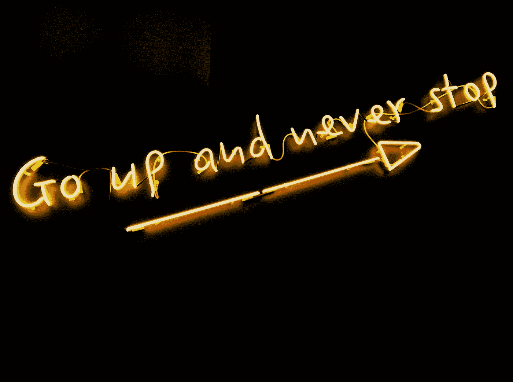
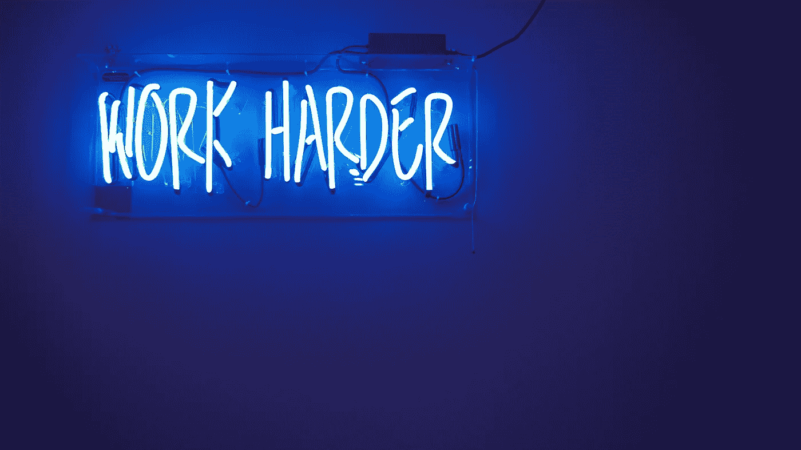
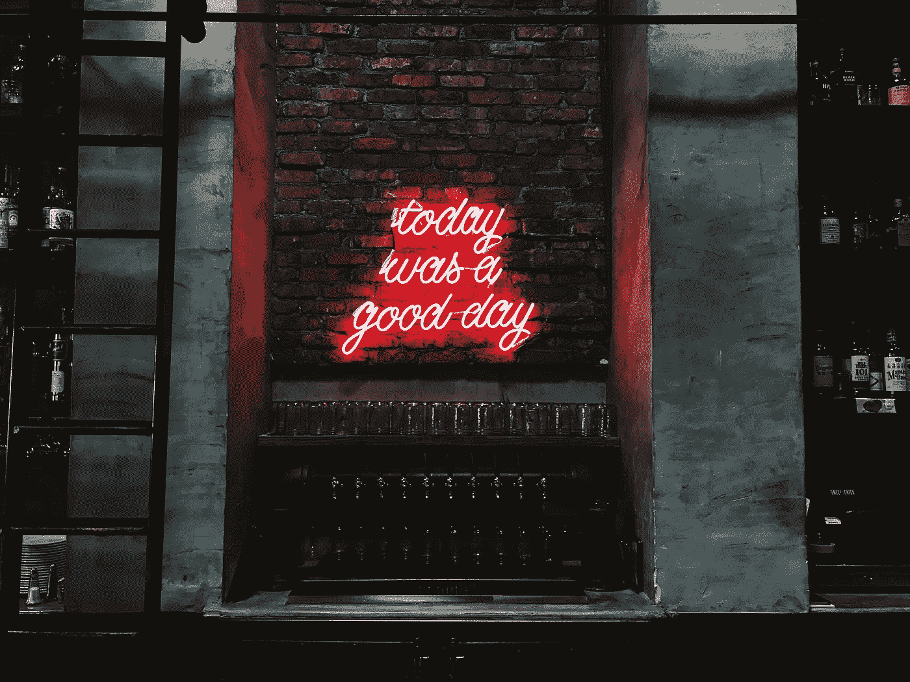

# 这是一本关于成功创业的非常有偏见的轶事指南

> 原文：<https://medium.com/hackernoon/a-highly-biased-and-anecdotal-guide-to-founding-a-successful-startup-64ca9f6f9a69>

Rikki Chan via Unsplash

成为创始人是一次真正疯狂的经历。尤其是当你在一家快速成长的早期科技公司的泡沫中，对生活感到陌生的时候。当我和我的共同创始人开始风险复制的时候，我已经建立了两家公司，并做了几年的设计师和程序员。但这是一只不同的野兽。我们潜入三藩市[初创企业](https://hackernoon.com/tagged/startup)场景的中心，带着我们能控制的最大水花着陆。

我想我们做了一些正确的事情，因为在第一年年底[退出](http://www.coupa.com/newsworthy/press-releases/coupa-aquires-riskopy/)之前，我们构建、推出并经历了几十次迭代(和一次相当大的转向)。老实说，我在那一年学到的东西比我职业生涯其余时间学到的加起来还多。我们是这样实现的。

我从自己的经历中学到了这些教训。我相信很多人对 startupland 相当普遍。(尽管 B2B 公司比 B2C 公司多一些。)其他人则完全违背传统的创业智慧。我不代表所有人。这太棒了。如果你的想法非常怪异和与众不同，你可以把一切都扔出窗外。无论如何，这是建造新的令人兴奋的东西的最好的一点。

Ash Edmonds via Unsplash

# 我们建造的东西

简而言之，Riskopy 是金融提供商的机器学习工具。它汇总了数百万家企业的数据，并将其放在上下文中，以帮助我们的用户监控其客户的投资组合的风险和机会。

> “快失败。”–每个喜欢陈词滥调的技术人员

我们独特的情况带来了好处和挑战。这三位创始人都有过创业经历，尽管是在不同的领域和不同的商业背景下。幸运的是，我们丝毫不认为这意味着我们知道会发生什么。但是我们可以脚踏实地地学习，坚持不懈地工作，并快速执行。这让我们为接下来的事情做好了准备。我们也不怕尝试和犯错误，或者像每个喜欢陈词滥调的技术人员所说的那样“失败得很快”。因此，当某些东西不起作用时，我们可以在几乎没有伤害的情况下继续前进。

Fab Lentz via Unsplash

# 什么奏效了

## **一直在说话**

敬所有人！不要歧视，不要势利眼。你永远不知道谁能帮助你，或者你能帮助谁。谈论你正在做什么，你能帮助什么，这就是入口。尽你所能支持你周围的人会有百倍的回报。商誉是一种强大的货币。这听起来像是唯利是图吗？确实是。但是只有当你友善和支持，而不是虚伪和贪婪时，它才会真正起作用。

你所帮助的人会为你传福音。或者他们会向他们在 Lyftbnb 做 DevOps 的堂兄 Ted 提到你的公司，因为你的软件听起来就像是他的团队热衷于试验的那种软件，他们会给你发介绍。这就是所有事情的开始，听起来很疯狂。

## 创始团队技能的正确组合

下面的能力组合对我们非常有效。我想不出还有哪个创始团队是这个样子的，很可惜。

*   **首席执行官/首席技术官** — Ahmad 讲述了与我们的知识库以及我们的业务发展有关的所有事情。他受过数据科学家的培训，有金融背景。他给团队带来了领域专业知识，并编写了后端代码。更不用说，他对所有艰难的决定都有最终决定权。(大多数团队应该在两个人之间分配。艾哈迈德是一个超级英雄。)
*   **所有的东西设计(UX、用户界面和产品)/前端开发**——我涵盖了与 Riskopy 的外观和感觉有关的所有东西。我的任务是尽可能深入我们潜在用户的大脑。随着我在我们的领域越来越得心应手，Ahmad 可以把更高层次的产品决策交给我。
*   **营销、销售和外联**——迈克报道了与吸引我们更多眼球有关的任何事情。

我们共享一种高度共生的关系，并且总是相互依赖来完成我们的工作。当你有可以信任的共同创始人时，这种方式非常有效。我们三个人可以取得惊人的成就。

同样值得一提的是:这个团队包括一名中东男子和一名美国女子(我们在十个不同的国家生活过),外加一名 15 岁的英国父亲，他是三个孩子的父亲。我们的多样性是宝贵的。

> "杀了你的宝贝们"–每个喜欢陈词滥调的作家

## 不要依恋

你的第一个想法可能很糟糕。很抱歉必须由我来告诉你这件事。幸运的是，这里面有一两个闪光点。你的工作是剥去所有多余的东西，找到金块，然后从那里重建。所以请不要太在意。你的情绪只会让你留在这里。

沿着这条线，也可能会有这样一个时刻，当你倾注了你的生命去建造一些惊人的东西，它刚刚开始也许可能开始有回报，一家大公司敲你的门，提出收购你。你不会想卖的。你会觉得自己站在世界之巅，并且希望这种感觉永远持续下去。*销售感觉就像辞职。喜欢失败而不是成功。但是如果你把你的感情排除在外，这也可能是一个削减你的奖金的好时机。我不知道对你来说什么是对什么是错，但是如果那个时候来了，试着客观一点。

## 我们很幸运

由于一个会计错误，我们为我们的共同工作空间支付了我们应该支付的一小部分，但似乎没有人介意。我的老朋友的男朋友碰巧是我们最想联系的一家公司的早期员工。当“金融科技”成为湾区最热门的词汇时，我们有了一个有用的想法。我们有足够的资源在旧金山生活，我们的工资仅够支付房租和小吃。我的共同创始人在特朗普的穆斯林禁令生效前一周拿到了签证。所以。很多。是。下去。敬。运气。

Jordan Whitfield via Unsplash

# 什么没起作用

## 美学设计困扰

除非你正在为挑剔的千禧一代打造一款 B2C 产品(👋嗨，我是你的女孩！)——你必须把所有关于品牌、个性和漂亮视觉效果的想法都拿出来。如果那不是你真正想要的，那就是分心，分心是浪费时间，你现在负担不起。作为一名设计师，我知道每天花 15 个小时盯着一个平淡无奇的屏幕有多痛苦，而你就是那个让它变成那样的人。但是你必须把你的自负从游戏中拿出来。(注意到主题了吗？)把你的设计精力集中在唯一重要的东西上:你的用户。除非你非常了解你的用户，否则任何超出准系统的界面都是浪费。这让我想到…

## 传统用户研究

当还没有人使用这个产品时，你必须利用你现有的东西。我依赖于对感兴趣的潜在用户的采访。我发现这些公司的产品经理是最有收获的谈话对象。给他们演示一下产品，看看他们的反应。或者更好的是，给他们最少的背景，让他们自己玩。看看他们是如何处理的，会出现什么问题。但是要小心，因为当某人不是利益相关者时，你不能对他的反馈给予同样的重视。

## 内容营销

你的里程可能会有所不同，但这需要一些奇迹般的有价值的内容来吸引任何类型的持续关注。我最喜欢的例子是[un splash 的故事](https://crew.co/blog/how-side-projects-saved-our-startup/)。它是如此的有用，现在它已经是一家成功的公司了。

## 我们运气不好

时机再糟糕不过了。我们试图在年底达成交易，那时每个企业都试图整齐地结束账目。我得了支气管炎，不得不离开球队几天，在一个关键的关键时刻躺在床上看《西部世界》。你投入工作，做好每一件事，然而……**如此。很多。是。下去。敬。运气。**

Lauren Peng via Unsplash

# 告诫的话

## 不要完全放弃自我保健

我们在旧金山逗留期间，在我们一大早打电话去欧洲和中东，以及我们在市里的晨会之间，我大部分时间都在戴维森山顶徒步旅行。那是因为大自然是我快乐的地方。尊重你快乐的地方。那是支撑你的东西。

## 只有在完全合适的情况下才加入加速器

如果你有机会加入的话，这似乎是一个千载难逢的机会。但是你为了公司的未来做出了巨大的牺牲。你的时间、精力和公司股权岌岌可危，而这些资源是有限而宝贵的。他们会教你什么？他们会把你和谁联系起来？校友们的成绩如何？如果这些人不是你需要的人，毫无疑问，你应该通过。从外面看，风险投资似乎是一个充满金钱的大球场。但这不是一件轻而易举的事。如果可以的话，总是引导你的生意。科技行业会让你羞于采用这种方法。不要听。(比我好的人已经写了为什么。)

## 没人关心你的技术堆栈

…超出了安全和(大部分)有效的范围。围绕你的编程语言来修正你的思维模式还为时过早，而且无论如何它都将被重写，所以保持开放和不可知论的态度。这也适用于设计系统。你还不需要。

## 也没人关心你的想法

所以不要护着。看在上帝的份上，不要因为扔 NDA 而让自己难堪。分享你正在做的事情，公开你的想法和目标。更好的是，建立一些有用的东西。人们甚至会开始关心。

Patrick Tomasso via Unsplash

# 的鼓励话语

## 人们比你想象的更支持你

…主要是因为他们对你好也没什么损失，你永远不知道谁是下一个 Lyftbnb。但是如果你以积极的态度去面对每一次遭遇，对你一路上遇到的人给予慷慨和支持，它会以各种方式回来。(谢谢，宇宙！)

## 你可以比你想象的更努力

我一直认为工作与生活的平衡是神圣的。成为一名创始人就无限期地抛弃这一点是令人畏惧的。我不确定我能应付得来。但我做到了，结果证明投入工作是最容易的部分。我有两个不可思议的联合创始人，他们完全支持我。我们一起创造了一些有趣和有用的东西。这是一份你可以充满激情并深感自豪的工作。老实说，让它占据我一年的生活是一种快乐和荣幸。

## 你能做到的！

当你刚开始时，你可能会紧张、困惑和充满疑问。(如果你没有，我希望你至少有一点自我反省。但是如果你有一个问题要解决，并且头脑清醒，你就有了解决问题的基础。

## 👋我是莎拉——一名设计师、创客、前创始人、远程工作者、全方位的 pixel 人。如果你想聊天，请在推特上或评论中联系我！💙