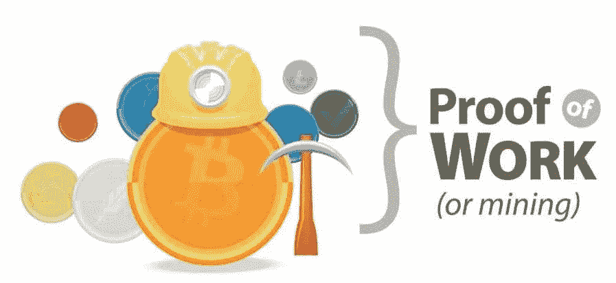
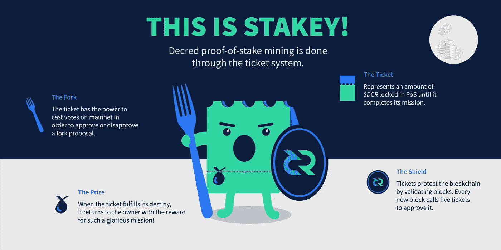
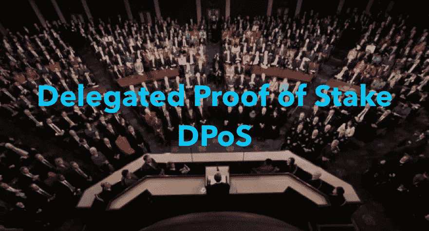
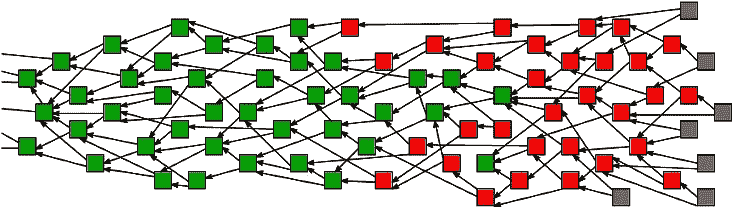

# 共识算法的搭便车指南

> 原文：<https://medium.com/hackernoon/a-hitchhikers-guide-to-consensus-algorithms-d81aae3eb0e3>

## 加密货币共识类型的快速分类

不要惊慌。每个伟大的加密货币背后，都有一个伟大的共识算法。没有一致的算法是完美的，但它们各有所长。在密码领域，共识算法的存在是为了防止*重复花费*。以下是迄今为止一些最流行的共识算法的简要介绍，从区块链算法到 DAGs 算法，以及介于两者之间的所有算法。

## 工作证明(PoW)-OG 共识

Pull a Rihanna and work work work work work

**流行实现:** [比特币](https://bitcoin.org)，[以太坊](https://ethereum.org/)，[莱特币](https://litecoin.org/)， [Dogecoin](http://dogecoin.com/) ，(大部分)

优点:我们知道这是可行的

**缺点:**吞吐量慢；毁灭地球

工作证明是第一个区块链共识算法。由中本聪设计用于比特币区块链的[，我们要感谢我们在世界各地看到的](https://bitcoin.org/bitcoin.pdf)[大规模采矿作业](https://qz.com/1053799/chinas-bitmain-dominates-bitcoin-mining-now-it-wants-to-cash-in-on-artificial-intelligence/)和电力消耗。我们知道它是可行的(我们可以对许多其他共识算法说得更多)，但在游戏的这个阶段，它开始被认为是一项遗留技术。甚至以太坊也在远离电力而转向更节能、更经济的 PoS。有这么多新的选择，很难理解为什么一个新的区块链会使用电力。

在 PoW 中，*矿工*解决困难、无用的问题来制造砖块。战俘在一个“最长的链条获胜”的系统上运行。因此，假设大多数矿工都在同一条链上工作，那么增长最快的那条链将是最长、最值得信赖的。因此，只要矿工投入的工作有 50%以上是诚实的，比特币就是安全的。

## 利害关系证明(PoS) —新成员(连锁)

Stakey’s going to fork you up

**流行实现:** [颁布](https://www.decred.org/)，[以太坊(即将)](https://github.com/ethereum/wiki/wiki/Proof-of-Stake-FAQ)， [Peercoin](https://peercoin.net/)

**优点**:攻击更贵；更加分散化；节能

**缺点:**没有任何利害关系

在 PoS 中，砖块不是由正在工作的矿工创造的，而是由*造币者用他们的代币“打赌”哪些砖块是有效的。在叉子的情况下，铸币者用他们的代币投票决定支持哪个叉子。假设大多数人投票选择了正确的分支，投错分支的验证者将会“失去”正确分支的股份。*

反对证据的常见论点是**的无利害关系问题。令人担忧的是，由于与 PoW 不同，验证器几乎不需要计算能力来支持 fork，所以验证器可以投票支持发生的每一个 fork 的两端。PoS 中的叉子可能会比 PoW 中的更常见，一些人担心这会损害货币的可信度。**

## **委托利益证明(DPoS 选出您的验证人**

****

**Just avoid the lobbyists and we’ll be fine**

****流行实现:** [Steemit](https://steemit.com/@zanewithspoon) ， [EOS](https://eos.io/) ， [BitShares](https://bitshares.org/)**

****优点:**便宜的交易；可扩展；节能**

**缺点:部分集中**

**DPoS 是丹尼尔·拉里默的创意，实际上与 PoS 有很大不同。在 dpo 中，token hodlers 自己不投票决定块的有效性，而是投票选举代表来代表他们进行验证。在 DPoS 系统中，通常有 21-100 名当选代表。代表们被定期洗牌，并被命令把他们的积木送进去。代表人数少可以让他们有效地组织自己，并为每个代表创建指定的时间段来发布他们的块。如果代理继续错过他们的块或发布无效的事务，利益相关者会投票淘汰他们，用更好的代理替换他们。**

**在 dpo 中，矿工可以合作生产区块，而不是像在 PoW 和 PoS 中那样竞争。通过部分集中块的创建，DPoS 能够比大多数其他一致算法快几个数量级。 [EOS 被设置为第一个区块链，阻塞时间< 1 秒！](https://themerkle.com/dan-larimer-reportedly-working-on-sub-second-latency-in-eos/)比比特币的 10 分钟阻塞时间稍快。**

## **权威证明(PoA) —相信无所不知的人**

****

**You will respect my authority!**

****流行实施:** [早熟禾。网络](https://poa.network/)，[以太坊 Kovan testnet](https://kovan.etherscan.io/)**

****优点:**吞吐量高；可攀登的**

****缺点:**集权制**

**授权证明是一种共识算法，交易由批准的帐户验证，有点像系统的“管理员”。这些账户是其他节点接收真相的权威。PoA 具有高吞吐量，并针对专用网络进行了优化。你不太可能看到 PoA 在公共链上运行，因为它是集中式的。**

## **重量证明(重量)—越大越好**

****

**Proof-of-Anything**

****流行实现:** [Algorand](https://people.csail.mit.edu/nickolai/papers/gilad-algorand-eprint.pdf) ， [Filecoin](https://filecoin.io/) ， [Chia](https://chia.network/)**

****优点:**可定制；可攀登的**

**缺点:激励可能是一个挑战**

**重量证明是基于[算法和](https://people.csail.mit.edu/nickolai/papers/gilad-algorand-eprint.pdf)共识模型的共识算法的广泛分类。一般的想法是，在 PoS 中，你在网络中拥有的令牌的百分比代表你“发现”下一个块的概率，在加权系统中，使用一些其他相对加权的值。具体例子:Filecoin 的[空间时间证明](https://filecoin.io/filecoin.pdf)取决于你存储了多少 [IPFS](https://ipfs.io/) 数据。其他系统可能包括权重，如信誉证明。**

## **拜占庭容错(BFT) —围攻区块链！**

****

**Those generals really love sieging cities**

****通俗实现:** [超账本](https://www.hyperledger.org/)[恒星](https://www.stellar.org/)[调度](https://t.me/dispatchlabs)，以及[涟漪](https://ripple.com/)**

****优点:**吞吐量高；成本低；可攀登的**

****缺点:**半信任**

**分布式计算是一个经典问题，通常用拜占庭将军来解释。问题是几个拜占庭将军和他们各自的拜占庭军队已经包围了一个城市。他们必须一致决定是否进攻。如果一些将军在没有其他将军的情况下进攻，他们的围攻将以悲剧告终。将军们通常相隔很远，不得不传递消息进行交流。几个加密货币协议使用某种版本的 BFT 来达成共识，每个协议都有自己的优缺点:**

****实用拜占庭容错(PBFT)** :这个问题最早的解决方案之一被杜撰 [*实用拜占庭容错*](http://pmg.csail.mit.edu/papers/osdi99.pdf) 。目前由 Hyperledger 所使用的织物，用几个(< 20，在那之后事情变得有点)预选的将军 PBFT 运行得令人难以置信地高效。优点:高事务吞吐量缺点:集中/允许**

****联邦拜占庭协议(FBA):** FBA 是 Stellar 和 Ripple 等货币使用的拜占庭将军问题的另一类解决方案。总的想法是，每一个拜占庭将军，负责他们自己的链，分类他们进来的信息以建立真理。在 Ripple 中，将军(验证者)是由 Ripple 基金会预先选定的。在 Stellar 中，任何人都可以成为验证者，所以你可以选择信任哪个验证者。**

**由于其难以置信的吞吐量、低交易成本和网络可扩展性，我相信 FBA 类共识算法是我们发现的分布式共识的最佳算法。**

## **有向无环图(Dag)——又名区块链杀手！**

****

**Spaghetti Consensus**

****流行实现:** [Iota](https://iota.org/) ， [Hashgraph](https://hashgraph.com/) ， [Raiblocks/Nano](https://raiblocks.net/)**

****优点:**网络扩展性；低成本**

****缺点:**取决于实施**

**达戈现在比[维塔利科的火绒简介](https://fitvitalik.io/)更热。Dag 是一种共识形式，不使用区块链数据结构，主要异步处理事务。big pro 理论上是每秒无限的事务，但是 Dag 像任何其他共识一样有优点和缺点。**

****Tangle:** [Tangle](https://iota.org/IOTA_Whitepaper.pdf) 是 Iota 使用的 DAG 一致性算法。为了发送 Iota 事务，您需要验证您收到的前两个事务。随着越来越多的交易被添加到纠纷中，买一送一的共识加强了交易的有效性。因为共识是由交易建立的，理论上，如果有人能产生 1/3 的交易，他们就能说服网络的其余部分，他们的无效交易是有效的。直到有足够的事务量，创建 1/3 的事务量变得不可行，Iota 在一个名为“[协调器](https://domschiener.gitbooks.io/iota-guide/content/chapter1/current-role-of-the-coordinator.html)”的集中节点上对所有网络事务进行“双重检查”。Iota 表示，协调器的工作就像系统的训练轮，一旦纠纷足够大，就会被移除。**

**Hashgraph 是 Leemon Baird 开发的一个八卦协议共识。节点随机地与其他节点共享它们已知的事务，因此最终所有的事务都被传到所有的节点。Hashgraph 确实很快(每秒 250，000+事务)，但不能抵抗 Sybil 攻击。所以 Hashgraph 对于私有网络来说是一个很好的选择，但是你不会很快看到它在像 Ethereum 或 Dispatch 这样的公共网络中实现。**

****块状晶格:** Nano(以前的 Raiblocks)在区块链上以一种扭曲的方式运行，称为*块状晶格。*Block-lattice 是一种结构，其中每个用户(地址)获得他们自己的只有他们可以写入的链，并且每个人持有所有链的副本。每个事务都分为发送方链上的发送块和接收方链上的接收块。块状晶格似乎太简单而无法工作，但它已经在野外运行了。这种独特的结构确实让 Block-lattice 向一些独特的攻击载体敞开大门，如 *Penny-spend* 攻击，攻击者通过向大量空钱包发送可忽略的数量来增加节点必须跟踪的链的数量。**

****SPECTRE:** *工作证明事件的序列化:通过
递归选举确认交易，*更广为人知的名称是 SPECTRE，它是一个提议的比特币扩展解决方案，利用 PoW 和 DAGs 的组合来达成可扩展的共识。在 SPECTRE 中，块被挖掘指向多个父节点，而不是一个父节点，因此网络可能每秒处理多个块。挖掘指向一些父块的块支持那些块的有效性。与 PoW 的“最长链获胜”相比，SPECTRE 使用类似“最多孩子获胜的街区”的东西。SPECTRE 还没有在野外经过战斗考验，新的攻击载体可能会出现，但它感觉是一种非常聪明的修复比特币的潜在方法。**

> **总部在旧金山？有兴趣发现去中心化、艺术和音乐的交集吗？来看看水坝协会活动[吧:8 月 3 日在旧金山公共工程部](http://www.thatdamconsortium.com/)[zaneapaloza 2](https://www.facebook.com/events/237475703483190/)。**