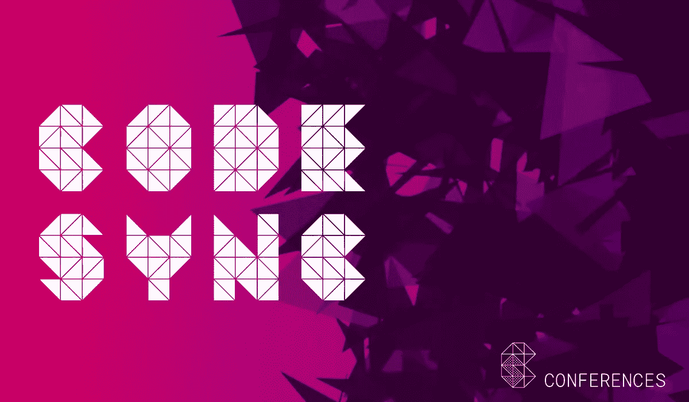

# 一个搭便车者的光束之旅

> 原文：<https://medium.com/hackernoon/a-hitchhikers-tour-of-the-beam-cdcfb11f0a6c>

BEAM 是目前使用的标准 Erlang 实现。它是专门为运行 Erlang 而设计的。但是除了运行 Erlang 的虚拟机之外还有什么梁呢？

今晚的导游 Robert Virding 将带您快速游览 BEAM，参观主要景点，了解它的内部结构和功能。这次短途旅行不需要毛巾。

Robert 解释了为了让 Erlang 在 BEAM 上运行，BEAM 必须支持 Erlang 系统的所有特定属性，包括:

*   轻量级大规模并发
*   异步通信
*   进程隔离
*   错误处理
*   系统的持续发展
*   软实时

# TLDR；

调度程序
BEAM 使用了一种叫做调度程序的东西。什么是调度程序？这是一个半自动的 BEAM 虚拟机，所以它拥有运行 Erlang 所需的几乎所有东西。但是它们运行在同一个系统中，所以它们需要能够相互通信。每一个都有自己的运行队列，并尽可能分开运行，以降低锁或同步的风险。

**进程**
BEAM 的独立进程堆有很多好处，比如垃圾收集效率。还有许多调谐选项。

**内存管理**
在 BEAM VM 中有许多不同的内存区域用于处理不同的内存类型。在如此复杂的系统中这并不稀奇。此内存系统支持快速系统。一个更简单的内存框架可以工作，但是它不会那么快。

在他的演讲中，Robert 还介绍了 BEAM 的消息传递、多核以及其他一些内容。

# 你的向导:罗伯特·维尔丁

Robert Virding 是 Erlang Solutions 的首席语言专家。在爱立信公司时，Robert 是爱立信计算机科学实验室的创始成员之一，也是 Erlang 语言的共同发明者。他参与了最初的系统设计，并贡献了许多最初的库，以及当前的编译器。

在实验室期间，他还在逻辑和函数式语言的实现以及垃圾收集方面做了大量工作。他也是一名企业家，并且是第一批 Erlang 创业公司(Bluetail)的联合创始人之一。Robert 还在瑞典国防物资管理局(FMV)建模和模拟小组工作了几年。他与人合著了关于 Erlang 的第一本书(Prentice-Hall ),并经常被邀请到世界各地授课和演讲。

在 [**码束 SF 2018**](http://www2.erlang-solutions.com/l/23452/2018-02-14/59vqj5) 得到罗伯特的训练:

*   [应用 Erlang 技术—2018 年 3 月 12 日至 14 日](http://www2.erlang-solutions.com/l/23452/2018-02-09/59n1ny)
*   [基本 OTP—2018 年 3 月 19 日至 21 日](http://www2.erlang-solutions.com/l/23452/2018-02-09/59n1ny)

*最初发布于*[*www . codesync . global*](http://www2.erlang-solutions.com/l/23452/2018-02-14/59vqj3)*。*