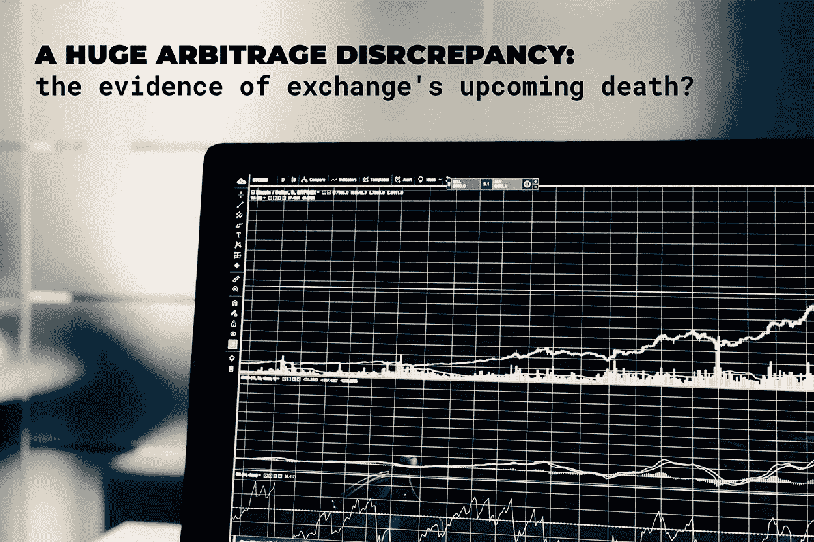
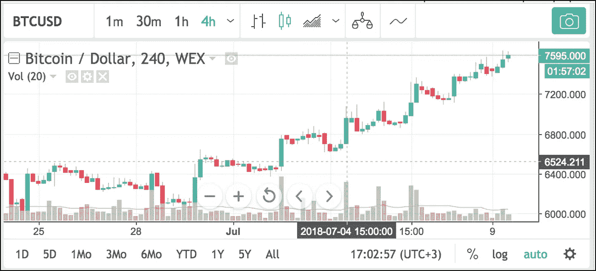
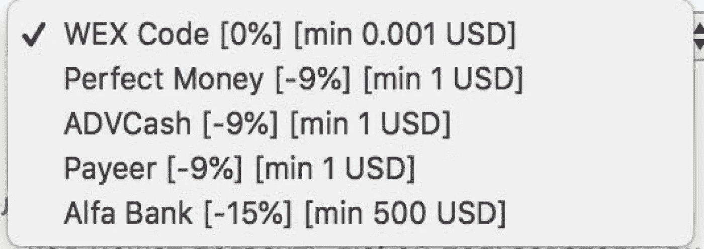
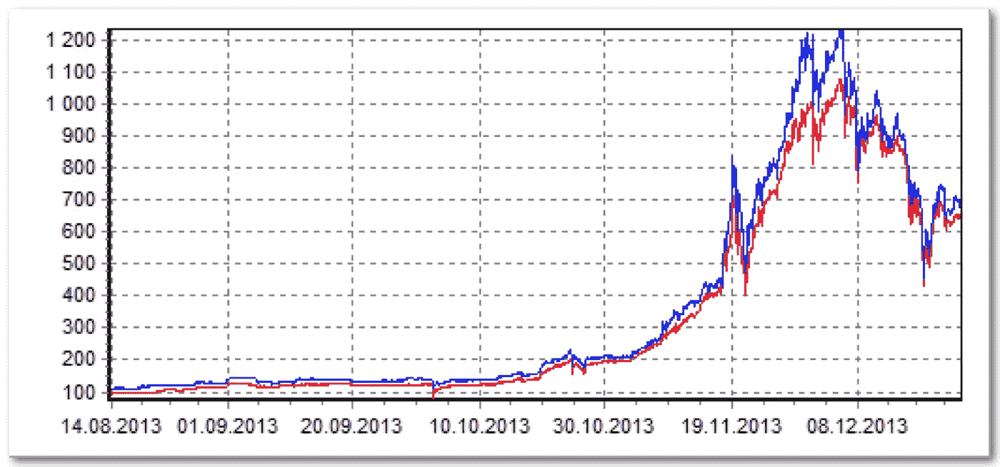
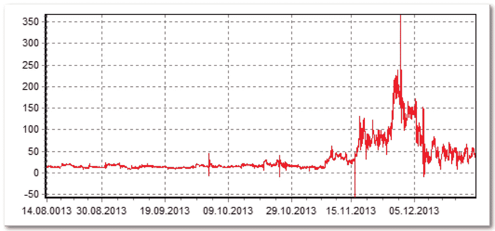
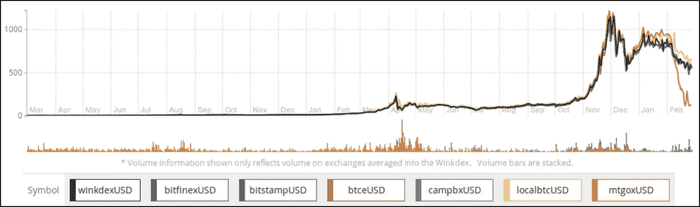

# 巨大的套利差异——交易所即将灭亡的证据？

> 原文：<https://medium.com/hackernoon/a-huge-arbitrage-discrepancy-the-evidence-of-exchanges-upcoming-death-9db800a43f69>

奥尔加·格里尼纳和瓦西里·苏马诺夫

**加密货币交易市场隐藏的传奇**

许多早期的比特币爱好者肯定听说过 BTC 电子交易所——2011 年开业的最古老的 BTC 交易所之一，远在比特币的交易量和受欢迎程度达到今天的高点之前。很长一段时间以来，该交易所一直是 BTC /菲亚特交易所市场的重要参与者，后来又成为其他新兴加密货币的重要参与者，直到 2017 年初迅速崩溃。这次破产相当臭名昭著，牵涉到美国执法机构[T3，被控严重洗钱价值](https://www.justice.gov/usao-ndca/pr/russian-national-and-bitcoin-exchange-charged-21-count-indictment-operating-alleged)[40 亿美元。](https://www.ccn.com/alleged-btc-e-admin-arrested-for-laundering-4-billion-in-bitcoin/)尽管事情发生了如此悲惨的转变，并且该交易所的法定账户用户因被逮捕而遭受了巨大的资金损失，但该交易所被收购并更名为 WEX，并承诺通过发行特别设计的“债务代币”从该交易所的利润中向用户支付损失的资金。奇怪的是，自 2012 年以来，WEX 界面和功能都没有改变，这可能会让一些用户回忆起比特币比现在便宜数百倍的美好时光。

事情突然发生了:巨大的套利缺口

直到上周，WEX 的一切都非常顺利。7 月 4 日左右，BTC 汇率迅速开始与 Bitfinex、HitBTC 和 Bitstamp 等主要交易所的交易不同(我们分析了交易 BTC 与美元的交易所):

BTC/USD exchange rate at WEX ( [wex.nz](http://wex.nz)) at 5pm on July 8, 2018

同时，这些主要交易所的 BTC 价格大约低 10%,因此我们确定了一个特定交易所——WEX 的汇率“超调”:

BTC/USD exchange rate at Bitfinex, HitBTC, Bitstamp according to [coinhills.com](http://coinhills.com) 17–00 08/07/18

在美元/USDT 市场也发现了不寻常的活动。WEX 的美元对“世界的象征性美元”显示了一个荒谬的 1.139 美元/USDT，即 1 USDT 几乎比内部 WEX 元高 14%。这可能会让许多用户(包括你的用户)质疑他们资金的安全性，并考虑转换到另一个密码交易所来转换他们的密码。

那么，WEX 到底发生了什么？

让我们试着更深入地调查一下整个 WEX 的情况。一开始为什么会这样？如此巨大的汇率差异能在全球市场上持续存在，为冒险的交易员提供疯狂获利的机会吗？事实上，在一些“邻居”交易所，比如说在 [EXMO](https://exmo.com/) 以 6800 美元的价格购买比特币似乎很容易，这与 fiat 取款的操作方式几乎相同，然后在 WEX 以 7600 美元的价格出售，赚取 800 美元的疯狂利润(~10%)，然后取款。这可以循环进行，直到汇率持平。然而，在现实中，这种努力正在失去它的魅力，只是因为 WEX 撤军目前有点太贵了，高达 15%:

然而，如果我们用美元计算 BTC 价格，以两个“邻居”交易所的交易量为例，结果几乎是一样的:现在大约是 6849 美元。资产美元价值如此巨大差异的原因是什么？此外，为什么与其他交易所相比，WEX 提高取款佣金的速度如此之快？例如，EXMO 的佣金为 1-3%。

所有可能的情况现在可能都变成了一种情况:交易所很可能已经失去了他们的那部分资本。这种情况只有在一种情况下才会导致资金短缺:客户存款大量外流。这是很有可能的，考虑到[关于 WEX 被一群与乌克兰自称的共和国有关的个人收购的谣言](https://www.rbc.ru/finances/04/07/2018/5b3b9ed99a79475f83b4f168?from=newsfeed)。WEX 否认这种爆发，最近部分收购了从其前身 BTC-E 继承的用户债务

然而，事实和图表表明，交易所正在以一种有点不寻常的模式运作，经历着法定赤字，这意味着流动资金的数额超过了法定账户的数额。因此，法定资金——美元、欧元等。—不能完全撤回。管理层可能设置了极高的佣金，试图限制提款(或在每个输入输出资金回路从用户那里获得一些额外资金)。然而，用户并不觉得投入资金以过高价格购买 BTC 特别有吸引力，在线交易所的“WEX 元”价格已经与美元等值。事实上，受影响最大的 WEX 用户现在是那些在价格暴涨之前在交易所储存菲亚特余额的人:现在他们可以以 10%的损失提取他们的钱(通过购买 BTC 高出 10%的股票和在提取菲亚特资金时损失相同的百分比)。我们可能会进一步猜测 WEX 赤字的根源，但目前只有一件事是清楚的:这肯定是一个危险信号。

WEX 会重蹈 Mt.Gox 的命运吗？

奇怪的是，WEX 的情况绝非独一无二。加密货币交易市场每个月都会受到一系列坏消息的困扰——无论是黑客攻击、欺诈还是倒闭，损失都超过了以前的“记录”。这里的一个终极经典大概是 Mt. Gox 破产。具有讽刺意味的是，正是 BTC-E 被指控对从该交易所窃取的比特币进行洗钱！早在 2013 年，Mt. Gox 就是领先的加密交易所之一，存储了比特币网络中一半以上的交易，以及世界上第一个加密货币美元市场的交易额。该交易所经历了一系列的考验和磨难，然而，有一些事情它最终无法应对:据称是由冻结法定资金造成的平衡漏洞。后来发现，相当数量的比特币也被盗。Mt. Gox 从 2013 年春天开始遇到存款取款问题，到 2013 年底，它变成了一个热点问题，迫使交易所在 2014 年 1 月关闭了该网站。有几个版本可以解释这一事件，其中一个版本是比特币在关闭前就被盗了，这一点得到了交易所 BTC 钱包交易的[审查](https://blog.wizsec.jp/2015/04/the-missing-mtgox-bitcoins.html))的证实。

奇怪的是，Mt.Gox 和其他交易所的 BTC 利率之间的差异是在缺乏法定提款资金时出现的。听起来很熟悉，是吧？顺便说一下，2013-2014 年的 BTC 价格图比较了 BTC 和 BTC 的价格:

Mt.Gox trade graph in blue, BTC-E trade graph in red.

BTC price discrepancy curve (arbitrage discrepancy) at the two exchanges

用户们意识到等待法定基金的收回是没有用的，于是被迫不惜任何代价买断 BTC。由于菲亚特投入/产出的问题，套利差异无法关闭。结果，Mt.Gox 的汇率下降到[零](https://en.wikipedia.org/wiki/Mt._Gox):

**对今日市场的可能影响**

与 Mt.Gox 时代相反，今天的现实是，即使一个主要交易所的下跌也不太可能导致严重和长期的全球影响。因此，2017 年 7 月 BTC E 的关闭对该行业没有太大影响。WEX 交易所的日交易量相当有限(约 2000 万美元)，在全球排名中排名第 42 位，它的停业甚至可能不会引起注意。

然而，类似 WEX 的交易所在历史上一直是作为一些独特服务的提供商出现的，比如通过电子代码和美元/USDT 等罕见的交易对进行即时提款。事实上，这种“精品方法”只存在于极少数交易所。在功能方面与 WEX 在概念上相当(菲亚特投入/退出、促销代码和优惠券等多种选项)。)大概是 [EXMO](http://exmo.com/) 交换。然而，这种技术更先进，并且没有在任何洗钱/安全漏洞事件中被发现。

在很大程度上，加密市场的生命周期与全球帝国的生命周期非常相似，这些帝国是为了以后被更强大的对手拖垮而建立的。随着 WEX 载入史册，另一个大插曲也将结束，这很符合逻辑:2018 年带来新的英雄。然而，Mt. Gox 和 WEX 的旅程却以如此相似的方式结束，这难道不具有讽刺意味吗？这两家交易所创建于加密历史的黄昏，其中一家很有可能清洗从另一家偷来的钱。

*由#technomads* 为您带来

【https://medium.com/tech-nomad-notes*在这里阅读更多关于区块链和后工业经济的内容:*