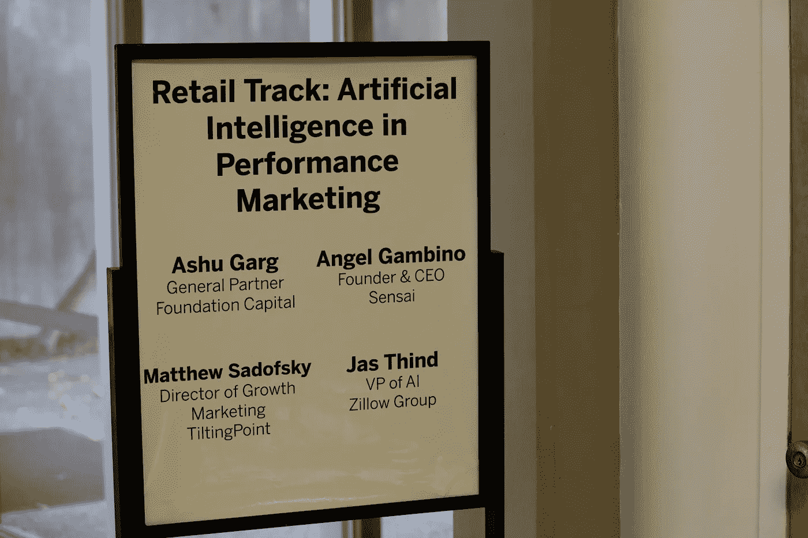
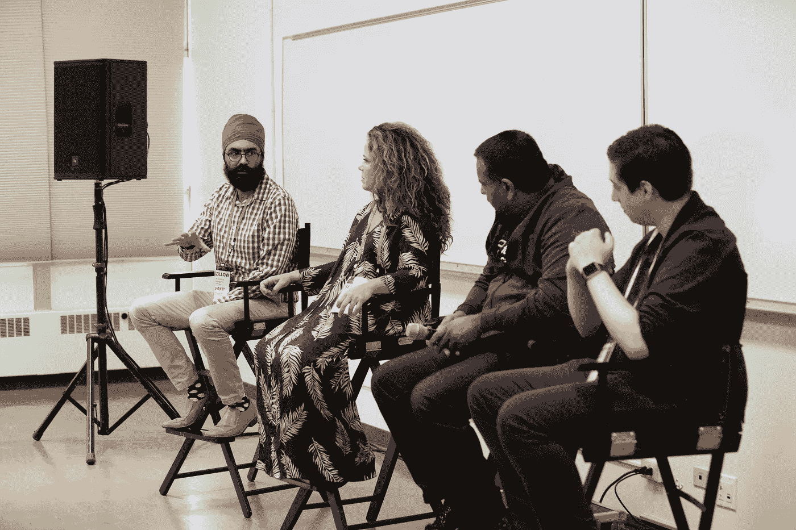
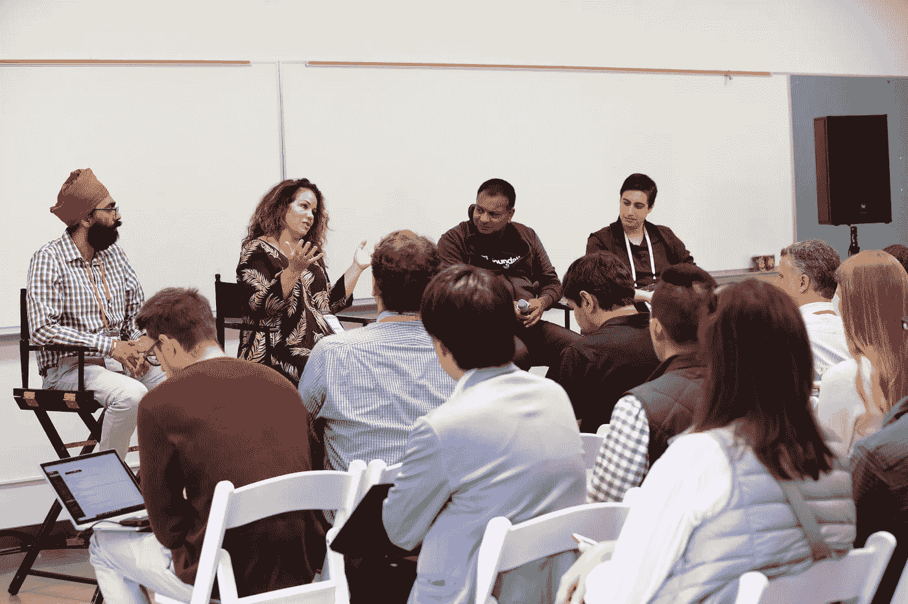

# 艾:炒作是真实的，它已经为你准备好了

> 原文：<https://medium.com/hackernoon/a-i-the-hype-is-real-and-its-ready-for-you-5311b8e06572>

去年人工智能炒作盛行，人工智能的现实现在已经白热化。事实上，[61%的企业表示，他们在 2017 年](https://www.techrepublic.com/article/61-of-businesses-have-already-implemented-ai/)在其组织中实施了人工智能——比 2016 年增加了 31%。并且， [791 家上市公司在 2017 年第三季度的财报电话会议上](https://www.cbinsights.com/research/artificial-intelligence-earnings-calls/)提到了人工智能。

这是什么意思？这意味着人工智能正接近“大数据”或“区块链”级别的恶名。很快，即使是最不可能的公司也会声称使用这项技术(想象一下[长岛冰茶成为区块链](https://www.fastcompany.com/40558198/surprise-the-long-island-iced-tea-blockchain-pivot-didnt-work)公司)来驾驭时代精神，并获得一些好的报道。事实上，TGI 星期五餐厅正在使用人工智能根据你的喜好自动定制鸡尾酒，所以 Alexa 可以让你在自己家里舒适地变成调酒师。现在，这是人工智能的实际应用，也是一种奇妙的品牌延伸体验。

虽然人工智能的宣传是真实的，但技术也是真实的。人工智能的应用无穷无尽，功能强大，可以在整个组织中部署。今天的一些应用程序令人惊叹，而一些只是以最佳速度高效扩展。

但这不是魔法。公司需要一种专注的方法，根据他们想要的结果来使用人工智能。事实上，目前使用人工智能的公司已经开始看到这项技术如何以增加客户参与和保留的形式产生有效的结果。

本周，我参加了数字营销高管 VentureBeat TRANSFORM 会议的一个小组，讨论企业如何利用人工智能提高客户洞察力和绩效营销。

**活动照片在此:**

我很荣幸加入基金会资本的普通合伙人阿苏·加尔格。[Zillow 集团人工智能副总裁 Jasjeet Thind](https://www.linkedin.com/in/jasjeetthind/)；和 [Matthew Sadofsky](https://www.linkedin.com/in/matthewsadofsky/) ，倾斜点的增长营销总监。他们对人工智能前景的想法和评论很有见地。

**人工智能正在推动更好、更独特的客户体验**

作为 [Sensai](http://trysensai.com) 的首席执行官，我亲眼目睹了这项技术如何提供见解，以深度个性化一个人的体验、影响和结果，同时通过取消大量繁重的工作或过于复杂的任务来节省宝贵的时间。Sensai 是一个人工智能驱动的社交媒体营销平台，提供关于吸引和增加受众的内容、平台和时间的可行建议。

好的人工智能工具可以让你的公司在他们需要的时候，根据他们的需要，向个人而不是角色进行营销。此外，健壮的人工智能可以提前预测这种需求。

在#VBTransform 期间，这种程度的个性化的一个更著名的例子是 TGI 星期五——是的，快速休闲餐饮连锁店。

你可能不会想到 TGI 星期五是利用人工智能的候选人，但首席体验官谢里夫·米蒂亚斯(Sherif Mityas)已经根据他们的个人订购模式，使用这项技术推荐招牌鸡尾酒。

“我们的目标是增加客户参与度，从而增加收入，”Mityas 在《华尔街日报》的一篇报道中说。“人工智能让这个品牌再次真正让我们与众不同。”(全文见[这里](https://blogs.wsj.com/cio/2017/12/06/tgi-fridays-adds-ai-to-menu-of-technologies/)。)

Nordstrom 营销副总裁 Brian Hovis 还分享了人工智能如何不仅改变了 Nordstrom 商店的客户体验，还推动了利用不同大都会地理位置的全新商店概念的创造，这让他们的客户感到高兴。

聊天机器人也一次又一次地作为人工智能的一种易于实现且非常有效的应用出现。拉斯韦加斯《大都会》杂志的万可儿同行和 Reply.ai 的创始人克拉拉·德索托(Clara De Soto)之间的炉边聊天尤其鼓舞人心。对于四海为家的人来说，聊天机器人通过他们命名为 Rose 的聊天机器人，带动了每位客人收入的惊人增长。Rose 的声音——自信、迷人、诱惑、成熟——与 Cosmopolitan 的品牌相一致，并使与她交谈的顾客满意度提高了 38%。

作为一名科技界的女性，我并不喜欢优步，因为它一直存在性别歧视和性骚扰问题(我改用 Lyft)，但我对优步的人工智能方法的清晰愿景和清晰表达印象深刻，这种方法将人工智能融入了整个客户旅程，并高度关注入职。优步产品总监贾伊兰·阮冈纳赞展示的幻灯片简洁明了，很好地展示了如何让有时模糊不清、不断发展的技术变得易于理解。我只希望我们能够听到更多关于他们在无人驾驶汽车和其他智能交通发展方面的进步。

也许最有趣的演讲之一是 Vanja Josifovski，Pinterest 的首席技术官，他将该平台描述为一个视觉发现引擎，而不是一个社交网络。他说，他们保持了创始人鼓励人们花时间离线的最初愿景。我很好奇在与投资者讨论广告收入和 KPI 时，这是如何转化的，所以我下次见到他们时会问他们。面对这么多旨在加剧数字成瘾的公司，这当然值得称赞。我想如果你花更多的时间离线，那么你可能会捕捉和分享更多鼓舞人心的视觉照片来分享和固定。

**人工智能可以取代你的员工。但这也有助于留住他们**

人工智能有时可能是一个贬义词——尤其是当它涉及员工和招聘时。大多数人害怕技术会让他们的工作过时。

是的，机器人正在取代许多重复性的客户服务工作，但目的并不总是相同。

VentureBeat 的 Stewart Rogers 详细描述了中国最大的两家公司如何以截然不同的方式使用人工智能。首先是小米，它使用机器人取代了 66%的呼叫中心员工，从而降低了成本。但腾讯使用人工智能来减少高要求和重复性的工作，让员工更高效、更快乐，因此可以留住他们。罗杰斯补充说，“所以教训是:如果你不想让人工智能取代你，就为好人工作。”

**什么时候是建设而不是购买或合作的时候？**

在我们的小组中，一些非常聪明的人加入了我，他们在比我的早期创业公司大得多的公司工作。然而，我也为像维亚康姆和英国广播公司这样的大企业服务过，所以我一直站在他们一边。

对于任何企业来说，一个关键点是知道何时将能力引入内部。向代理机构支付小额营销预算的 10%可能是合理的，但随着预算的增长，聘请内部专家可能会更有效。负责多个手机游戏的效果营销的马修·萨多夫斯基(Matthew Sadofsky)说得好:“我们每个月花费 300 万美元来获取和留住客户。在我们谈到这一点之前，我意识到，我可以用付给代理公司的钱雇佣一些真正聪明的人。”

我们也有一个关于最佳实践的问题，我很高兴回答这个问题，因为我们从 Sensai 那里学到了很多。最佳实践只是一个起点。每个公司都有独特的受众，他们必须进行测试和学习，以了解如何有效地推出。

**人工智能为你准备好了**

总的来说，VentureBeat TRANSFORM 的氛围非常令人鼓舞。我们看到各种规模的企业都在利用可访问的人工智能工具来提高业务绩效，留住员工，并可持续地增加收入。

英特尔的 Amir Khosrowshahi 在会议的第二天谈到了英特尔如何通过降低所需的计算能力来实现人工智能的民主化。正如摩尔定律帮助英特尔将电脑从你存放在办公室地下室的东西变成你戴在手腕上的东西一样，他们正在努力将人工智能带给更多地方更多人，同时要求更低。无障碍人工智能正在出现。

现在开始尝试人工智能工具并不算早。在 Sensai，我们专注于向中小企业提供人工智能见解，否则需要数百或数千人来收集。这使得社交媒体领域变得更加公平，因为企业级公司的大预算会让这个领域变得拥挤不堪。

在 Sensai，很荣幸成为人工智能革命的一部分，就在它着火的时候。我们很高兴看到更多的人工智能应用进入市场，希望我们很快会看到更多的女性创始人进入这个领域。

**我们今天是如何实现人工智能的？**

在 Sensai，我们正在为企业和艺术家建立一个可访问和负担得起的人工智能驱动的平台和产品。人工智能驱动的见解的一些例子包括:

*   **发布建议的最佳时间**:正如我上面提到的，最佳实践只是一个起点。在算法驱动的平台上，发布时间至关重要，但并不像许多社交媒体从业者建议的那样，是一刀切的。除非你能筛选出大量的数据，包括受众何时活跃并参与社交帖子以及参与程度，以及多个维度，包括客户垂直市场、他们的目标和兴趣、他们的帖子内容和主题，以及他们的受众构成——人口统计、地理位置、社交行为、季节性、时间性、他们当时感兴趣的主题等等。人工智能和机器学习的深度聚类和细分有助于为一个客户提供个性化的最佳发布时间。
*   **主题建模**:如果你是一名内容营销人员，或者更确切地说是一名社交内容营销人员，你如何预测你的预期回报？通过使用人工智能、自然语言处理和机器学习的主题建模和聚类模型，我们能够识别、分类和确定将引发观众互动的特定内容主题。
*   **标签推荐**:正如许多社会专家可能已经知道的那样，标签被用于确定社会内容如何以及在何种程度上被标记、排名、搜索、发现和呈现给社会媒体用户。但是，除了被排名、搜索和发现的内容之外，你怎么知道你的帖子中使用的标签是相关的，并且会返回你的观众的最佳互动水平呢？人工智能、NLP 和机器学习模型的使用使得来自社交媒体平台的数 Pb(如果不是 zetabytes)的非结构化数据能够流动，然后我们可以对其进行分析、聚类和排名，以便显示与内容具有语义相关性的标签。但是你必须快速完成:社交数据的 4v——数量、多样性、速度和准确性——需要实时执行，同时标签是相关的和最新的。

我期待着与我在 TRANSFORM 遇到的许多人工智能领导者进行后续交流，以便我们都能提升我们的学习水平，并在改善生活——甚至可能是人类——的新工具的持续开发中进行合作。