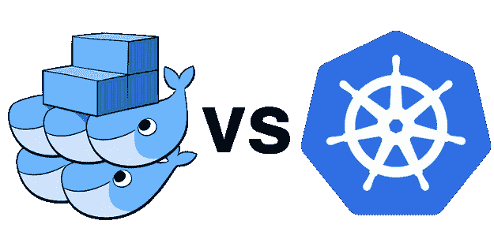

# Docker Swarm 爱好者 Kubernetes 指南

> 原文：<https://medium.com/hackernoon/a-kubernetes-guide-for-docker-swarm-users-c14c8aa266cc>

## 你已经掌握了蜂群。现在是掌握舵的时候了


Set sail!

我从未关注过 Kubernetes，因为 Swarm 给了我在容器编排方面所需要的一切。虽然简单易用，但它在一个像 Mesos 和 Kubernetes 这样的容器编排器很难设置的世界里大放异彩。

但现在在 2018 年，情况完全不同:所有三大云提供商(AWS、谷歌云和 Azure)现在都将赌注压在 Kubernetes 上，将托管的 Kubernetes 作为一种服务。这很重要，因为它将管理集群的所有复杂性(在我看来，这是 K8S 的主要难点)都交给了云提供商。更不用说新版本的 Docker Enterprise 和 Docker for Mac & Windows 将与 Kubernetes 捆绑在一起。

社区的规模也是这个故事的一大看点。每当我在 Docker Swarm 上遇到问题时，我都要花一段时间才能找到解决方案。相比之下，即使有更多的功能和配置可能性，简单的谷歌搜索和[在 Slack 上提问](http://slack.k8s.io/)帮助我解决了迄今为止我在 Kubernetes 上遇到的所有问题。不要误解我的意思:Docker Swarm 社区很好，但没有 Kubernetes 社区好。


这一点不是 Docker Swarm 的错:事实是，Kubernetes 正在由 Google、Microsoft、Red Hat、IBM(我猜还有 Docker)等公司以及个人贡献者积极开发。看一下这两个 Github 库就会发现，事实上 Kubernetes 要活跃得多。

但是嘿！这应该是一个指南，所以让我们从比较如何在 Swarm 和 K8S 中实现类似的场景开始。

> **免责声明:本指南无意提供任何生产就绪场景。我把它变得简单，以便更容易地说明 Swarm 和 K8S 之间的相似之处。**



Not so much of a **VS**, but I found this image on the Internet

# 启动集群(1 个主集群和 1 个工作集群)

为了简单起见，让我们构建一个简单的集群，其中有一个主集群和一个工作集群。

## 启动集群— Docker Swarm

在 Docker Swarm 中启动一个集群非常简单。机器上安装 Docker 后，只需:

```
> **docker swarm init**Swarm initialized: current node (x5hmcwovhbpxrmthesxd0n1zx) is now a manager.To add a worker to this swarm, run the following command:*docker swarm join --token SWMTKN-1-5agb6u8svusxsrfisbpiarl6pdzfgqdv1w0exj8c9niv45y0ya-9eaw26eb6i4yq1pyl0a2zdvjz 192.168.65.3:2377*To add a manager to this swarm, run 'docker swarm join-token manager' and follow the instructions.
```

然后，在同一网络中的另一台机器上，粘贴上述命令:

```
> **docker swarm join --token SWMTKN-1-5agb6u8svusxsrfisbpiarl6pdzfgqdv1w0exj8c9niv45y0ya-9eaw26eb6i4yq1pyl0a2zdvjz 192.168.65.3:2377**The node joined the swarm as a worker
```

## 启动集群— Kubernetes(使用 kubeadm)

我几次提到建立 Kubernetes 集群是复杂的。虽然这仍然是事实，但有一个名为 **kubeadm** 的工具(仍处于测试阶段)可以简化这个过程。其实用 kubeadm 设置一个 K8S 集群和 Docker Swarm 很像。安装 kubeadm 很容易，因为它可以与大多数包管理器(brew、apt 等)一起安装

```
> **kubeadm init**Your Kubernetes master has initialized successfully!

To start using your cluster, you need to run (as a regular user):

  mkdir -p $HOME/.kube
  sudo cp -i /etc/kubernetes/admin.conf $HOME/.kube/config
  sudo chown $(id -u):$(id -g) $HOME/.kube/config

You should now deploy a pod network to the cluster.
Run "kubectl apply -f [podnetwork].yaml" with one of the options listed at:
  http://kubernetes.io/docs/admin/addons/

You can now join any number of machines by running the following on each node
as root:

  *kubeadm join --token <token> <master-ip>:<master-port> --discovery-token-ca-cert-hash sha256:<hash>*
```

该命令需要一段时间才能完成，因为 Kubernetes 依赖于 etcd 等外部服务的设置来运行。所有这些都通过 kubeadm 实现了自动化。

与 Swarm 一样，要加入另一个节点，只需在另一个节点上运行输出的命令:

```
**> kubeadm join --token <token> <master-ip>:<master-port> --discovery-token-ca-cert-hash sha256:<hash>**Node join complete:
* Certificate signing request sent to master and response
  received.
* Kubelet informed of new secure connection details.

Run 'kubectl get nodes' on the master to see this machine join.
```

到目前为止，这两个解决方案中的集群创建过程几乎是相同的。但是 Kubernetes 需要一个额外的步骤:

**安装 pod 网络**

Docker swarm 与一个服务网络捆绑在一起，该服务网络在集群内部提供联网功能。虽然这很方便，但 Kubernetes 在这方面有更大的灵活性，允许您安装自己选择的网络。官方实现包括*印花布、运河、法兰绒、Kube-Router、Romana 和 Weave Net* 。安装它们的过程是相同的，但是在本教程中我将继续使用 Calico。

```
> **kubectl apply -f https://docs.projectcalico.org/v2.6/getting-started/kubernetes/installation/hosted/kubeadm/1.6/calico.yaml**
```

关于使用 kubeadm 的更多信息，请点击[这里](https://kubernetes.io/docs/setup/independent/create-cluster-kubeadm/#24-initializing-your-master)

## 启动集群— Kubernetes(使用 minikube)

如果你想在你的本地机器上试验 Kubernetes o，有一个很棒的工具叫做 **minikube** ，它可以在一个虚拟机上运行一个 Kubernetes 集群。我不打算在这方面做太多扩展，但是您可以通过以下方式在您的系统中运行 minikube:

```
> **minikube start**
```

有关 minikube 的更多信息，请点击[这里](https://kubernetes.io/docs/getting-started-guides/minikube/)


The literal file name of this image was container-drugs.jpg. I hope the DEA isn’t reading any of this

# 运行服务

现在我们已经有了一个正在运行的集群，让我们启动一些服务吧！虽然有一些差异，但这两个管弦乐队的做法非常相似。

## 运行服务— Docker Swarm(内嵌)

要使用内联命令运行服务，只需执行以下操作:

```
**> docker service create --publish 80:80 --name nginx nginx:latest**
```

## 运行服务— Kubernetes(内嵌)

可以想象，在 Kubernetes 做同样的事情并没有什么不同:

```
**>** **kubectl run nginx --image=nginx:latest** deployment "nginx" created
**> kubectl expose deployment nginx --port 80 --type NodePort**
service "nginx" exposed
```

如上所述，我们需要两个命令来复制 Swarm 的行为。两个 orchestrators 之间的主要区别在于，在 Swarm 的情况下，我们在主机上显式地公开了端口 80。在 Kubernetes 中，端口是从预先配置的端口范围中随机选择的。我们可以选择带有标志的目标端口，但它需要在该范围内。我们可以使用以下命令查询所选端口:

```
**> kubectl get services**NAME         TYPE        CLUSTER-IP       EXTERNAL-IP   PORT(S)        
nginx        NodePort    10.105.188.192   <none>        80:**30149**/TCP 
```

## 运营服务— Docker Swarm (YAML)

您可以在堆栈文件中定义服务(以及卷、网络和配置)。堆栈文件是一种 YAML 文件，使用与 Docker-Compose 相同的符号，但增加了功能。让我们使用这种技术来加速我们的 nginx 服务:

```
**> cat nginx.yml**version: '3'services:
  nginx:
    image: nginx:latest
    ports:
      - 80:80
    deploy:
      mode: replicated
      replicas: 1**> docker stack deploy --compose-file nginx.yml nginxstack**Creating network nginxstack_default
Creating service nginxstack_nginx
```

由于我们没有指定任何网络，Docker Swarm 为我们创建了一个。请记住，这意味着 nginx 服务不能通过另一个服务的服务名来访问。如果我们想要这样做，我们可以定义需要在同一个 YAML(以及一个网络)中相互通信的所有服务，或者在两个堆栈中导入一个预先存在的覆盖网络。

## 运行服务— **Kubernetes (YAML)**

Kubernetes 允许通过 Kubernetes 清单文件创建资源。这些文件可以是 YAML 文件，也可以是 JSON 文件。使用 YAML 是最推荐的，因为它几乎是标准。

```
**> cat nginx.yml**apiVersion: apps/v1
kind: Deployment
metadata:
  name: nginx
spec:
  replicas: 1
  selector:
    matchLabels:
      *app: nginx*
  template:
    metadata:
      labels:
        *app: nginx*
    spec:
      containers:
      - name: nginx
        image: nginx:latest
        ports:
        - containerPort: 80
---apiVersion: v1
kind: Service
type: NodePort
metadata:
  name: nginx
spec:
  selector:
    *app: nginx*
  ports:
  - port: 80**> kubectl apply -f nginx.yml**service "nginx" created
deployment "nginx" created
```

因为它是围绕一个更加模块化的架构构建的，Kubernetes 需要两种资源来实现与 Swarm 相同的功能:一个*部署*和一个*服务*。

一个**部署**很大程度上定义了一个服务的特征。它是定义容器、卷、秘密和配置的地方。部署还定义了副本的数量以及复制和放置策略。你可以把它们看作是 swarm 中的栈定义，只是没有负载平衡。

事实上，部署是对较低级别的 Kubernetes 资源的高级抽象，如 pod 和副本集。部署定义的*模板*部分中定义的一切都定义了一个 ***pod*** ，这是 Kubernetes 提供的最小调度单元。**一个 pod 不等于一个 container。这是一组应该一起安排的资源；例如一个容器和一个卷，或者两个容器。**在大多数情况下，一个 Pod 只包含一个容器，但是理解这种差异是很重要的。

**文件的第二部分定义了一个服务资源**，可以看作是引用网络中的一组 pods 以及它们之间的负载平衡的一种方式。NodePort 类型告诉 Kubernetes 在集群的每个节点上分配一个外部可访问的端口(在所有节点上都相同)。这也是 swarm 所做的。**你通过使用选择器**告诉服务负载平衡，这就是为什么标签在 Kubernetes 中如此重要。

在这种情况下，Kubernetes 要强大得多:例如，您可以定义一个 LoadBalancer 类型的服务，这将在您的云提供商(之前的配置)中产生一个负载平衡器，例如 AWS 中的 ELB，它将指向您的服务。默认的服务类型是 ClusterIP，它定义了一个可以在给定端口上的集群中的任何位置访问的服务，但不能从外部访问。使用 ClusterIP 相当于在 Swarm 中定义一个没有外部映射的服务。

# 创建卷

需要卷来维护状态和提供配置。这两个编排器都提供了简单的方法来定义它们，但是 Kubernetes 以更多的功能领先。

## 创建卷— Docker Swarm

让我们为 nginx 服务添加一个卷:

```
**> cat nginx.yml**version: '3'services:
  nginx:
    image: nginx:latest
    ports:
      - 80:80
    **volumes:
      - nginx-volume:****/srv/www**
    deploy:
      mode: replicated
      replicas: 1**volumes:
  nginx-volume:**
```

这是最简单的情况，显然这种体积在这种情况下不会提供任何好处，但足以进行演示。

## 创建卷— Kubernetes

在 K8S 中做同样的事情很容易:

```
**> cat nginx.yml**apiVersion: apps/v1
kind: Deployment
metadata:
  name: nginx
spec:
  replicas: 1
  selector:
    matchLabels:
      app: nginx
  template:
    metadata:
      labels:
        app: nginx
    spec:
      containers:
      - name: nginx
        image: nginx:latest
        ports:
        - containerPort: 80
       **volumeMounts:
        - mountPath:** **/srv/www** **name: nginx-volume
       volumes:
         - name: nginx-volume
           emptyDir: {}**---apiVersion: v1
kind: Service
type: NodePort
metadata:
  name: nginx
spec:
  selector:
    app: nginx
  ports:
  - port: 80
```

**emptyDir** 卷类型是 Kubernetes 提供的最简单的卷类型。它将容器中的一个文件夹映射到节点中的一个文件夹，该文件夹在 pod 停止时消失。
Kubernetes 附带了 [26 种类型的卷](https://kubernetes.io/docs/concepts/storage/volumes/#types-of-volumes)，所以我认为几乎涵盖了所有用例。例如，您可以在 AWS 中定义一个由 EBS 卷支持的卷。

# 好了

当然，除了服务和卷之外，还有更多资源，但是我现在将它们排除在本指南之外。kubernetes 中我最喜欢的资源之一是 **ConfigMaps** ，它类似于 Docker 配置，但提供了更好的功能。我会努力写另一个指南来比较这两者，但是现在，我们就到此为止吧。


Anoter picture of containers. Just because.

# 结论

像 Swarm 一样使用 kubernetes 比以往任何时候都更容易。我们需要一段时间来决定将所有基础设施迁移到 Kubernetes。在写这篇文章的时候，Swarm 给了我们所需要的一切，但很高兴知道 K8S 的入门门槛正在随着时间的推移而降低。

> 我是一名驻阿根廷布宜诺斯艾利斯的软件工程师。目前在拉丁美洲领先的移动游戏公司 Etermax 担任平台工程师。