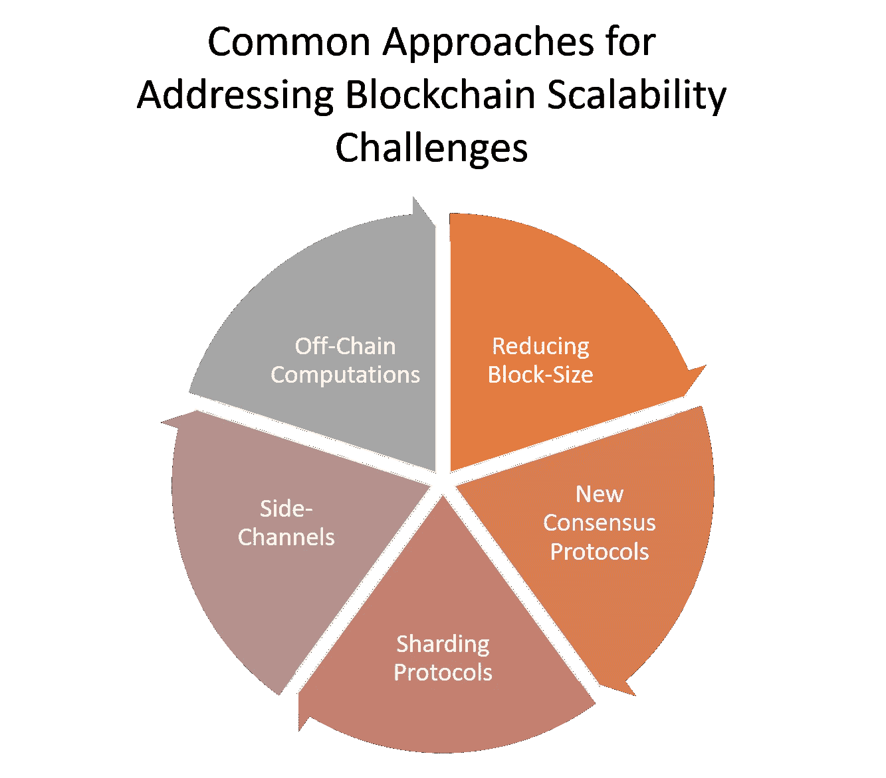

# 适用于任何区块链的 0 层可扩展性解决方案

> 原文：<https://medium.com/hackernoon/a-layer-0-scalability-solution-for-any-blockchain-36cb6b489d69>

许多人认为可扩展性是当前一代区块链解决方案面临的最大挑战。可扩展性挑战不仅限制了区块链技术的主流采用，也是区块链安全攻击中利用的主要因素。直觉上，我们认为区块链中的可伸缩计算模型要么是“第 2 层”协议，要么是全新的区块链。几个月前，我遇到了一家有趣的初创公司 blox route T1，它提出了一种完全不同的方法:在不改变核心协议的情况下扩展区块链。如果像等离子或分片这样的协议被认为是第 2 层解决方案，我相信 [bloXroute](https://bloxroute.com/) 应该被归类为第 0 层可伸缩性解决方案。

# 可扩展性挑战

当你遇到一个挑战传统智慧的解决方案来解决一个特定的问题时，难道你不喜欢吗？谈到区块链的可伸缩性，bloXRoute 就是这么做的。你看，区块链可扩展性问题的大多数解决方案都集中在改进一致协议、减小块大小或用旁路信道扩展网络。

虽然这些第 2 层可扩展性协议中的许多可能会被当前一代的区块链技术广泛采用，但它们也导致了空间的日益碎片化。毕竟，我们可能有使用不同第 2 层可伸缩性协议的同一区块链的不同版本，当然也有使用完全不同的可伸缩性模型的不同区块链。

# bloXRoute

虽然第二层可伸缩性协议的斗争正在全力进行，但 bloXRoute 忽略了这些传统模型，并提出了一种在任何区块链下都能工作的解决方案。他们的方法类似于内容分发网络(cdn)对互联网可扩展性的贡献。毫不奇怪，bloXRoute 团队喜欢称自己为区块链的 Akamai😉

根据 Akamai 的类比，bloXRoute 引入了区块链分发网络(BDN)的概念；一种第 0 层协议，可以将链上吞吐量提高几个数量级，而不会影响区块链的整体架构。

bloXroute BDN 通过充当区块链下的分散式路由器来实现高级别的可扩展性。bloXroute 架构基于两个基本组件:

**BDN:** 是一个高容量、低延迟的全球 BDN 网络，经过优化，可快速传播多个区块链系统的事务和数据块。

**对等网络:** P2P 节点网络，利用 bloXroute 传播事务和块，同时仔细审核其行为。每个对等网络由使用特定协议的所有节点组成。例如，所有利用 bloXroute 的比特币节点形成单个对等网络，而所有利用 bloXroute 的以太坊节点形成不同的对等网络。

bloXroute 的神奇之处在于，BDN 使用少量节点在区块链中传播数据块。BDN 盲目地为节点服务，不知道它传播的块、它们的起点或它们的目的地。此外，节点不断充当 BDN 行为的审计员。该平台利用系统范围的高速缓存实现更快的传播和千兆字节大小的数据块，并利用最先进的路由方法实现数据块在网络中的高效传输。

# 使用 bloXroute

为了使用 bloXroute，区块链可以通过在一组目标节点(如 miners)上运行 bloXroute 服务器的实例来启动。bloXroute 将在世界各地运行足够数量的 BDN 节点，这样用户就可以比任何其他对等方更快地传播块和接收事务。随着越来越多的节点使用 bloXroute，块分发性能应该会显著提高。显然，为了充分利用 bloXroute 的优势，区块链可能会决定更改一些参数，如块大小或块间时间间隔。

# bloXroute 令牌

bloXroute 包含一个名为 BXLR 的本地 ERC20 令牌，它从 bloXroute 收到的 50%的资金中获取值。BLXR 的价值也由称为 BLXR-Reserve 的异质加密货币储备担保，所有 BLXR 持有者都可以使用该储备。BLXR 储备向网络注入一定水平的流动性，允许 BLXR 持有者在任何给定时间将其 BLXR 转换为其他加密货币。

# 区块链可扩展性的独特方法

bloXroute 提出了一种独特的方法来解决区块链网络的可扩展性问题，而不会破坏现有区块链的底层协议。bloXroute 结合了三个原则，这三个原则在谈到区块链时经常被认为是相互矛盾的:可伸缩性、中立性和适应性。该平台通过实现有效的广播原语来提供可伸缩性，该原语可以合并到任何区块链中。它通过支持加密块和通过对等中继隐藏块的来源来实现中立性。最后，可审计性是通过使用户能够经由网关以系统的方式直接和主动地探查网络来实现的。