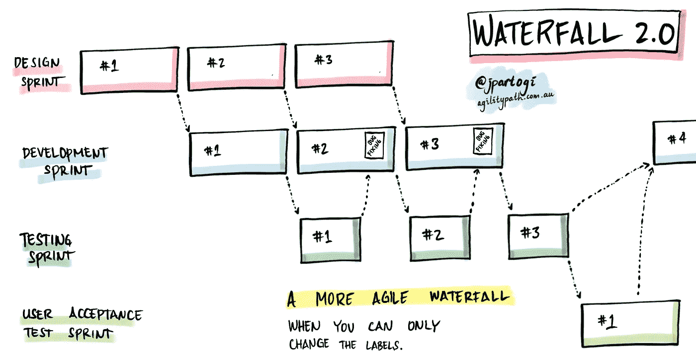

# 设计冲刺的精益替代方案:封面故事

> 原文：<https://medium.com/hackernoon/a-lean-alternative-to-design-sprints-cover-story-e9349c82d545>

我喜欢设计冲刺背后的想法，但我不喜欢设计冲刺。

我喜欢设计冲刺让人们与客户一起迭代的事实。

我喜欢人们试图理解他们应该弄清楚如何最好地满足客户的需求。

我讨厌大多数团队在没有客户在场的情况下做这件事。

我讨厌从精益的角度来看，这几乎是完全的浪费。

无论花了多长时间想出最好的设计，最终都没有产生任何价值(我应该说没有给产品增加任何价值)。我喜欢的部分是第 5 天的用户验证部分，从中获益良多。我讨厌的是它发生在一个原型上。当功能成为产品的一部分时，用户的整体体验(不是 UI，而是 UX)可能会非常不同。

设计冲刺可以非常容易地让你走上现代化瀑布的道路。无论你如何推销，设计冲刺都是 BUFD(大的前期设计)。最终，没有经过客户验证的产品，最多只有经过客户验证的设计。如果构建功能需要很长时间，客户的需求、设计偏好甚至客户自己都可能改变。最终的集成体验也可能与感知的设计大相径庭。如果你的流程看起来有点像下面的约书亚·스크람·帕托吉的图表，你的设计冲刺可能会为你设置一个“更敏捷的瀑布”。

Courtesy [Joshua 스크람 Partogi](https://medium.com/u/19dabde0c903?source=post_page-----e9349c82d545--------------------------------)

我想提出一个设计冲刺的替代方案:封面故事。

> 这不是一个正式的“过程”,也不打算如此。这是一个寻找最佳方法的实验，以便于尽早、快速地发现问题和解决方案。这是一个可能成功也可能惨败的实验。

**封面故事**以设计冲刺开始，但以不同的方式发展。这个想法是让客户审查一些功能，并发现特性的真正范围和方向。

**功能启动** —这是一个 2-3 小时的设计冲刺，以此开始。这是客户问题被带到团队的地方。团队成员试图理解问题并提出解决方案。建议的解决方案可以很宽泛，但要围绕正在解决的主要用户问题。这些解决方案经过收集、评论和组合，形成 1 到 3 个可以实施的主要想法。

**黑客马拉松** —根据团队成员的数量，一旦解决方案被缩小到 1-3 个，我们就开始为期 2 或 3 天的黑客马拉松。设计师、BAs、dev、QAs，每个人都试图构建一个可以被客户评审的功能特性。正在构建的特性只需要解决我们试图解决的主要问题。被解决的辅助问题是额外的，但不是必需的。想法是建立它，以便在封面故事结束时，功能是在生产中。这意味着，测试、CI、部署，都是黑客马拉松的一部分。

**演示/验证** —所有实施的解决方案都作为产品的一部分呈现给客户(或者你在设计冲刺中使用的任何表现形式)。他们可以随意点击，体验实现，观察流程并提供反馈。反馈用于确定哪个版本的解决方案将是产品的一部分。用户喜欢的“被拒绝的”解决方案的元素可以用来创造未来的故事。

**集成** —将所选解决方案的所有代码检入主分支。此代码现在是发送到 CI 和生产环境的常规构建的一部分。功能切换和 Beta 标签可能用于突出显示该功能可能仍在进行中，并且正在被添加到。

**未来计划** —从用户那里收到的反馈可以用来为不久的将来创作故事。在我们关闭这个特性之前，黑客马拉松中积累的任何技术债务也应该作为需要处理的故事包括在内。如果未完成的增强和用户请求的总数超过了可接受的阈值(5、10、15、20 个故事等)。)，剩下的工作应该分成多个功能，可以用自己的封面故事来处理。

我将在我自己的组织中寻找想要尝试这种方法的团队。我希望它将最好的设计冲刺和精益思想结合在一起，产生最好的结果，而不会在这个过程中产生大量的浪费。然而，任何产生的浪费都有望有助于价值的传递。毕竟价值胜过浪费(跳过这里的流程步骤…或者可能没有)。我们的想法是通过实际操作该功能，尽可能多地了解该功能，并利用反馈来指导我们未来的课程。这是我能想到的实现它的最简单的方法。

这里还有一个最初意想不到的副作用。如果特性太大，以至于中心思想无法在 2-3 天的黑客马拉松中实现，那么这个特性可能已经需要被分解成更小的特性。太多的时候，团队被抓到在小故事上工作，但是有大的特性。这也可能有助于调整特征的大小。

这不是一个正式的“过程”,也不打算如此。这是一个寻找最佳方法的实验，以便于尽早、快速地发现问题和解决方案。这是一个可能成功也可能惨败的实验。请随意对此进行修改并尝试一下。如果您不能在黑客马拉松之后立即部署，请使用测试环境。如果您无法让用户进行验证，请联系产品、销售或客户支持团队。这里没有什么是处方，只是一个松散的实验时间表。如果你决定尝试一下，请让我知道你的情况。希望有一些令人敬畏的结果…

又及——我是不是把 Scrum 重新命名为封面故事了？看起来确实非常接近一个功能的第一个 1 周冲刺。