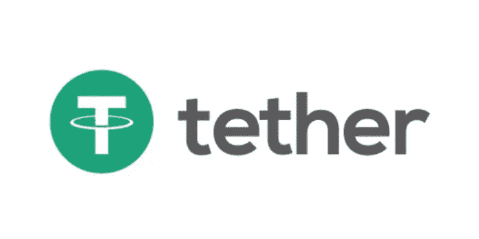

# 从众的一课:区块链社会规则及其重要性

> 原文：<https://medium.com/hackernoon/a-lesson-in-conformity-blockchain-social-rules-and-why-they-matter-d11d66d98ede>

最重要的是，区块链是社交计算的胜利。它允许理论上无限数量的人聚集在一起，通过经济激励就一个系统达成一致。在 2005 年，比特币矿工购买硬件，被激励诚实经营，如果不诚实经营，将受到电费惩罚。但是“诚实”对区块链意味着什么呢？

在区块链，人们一致同意诚实的行为。当交易通过系统时，诚实的矿工将检查签名是否准确，地址是否具有他们试图发送的值，以及最终他们的随机数是否可被区块链接受。这个系统是有意义的，并且根植于我们人类共有的所有权概念。然而，真正的经济激励不在于诚实，而在于共识。在许多方面，共识是公众心目中诚实的根源。大多数人同意的事情通常都是真的。然而，这已经被证明只有在比特币挖矿的意义上才是真的。对区块链的成功攻击即使有也很少，只是针对提供访问它们的服务。人们可以说这是技术的胜利，但它植根于贪婪。这并不是说这种制度行不通(事实上这可能是使这种制度行之有效的唯一方法)，但重要的是这对整个区块链社会的溢出效应。

# **系绳和对免费午餐的追求**

正如许多人最近听说的那样，一种名为 Tether 的[加密货币](https://hackernoon.com/tagged/cryptocurrency)参与了一些可疑的商业活动。他们已经印制了超过 10 亿张人民币，这些人民币理论上应该由银行账户中的美元支持，以便随时可以兑换成美元。然而，Tether 特别声明，他们并不声称允许完全访问这些美元，而且更重要的是，这些美元可能不存在。考虑到比特币基地今年带来了 10 亿美元的收入，泰瑟公司是否有足够的资金来支持其货币中储存的巨额价值是非常值得怀疑的。那么，为什么 Tether 的估值维持在 1 美元？

答案很简单，**它与比特币挖掘本身的过程有很多相似之处**。在比特币挖矿中，共识规则规定最长的链是有效链。在最长的链条上采矿有很高的经济激励。最长的链实际上从未被另一个链中断(除非在单个块分叉的情况下，其中两个被暂时认为是最长的),并且在交替链上进行的任何采矿活动都被浪费。在系绳中，动机是相似的。在这种情况下,“最长的链条”是对一美元的估价。在这里请原谅我，因为采矿和贸易中存在的机制显然有很大的不同，但前提是相同的。采矿共识表明，如果人们遵循这个系统，他们就会获利。这种类比对 Tether 来说是正确的，因为那些认为 Tether 将保持其美元估值的人可以在股价跌至 1 美元以下时买入股票获利。尽管 Tether 看到了所有的负面报道，但它仍然忠实地定价为 1 美元。这种行为的唯一解释是共识。在考虑预期价值的估值模型中，Tether 肯定会贬值。你是否能在任何时候用一条绳子换一美元，这是有很大风险的。然而，在这个系统中，交易者知道，除非这种信任被彻底摧毁，否则它将根据共识规则维持其价值。

有些人可能认为这是好的，它允许试图开发新技术的新公司在不破坏项目的情况下犯边际错误。但这里的问题是，这不是一个本地化的问题。人们继续用假币购买其他货币。超过 10 亿美元被注入区块链经济，对加密货币市值的贡献远远超过这一数字。具有讽刺意味的是，**这个共识系统为加密经济**、**创造了一个失败的中心点**，尽管该技术的整个目的是消除这样一个东西。在共识系统可能有利于处理交易的情况下，可能会对市场产生明显的不利影响。共识是导致市场价格剧烈波动的原因，网络泡沫，房地产泡沫，不胜枚举。显然，股票市场在某种程度上通过共识发挥作用，但只有当共识是基于内在估值模型时。在加密市场，共识意味着当价格上涨时你买入，当价格下跌时你卖出。这就是密码市场中经典的*【hodl】*召唤的原因，因为那些真正关心技术的人鄙视价格的剧烈波动(这可能是真实故事的委婉说法，一个喝醉的投机者对在高峰时购买感到沮丧，但它对这些目的有效。)

# 前进的道路

这些例子并不意味着区块链天生贪婪，也不意味着对这项技术的未来表示怀疑。相反，社区需要成长并学习更好的方法来设计共识。我们今天看到的同样的淘金热有许多历史例子，无论采矿激励是否以这种方式进行，这种情况都可能发生。这篇文章的目的是强调以一种不仅在经济上有益，而且在社会上有益的方式来定义共识的重要性。不是它们是否应该包括共识，*而是共识机制是否有益*。共识机制是区块链技术的核心，它们几乎不折不扣地阐明了社区的行动。考虑到这种力量，区块链开发商不仅需要认真考虑他们协议的采矿动机，还需要考虑由此可能产生的社会和政治共识。在这方面有许多工作要做；其中大部分必须通过反复试验来学习。最终，这项技术的命运将由人类道德的预期价值来决定，尽管许多人可能会对此提出质疑，但我个人愿意将我的生命押在这上面。