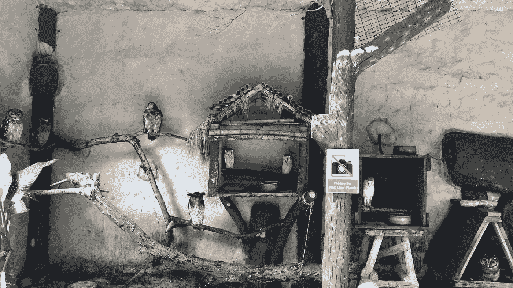

# 给“X 一代”和“婴儿潮一代”的一封信

> 原文：<https://medium.com/hackernoon/a-letter-to-gen-x-and-baby-boomers-ee5aa2b779b2>

## 数字世界不仅仅属于千禧一代。其他几代人也扮演着重要的角色。

几周前，我写了一封“[致千禧一代](https://hackernoon.com/a-letter-to-millennials-d536c83a204e)的信”，在信中我解释了在做出招聘决定时我会寻找什么。主要信息是“千禧一代应该是千禧一代。”他们需要利用他们的技术素养，保持真实，并保持冒险精神。

但在过去几周里，我感觉“其他”一代人也需要理解第四次工业革命到底是怎么回事。他们也应该拥抱最新技术发展所创造的新可能性，比如人工智能、机器人、传感器和区块链。

是时候给我这一代和我父母这一代写封信了。

主要的想法是，随着预期寿命的延长，以及经济、文化和社会的扁平化、分散化和开放化，每个人都可以更长久地创业。今天的生活提供了更多的机会，它们不应该被浪费掉。每个人在设计我们的数字未来中都有自己的角色。

所以，这是我写给 x 世代(比如我)和婴儿潮一代(比如我的父母)的信。

# **否认不是答案**

自古以来，老一代人就否认“新”的重要性。不愿承认变化可能是我们所有人的天性。但是，关于数字技术的影响，几乎每天都会遇到这样的否认，这继续让我感到惊讶。

我们总是不得不应对创新，但太多属于 X 一代和婴儿潮一代的人似乎认为数字革命不会很快扰乱他们的生活或工作。

传统媒体的报道助长了这种观点，这些报道解释了为什么人工智能并不真正智能，或者为什么区块链技术目前被高估了。从某种意义上说，这些报道是正确的。许多新兴的数字技术仍处于实验阶段。但是，把它们斥为炒作也太过分了。

我之前提过好几次，这些技术不要在[隔离](https://hackernoon.com/how-to-succeed-in-the-world-of-tomorrow-a74ca8ec2586)里看。它们正在相互放大和加速，我同意“数字空间”中许多评论家的观点，现在是让自己为这些新技术的影响做好准备的时候了。

生活在否认中也许很舒服，但这不是答案。对于每个人来说都是如此，尤其是像我和我的父母这样没有成长为“数字原住民”的人。

# **但也不是“改装”**

我越来越多地遇到的 X 一代和婴儿潮一代的第二种普遍态度是，新技术应该用来改善“旧”模式、系统和做事方式。

这种观点在我参加的许多会议上都很流行。人们普遍认为，一些重要的事情正在发生，每个人都需要接触科技。但这种参与是关于利用技术让旧世界变得更好。

这个想法有一定道理，看起来很有意义。它尊重旧的，同时承认新的，因此威胁要小得多。毫不奇怪，这种“改造”正变得被广泛接受和普遍，尤其是在那些与目前的运作方式有利害关系的人中间。

此外，这种改装通常被用作公关或装饰门面的手段:“看！我们正在与新技术合作。”

# **认清&拥抱“新”**

但我们应该认识到，新技术并不是让旧世界变得“更好”。相反，他们正在颠覆过去，创造一个更扁平、更有活力、基于社区的现实。

我到处都看到这种新的证据。让我举一个最近的例子。

我和妻子上周在吉隆坡，我们选择了使用 *Grab* (亚洲的*优步*)而不是传统的出租车。让我们感到惊讶的是，甚至酒店工作人员也推荐了拼车应用(“它更可靠、更高效”)。

但我最感兴趣的是当我们的 *Grab* 车不再出现在追踪应用程序上时发生了什么。我们没有放弃，而是选择了一辆停在我们周围的“旧世界”出租车。相反，我们更愿意等待原司机的消息，说他的车出了点问题，一个替代司机正在路上。

我们宁愿多等八分钟，等一个完全陌生的人开自己的车，也不愿坐任何一辆出租车。为什么？

价格、路线和时间的明确性使我们致力于新的电子系统，而不是旧世界的出租车公司。但我认为还有更深层的原因，而且并不完全合理。

在我看来非常清楚的是,“旧世界出租车”的价值观和结构——一个有点阴暗的政府许可、规则和条例以及等级制、“程序化”组织的世界——对我没有吸引力。只要有数字解决方案，我甚至不再考虑出租车。至少，出租车是最后的手段。

而这就是临界点。技术变革(这里是网络、智能手机和“应用”)开启了以前不存在的新选择(这里是*抢*)。同样重要的是，它们扼杀了，或者至少颠覆了旧的做事方式(在这种情况下，是出租车公司)。

当然，技术进步从来都是这样的。毕竟汽车走向主流后谁还用马车。“改造”从来就不是一个选项。

现在不同的是技术变革的速度和复杂性。我们并不总能确定我们的前进方向，由此产生的不确定性会让否认或改造看起来非常有吸引力。

但是有一些反复出现的主题、趋势和价值观定义了一个数字时代。这是一个更加扁平、更加包容的世界。在这个世界里，开放的组织和 API(应用编程接口)正在用规定的过程和程序取代停滞和孤立的组织。这是一个能力胜过正式资格或经验的世界。在这个世界里，每个人都愿意牺牲一点隐私来换取新技术的便利和可能性。

# ***每个人*都相关**

事情是这样的。在过去一年左右的时间里，我学到的是，老一代人在这个新兴的新世界中仍然举足轻重。特别是，存在于老一代人和新一代人之间的创造性紧张关系对于为我们正在进行的数字技术实验提供一致的方向是至关重要的。

我们需要尽可能多种多样的观点、经验和技能来汇集和整合。正是这种不同观点之间的“紧张”将最大限度地增加创造和创新的机会。

> 因此，由此产生的代际对话至关重要。

参与和社区建设是确保我们的数字未来保持高效的核心问题。

例如，我们可以在今天的银行业中看到这样的例子。许多老牌和传统银行正在被 FinTech(新金融科技公司)和 TechFin(扩展到金融服务业的科技公司)公司颠覆。作为回应，越来越多的传统银行正在建立“远程”和“独立管理”的子公司。这些子公司的任务是扰乱母公司(同时利用母公司的银行执照)。

这是一个明显的例子，说明如何在“年轻一代”和“老一代”之间制造紧张关系，从而创造一个更美好的世界。

每个人都需要接受新事物，因为它是真正的新事物，并承认他们可以为设计新的世界秩序做出贡献。

*非常感谢您的阅读！请按住*👏*下面，还是留下评论吧。*

每周都有新的故事。因此，如果你关注我，你不会错过我关于数字技术如何改变我们生活、工作和学习方式的最新见解。