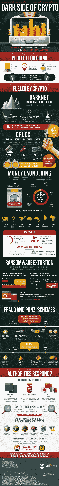

# 看一看加密的黑暗面

> 原文：<https://medium.com/hackernoon/a-look-at-the-dark-side-of-crypto-dd4113721999>

加密货币为网络犯罪分子提供了很多好处。区块链已被证明是完美的秘密集合点，提供完全匿名，从地球上任何地方进行无边界交易，以及安全使用公钥和私钥。所有这些因素使得追踪犯罪交易的尝试——从非法物质和武器到伪造证件，甚至是合同杀手的服务——成为徒劳。

加密热潮已经引起了美国、欧盟和国际机构的关注，并且经常困惑于这种革命性的技术是如何让恶作剧的演员逃脱惩罚的。丝绸之路是第一个以大规模毒品销售闻名的暗网市场，在主要通过比特币交易赚了超过 10 亿美元后，于 2013 年被关闭。

使用加密货币的犯罪活动也不仅仅是为了相互交易。中国和墨西哥等国家开始实施监管，以应对日益增多的勒索软件攻击、退出骗局和建立在庞氏骗局结构上的欺诈公司，包括今年春天倒闭的 BitConnect。

虽然加密被证明是世界范围内政府监管和执法的祸根，但有一点是肯定的。

它不会很快消失。

通过下面由 NullTX 提供的信息图，了解更多关于 crypto 的黑暗面。

