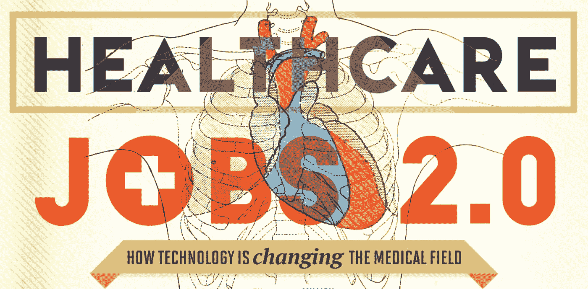
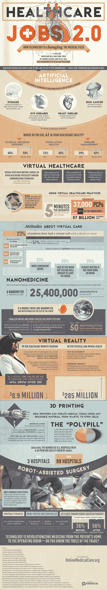

# 展望未来的医疗保健工作

> 原文：<https://medium.com/hackernoon/a-look-at-the-healthcare-jobs-of-tomorrow-9d462a5f6346>

到 2050 年，1.71 亿美国人将患有某种慢性疾病，按照目前的速度，医疗保健根本跟不上。预计将有超过 100，000 名医生的短缺，医疗保健需求正在转向技术以获得持久的解决方案。

由于大大小小的技术已经影响了医疗保健几千年，未来仍然取决于这些创新。今天，是增强和虚拟现实技术带来了巨大的变化。“虚拟医疗”促进了视频会议、移动应用和消息传递等先进通信技术的使用，为患者护理开辟了更多渠道。更多的机会给病人留在家里进行检查和状态更新的选择赋予了“出诊”全新的含义。当旅行变得禁止时，虚拟交流选项也在病人和他们的专业护理提供者之间建立了桥梁。

对于医疗保健的实际应用，机器人提供了一个计算机化的助手。今天，最常见的机器人系统用于辅助手术，因为摄像机有助于以尽可能微创的方式指导外科医生。附有手术工具的机械臂由外科医生控制，通过计算机成像，提供者能够看到手术部位本身的高清放大视图。这意味着更精确和可控的运动，微创手术，甚至有助于提高对机器人辅助手术的积极态度，使其成为现代奇迹，而不是令人恐惧的东西。

从我们的家庭到手术台，技术正在彻底改变我们看待医疗保健的方式。你对未来的医疗保健、程序和准入有什么期望？请看这张信息图，了解未来医疗保健工作的更多细节。

