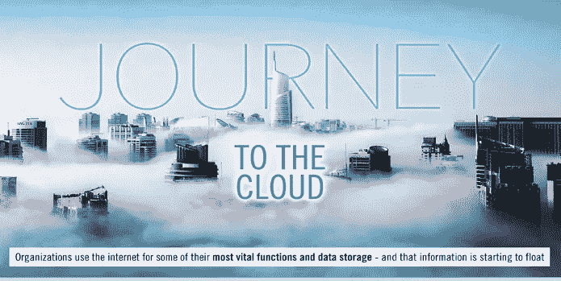
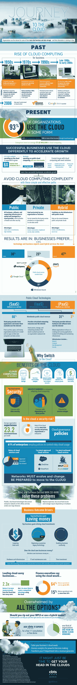

# 看一看云计算之旅

> 原文：<https://medium.com/hackernoon/a-look-at-the-journey-to-the-cloud-ae97b28308af>

在大型机时代，计算机太大，投资太大，无法满足每个员工的需求。相反，一台电脑允许多人通过“哑”终端访问。随着个人计算越来越受欢迎，虚拟化专用网络(VPN)连接使用户能够访问共享基础架构，从而简化业务运营。直到 2006 年，当谷歌文档第一次推出时，数据还不能很容易地在网上存储或共享。一些最早的云服务。

如今，超过 90%的组织使用云，到 2020 年，全球公共云计算支出将达到 1620 亿美元。但是云并不完美。云解决方案存在隐私和安全问题，在互联网中断期间无法访问，以及对消费者缺乏控制，消费者容易受到云提供商的影响。为了推动下一阶段的业务增长，云计算必须克服这些挑战。

尽管有一些缺陷，云计算为商业提供了许多好处。您可以将数据和分析存储在云上，或者进行实时财务分析。shard 公司资源的即时创建和简单的可伸缩性使每个人都在同一页面上。公用事业式的计量定价降低了成本。

在此信息图中了解更多关于云计算的信息:

