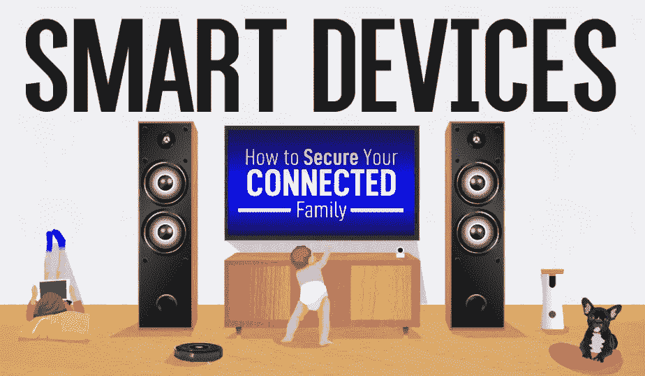
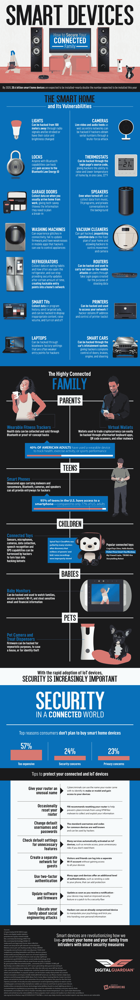

# 物联网设备的安全风险

> 原文：<https://medium.com/hackernoon/a-look-at-the-security-risks-of-iot-devices-f0d6ffe1441d>

据估计，到 2020 年，离现在不远，将安装 204 亿台智能家居设备。仅今年安装的数量就几乎翻了一番，有面向整个家庭的物联网设备，从妈妈、爸爸、孩子，甚至宠物。然而，随着这种越来越受欢迎，安全问题也随之增加——忽视这些设备的安全性和完整性会带来风险。

将物联网设备带回家时，养成留意物联网设备的习惯至关重要。诸如检查设备是否有不需要的连接功能、更新双因素身份验证设置以及为客人开放单独的网络等例行程序使我们保持警惕，免受风险的影响。甚至 FBI 也建议偶尔重置一下你的路由器，以避免 VPNFilter 恶意软件。像定期检查安全补丁更新这样简单的习惯可以对网络犯罪产生巨大的影响。作为一个家庭，确保每个人在网络安全和物联网连接方面保持一致有助于建立一个安全的家庭。

如果它有互联网连接，它很可能容易受到网络攻击。你知道你家里的物联网设备有多安全吗？该信息图详细介绍了物联网设备的[安全风险，以及如何通过智能安全措施安全管理这些风险。](https://digitalguardian.com/blog/smart-devices-how-secure-your-connected-family)

