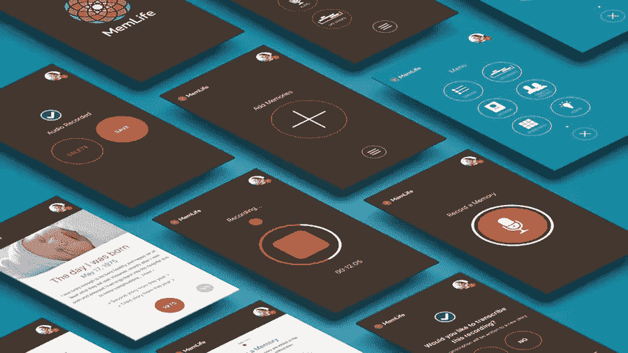
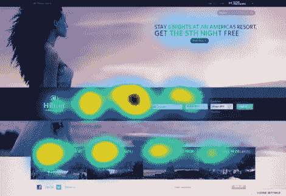
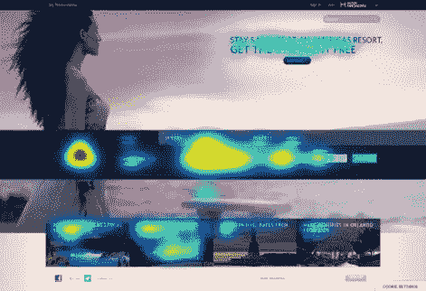
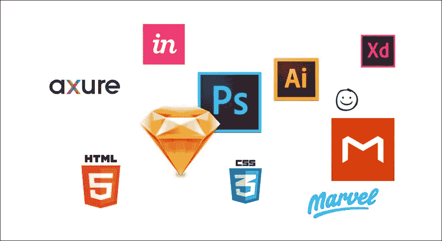
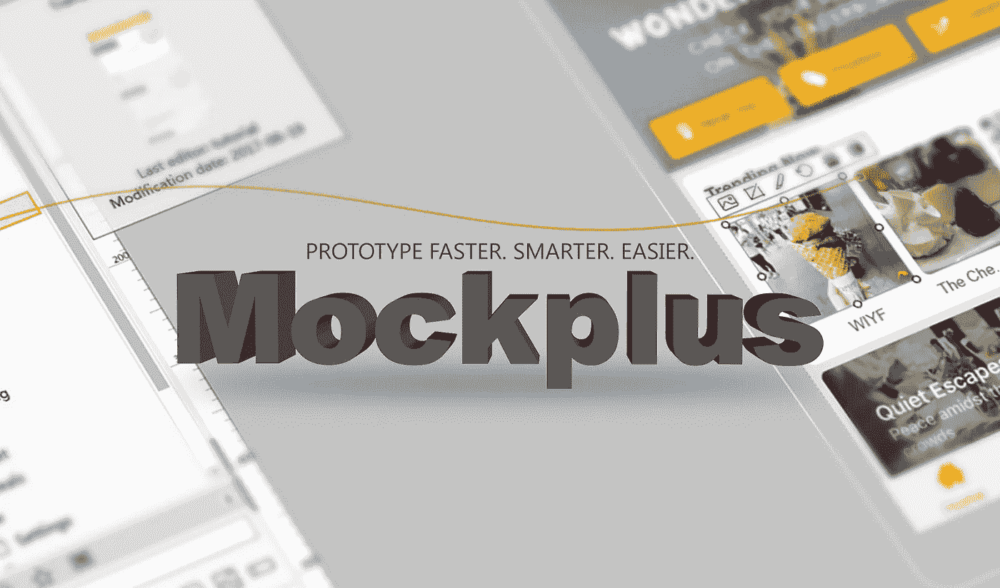

# 2017 回眸(二):AI 将如何影响 UI/UX 设计？

> 原文：<https://medium.com/hackernoon/a-look-back-at-2017-ii-how-ai-will-affect-ui-ux-design-db287b546315>

## 人工智能将成为 2018 年 UX 设计中不可或缺的工具，但人工智能将如何影响 UX/UI 设计？这篇文章将澄清困惑，告诉你如何通过人工智能提高 UX。

艾和在当今世界有着千丝万缕的联系，我们正面临着一个设计新时代的转折点。它们都影响并告知其他人如何工作，然而一些人认为人工智能最终将取代设计师和人类驱动的 UX 的需求。根据那些人工智能和机器人专家的说法，“末日即将来临”。

一个典型的例子是未来学家托马斯·弗雷的 TEDx 演讲，他说，到 2030 年，超过 20 亿个工作岗位将会消失，机器人可能会接管一部分现在由人类占据的工作。回顾 2017 年，我们可以发现人工智能已经广泛应用于各个领域，像优步的自动驾驶汽车，客户代表的聊天机器人，亚马逊的送货无人机——机器人的革命才刚刚开始。

AI 的崛起会取代设计师的工作吗，我们有麻烦了吗？人工智能将如何影响未来的设计领域、设计师的职业生涯以及设计工具？在这里，让我们一起来探讨那些问题。

# 人工智能会取代设计师吗？

至少近期不会。你可能还记得几年前发布的 Grid(一个由人工智能驱动的网站设计和开发系统)，它宣布自己制作网站模块和交互模式，无需设计师的帮助。然而，当世界看到第一个由网格设计的网站时，这是一场灾难。

事实上，机器人接管的大部分工作将是重复性的&由蓝领工人完成的机械工作。当你看设计时，事情要复杂得多，人类有独特的能力为用户创造同理心，并为设计设置背景。

**事实是**——这将是设计师和机器人的共同努力。代替问题的，将是一系列的机会，包括:

# 1.训练机器人自动工作。

图像大小调整和颜色调整的工作可以由机器人来完成，这大大提高了设计师的工作效率。最近，Airbnb 宣布了一项技术，可以识别设计草图，然后实时将其转换为编码。这样，设计师将有更多的时间进行产品的战略决策，而这是计算机至少需要十年才能学会的。

# 2.创建更加智能化和模块化的设计系统。

无论是大型企业还是初创企业，设计师都应该确保系统的一致性，以保证产品和用户之间的一致性。如果加上一层智能，这些系统可以分析用户如何与 UI 元素交互，以及哪些功能是最有效的。像 Squarespace 和 Wix 这样的网站建设平台已经开始使用人工智能技术来帮助用户做出一些次要的设计决策。

# 3.做出个性化的用户体验。

这意味着你的产品会根据收集到的用户数据给访问者提供更加个性化的体验，比如这些用户来自哪里，使用的是什么类型的设备等等。所有这些数据将非常有助于他们找到自己真正需要的东西，从而提高转化率。

# 为什么我们需要人工智能和机器学习技术？

让一台机器理解设计的情感部分并不容易，但我们不得不承认，AI 和 UX 设计是“共同进化”的关系。当机器为人们自动完成重复的任务时，人类大脑的创造力将会大大提高。设计师将更加专注于管理、创造性思维、沟通和其他更高级的能力，以保持竞争力。

此外，人工智能技术还可以帮助中小企业对初稿进行基本的设计质量判断。例如，一个名为 eyequant 的网站可以帮助提供“无人值守眼球跟踪器”服务，下面是通过数据训练获得的神经网络预测结果。计算机不仅可以通过眼睛的运动知道用户的焦点，还可以通过语音理解语言。美术的风格也是可以习得的，何况是一个简单的 App 设计。

除了在实践中对设计的影响，人工智能将有助于产生一个新的设计角色——培训师。随着技术和人工智能的进一步发展，将会出现更多的设计角色，这有助于推动设计的民主化进程。[像 Autodesk 这样的设计工具](https://www.mockplus.com/blog/post/hottest-design-tools-in-2017)经过设计师的输入，可以快速生成上百种不同的设计方案，设计师只需要选择自己喜欢的，并使之组合起来，就可以得到最满意的结果。

# 从长远来看，人工智能如何影响 UI/UX 设计工具？

显然，机器拥有人类所有的构图和色彩搭配能力，但产品体验却无法轻易、独自完成。在 UX(用户体验)的基础上，不久的将来的产品将更加重视 EX(体验设计)，它迎合了用户的角色、行为和上下文理解，为用户带来更多的价值。

因此，支持用户交互和[可用性测试](https://www.mockplus.com/blog/post/how-to-conduct-usability-testing)的设计工具仍将非常需要，但简单支持线框或 UI 映射的工具将面临转型或逐渐被淘汰。从 UX 到 EX，设计师将需要更多地考虑如何充分利用工具，增强自己而不是被取代，其中设计思维和逻辑显得如此重要。

如下图所示，一个帮助设计师更好地实现创意、交流、素材收集、减少体力劳动的工具，将是未来“AI +设计”时代的宠儿。在这一点上，Mockplus 早就因其无与伦比的特性而颇有见地:

*   [思维导图](https://www.mockplus.com/newfeatures/post/mindmap-design-mode-newfeatures)和 [UI 流程](https://www.mockplus.com/newfeatures/post/ui-flow-design-mode)设计模式可以快速布局你的概念设计和页面结构，清晰简单得多。
*   [团队协作](https://www.mockplus.com/newfeatures/post/team-collaboration)，在线审核和页面划分，让您的团队沟通随时随地轻松完成。
*   一个大型的图标和组件库以及不同设备大小的页面模板可以节省您寻找所需设计资源的大量时间和精力。
*   Repeater 和[自动数据填充](https://www.mockplus.com/newfeatures/post/auto-data-fill-newfeatures)可以大大节省制作重复元素的时间，从而提高生产率。

# 包裹

从上面的例子中，我们可以发现人工智能技术没有也不会取代设计师，而是帮助自动化重复的任务，使我们更加专注于设计的战略决策。这将有助于创造更好的个性化体验。利用机器，把 Mockplus 这样的工具作为辅助，将是大势所趋。