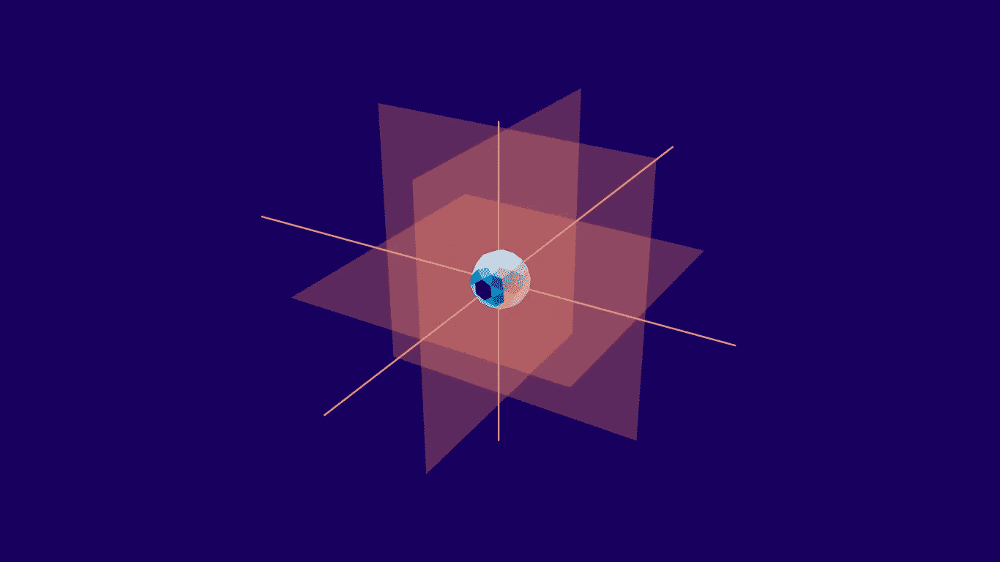
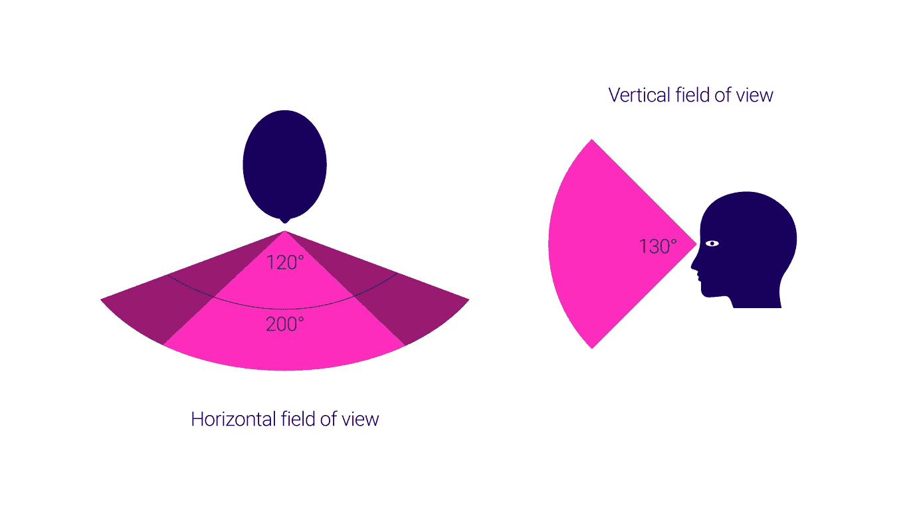
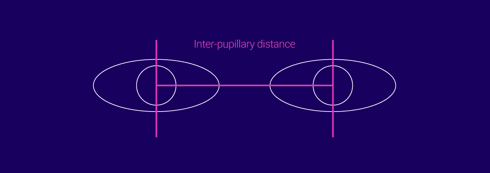
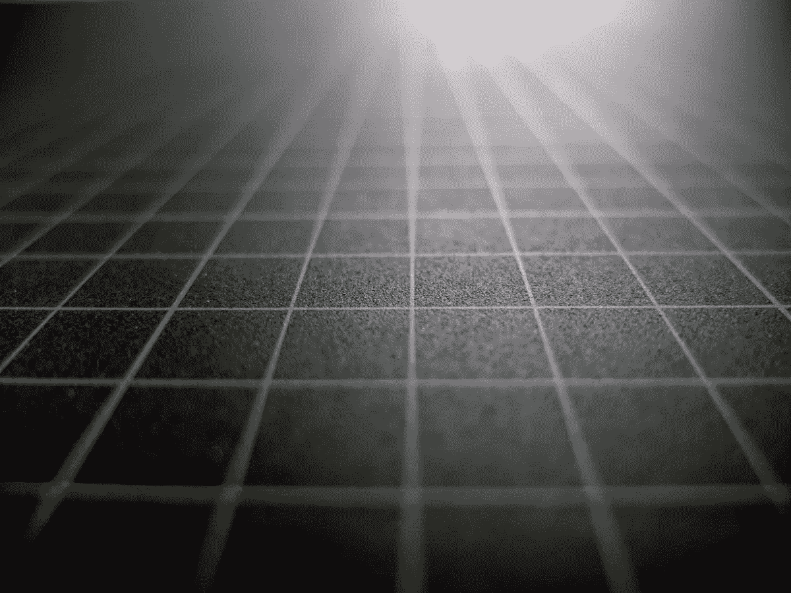

# 增强现实中的机器和人类对世界的感知

> 原文：<https://medium.com/hackernoon/a-machine-and-humans-perception-of-the-world-in-augmented-reality-2342f4a6750>

增强现实是机器帮助我们看到世界的增强视图的顶点。然而，为了让机器理解我们的现实，反之亦然，有必要看看这些群体是如何感知世界的。



# 计算机对增强现实空间的理解

增强现实的目标是将计算机对空间的感知与人类对空间的理解相叠加。在计算机科学中，空间仅仅是一个隐喻，是对空间、时间和物质的普遍认同和科学验证的概念。计算机对空间的理解只不过是物体、位置和物质的数学定义的 3D 表示。它可以简单地通过坐标系统来理解，而不需要像超现实或交替宇宙这样令人困惑的术语。虽然这些绝对是有趣的思想实验。虚拟空间只不过是计算机对人类提供的真实世界的理解。

人类是空间生物。我们与大部分三维现实互动并理解它们。随着增强现实试图将虚拟世界模拟到人类现实中，理解虚拟 3D 空间的基本方面是很重要的。

# 视觉空间和物体空间

我们所感知的物体在环境中的位置是视网膜上光模式的重建。计算机图形学中的视觉空间可以被定义为参与者正在体验的 3D 虚拟空间的感知空间或视觉场景。

物体存在的虚拟空间称为**物体空间**。它是视觉空间的直接对应物。


每只眼睛看到的视觉空间不同。对于双目虚拟设备或智能眼镜来说，这是计算机图形学的一个关键挑战。为了设计虚拟世界，对虚拟物体在现实世界中的位置和方向有一个共同的理解是很重要的。通用坐标和定向系统在这方面很有帮助。

# 位置和坐标

三种类型的坐标系用于虚拟和增强现实应用的布局和编程:

## 笛卡尔坐标

笛卡尔坐标系主要是因为它的简单和熟悉而被使用，并且大多数虚拟空间都是由它定义的。基于 x-y-z 的坐标系对于在虚拟空间中指定 3D 对象的位置是精确的。三个坐标平面相互垂直。距离和位置从原点指定，原点是三个平面彼此相交的点。该系统主要用于定义三维物体的视觉坐标。


Cartesian Coordinates

## 球极坐标

笛卡尔系统通常相对于原点来定义 3D 对象的位置。当相对于用户的位置定位物体和特征时，使用球形极坐标系统。该系统主要用于虚拟声源的映射，或者在基于第一人称的沉浸式 VR 的情况下用于球形视频的映射。球面坐标系基于平分球体的垂直平面，由三个元素组成:方位角、仰角和距离。方位角是水平面/地平面中与原点的角度，而仰角是垂直面中的角度。距离是距离原点的大小或范围。


Spherical Polar Coordinates

## 柱面坐标

该系统主要用于观看 360 度全景的 VR 应用。圆柱形系统允许静态图像的精确映射和对齐，以重叠全景图中的边缘拼接。该系统由带原点(O)的中心参考轴(L)组成。径向距离( *ρ* )由原点(O)定义。角度坐标( *φ* )定义为径向距离( *ρ* )和高度(z)。虽然这个系统对于需要旋转对称的场景是很好的，但是它在垂直视图方面是有限的。


Cylindrical Coordinates

# 定义方向和旋转

有必要定义用户视点和对象的方向和旋转以及它们在虚拟空间中的位置。当跟踪用户正在看哪里或者知道虚拟物体相对于视觉空间的方向时，知道该信息尤其重要。

## 六个自由度(6 个自由度)

在虚拟和增强现实中，通常用三个独立的值来定义方向和旋转。这些被称为滚转(x)、俯仰(y)和偏航(z ),并且是已知的方位角。位置(x-y-z)和方向(滚动-俯仰-偏航)的组合被称为六个自由度(6 DOF)。


Orientation and Rotation

# 航行

导航和寻路是虚拟空间中最复杂的两个概念，尤其是对于 VR 和 AR。它可以通过用户在真实空间中的物理移动来处理，或者通过使用控制台来穿越更大的距离。例如，物理运动可能指的是在像使命召唤这样的游戏中射击时的手和腿的运动，而虚拟运动则指的是玩家前往敌人的基地。有大量的设备可以实现从键盘、游戏控制器到多方向跑步机的虚拟运动。一个单一的通用界面来导航虚拟和物理空间可能是导航控制器设计的圣杯。

# 人眼对增强现实空间的理解


从工程的角度来看，我们的眼睛是精密的光学传感器，它的结构长期以来一直被用作设计相机的蓝图。光通过一系列光学元件进入。折射和聚焦发生在这里。光圈控制通过光圈的光量。随后的光图案落在一个图像平面上，电信号从这里被发送到大脑。这些信号然后被解码成图像。虽然眼睛的功能本身是一个有趣的话题，但为了简单起见，我冒昧地省略了眼睛如何工作的一大部分。但我相信你已经知道大概意思了。更有趣和相关的是这种神奇的有机光学传感器能够为人类带来什么。

# 可见光谱

人类的视力因光而存在。作为电磁辐射的一种形式，光是人类视觉的主要刺激。这种辐射以波的形式在空间中移动，能够刺激视网膜产生视觉。电磁辐射是根据波长分类的，波长是一个波的两个波峰之间的距离。虽然整个电磁波谱包括无线电波、红外线、x 射线和其他波类型，但人眼仅对 380-740 纳米*之间的窄带敏感。这就是所谓的可见光谱。
**1 纳米=十亿分之一米*


```
**Superman's X-Ray vision**The idea of Superman is that of an augmented human. X-Ray vision is one of his powers. This is nothing but a simplistic way of saying that his retina is sensitive to a much wider spectrum of electromagnetic waves (Sorry to spoil the romance of the idea). If Augmented reality devices could enable us to view a wider spectrum of electromagnetic radiation, it would bring us one step closer to becoming Super People.
```

# 人眼的基本特性

## 视野(FOV)

它被定义为双眼可见的图像的总角度大小。平均而言，水平双目 FOV 为 200 度，其中 120 度是双目重叠。双目重叠对于立体视觉和进一步讨论的其他深度线索尤其重要。垂直 FOV 大约为 130 度。



## 瞳孔间距(IPD)

顾名思义，它是眼睛瞳孔之间的距离，是双目观察系统的一个极其重要的考虑因素。这个距离因人而异，因性别和种族而异。一个不准确的 IPD 考虑可能会导致不良的眼睛镜头对准，图像失真，眼睛疲劳和头痛。成年人的平均 IPD 约为 63 毫米，大多数在 50-75 毫米之间。儿童的最小 IPD 约为 40 毫米。



## 眼睛放松

这是从眼睛角膜到第一光学元件表面的距离。它定义了用户可以获得全视角的距离。这是一个重要的考虑因素，尤其是对于佩戴矫正镜片或眼镜的人。眼镜的眼间隙约为 12 毫米。对于头戴式显示器来说，使用户能够调节眼睛间隙是非常重要的。

## 出瞳

这是光学系统传输到眼睛的光的直径。

## 眼盒

这是一个体积，用户可以将他们的学生放在里面，以完全体验视觉效果。

# 空间视觉和深度线索

实际上，数十亿个信号被发送到大脑皮层进行分析以形成图像。有许多空间和深度线索，使人脑能够破译这些光信号，以创造我们的可见现实。

## 视网膜外线索

这些类型的线索是生理过程的结果，而不是来自进入眼睛的光模式。

**调节(转移焦点)** 调节是一种视网膜外的提示，帮助眼睛在前景和背景的物体之间转移焦点。睫状肌环绕虹膜，以帮助观察者在不同景深之间快速转移焦点。眼睛晶状体的光焦度发生变化。当眼睛在舒适的距离看物体时，这些肌肉放松。当眼睛需要聚焦附近的物体时，睫状肌收缩或调节。这就是为什么当你需要放松眼睛时，向远处看是可取的。


**聚散度**
这是一个相当简单的想法，当看远处的物体时，两只眼球都向中心旋转，以调整图像，供大脑处理。当物体靠近时，眼球会稍微向对方靠拢。这种同步旋转被称为聚散度。


```
**Why are accommodation and vergence important concepts for AR?**A number of AR glasses users often complain about headaches and eye strain. This is caused due to the eyes being focused on the flat panel within inches of the eye. Even though the 3D objects appear far, the illusion of depth is only simulated. Addition to this, there is a mismatch in the sensory cues provided by the eye to the brain. The eye has to accommodate and converge for a large amount of time which is the main cause of this discomfort. Reducing the effects of accommodation and vergence while simulating real depth is an interesting problem to be solved.
```

## 视网膜或深度线索

这些线索来源于进入眼睛的光线模式。这些线索要么是双眼的(有两个眼球对这些线索有影响)，要么是单眼的(即使有一个正常工作的眼球也能观察到)。

我们有两只眼睛，平均相距约 2.5 英寸。每个眼球捕捉到的图像略有不同。由于大脑处理的两幅图像中的轻微偏移而观察到的感知深度被称为立体视觉。立体视觉对于沉浸式头戴式 VR 显示器尤为重要。显示给每只眼睛的两个单独的图像，甚至图像中的微小位移都会导致立体视觉的丧失，使 VR 体验感觉不自然。


Place your eyes closer to the screen such that one eye can see only a single cube. If you are on a phone, make sure it is in landscape mode for optimum experience

立体视觉是这里讨论的唯一双目线索。其余的线索都是单眼的。

**运动视差
原因是，较近的物体会比较远的物体更快地穿过你的视野。此信息对于在 3D 环境中模拟移动对象之间的相对深度非常重要。**

**遮挡或插入** 当一个物体挡住另一个物体的视线时，就会观察到这些线索。大脑记录下阻挡的物体比被阻挡的物体更近。模拟遮挡的效果对于 ar 场景尤其困难，在 AR 场景中，计算机必须知道视图中远近物体的位置。对于附近的物体，使用深度感测相机将是解决这个问题的可行解决方案。

**删除和增加** 这个线索是运动视差和深度线索的延伸。当一个物体移动到另一个物体后面时，就发生了删除，而当该物体在观察者的视角中显露出来时，就发生了吸积。如果删除和增加发生得很快，那么该物体被记录为更靠近阻挡物体。如果这两个物体离得远一些，删除和增加就会缓慢进行。


**线性透视** 这种深度线索是线条向远处一个点汇聚的结果。平行线似乎向远处退去。越多的线汇聚，它们就显得越远。


**Left**: Linear perspective. **Right**: Kinetic depth effect from a series of silhouettes (Source: Wikipedia)

**动态深度效应** 这种效应是从物体的运动中感知到物体的结构。这种效果在显示对象的复杂结构时特别有用，即使在缺少其他深度线索时也是如此。

**熟悉的尺寸** 这个深度线索帮助我们估计物体相对于周围元素的尺寸。这在数据可视化中特别有用，在这种情况下，显示相对大小可以为用户提供数据的视角。


The green house appears smaller than the yellow house

**相对尺寸** 两个尺寸相似但距离不同的物体相对于它们与观察者的距离被感知为不同的尺寸。大小相同但距离不同的两座房子投射出不同的视网膜图像，该图像被感知为距离提示。


Relative size and Relative height

**相对高度** 

**大气或空中视角** 这种深度线索是光线被蒸汽和烟雾等粒子散射的结果。随着距离的增加，物体和背景之间的对比度降低。


Atmospheric perspective

**纹理渐变** 这是一个重要的线索，物体纹理的渐变(通常是由细到粗)给出了一种深度感。单位纹理的密度或单位纹理的高度或纹理间距离的减小会产生距离感。



Texture gradient

**灯光、阴影和阴影** 这是艺术家和建筑师最常用的深度暗示之一。阴影的角度和锐度影响深度感知。清晰明确的阴影表示距离较近，而模糊的阴影可能表示深度较大。光与不规则形状的物体相互作用的方式也可能揭示关于物体的重要信息。


**光学扩展** 这个 cue 是相对大小 cue 和遮挡的扩展。当一个物体的视网膜图像变大时，它看起来越来越近，并开始遮挡其路径上的物体。


The ball appears to be moving closer

了解人眼的工作原理可以帮助我们建立更自然的 AR 体验，并对虚拟环境的未来做出重要贡献。

# 增强视觉的构建模块


围绕增强现实的大多数早期和流行的想法都专注于增强人类的视觉，技术的发展是为了支持这些想法。相机在这种类型的增强现实(AR)中扮演主要角色。与计算机(智能手机)配对的相机使用计算机视觉(CV)扫描其周围环境，并将内容叠加在相机视图上。大量现代 AR 应用程序很容易使用智能手机的摄像头来显示真实空间中的 3D 对象，而不必使用特殊的标记。这种方法有时被称为无标记 AR。然而，这并不总是标准。有多种技术用于增加摄像机视图上的内容。

# 基准标记和图像

基准标记是通常印刷在平面上的黑白图案。计算机视觉算法使用这些标记来扫描图像，以相应地在相机视图中放置和缩放 3D 对象。早期的 AR 解决方案通常依赖于基准标记。作为替代，也可以使用图像来代替基准标记。基准标记是最准确的 AR 内容创建机制，通常用于电影行业的动作捕捉(MOCAP)。


# 3D 深度传感

以“你是控制器”为口号，微软的 Kinect 是增强现实研究的革命性设备。这是一款 3D 深度感应相机，能够识别和绘制空间数据。3D 深度感测在 Kinect 之前就已经存在了，但是 Kinect 让这项技术变得更加容易使用。它改变了普通计算机观察和增强自然环境的方式。深度传感相机分析和映射空间环境，以将 3D 对象放置在相机视图中。最近一个更主流的深度感应相机是 iPhone X 的前置相机。

# 同步定位和绘图(SLAM)

对于能够在环境中移动或增强环境的机器人或计算机来说，它需要绘制环境地图并了解它在环境中的位置。同步定位和地图绘制(SLAM)是一项能够实现这一点的技术。它最初是为机器人导航复杂地形而建造的，甚至被谷歌的自动驾驶汽车所使用。顾名思义，SLAM 支持实时绘制环境地图，在相机和一些传感器的帮助下生成 3D 地图。该 3D 地图可以被计算机用来在环境中放置多媒体内容。

# 点云

3D 深度传感相机，如微软的 Kinect 和英特尔的 real sense，以及 SLAM 在空间中生成一组数据点，称为点云。计算机参考点云在 3D 环境中放置内容。一旦映射到一个环境，它们使系统能够记住一个 3D 对象在环境中的位置，甚至是在一个特定的 GPS 位置。


# 机器学习+普通摄像头

早期的 AR 方法除了依赖相机之外，还依赖大量的传感器。OpenCV、Vuforia、ARCore、ARKit、MRKit 等软件库已经在智能手机等小型计算设备上实现了 AR，并具有令人惊讶的准确性。这些库使用机器学习算法将 3D 对象放置在环境中，并且只需要一个数码相机作为输入。这些算法在传感器要求方面的节俭在很大程度上导致了最近围绕 AR 的兴奋。

我们在图像识别、机器学习、3D 图形优化和一系列其他技术挑战方面取得了长足的进步，让第一波 AR 触手可及。我们大多数人都见过在 AR 环境中建筑的 3D 建筑模型被展示为 AR 潜力的巅峰。这仅仅是开始。

我们已经开始通过我们称之为计算机的小门户来体验我们生活的主要部分。这些门户有各种不同的名称；笔记本电脑、iPads、智能手机、智能手表、智能音箱等等。即便如此，我们和我们的技术之间似乎还有一道屏障。我们无法与另一边的东西进行物理互动。增强现实的想法带来了一个有趣的前景，并可能是我们与计算机交互方式的一个根本性转变。

**参考文献:**
1。[增强人类——海伦·帕帕吉安尼斯](https://amzn.to/2C7k3c3)2。[实用的增强现实——史蒂夫·奥克斯塔卡尼斯](https://amzn.to/2C6XDHR)

**相关文章:**
1。[人眼对增强现实空间的理解](/@akshaykore/human-eyes-understanding-of-space-for-augmented-reality-d5ce4d9fa37b)2。[一台机器和人类在增强现实中对世界的感知](https://hackernoon.com/a-machine-and-humans-perception-of-the-world-in-augmented-reality-2342f4a6750)
3。[增强与虚拟现实显示技术基础](https://hackernoon.com/fundamentals-of-display-technologies-for-augmented-and-virtual-reality-c88e4b9b0895)
4。[AR 装置的种类](https://uxplanet.org/augmented-reality-device-types-a7668b15bf7a)
5。[增强视觉的构建模块](https://uxplanet.org/building-blocks-for-augmented-vision-cc9b6172b461)
6。我们增强世界的未来。[计算机对增强现实空间的理解](https://uxplanet.org/a-computers-understanding-of-space-for-augmented-reality-c0fd40a52900)

**如果您喜欢这篇文章，请点击👏按钮(一次、两次或更多次)。
分享帮别人找！**