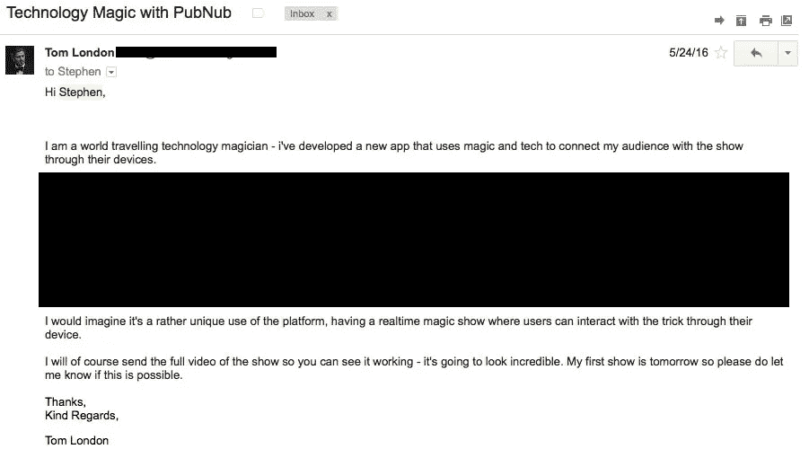
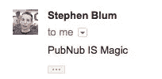
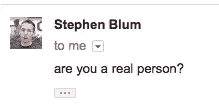

# 魔术师从不透露他的秘密——除非是在黑客中午

> 原文：<https://medium.com/hackernoon/a-magician-never-reveals-his-secret-unless-its-for-hacker-noon-7f3c29158c18>

很经典的一句话；魔术师永远不会泄露他的秘密。为什么？好吧，秘密总是远不如技巧让人印象深刻。魔术师在表演魔术时使用一个基本假设，即人们不能同时思考一件以上的事情。尤其是当你向他们展示他们每天都会看到的物品时。比如一包卡或者当今世界，还有 iPhone。人们倾向于关闭并进入自动驾驶模式，就像他们开车时一样。

魔术师和黑客比你想象的更相似。超过 99%的人都懂技术、电子和代码，黑客可以利用这些知识来操纵和控制用户在数字空间中的所见、所想和所信。
魔术师在物理空间里用戏法和唯心主义做着同样的事情。

作为两者都做过的人，相似之处令人震惊，但有一个巨大的不同。魔术师表演魔术给外行人鼓掌。黑客攻击是为了乐趣，为了探索数字领域，为了科学/艺术/技术而发明。

我将第一次，希望不是最后一次，在这里透露我的一个秘密。为什么？

我热爱技术，创新和创造力，魔术只是一个把戏，这很尴尬

看这个，这是我的美国达人海选:

Tom London America’s Got Talent Audition

现在你已经看过了，你要么有很多问题，要么想问我你的理论是否正确。
这就是推特的用途。打我。

从字面上看，这整件事是一个任务，但也是一个梦。

# 实时控制成千上万的手机屏幕

我最初的概念是:能够通过互联网控制手机屏幕。更准确地说:

**给人的印象是我在不到 100 毫秒的时间里，用手指点击入侵了 2000 部手机。**

## 我不能做什么

我必须能够实时控制 2000 多台设备，而且不能让任何人知道发生了什么。
如果他们都在同一个 wi-fi 网络上，这很容易，对吗？“礼堂里没有无线网络，”胖检查员说。

我做的第一件事就是取消了所有因为试镜/舞台表演/电视节目限制而不能做的事情:
- *没有 wi-fi。
-观众没时间下载 app。
-不能触摸任何用户的设备。在我走上舞台之前，我不能告诉他们任何事情。
-实际上不能做真正的魔法(震)。*

**基本上我做不到。**

直到这个。
[**PubNub。**](https://www.pubnub.com)

PubNub 是一个实时数据信息平台，嗯，他们是一年前。现在他们在他们的数据流上做云功能、服务器块和节省时间的魔法，我的意思是，这些天他们为我做的一切提供动力。

我联系了 PubNub 的 CTO 斯蒂芬·布鲁姆。

## 进入我的第一个 SF tech 公司邮件线程体验。

Stephen replies with this.

Minutes later.

I then had to convince him I was real?

经过几次 skype 通话后，Stephen 帮我联系上了 Jason 和 Jasdeep，他们是他手下的两个人，他们和我以及我的父亲(生病的程序员)一起开发了我的 web 应用程序。

# PubNub 魔法

PubNub 的工作方式就像一个巨大的 whatsApp 集团。你可以创建一个群聊，不同的服务，程序，服务器都可以订阅聊天，并通过使用一种通用语言如 JSON 来存储你的数据来了解发生了什么。

PubNub 的酷之处在于他们有一个 SDK 或者 API 来处理几乎所有的事情。水壶，性玩具，任天堂 Switch。可能有一个 SDK。(实际上没有针对这些东西的 SDK，但是是的，你懂的)

## 用 PubNub 控制设备

我创建了一个登陆网页，运行一个 javascript 脚本，将该页面连接到 pubNub，并订阅了我的频道“magic”。

然后，我拿出另外 3 部手机，看着它们全部连接起来。然后我在 pubnub 控制台上打出一条“Go”信息，看着它通过互联网传到设备上。一旦设备收到消息，javascript 就会触发一个 onDelay 事件，改变 HTML 主体的背景颜色。

恶心。入侵主机。

Pubnub 在不到 100 毫秒的时间内就在互联网上发布了这条几 kb 的小消息，而我所要做的就是实现他们的 API。

我在巴塞罗那的一次发布会上测试了这一点。事实上，这是预先筛选，我的客户是狮门影业的副总裁。他们想让我创造一些魔术来重现这部电影，所以我提前 6 个月看了这部电影，并制作了这个魔术。点击一个按钮，让每个人的设备闪烁品牌的颜色。我让大约 600 人同时使用它，看起来很疯狂。答对了，说到点子上了。

## 同步设备

如果你还记得视频中，当我举起双手时，这些设备几乎同时开始漂亮地闪烁。

这是很难做到的，原因有很多。首先，设备是在一个礼堂，这意味着混凝土，金属，来自其他设备的无线电信号和可怕的麦克风无线电波。所有这些噪音都会降低设备上 3G/4G/LTE/Edge 连接的速度。

疯狂的是，我在现场试镜的前一天才意识到这一点。

此时，Stephen 让他的两个团队参与进来，Jasdeep 和 Jason。他们飞到了洛杉矶的 Studio City，我们坐在一起吃着联伊援助团的汉堡，24 小时都在强调我们该如何让它运转起来。

我们得出的结论是，最好的方法是计算出设备时间，并将其与服务器时间进行比较。这将允许我们为所有设备创建一个通用时间，方法是计算出本地设备时差，然后从我们的服务器时间中加上/减去它。

然后，服务器会通过 PubNub 发送一条消息，该消息包含 JSON 对象中的一些信息，这些信息说明了设备在未来 10 秒后开始闪烁的时间。这意味着，一旦我开始这个例程，有 10 秒钟的时间将消息发送到每一个设备，无论它们需要多长时间才能收到消息，所有设备理论上都将在 16:47 开始(例如)。

它的效果比我预期的要好，我在 5 个国家的测试中使用了设备，并在同一时刻启动了序列。

我刚刚意识到，我创造了一个实时手机屏幕系统。PubNubs 消息系统理论上允许我拥有…数百万台设备。

## 随机挑选 5 台设备

在所有设备闪烁之后，我向 Simon Cowell 提到我随机选择了 5 个设备。这真的，真的，真的很酷。

当设备订阅流时，它发布一个 UDID 并将其发布到 PubNub。这给了我所有设备的清单。我的服务器遍历列表，随机选择 5 个，然后将它们推送到 PubNub 流中。如果本地设备 UDID 与流中的这 5 个中的任何一个匹配，则该设备将状态更改为“已选择”。我们在这里讨论几行代码来做一些我认为没有 PubNub 会非常复杂的事情。

## 我是如何玩数字游戏的。

嗯，那是以后的事了。不，我没有用‘有毒’。

*   有毒是你在 iPhone 计算器中键入一个数字，然后输入一个随机数(称之为 rN)按，加，0，乘以，左括号，取消。结果是任意数量的数相乘将= rN。我没那么做。

有人问我每天是如何做到这一点的，这只是一些聪明的网络应用程序。我还感到震惊的是，当我在主题演讲中这样做，用它打开预先填充内容的应用程序或撰写电子邮件时，有人认为我真的入侵了它们。如果你了解大多数人对他们所使用的技术的普遍知识水平，你今天就可以逃脱这么多的惩罚。